# Demo Brand: Luma Telco 

## Overview

Based on the many interactions we've had with Telco's across EMEA, we decided to create a generic demo brand so we can do specific demos for a Telco brand.
We also reused the work that was done for Summit EMEA, with BT (leading telco in UK) being the brand we used to showcase the telco-specific use-case around Churn Prevention.

In the Luma Telco demo environment, you'll be able to follow the usual demo approach with the desktop website, mobile application and Alexa simulator updating the X-ray panel and in addition to that, you'll have the ability to talk around Machine Learning and Sensei Services with Churn Prevention being the use-case.

## Using Luma Telco

Go to [https://platformdemo.net/sytycd](https://platformdemo.net/sytycd). You'll be redirected to the Admin UI.

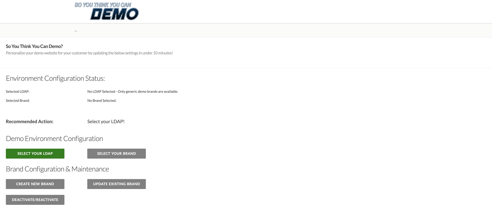

Luma Telco is a generic brand and automatically accessible to everyone, so no need to select an LDAP.

Go to ``Select Brand``

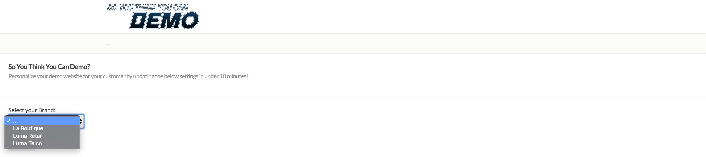

From the dropdown-list, select ``Luma Telco`` and click ``Save``.

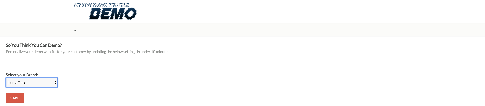

After 10 seconds, Luma Telco will be loaded and you'll be redirected to the homepage.

From the homepage, navigate to ``Broadband Deals``.

Navigate to ``Mobile``.

Navigate to ``Sports``.

3 Experience Events will now be part of your profile on X-ray.

Go to ``Login/Register`` and fill out the form to create an account. Click ``Create Account``.

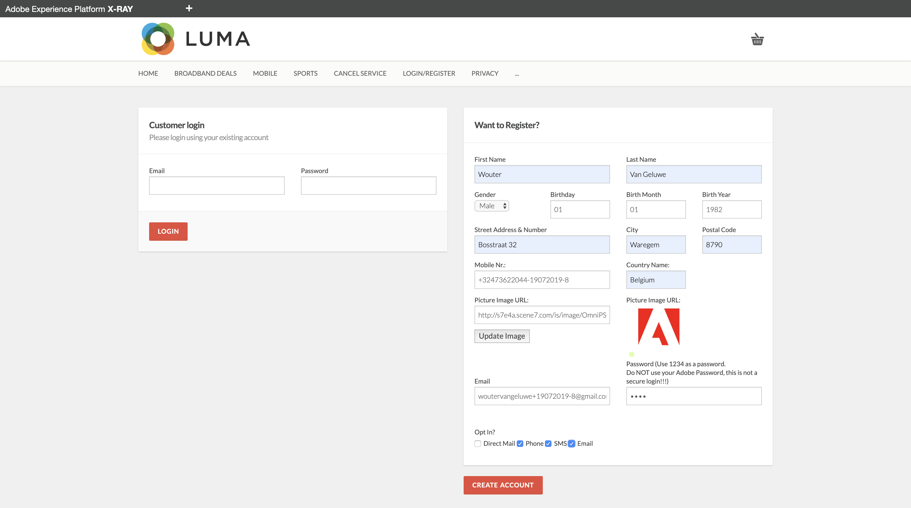

After creating your account, your Profile information will be shown on X-ray. You can now also open ``Sensei Services`` on X-ray. You'll now see a Churn Score of 0.00.

The storyline here is that after some time, this customer starts to display typical churn behavior. The way of showcasing that is by going to the ``Cancel Service`` - page.

By going to the ``Cancel Service`` - page, your Churn Score has updated in Real-Time and has now become 0.52. In this demo-environment, this is a simulation of a Data Science Workspace feature that will be available in the near future. Once this feature is available in Platform, a ML Model can be published a a Service to our Edge Network and as of that moment, the ML Model will listen to all Experience Event traffic flowing into Platform and will potentially recalculate a churn score on the fly when a relevant churn-related Experience Event is received on the Edge.

The customer decides to call the call center to have a discussion around cancelling his contract. Scroll down on the page to find the Phone-icon and click the ``Call us now so we can assist you`` - link.

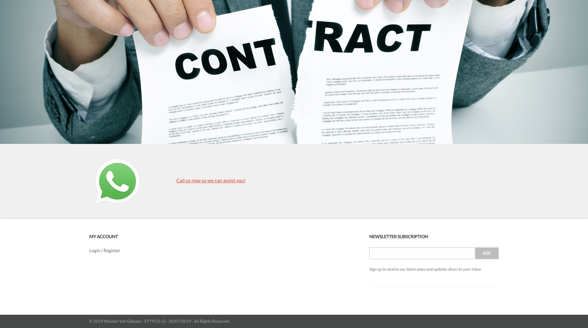

You're now sent to the Call Center environment. Click the ``Check`` - button to retrieve your Customer Profile through the API's, based on the Mobile Nr. - identifier.

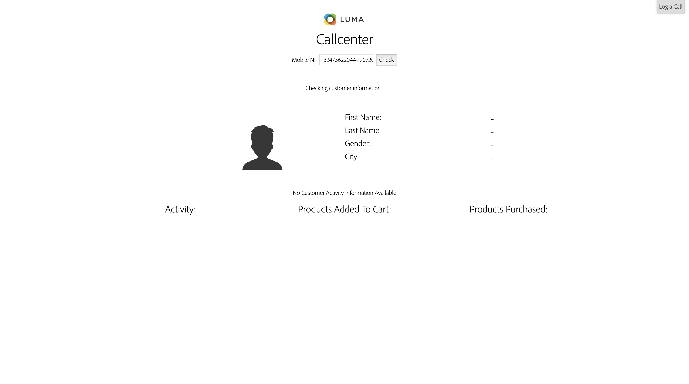

You'll see your Profile and Experience Event data being displayed, alongside the Churn Score which is now 0.52.

Communication between Platform and the Call Center environment shouldn't be one way, it should be bidirectional. This means that after the call has finished, there should be a feedback-loop from the Call Center back to Platform. You can do this by clicking the ``Log a Call`` - button on the top right side of your screen. You'll then see the below popup.

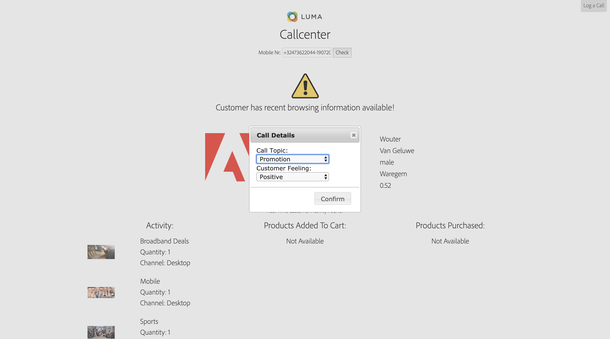

Select the topic of ``Contract Discussion``.

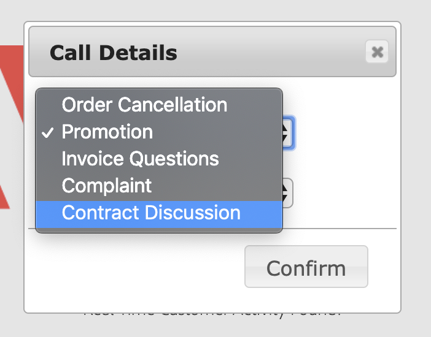

Select the feeling ``Negative``.

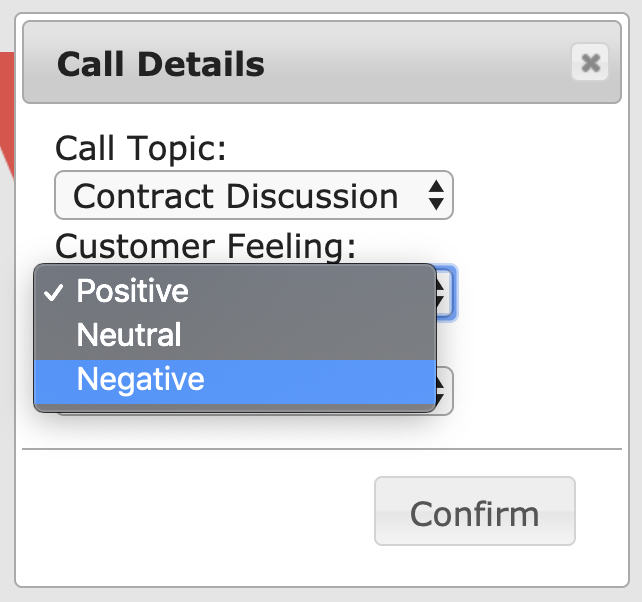

Click ``Confirm``.

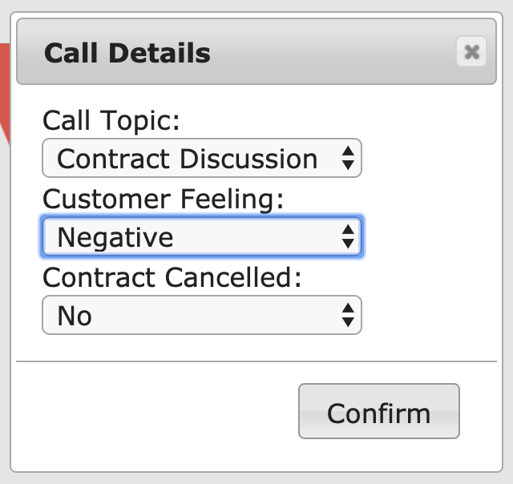

Lastly, click the ``Check`` - button again to reload the Customer Profile through the API's and you'll see the updated Churn Score of 0.78.

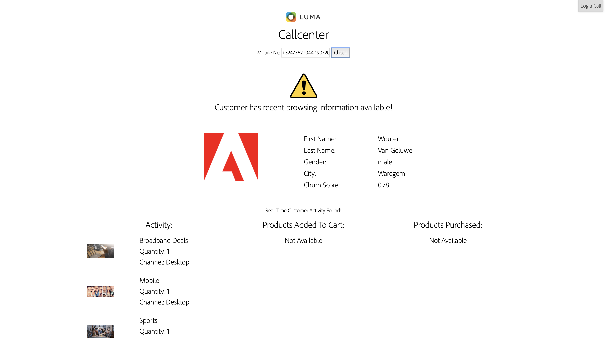

And you'll also see the updated Churn Score on the X-ray panel on the website.

## Configuring Telco Industry

Luma Telco is a generic brand. The goal of the SYTYCD-environment is to deliver personalized live demo's.

In the Admin UI, go to ``Create Brand`` and in the ``Brand Settings`` - menu, in the ``Industry`` - dropdown menu, select ``Telco``.

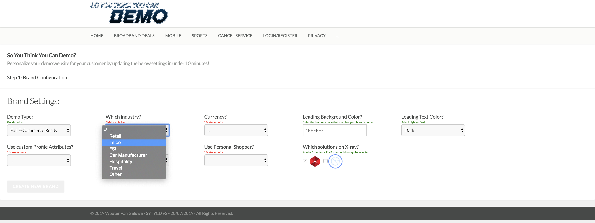

You'll then see an additional field pop up, named ``Telco Industry Specific Settings``.
You are now expected to select and upload the image to show on the ``Cancel Service`` - page. 

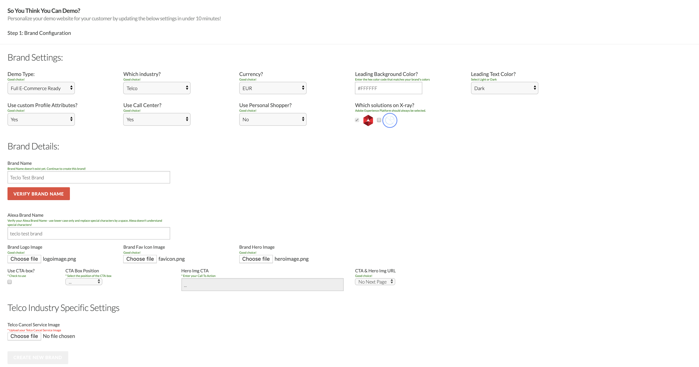

The idea is that you take a screenshot of your Telco's real ``Cancel Service`` - page and upload it here.

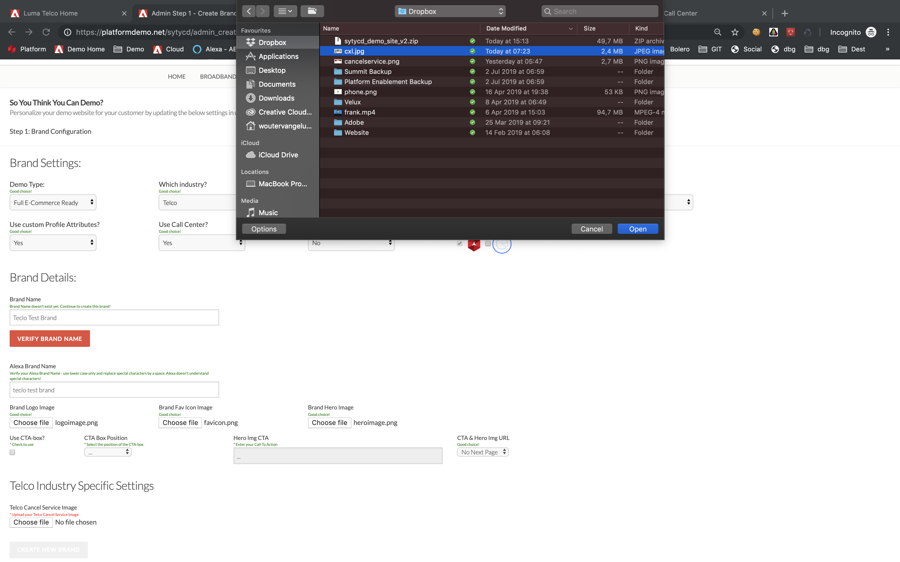

Next, click the ``Create New Brand`` - button to save your brand details and continue the rest of your configuration.

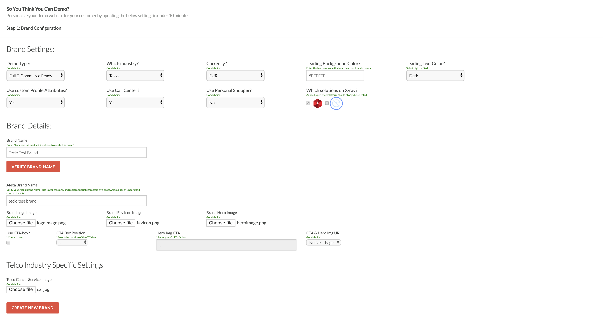

After saving your brand and finishing the configuration, you'll be able to use the new template.

This is an example of such a personalized ``Cancel Service`` - page as used for a demo for Vodafone UK.

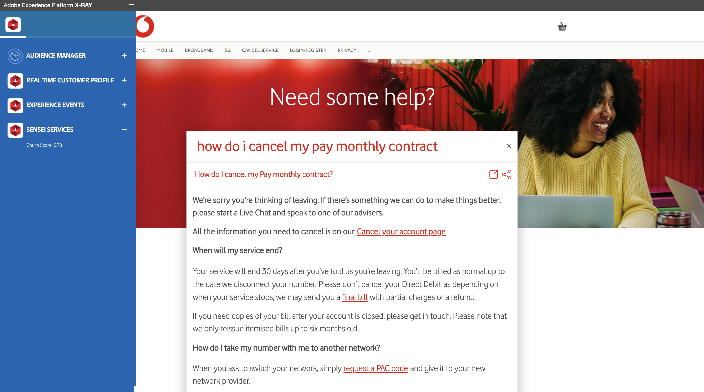

Once you've created your ``Cancel Service`` - page for your specific Telco brand, the rest of the above demo storyline around Churn Prevention also applies to your Telco, with the same sequence of events applying to the scenario.

---

[Go Back to All Modules](../README.md)

