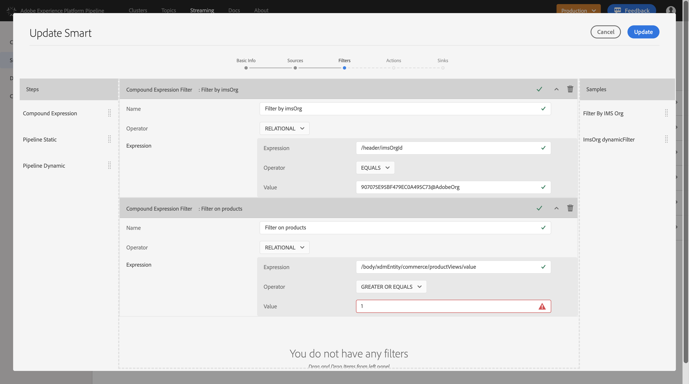
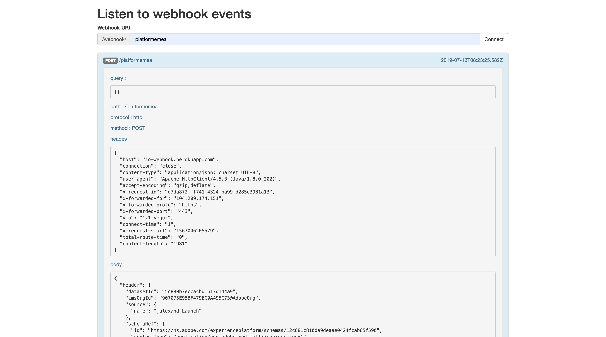

# Adobe Experience Platform Pipeline - Smarts

## Overview

Many brands have invested in internal data lakes and/or internal decisioning systems. Some of the common systems that we've seen in our customer meetings include Pega Systems, SAS, NGData, ...

These environments want to receive data as soon as possible, with real-time being the only acceptable speed.

In today's ecosystem with Adobe Solutions, most of the brands that we work with receive Adobe solutions data in a batch process, which takes anything from a couple of hours to a couple of days, depending on which solution.

With Adobe Experience Platform Pipeline, we now have a way of providing brands with this data in real-time, by making use of Pipeline Smarts.

Through the use of Pipeline Smarts, we're now able to open a door on our Kafka Pipeline environment, which listens to a specific ```topic```, ```filters``` this topic to only take out relevant messages, potentially ```transforms``` the message to match a specific output and then ```forwards``` this message to an external webhook.

In the below example, a Pipeline Smart has been defined that forwards specific messages to an AWS Lambda environment and also to a custom webhook. The webhooks used in this example don't require authentication.

## Key Takeaways

* Become familiar with Adobe Experience Platform Pipeline
* Understand the configuration of Pipeline Smarts
* Showcase Pipeline Smarts as part of a demo for a technical/archictect audience.


## Configuration: Pipeline Smart

You can login to Adobe Experience Platform Pipeline by going to [https://pipeline.corp.adobe.com](https://pipeline.corp.adobe.com). Note: at this moment, access rights to Adobe Experience Platform Pipeline are restricted. Pipeline Smarts will become available in the UI of Adobe Experience Platform at a later stage.

After logging in to the Pipeline UI, you'll see this screen:


From the top menu bar, navigate to ``Streaming``.


You'll then see this screen:


From the left menu bar, navigate to ``Smarts``.


In the list of Smarts, you can a smart named ``pega_poc_907075E95BF479EC0A495C73@AdobeOrg``. This is the Pipeline Smart that was configured for the ``Experience Platform EMEA`` - org.


By hovering over this smart, you'll see an ``Edit`` - icon. Click the ``Edit`` - icon.


You'll then see a step-by-step process to configure/update a Pipeline Smart. The first step is the ``Basic Info`` applicable to this Smart.


By clicking on ``Sources``, you can define the ``topic`` to listen for on the Pipeline. In our case, we're sending ``DCS-calls`` in a ``JSON`` - encoding that contain ``XDM`` - language. The topic we should listen for as such should be ``xdm_acp_dcs``. The encoding should be ``JSON``.


Next is the setup of ``Filters``. Click on ``Filters`` to define them. In this example, we have 2 filters that are active:

  * A filter that looks for the ImsOrg for our Platform instance, ``907075E95BF479EC0A495C73@AdobeOrg``
  * A filter that looks for a Product View by looking at the XDM-field ``/body/xdmEntity/commerce/productViews/value`` which should have a value of 1 or more.
  


By clicking on ``Actions``, you have the ability to define transformations if needed. In this example, there are no transformations to do.


And finally, by going to ``Sinks``, you have the ability to define where the message needs to be published to. In this example, we're publishing the message that matches the defined topic and filters to 2 locations:

  * A custom webhook: ``https://io-webhook.herokuapp.com/webhook/platformemea``
  * An AWS Lambda/API Gateway webhook: ``https://k8eqzf2i5k.execute-api.us-west-2.amazonaws.com/prod/``


To save your confiuration, click ``Update``.

## Deploy the Pipeline Smart

After saving/updating your Pipeline Smart, you'll be sent back to the Smarts UI.


Instead of editing the smart, you should now just ``click`` the SMart to open it.
You'll then see a visual overview of your Smart's configuration:


By going to the ``Deployments`` - tab, you can deploy/redeploy the Smart.


There's also a full audit log for the Smart.


After configuring and deploying the Smart, you can use it in production.

## Visualize the Real-Time Smart through a webhook

Go to [https://io-webhook.herokuapp.com/](https://io-webhook.herokuapp.com/).


Enter the text ``platformemea`` in the webhook URI - field.


Click ``Connect``, after which you'll see that the webhook is listening to all activity that is sent to the webhook.


Now go on your ``SYTYCD`` - demo environment and click on any Product. This will send a ``Product View`` - event to Platform.


On your webhook, you'll immediately see a ``POST`` - entry being displayed.


Click the ``POST`` - entry to display the payload.



Scroll down a bit to see the full JSON payload that was sent by the website, to Adobe Experience Platform Pipeline and which was then forwarded in real-time to this webhook.


## Visualize the Real-Time Smart through an AWS Lambda Function & API Gateway Setup

In the above Smart configuration, the message is also forwarded to an AWS Lambda - function. This Lambda function is linked to an AWS API Gateway which doesn't require authentication. To view what messages were forwarded by Adobe Experience Platform Pipeline to AWS, we can verify the logs of the Lambda function.

This is the Lambda-function ``Overview`` in AWS. 


By going to ``Monitoring``, I can see a dashboard of metrics linked to the function.


By clicking ``View logs in CloudWatch``, you're taken to the full logs of this function.


By clicking the most recent ``Log Stream``, you're seeing the detailed logs of the traffic on this function.


And finally, by clicking the ``INFO`` - line, you can see the full JSON/XDM payload that was forwarded from Adobe Experience Platform Pipeline to AWS.


According to the concept and use-case behind serverless functions like AWS, the payload is sent here once and can then be redistributed by this function to any other endpoint of choice.

---

[Go Back to All Modules](../README.md)

