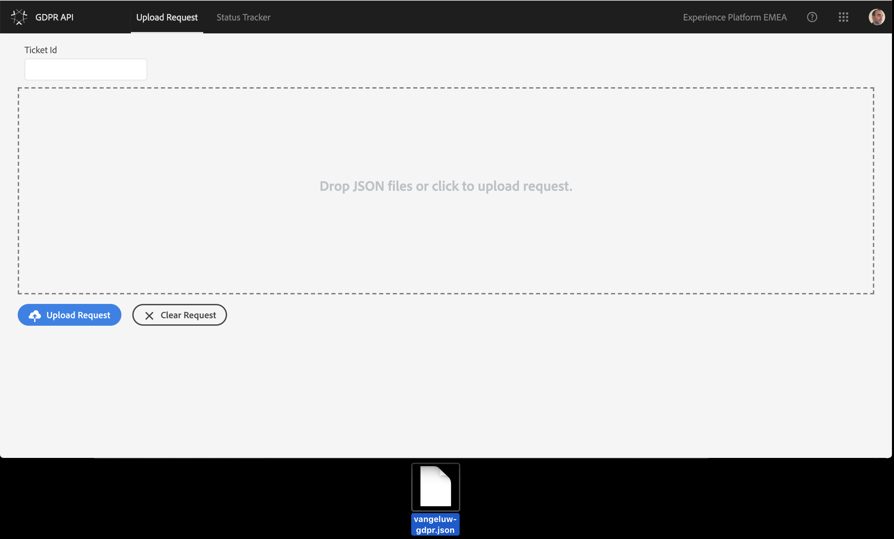

## Exercise 1.4.3 - Launch a GDPR Access Request through the GDPR UI

Go to [https://gdprui.cloud.adobe.io/](https://gdprui.cloud.adobe.io/) and if needed, login with your personal login details.

Before continuing, please make sure that the active company name is Experience Platform EMEA. You can check this in the top right part of your screen:

If the company name is correct, go to your desktop and select the request file that you prepared in the previous exercise.

Drag and drop the file in the GDPR UI

If the file was correctly formatted and dropped, you will see the file name appear on the bottom left part of your screen.

Assign a Ticket Id to your Request. Use "**yourldap** - 001" as a Ticket Id.

Click the Upload Request button.

You will get a visual confirmation of your upload.
Click Yes to navigate to the status tracker.

In the Status Tracker window, you'll find your request, with a "Processing" - status. Processing may take up to 30 days, depending on which solutions and how much data was requested.

By clicking on the JOB ID, you can see all of the details for your GDPR Access Request.

**Congratulations!** You've successfully finished Exercise 4 and Module 1!

[Go Back to Module 1](../README.md)

[Go Back to All Modules](/../../)

