## Exercise 1.2.4 - Datasets in Platform

As part of the Launch Rule configuration, we'll define rules that will send behavioral and profile data to Platform. In Exercise 1.2.2 we've already defined a streaming endpoint so that we could send data directly from any source into Platform. When defining a rule to send in behavioral and/or profile data, we'll have to specify where that data needs to be stored in Platform. For that, we need to use datasets in Platform.

To log in to Platform, go to [https://platform.adobe.com/home](https://platform.adobe.com/home). 

Log in with your personal Adobe Login credentials.

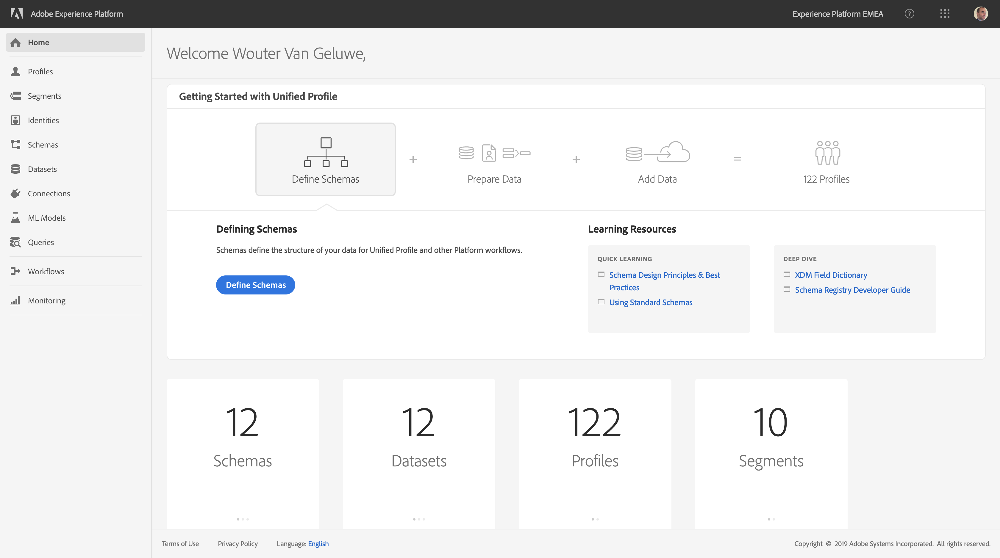

After login, make sure that you're in the right company: Experience Platform EMEA, which you can check in the top right corner of your screen.

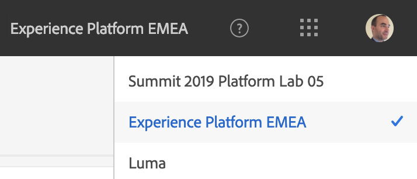

A dataset needs to be mapped against a schema. Schema's are defined as part of our Experience Data Model, aka XDM.

Behavioral data needs to be mapped against the ExperienceEvent schema.

Profile data needs to be mapped against the Profile XDM schema.

You can consult these schema's by going to "Schemas" in the Platform menu.

If you'd like to know more about XDM, please have a look here:

  * [https://www.adobe.io/open/standards/xdm.html](https://www.adobe.io/open/standards/xdm.html)
  * [https://github.com/adobe/xdm
](https://github.com/adobe/xdm)

Search for "EMEA Website Registration Data" to find the Profile XDM for our Platform Org.

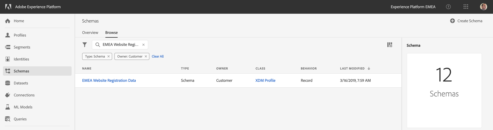

The EMEA Website Registration Data Schema looks like this:

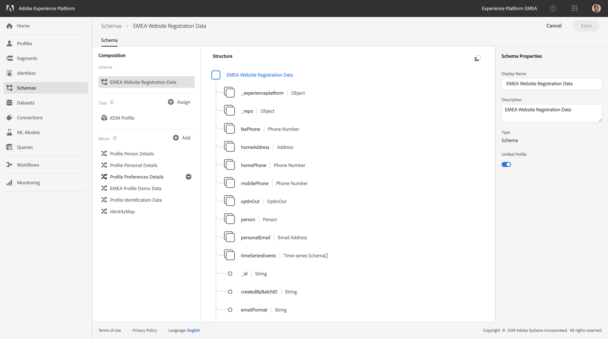

Search for "EMEA Website Interaction Data (EE)" to find the ExperienceEvent XDM.

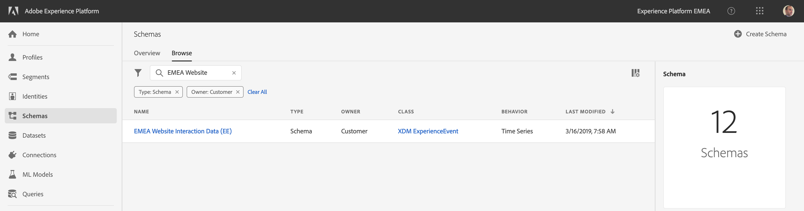

The EMEA Website Interaction Data (EE) Schema looks like this:

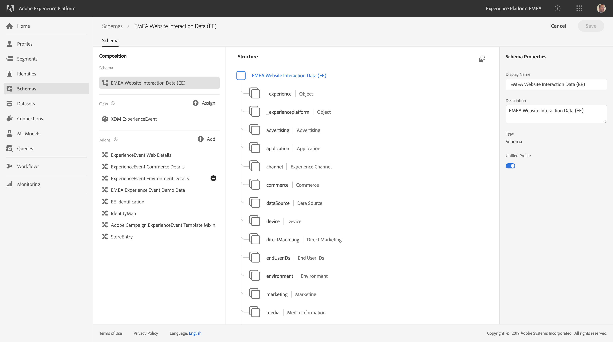

Try to locate these 2 Schema's yourself in the UI of Platform.

For the EMEA Platform Enablement, we will be using shared datasets. These datasets have already been created. 

To view **Datasets**, navigate to the "Datasets" menu option.

You'll find a number of existing Datasets in Platform.

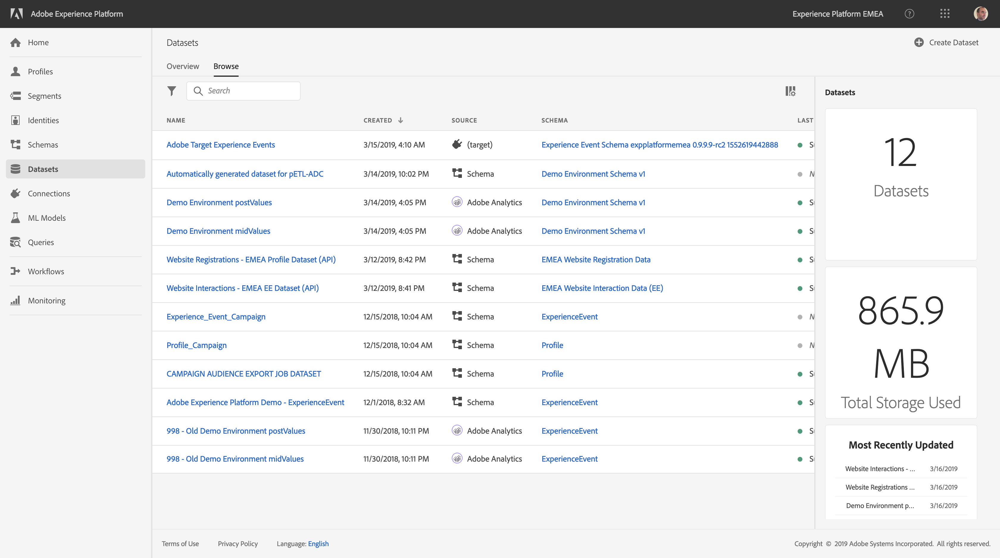

At this moment, we'll use 2 datasets, which are linked to the Schema's that you just viewed

  * 1 Dataset to capture Website Interaction data
  * 1 Dataset to capture Website Registration data

These datasets already exist! Don't recreate them.

  * Website Interaction Dataset name: 
  
    * **Website Interactions - EMEA EE Dataset (API)**
      

  * Website Registration name: 
  
    * **Website Registrations - EMEA Profile Dataset (API)**
      
    
**FOR YOUR INFORMATION**

Below is the process to create a new dataset. At this moment, this information is purely informational and you should not perform the below configuration.

This is the process to Create a Dataset. Do not do this yourself at this moment, just read through the information.

Click on the "Create Dataset" button, let's start with the Website Interaction dataset.

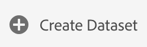

Select the "Create Dataset from Schema" option by clicking on that specific "Create Dataset from Schema" button.

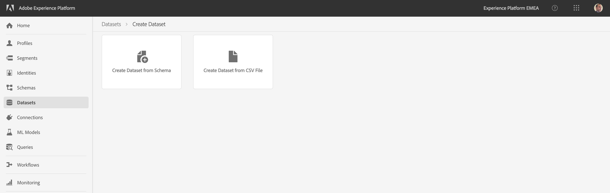

In the next screen, you have to select the Schema to be linked to your dataset.

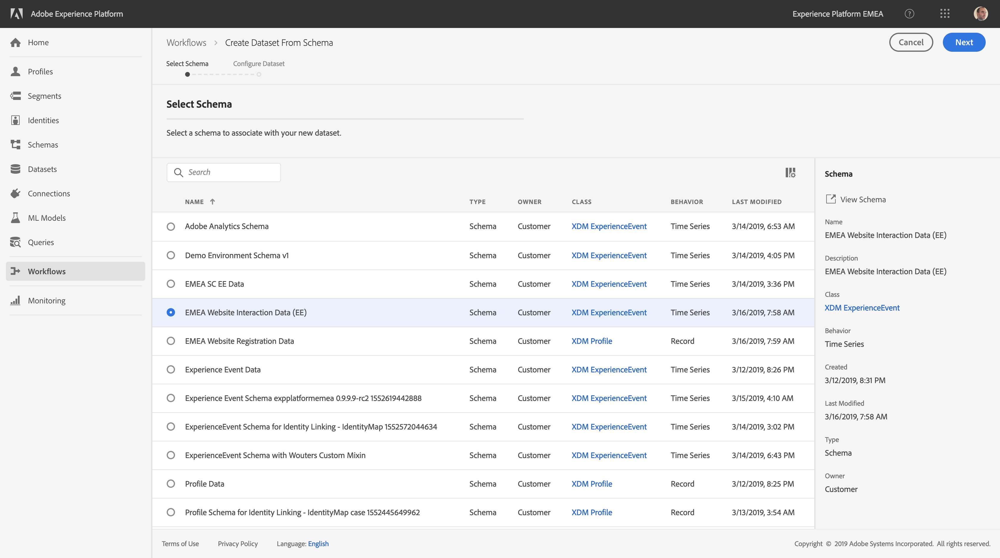

Search for the EMEA Website Interacton Data (EE) schema, select it and click "Next".

On the next screen, you must define the dataset's name. Please remember and respect the naming convention:

  * Website Interactions Dataset name: 
    * **ldap** - Website Interactions - EMEA EE Dataset

Enter this name for both the Name and the Description - field.

Click "Finish" to save your dataset.

Now you'll have to repeat the process to create your Website Registrations dataset.

Click on the "Create Dataset" button, let's start with the Website Registrations dataset.

Select the "Create Dataset from Schema" option by clicking on that specific "Create Dataset from Schema" button.

In the next screen, you have to select the Schema to be linked to your dataset.

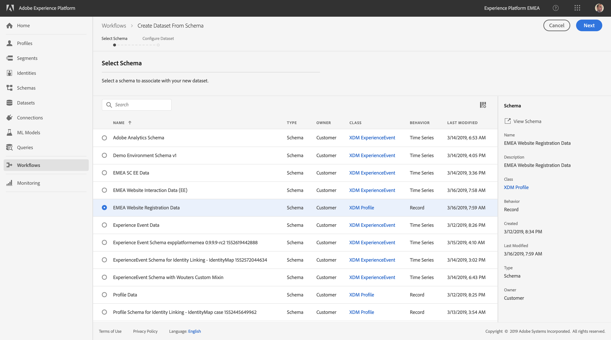

Search for the EMEA Web Registration Data schema, select it and click "Next".

On the next screen, you must define the dataset's name. Please remember and respect the naming convention:

  * Website Registration Dataset name: 
    * **ldap** - Website Registrations - EMEA Profile Dataset

Enter this name for both the Name and the Description - field.

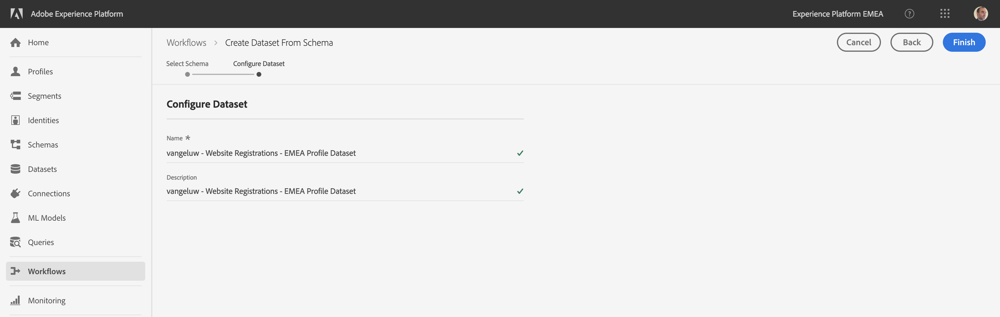

Click "Finish" to save your dataset.

Congratulations for reaching this point! Let's continue with the Launch Rule Configuration now.

[Next Step: Exercise 1.2.5 - Configure Launch Rules](./ex5.md)

