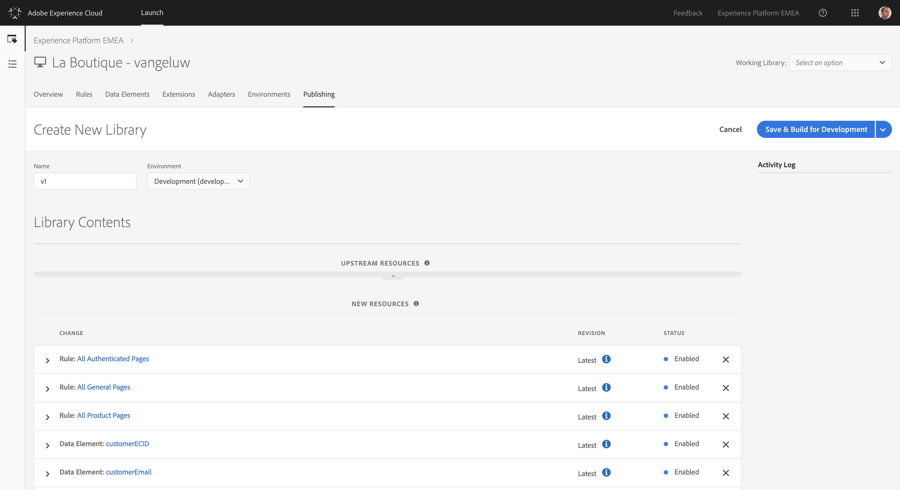
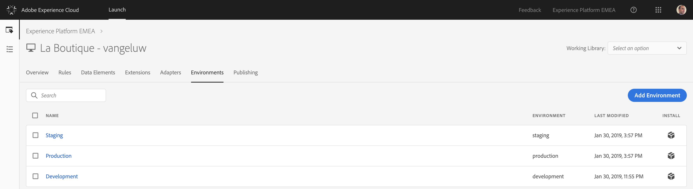

## Exercise 1.2.6 - Publish your Launch Property

Go to [https://launch-demo.adobe.com/](https://launch-demo.adobe.com/) and login with your personal login details.

In the Launch UI, navigate to the menu option "Publishing".

Click the "Add New Library"-button

Enter as Name "v1" and select the Development environment from the dropdown list.

Click on the "Add All Changed Resources"-button, after which you should see all the elements that you configured pop up in the "New Resources" list.

Click the "Save & Build for Development"-button.

Your new Library is now being built!

To implement the new library on the La Boutique website, navigate to the "Environments"-tab in the Launch UI.

Locate your Development Environment, and click on the "Install"-icon on the right side of the screen:

You'll see a screen like this one, which contains the tag to implement on the website:

Copy the <head> tag, with the goal of pasting it on the La Boutique website in the <head> section of the page. More instructions in the next and last exercise of the Launch implementation.

[Next Step: Exercise 1.2.7 - Implement Launch Tag on La Boutique website](./ex7.md)

