## Exercise 1.5: Install the La Boutique Mobile Application
In this exercise, the goal is to install and use the "La Boutique" Mobile Application.

The "La Boutique"-mobile application is a variation of the "Luma"-application which was built by Mathieu Hannouz from the Evangelist-team. If you're looking for the source-code of the app, you can find it here: [https://git.corp.adobe.com/hannouz/Luma-Platform-iOS](https://git.corp.adobe.com/hannouz/Luma-Platform-iOS)

_In Module 2, there will be an exercise that details the setup of this application further, and how Launch with the new SDK was implemented in that application._

The mobile application is only available for iOS devices at this moment. Sorry for any inconvenience caused for Android-users.

Before you can start this bonus exercise, you need to install the "La Boutique"-mobile app. To get access to the "La Boutique"-mobile application, [click here to add yourself as a tester of the "La Boutique"-demo app](https://apple.co/2GZWcMs).

After being invited to test the app, you can start the below exercise.

### Exercise 1.5.1 - Install the iOS application by making use of Testflight

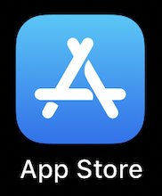

On your iPhone, go to the App Store and search for "testflight".

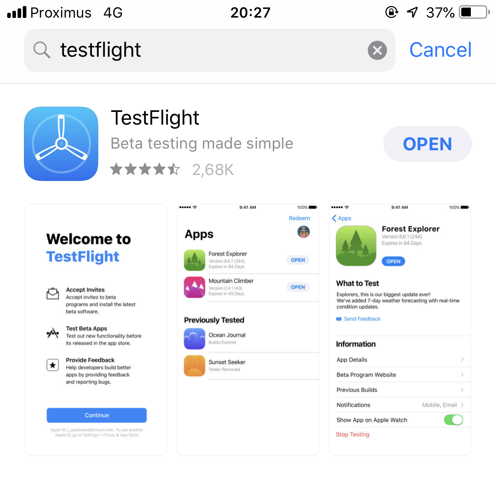

Install the app TestFlight on your iPhone.

Look out for an invitation by email to test the "La Boutique" mobile application.

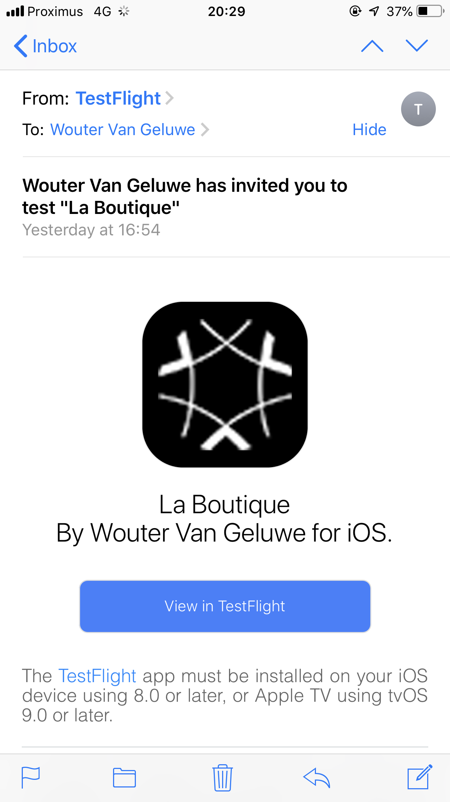

Once you've received the email invitation, click on the "View in TestFlight"-button in the email.

In the TestFlight-app, click on the "INSTALL"-button.

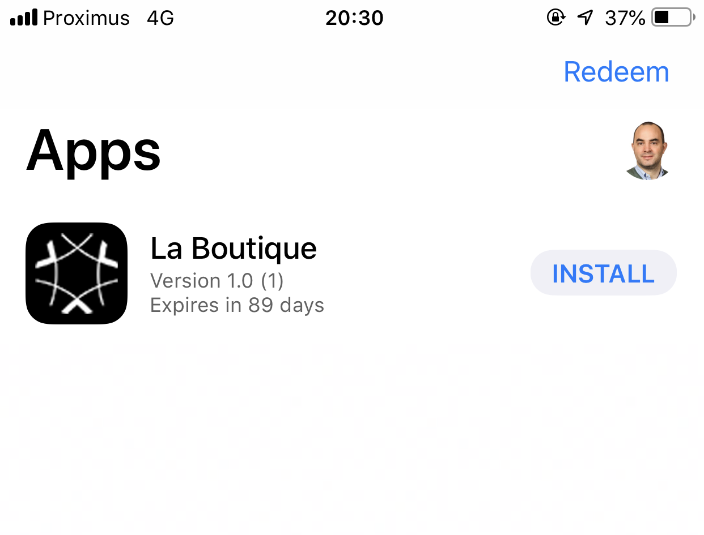

After installing the app, open the "La Boutique"-app.

You'll have to respond to 2 questions asking for your permission to track your location and to send you push notifications. If you'd like to use iBeacons in combination with your mobile app to track your location and if you'd like to receive personalized push notifications, please accept both questions.

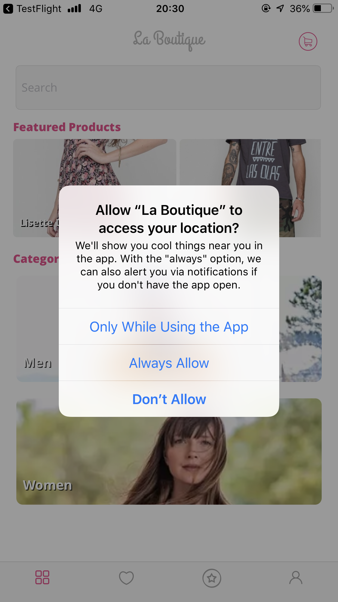

Click "Always Allow" so that the application can always track your location.

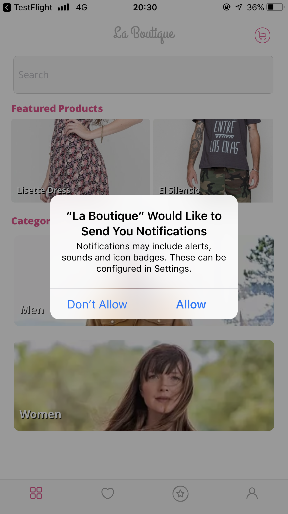

Click "Allow" to receive push notifications from La Boutique.

Next, click on the "user"-icon to go to the login-screen.

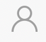

Click the "Log In"-button.

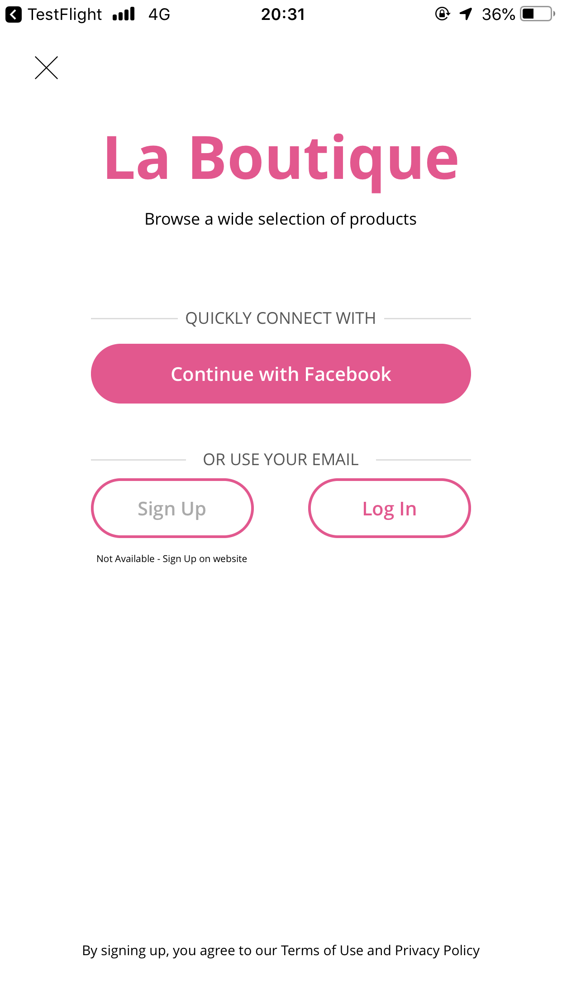

Enter the email-address and password (1234) that you used to login on the "La Boutique"-website. 

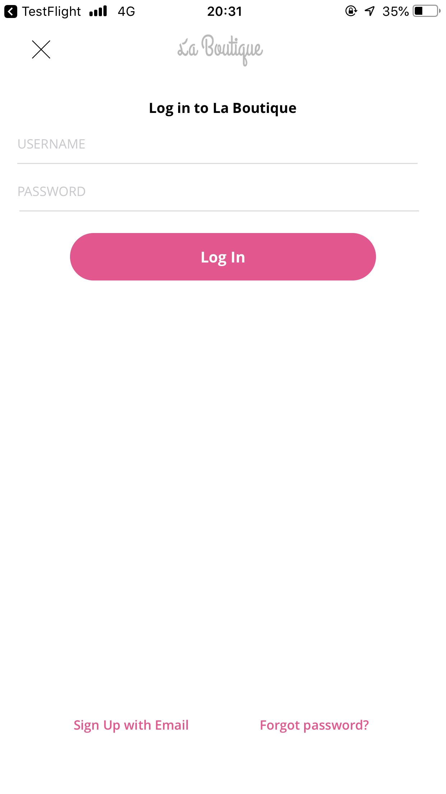

After login, you should see the personal data that you previously entered on the "La Boutique"-website.

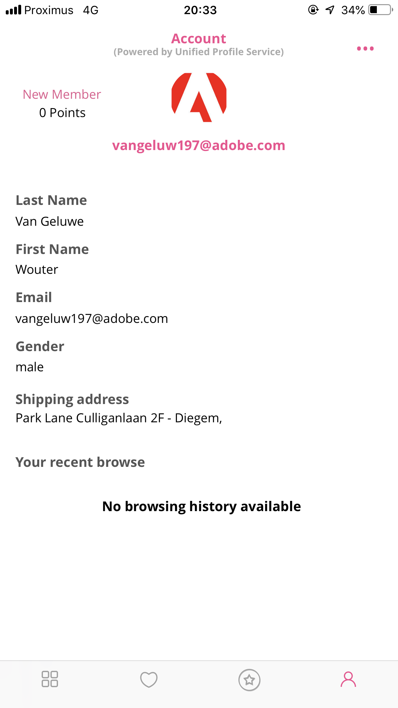

Next, go back to the Products & Category page by clicking on this icon:

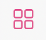

Select a category, for instance, "Men".

In the "Mens"-section: view a product like for instance, the "Bay Blocker".

Click on the "user"-icon to go back to the login-screen.

You'll now see that the viewed product is part of your recent browse history:

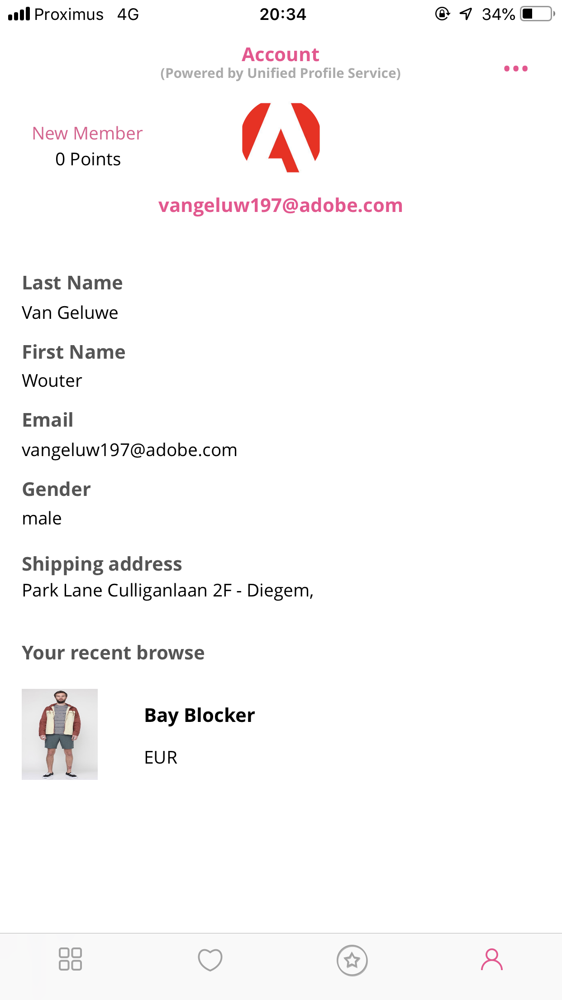

You can repeat the process a number of times.

Go back to the Products & Category page by clicking on this icon:

Select a category, for instance, "Men".

In the "Mens"-section: view a product like for instance, the "Navy Linen Blazer".

Click on the "user"-icon to go back to the login-screen.

You'll now see that the viewed product is also part of your recent browse history:

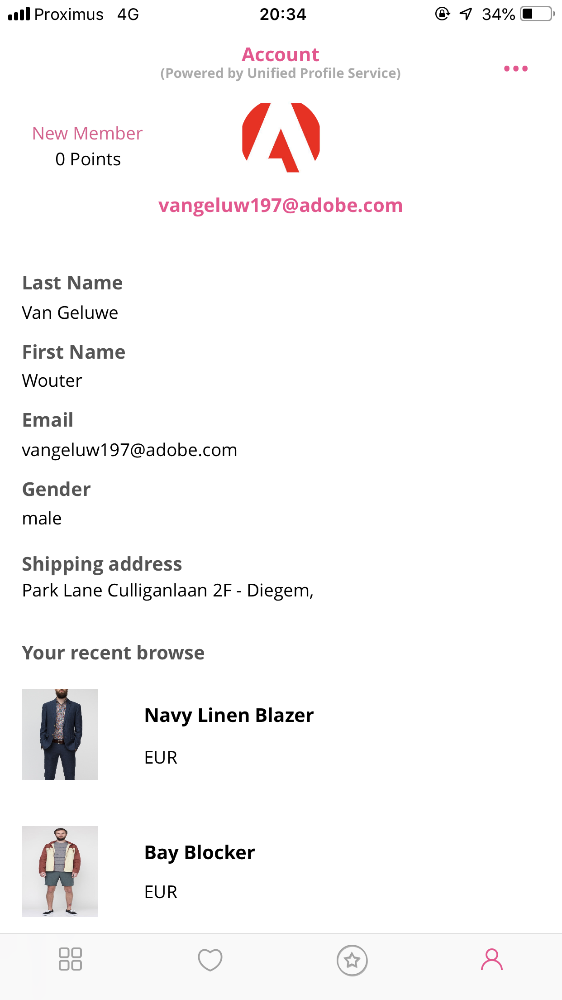

The "La Boutique"-mobile application is linked to Adobe Experience Platform and sends data like "Products Viewed" in real-time to Platform as an Experience Event. These Experience Events then become part of the Unified Profile of this customer.

Module 2 will focus heavily on cross-device behaviour, ID-syncs, API's and so much more! 

[Go Back to Module 1](https://git.corp.adobe.com/vangeluw/platformenablement/tree/master/module1)

[Go Back to All Modules](https://git.corp.adobe.com/vangeluw/platformenablement)

