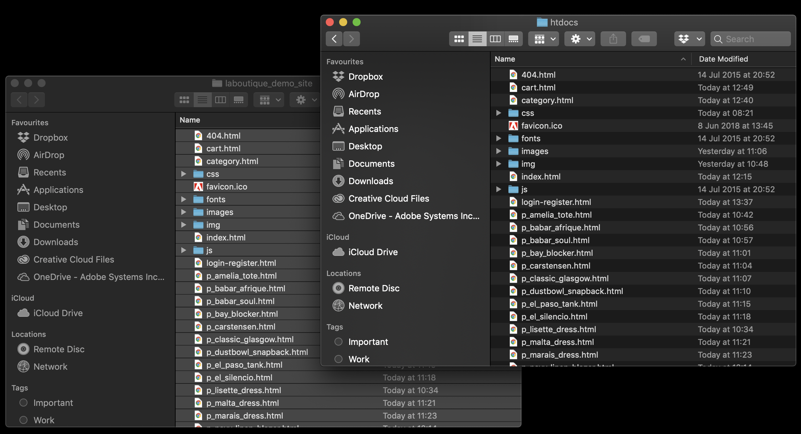

## Exercise 1.1: Setup of Prerequisites
In this exercise, the goal is to install and configure everything that is needed to run through the exercises.

### Exercise 1.1.1 - Download and Install MAMP

MAMP is a free web server which we will use for this enablement.

Go to <a href="https://www.mamp.info/en/" target="_blank">https://www.mamp.info/en/</a> and install MAMP (Free Edition).

MAMP comes in 2 versions: Free and Pro. For this enablement we'll be using the Free version. 

**For Mac Users:** install MAMP with all default settings.

**For Windows Users:** during the installation of MAMP, you can also choose to install MAMP Pro. We will not be using MAMP Pro as part of this enablement so do not install MAMP Pro.

Configuration of MAMP will be done in the next exercise.

### Exercise 1.1.2 - Download Demo Site Package
Download the [demo site zip package](./downloads/laboutique_demo_site_v1.zip) to your computer, unzip it in a directory of your choice, f.i. on your Desktop:

### Exercise 1.1.3 - Setup Demo Site

**Mac:** Go to Launchpad and click on the grey MAMP-icon to start MAMP.

**Windows:** Go to your Windows Desktop and double-click on the grey MAMP-icon to start MAMP.

MAMP will start and you'll see the below screen.

Click on Start Servers to start MAMP.

Servers are now running, and you can access the Start Page by clicking on 'Open WebStart page'.

MAMP has a default website installed on a specific location on your computer. We need to replace the default website with our 'La Boutique' demo website.

**Mac:** On your MacBook, go to Applications and locate the MAMP folder in the Applications list.

**Windows:** On you Windows machine, go directly to C:\MAMP\htdocs

**Only for Mac:** Double-click to go in the MAMP-folder.

**Only for Mac:** Open the folder 'htdocs'.

**Fot both Windows and Mac:** Delete all files in this folder.

Go to the folder where you unzipped the zip-package of the La Boutique demo website. Copy all files and paste them in the 'htdocs' folder.

Go back to your web browser.

Click on 'My Website' to navigate to the La Boutique demo website.

You should now see this website:

You can always Start and Stop MAMP by going back to the MAMP Application:

One you've started your web server, you can directly access the La Boutique website by going to <a href="http://localhost:8888/index.html" target="_blank">http://localhost:8888/index.html</a>

If the La Boutique website is displayed, then you've successfully completed this exercise.

Congratulations!

[Next Step: Configure Launch for your website](../launch/README.md)

[Go Back to Module 1](../README.md)

[Go Back to All Modules](../../README.md)

