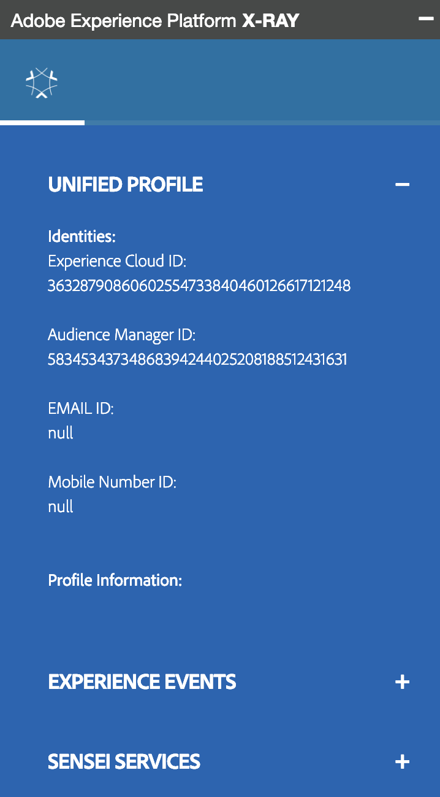
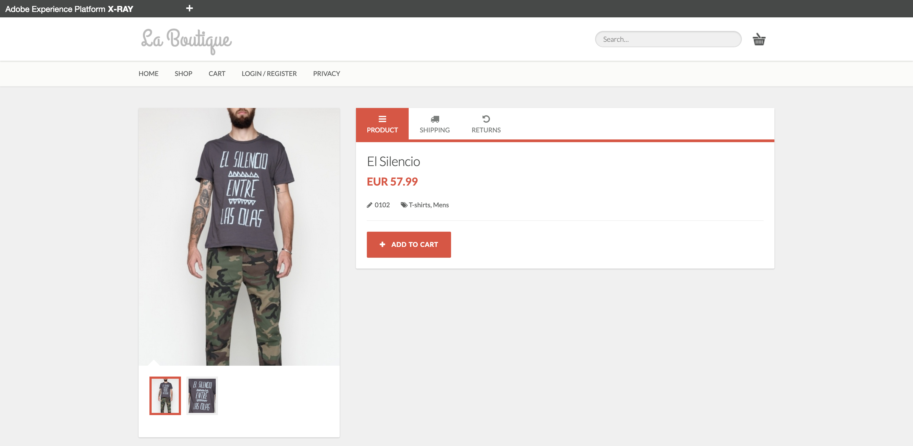
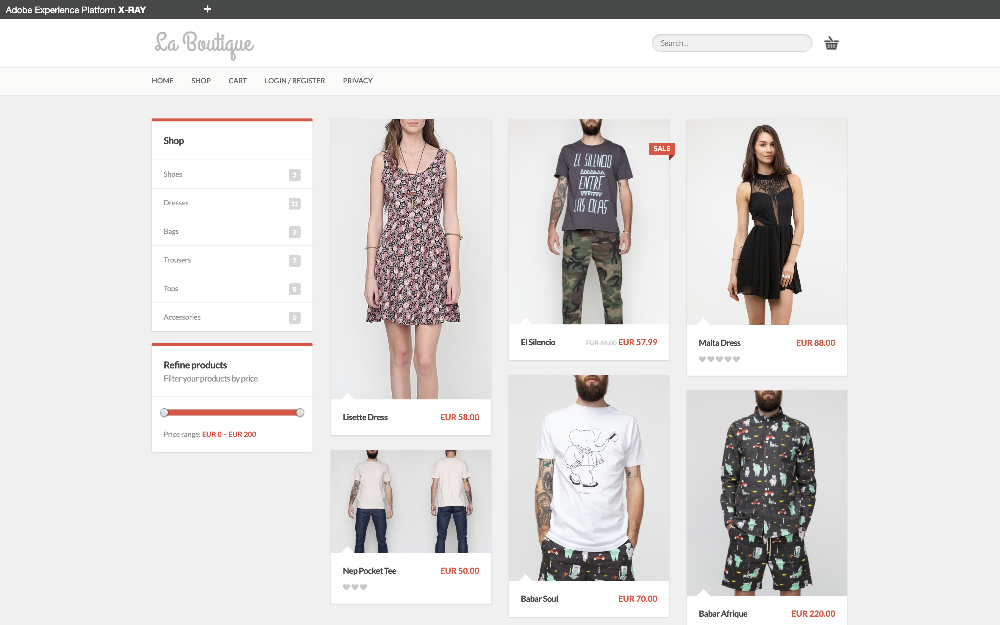
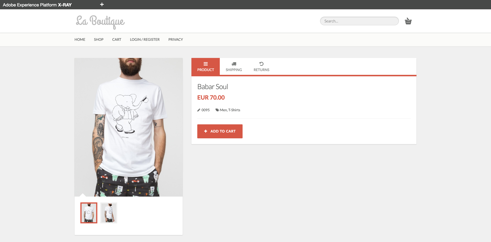
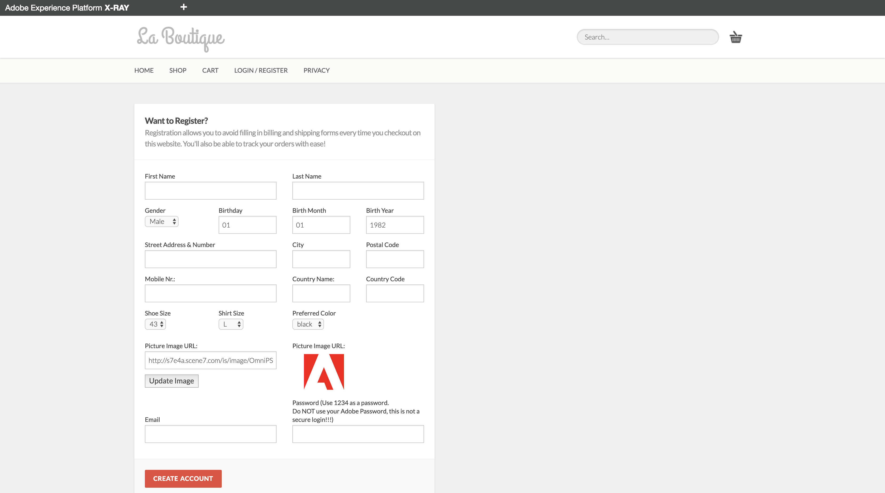
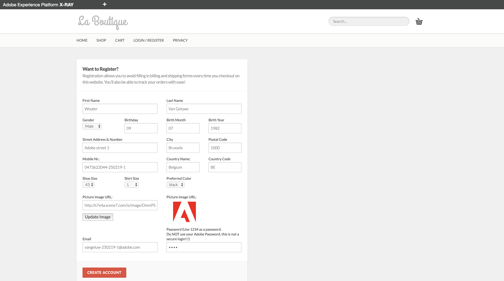
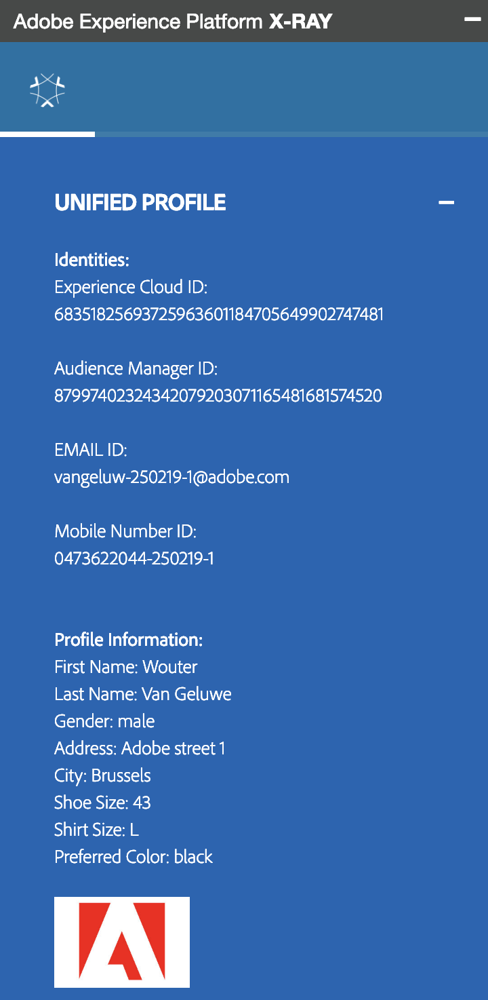

### Exercise 2.5.1 - From unknown to known on the La Boutique website

ATTENTION: please remember [the Platform Demo Best Practices guidelines](./ex0.md)

#### **Context:**

The journey from unknown to known is one of the most important topics amongst brands these days, as is the customer journey from acquisition to retention. 

Adobe Experience Platform plays a huge role in this journey. Platform is the brains for communication, the Experience System of Record.

Platform is an environment in the word "customer" is broader than 'just' the "known"-customers. This is a very important thing to mention when speaking to brands: an unknown visitor on the website is also a customer from Platform's perspective and as such, all of the behavior as an unknown visitor is also sent to Platform. Thanks to that approach, when this customer eventually becomes a known customer, a brand can visualize what happened before that moment as well. This helps from an attribution and experience optimisation perspective.

When a customer is an unknown website visitor, the main identifier to Adobe is the Experience Cloud ID. The ECID is the internal, Adobe identifier to Adobe Experience Platform and Experience Cloud solutions. When Adobe Analytics speaks to Adobe Target, their common identifier is the ECID.
In the acquisition phase, where a brand wants to turn an unknown visitor in a known customer, there's a specific solution that plays an important role: Adobe Audience Manager. Adobe Audience Manager is a Data Management Platform (DMP) and a DMP does 3 things: 

  * Data Ingestion
  * Building a Profile for Segmentation
  * Send a segment to a destination as fast as possible

While there's clearly some overlap between what Adobe Audience Manager does and what Platform doesn there are a couple of things that **only** Adobe Audience Manager does:

  * Adobe Audience Manager is the door, the gateway between a brand's internal world and the external world of Display, Search and Social
  * Adobe Audience Manager captures all types of data, including 2nd and 3rd Party Data
  * Adobe Audience Manager offers brands the ability to monetize their data through an Audience Marketplace

Adobe Audience Manager will continue to do these things, but also, Adobe Audience Manager will benefit from Platform's capabilities to optimise what it does.

In the journey from unknown to known, Audience Manager plays a vital role as it's able to speak to this unknown visitor on external channels and basically, pull this unknown visitor back to a brand's digital properties and have that unknown visitor convert.

That's why we have an Audience Manager ID: it's the gateway between a brand's internal world and the wild, wild west of the outside world of Display, Search and Social. It's important to call this out to brands.

#### **Demo flow:**

#### Step 1 - Unknown visitor browses the La Boutique website

  * Go to the La Boutique Homepage
  
  
  
  * Introduce the X-ray panel and explain the Unified Profile:
    * **ECID** as the internal Adobe identifier
    * **Audience Manager ID** as the external identifier, and stress the importance and unique role of Audience Manager as the door and gateway between the internal 'owned' world and the external, paid media world.
      
  

  * Introduce the concept of Experience Events

  
  
  * Scroll down on the page until you see the products, click on the El Silencio T-shirt **(FYI: it may take 30sec-1min before the Product View is displayed on the X-ray panel)**
  
  
  
  * Have a look at the product, explain that an Experience Event of type "Product View" has been sent by Adobe Analytics to Platform and then go to the "Shop"-page
  
  
  
  * On the "Shop"-page, click the "Babar Soul"-product
  
  
  
  * Explain that one more Experience Event has been sent by Adobe Analytics to Platform. Go back to the Homepage. **(FYI: it may take 30sec-1min before the Product View is displayed on the X-ray panel)**
  
  
  
  * Open the X-ray panel and showcase that we now have 2 Experience Events of type "Product View" available in Platform. While the behaviour is anonymous, La Boutique is able to track every click and store in in Platform. Once the anonymous customer becomes known, La Boutique will be able to merge all anonymous behaviour automatically to the know profile.

  
  
#### Step 2 - Unknown visitor registers on the La Boutique website

As a best practice, please use the following convention for identifiers:

  * Email Address identifier: **ldap**-**DDMMYY**-**number**@adobe.com
  * Mobile Nr identifier: **yourmobilenumber**-**DDMMYY**-**number**

As an example, for the ldap "vangeluw":
On Monday February 25 2019, this should be the first set of identifiers of the day.
  
  * Email Address identifier: **vangeluw**-**250219**-**1**@adobe.com
  * Mobile Nr identifier: **0473622044**-**250219**-**1**

  * Go to the Register/Login page
  
  
  
  ATTENTION: please remember [the Platform Demo Best Practices guidelines](./README.md)
  
   
 
  * Fill out your registration details and click "CREATE ACCOUNT".
  
  * After login, go to the Homepage of the La Boutique website and open the X-ray panel, go to Unified Profile. On the X-ray panel, you should see all of your personal data displayed.
  
  

  * On the X-ray panel, go to Experience Events. You should see the 2 products that you viewed before on the X-ray panel.

  

After becoming a known customer, it's time to install the "La Boutique"-mobile app on your iPhone and then login to the app. 

Go to the next exercise!

[Next Step: Cross-device on Mobile App](./ex2.md)

[Go Back to Module 2](../README.md)

[Go Back to All Modules](/../../)

