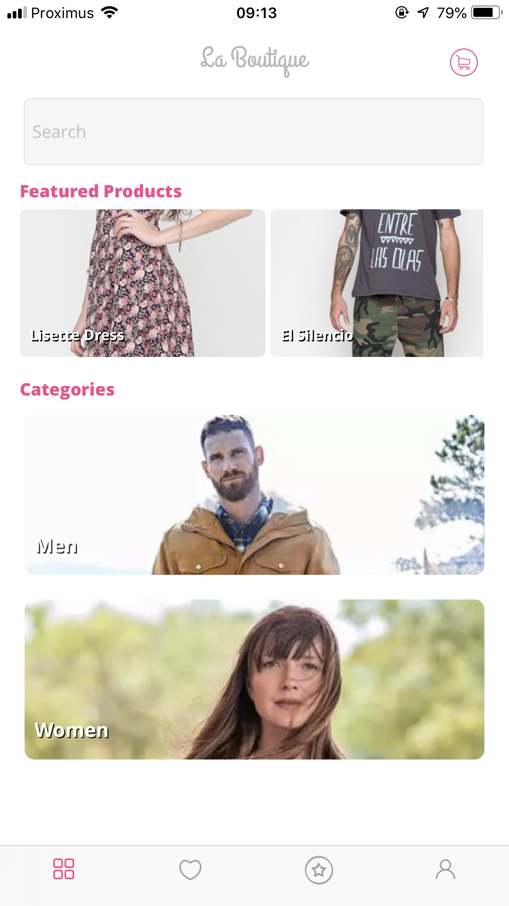
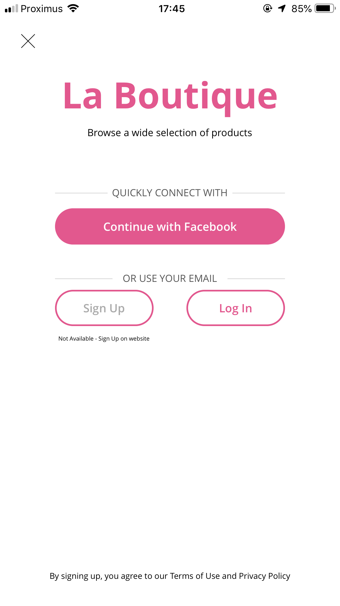
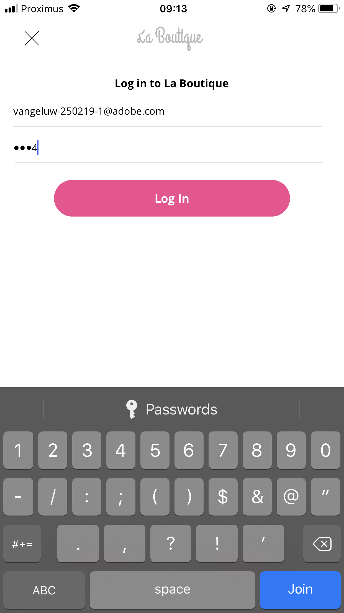
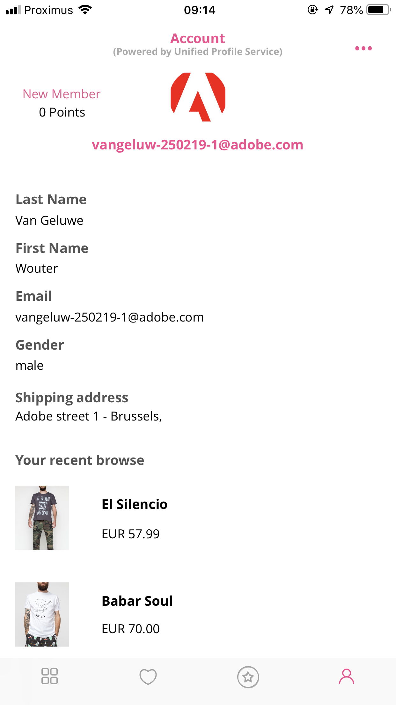
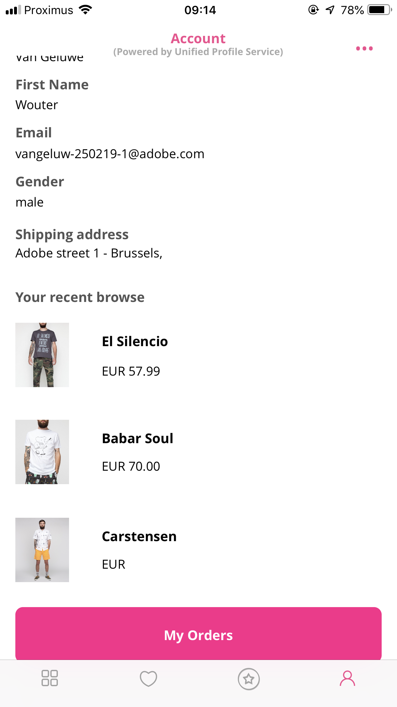

### Exercise 2.5.2 - Cross-device on Mobile App

ATTENTION: please remember [the Platform Demo Best Practices guidelines](./ex0.md)

To get access to the "La Boutique"-mobile application, [click here to add yourself as a tester of the "La Boutique"-demo app](https://apple.co/2GZWcMs).

Demo flow:

  * Open the La Boutique mobile app.
  
  

  * Go to the Account-screen.
  
  

  * Login with the Email ID you used in the previous exercise and the password of 1234.
  
  

  * See your Unified Profile data appear in the application, along with your Desktop Product Views

  

  * Go to the app's Homepage
  
  

  * Go to the "Mens"-category
  
  

  * Click on the product "Carstensen" and view the product.
  
  

  * Go back to the previous screen
  
  

  * Go to the Account-screen and your Unified Profile data will be refreshed, after which you'll see the "Carstensen"-product be part of your Viewed Products.
  
  

  * Now go back to your desktop computer and refresh the La Boutique homepage, after which you'll see the Carstensen product also appear there.
  
  

[Next Step: Personal advice in the brick-and-mortar store](./ex3.md)

[Go Back to Module 2](../README.md)

[Go Back to All Modules](../../README.md)

