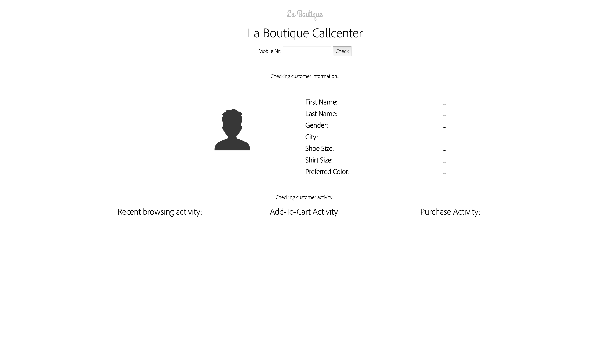
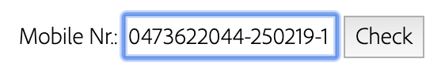
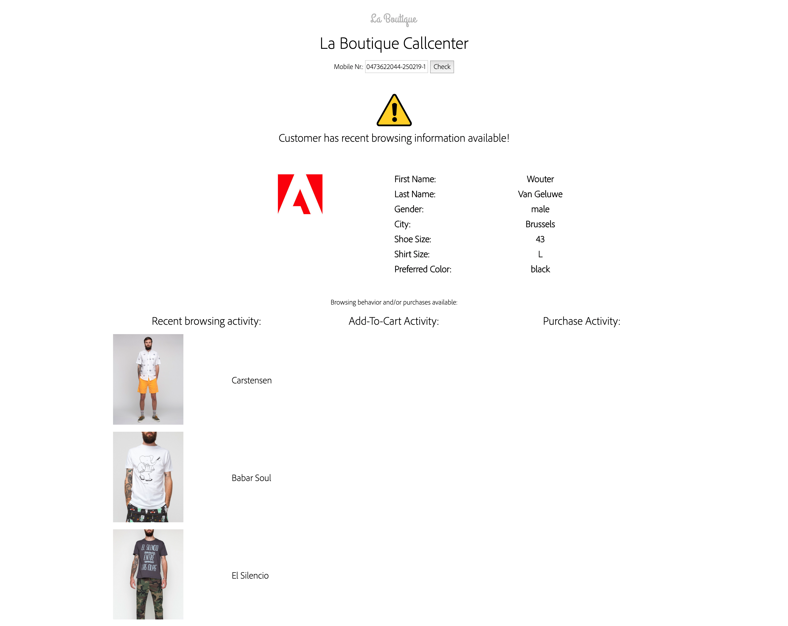

### Exercise 2.5.4 - Questions or problems? Call the most personal Call Center ever!

ATTENTION: please remember [the Platform Demo Best Practices guidelines](./ex0.md)

#### **Context:** 

  * As a customer, I expect the same level of personalisation in the offline world just like I do in the online world. 
  * As a brand, I want to be as consistent as possible in my communication with my customers, and as such, I consider my offline channels the same as my online channels.

As a brand, my call center is one of my most important channels. Customers rarely call the call center to say that all is good. Every call is a potential reason for a customer to churn if not handled in the proper way.

Handling a problem in the right way can only be done if all the information is available. It's very difficult to solve a puzzle if you don't have all the pieces.

In today's call center environments, a call center employee is basically driving a car blindfolded. Sure, all CRM-data is available and that contains the gender, age, owned products, etc... but there's no behavioral information available in those environments.

What we can offer with Platform's API's, is a revolution to the kind of data a call center employee has available.

In this use-case, we're zooming in on using the recent behavioral data, in real-time, to inform the call center employees that a specific customer with a specific background and preferences was browsing the website. The goal is to provide this valuable information in a push-way, onto the employee's computer screen, before the employee even speaks to the customer.

Once a customer calls the call center, there's an IVR-system that receives the call. When the IVR-system receives the call, the phone number is known. With this information, the IVR-system can query Platform's API's immediately to then receive all that mission-critical information immediately.

Upon receiving the behavioral information, the IVR-system can then also make decisions based on that data to direct a call to a specific employee if that employee is more suitable than another to handle a specific problem.

From a technical perspective, when a customer calls the call center, this Personal Call Center-dashboard does the following:

  * Capture the Mobile Nr ID
  
  * Join the Mobile Nr ID with the Namsespace of "mobilenr".
  
  * Send this information to an Adobe I/O runtime function
  
  * The Adobe I/O runtime function then does the following:
    * Authenticate to Adobe I/O
    * Send a first call, specifying the Profile XDM Schema, with the Mobile Nr ID and NS of mobilenr to Platform's API's 
    * Send a second call, specifying the Experience Event XDM Schema, with the Mobile Nr ID and NS of mobilenr, to Platform's API's
  * The response from Platform on both calls is sent back to the Personal Call Center-dashboard
  * The Personal Call Center-dashboard parses the information, takes the requested information and displays it on the Personal Call Center-dashboard.

Also remember, the interaction doesn't have to be one-way only. After the call, the call center should log the call and send an Experience Event to Platform so that Platform also has visibility on what happened.

Thanks to this bi-directional interaction between a Call Center and Platform, many use-cases become much easier and more powerful:

  * Call Deflection
  * Churn Prediction (using Data Science Workspace)
  * Up-sell and Cross-sell
  * ...

#### **Demo flow:**

  * Go to [http://platformdemo.net/callcenter/](http://platformdemo.net/callcenter/)

  
  
  * Enter the Mobile Number you used to register on the La Boutique website.
  
  
  
  * After 1-2 seconds, your Unified Profile data is being shown to the call center employee, including your browsing behaviour from the last couple of seconds.
  
  

Congrats! You've finished the default content for module 2!

[Go Back to Module 2](../README.md)

[Go Back to All Modules](/../../)

