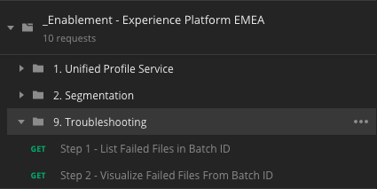

### Exercise 2.5.5 - Troubleshooting failures during data ingestion

During demo preparation and testing, it's possible that you'll encounter problems with data ingestion. If your Profile data or your Products Viewed data isn't visible on the X-ray panel in real-time, it's very likely that you have an issue with the data that you're sending to Platform. When data arrives in Platform, there are a number of mechanisms that validate data prior to ingesting it.

The most common visual way to discover that data validation has failed, is when you see a "Failed"-status in Platform IU. 

FYI: Batches are processed in Platform's Data Lake every 15 minutes. So if your data isn't showing on X-ray immediately, you might have to wait a couple of minutes before you're able to retrieve the Batch ID of the failed batch that contains your data.


As you can see in the above message, some batches have failed:


When clicking on the Batch ID, you're seeing this message currently:


While the Product Teams are working on providing more meaningful details about the error in the Platform UI, currently it's not possible to deduct from this message why the error has happened.

In order to know why your data ingestion has caused an XDM Validation error, today we can use Platform's API through Postman to find out more.

In Postman, have a look at your collection named "_Enablement - Experience Platform EMEA". 



In case you don't have the menu "9. Troubleshooting", please download [this updated Postman collection](../prerequisites/downloads/postman_troubleshooting.zip) and unzip it to your desktop.


After unzipping the updated Postman collection, you'll see this JSON-file: "_Enablement - Experience Platform EMEA.postman_collection.json".

Go to Postman and in the upper right corner, click the "Import"-button


Click the "Choose Files"-button.

Navigate to find the file that you just downloaded: "_Enablement - Experience Platform EMEA.postman_collection.json"


Click "Open".

Click "Replace" to repalce the already existing Postman collection with this one.


After that, you'll find an updated collection with a folder called "9. Troubleshooting".


In this folder, you'll find 2 steps:

  * Step 1 - List Failed Files in Batch ID
  * Step 2 - Visualize Failed Files From Batch ID

In Step 1, you need to provide the Batch ID of the failed batch that you want to troubleshoot.

In the below example, the Batch ID of the failed batch is ```ff519de8e92e423499163eea288b83ba```.


Let's open the call "Step 1 - List Failed Files in Batch ID".


Let's have a deeper look at the call and its URL.


In the URL, you can see ```a181bbcaa26441708d5b34bc887290bd```. This is a Batch ID from a previous troubleshooting. 

In this exercise, and also every time that you'll want to redo troubleshooting for another Batch ID, you'll have to replace the previous Batch ID with the new Batch ID in the URL of the call.

So, let's do that now.

Replace ```a181bbcaa26441708d5b34bc887290bd``` in the GET URL by the Batch ID of the failed batch that you want to investigate now, which is ```ff519de8e92e423499163eea288b83ba```.


Hit the "Send"-button.


FYI: if you get the below error message, it means that your access_token to 'speak' with Adobe I/O and the Platform API's has expired.


If your access token is expired, request a new one by going to the Postman Collection with the name "_Adobe I/O - Token", select the call "IMS: JWT Generate + Auth".


Click the "Send"-button to execute the call and you'll receive the new access_token.


You can now continue with the troubleshooting exercise, Step 1.


Hit the "Send"-button again.


You now get the following response.


```
{
    "data": [
        {
            "name": "_SUCCESS",
            "length": "0",
            "_links": {
                "self": {
                    "href": "https://platform.adobe.io:443/data/foundation/export/batches/ff519de8e92e423499163eea288b83ba/failed?path=_SUCCESS"
                }
            }
        },
        {
            "name": "part-00000-fe0b823d-6ce0-4d4b-aa56-dab6c7977637-c000.json",
            "length": "10294",
            "_links": {
                "self": {
                    "href": "https://platform.adobe.io:443/data/foundation/export/batches/ff519de8e92e423499163eea288b83ba/failed?path=part-00000-fe0b823d-6ce0-4d4b-aa56-dab6c7977637-c000.json"
                }
            }
        }
    ],
    "_page": {
        "limit": 100,
        "count": 2
    }
}
```

We're looking for detailed information about why this Batch ID has failed. This detailed information is now part of a JSON-file that has been made available. The URL of this JSON file is part of the response, in the second object of the "data"-array. Look for the key ```_links.self.href``` that references a JSON-file.


You now have to select the full URL (without the quotes) and copy it.

Attention: do not copy any quotes ```"```. You should copy from ```https``` all the way to including ```json```

This is what you should have copied:
```
https://platform.adobe.io:443/data/foundation/export/batches/ff519de8e92e423499163eea288b83ba/failed?path=part-00000-fe0b823d-6ce0-4d4b-aa56-dab6c7977637-c000.json
```

Now, go to Step 2 - Visualize Failed Files From Batch ID and open the call.


Select the full URL of the call and delete it.
 


Now, paste in the URL that you copied from Step 1.


Hit the "Send"-button.


In the response to this call, you're seeing a JSON-file that contains a readable explanation why this call has failed.


In this response, you can find multiple failed calls and every call could have failed for a different reason. 

Let's zoom in on the first one:

```
{"body":"{\"xdmMeta\":{\"schemaRef\":{\"id\":\"https://ns.adobe.com/experienceplatform/schemas/f4df663350450a1e8bd8dd03e6c5d5cc\",\"contentType\":\"application/vnd.adobe.xed-full+json;version=1\"}},\"xdmEntity\":
{\"_repo\":{\"createDate\":\"2019-03-29T17:01:29Z\"},\"mobilePhone\":{\"number\":\"\"},
\"person\":{\"gender\":\"male\",\"name\":{\"lastName\":\"\",\"firstName\":\"\"},\"birthDate\":\"1982-01-01\"},\"_experienceplatform\":{\"identification\":{\"emailId\":\"tzhu-2903-2@adobe.com\"},\"retailSizes\":{\"shoeSize\":\"43\",\"shirtSize\":\"\",\"preferredColor\":\"black\"}},
\"identityMap\":{\"ECID\":[{\"id\":\"59418544230271691613720230211588644438\",\"primary\":true,\"authenticatedState\":\"authenticated\"}],\"email\":[{\"id\":\"tzhu-2903-2@adobe.com\",\"authenticatedState\":\"authenticated\"}],\"mobilenr\":[{\"id\":\"\",\"authenticatedState\":\"authenticated\"}]},
\"profilePictureLink\":\"http://s7e4a.scene7.com/is/image/OmniPS/adobelogo?$generic%5Fimg%5Fpreset$\",\"homeAddress\":{\"country\":\"\",\"city\":\"\",\"countryCode\":\"\",\"postalCode\":\"\",\"street1\":\"\"},\"personalEmail\":{\"address\":\"tzhu-2903-2@adobe.com\"}}}",
"header":"{\"schemaRef\":{\"id\":\"https://ns.adobe.com/experienceplatform/schemas/f4df663350450a1e8bd8dd03e6c5d5cc\",\"contentType\":\"application/vnd.adobe.xed-full+json;version=1\"},\"xactionId\":\"1553878889327:0391:9\",\"_dcvsMeta\":{\"processingTimestamp\":1553878889396},\"datasetId\":\"5c880b9b45d3db1517d13afb\",
\"msgId\":\"1553878889327:0391:9\",\"source\":{\"name\":\"tzhu - Launch\"},\"originalTimestamp\":1553878889327,\"_dcsMeta\":{\"inletId\":\"5a814af9654820a53ad486cb8f2a8d655bf0588d06438b250f86c617f69cd16e\",\"authenticatedRequest\":false},\"imsOrgId\":\"907075E95BF479EC0A495C73@AdobeOrg\",\"msgVersion\":\"1.0\"}",
"_errors":"{\"_streamingValidation\":[{\"schemaLocation\":\"#/properties/homeAddress/properties/countryCode\",\"pointerToViolation\":\"#/homeAddress/countryCode\",\"causingExceptions\":[],\"keyword\":\"pattern\",\"message\":\"string [] does not match pattern ^[A-Z]{2}$\"}]}"}

```
The specific error which caused the failure can be found at the end of the JSON output. Look for the ```_errors```key.

```
"_errors":"{\"_streamingValidation\":[{\"schemaLocation\":\"#/properties/homeAddress/properties/countryCode\",
\"pointerToViolation\":\"#/homeAddress/countryCode\",\"causingExceptions\":[],
\"keyword\":\"pattern\",\"message\":\"string [] does not match pattern ^[A-Z]{2}$\"}]}"}
```

In this example, the reason for the failure can be found in the property ```homeAddress.countryCode```, which received an empty string-value ```string []```which does not match the expected pattern ```^[A-Z]{2}$\"}]}"```.
The countryCode field expects a 2-digit ISO-code for the country of the customer and in this case, received an empty string, which triggered the validation error.

So every time that your Profile data or your Products Viewed data isn't visible on the X-ray panel in real-time, it's very likely that you have an issue with the data that you're sending to Platform and in that case, you should execute these steps again to find out why specifically your call is failing.

[Go Back to Module 2](../README.md)

[Go Back to All Modules](/../../)


