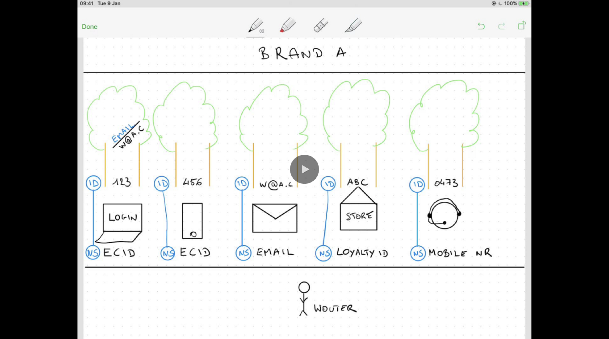
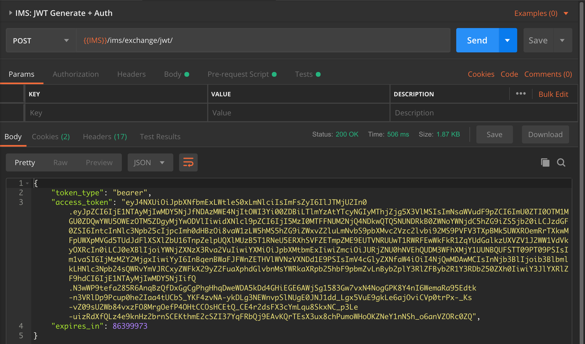

## Exercise 2.3: Understanding Identity
In this exercise, the goal is to fully understand what Identity means, what ID-syncs are and why this is crucial to understand when talking about Adobe Experience Platform.

### Learning Objectives

- Understand Identity, ID-syncs and Device Coop
- Be able to reproduce the "Trees in the Forest"-whiteboard.
- Be able to articulate the concept of ID-syncs

### Lab Resources

- [Video & Whiteboard: Identity, ID-syncs and Device Coop](http://bit.ly/2DWorZe)

### Lab Tasks

- Query Adobe I/O to retrieve your own Identity and understand which ID's are part of your profile in the "La Boutique"-website context.

Let's first understand the basics by having a look at this video, which explains the concepts of Identity, ID-syncs and Device Coop.

[](http://bit.ly/2DWorZe) 

Now that you have a basic understanding of Identity, Namespaces and ID's, let's review the configuration you did in Module 1.

#### Exercise 2.3.1 - Introduction to your Identifiers

First of all, you built a rule "All Authenticated Pages". This rule is activated when a customer is logged in.

The first action in this rule is to send a Beacon to Adobe Experience Platform. In the configuration of this beacon, you've told Launch to capture data elements like customerFirstName, customerEmail and customerMobileNr and send the values of those data elements to Platform. Below is a sample of such a call, which contains a number of values, but also a number of identities.

You can find this call yourself on your website by going into Chrome and opening the Chrome Developer Tools, just like you did in Module 1, Exercise 1.2.8. If you need help, go back to [Exercise 1.2.8](../../module1/launch/ex8.md).

```
{
  "header": {
    "datasetId": "5c880b9b45d3db1517d13afb",
    "imsOrgId": "907075E95BF479EC0A495C73@AdobeOrg",
    "source": {
      "name": "vangeluw - Launch"
    },
    "schemaRef": {
      "id": "https://ns.adobe.com/experienceplatform/schemas/f4df663350450a1e8bd8dd03e6c5d5cc",
      "contentType": "application/vnd.adobe.xed-full+json;version=1"
    }
  },
  "body": {
    "xdmMeta": {
      "schemaRef": {
        "id": "https://ns.adobe.com/experienceplatform/schemas/f4df663350450a1e8bd8dd03e6c5d5cc",
        "contentType": "application/vnd.adobe.xed-full+json;version=1"
      }
    },
    "xdmEntity": {
      "_repo": {
        "createDate": "2019-03-18T10:02:52Z"
      },
      "person": {
        "name": {
          "lastName": "Van Geluwe",
          "firstName": "Wouter"
        },
        "gender": "male",
        "birthDate": "1982-01-01"
      },
      "homeAddress": {
        "city": "Waregem",
        "country": "Belgium",
        "street1": "Bosstraat, 32",
        "postalCode": "8790",
        "countryCode": "BE"
      },
      "identityMap": {
        "ECID": [
          {
            "id": "17403431921341035514381613541323453523",
            "primary": true,
            "authenticatedState": "authenticated"
          }
        ],
        "mobilenr": [
          {
            "id": "0473622044-18032019-3",
            "authenticatedState": "authenticated"
          }
        ]
      },
      "mobilePhone": {
        "number": "0473622044-18032019-3"
      },
      "personalEmail": {
        "address": "vangeluw-18032019-3@adobe.com"
      },
      "profilePictureLink": "http://s7e4a.scene7.com/is/image/OmniPS/adobelogo?$generic%5Fimg%5Fpreset$",
      "_experienceplatform": {
        "retailSizes": {
          "shoeSize": "43",
          "shirtSize": "L",
          "preferredColor": "black"
        },
        "identification": {
          "emailId": "vangeluw-18032019-3@adobe.com"
        }
      }
    }
  }
}
```

Let's zoom in on the identities-part of this call.

```
 "identityMap": {
        "ECID": [
          {
            "id": "17403431921341035514381613541323453523",
            "primary": true,
            "authenticatedState": "authenticated"
          }
        ],
        "mobilenr": [
          {
            "id": "0473622044-18032019-3",
            "authenticatedState": "authenticated"
          }
        ]
      },
```
and
```
"_experienceplatform": {
        "identification": {
          "emailId": "vangeluw-18032019-3@adobe.com"
        }
      }
```

In the identities-property, we can see 3 Identity Types and ID's are being used:

| Identity Type             | ID |
|:---------------------:|:--|
| **ecid**              |17403431921341035514381613541323453523 |
| **email**             |vangeluw-18032019-3@adobe.com|
| **mobilenr**          |0473622044-18032019-3|

These are the branches of the tree. Since these 3 ID's have been part of the same call to Platform, they are synced to eachother.

With the above Namespace and ID's in mind, let's have a look at your own identity in Platform, based on the interactions you've had with the "La Boutique"-website.

You need to know your values for these namespaces. To find these values, the easiest thing to do is to go onto the X-ray panel, which will show you all available ID's.


With these ID's in mind, go to Postman.


Before sending a request to Platform, you need to be properly authenticated. To be authenticated, you need to request an access token.

#### Exercise 2.3.2 - Postman authentication to Adobe I/O

If you're already authenticated and have a valid access_token/bearer token, you can continue directly to "Exercise 2.3.3 - Unified Profile API".

Make sure that you've got the right Environment selected before executing any call. You can check the currently selected Environment by verifying the Environment-dropdown list in the top right corner. 

The selected Environment should be "_EMEA Platform Enablement".


You need to load an external library that will take care of the encryption and decryption of communication. To load this library, you have to execute the call with the name ```INIT: Load Crypto Library for RS256```. Select this call in the \_Adobe I/O - Token collection and you'll see it displayed in the middle of your screen.


Click the blue "Send"-button. After a couple of seconds, you should see a response displayed in the "Body" section of Postman:


With the crypto libray now loaded, we can authenticate to Adobe I/O.
In the \_Adobe I/O - Token collection, select the call with the name ```IMS: JWT Generate + Auth```. Again, you'll see the call details displayed in the middle of the screen.


Click the blue "Send"-button. After a couple of seconds, you should see a response displayed in the "Body" section of Postman:



If your configuration was successfull, you should see a similar response that contains the following information:

| Key     | Value     | 
|:-------------:| :---------------:| 
| token_type          | **bearer** |
| access_token    | **eyJ4NXUiOiJ...o6anVZORc0ZQ** | 
| expires_in          | **86399973** |

Adobe I/O has given us a 'bearer'-token, with a specific value (this very long access_token) and an expiration window.

The token that we've received is now valid for 24 hours. This means that in 24 hours, if you want to use Postman to authenticate to Adobe I/O, you will have to generate a new token by running this call again.

#### Exercise 2.3.3 - Unified Profile API, Schema: Profile

Now you can go ahead and send your first call to Platform's Unified Profile Service API's.

In Postman, locate the collection \_Enablement - Experience Platform EMEA


In "1. Unified Profile Service", select the first call with the name "UPS - GET Profile by Entity ID & NS".


For this call, there are 3 required variables:

| Key     | Value     | 
|:-------------:| :---------------:| 
| entityId          | **id** |
| entityIdNS    | **namespace** | 
| schema.name          | **\_xdm.context.profile** |

* entityId = the specific customer ID
* entityIdNS = the specific namespace that is applicable to the ID
* schema.name = the specific schema for which you want to receive information

So, if you want to ask Platform's API's to give you back all Profile information for your own ecid, you will need to configure the call as follows:

| Key     | Value     | 
|:-------------:| :---------------:| 
| entityId          | **yourECID** |
| entityIdNS    | **ecid** | 
| schema.name          | **\_xdm.context.profile** |


Click "Send" to send your request to Platform.

You should get an immediate response from Platform, showing you something like this:


This is the full response from Platform:

```
{
    "A2__MWya6fAmGFM0oBFNns48": {
        "entityId": "A2__MWya6fAmGFM0oBFNns48",
        "sources": [
            "",
            "5c880b9b45d3db1517d13afb"
        ],
        "tags": [
            ""
        ],
        "identityGraph": [
            "A2__MWya6fAmGFM0oBFNns48",
            "BUF5dmFuZ2VsdXctg5MlEwEtM0BhZG9iZS5jb20",
            "Glu7BkFskxyw1Vctg5MlEwEtMw"
        ],
        "entity": {
            "_repo": {
                "createDate": "2019-03-18T10:25:07Z"
            },
            "mobilePhone": {
                "number": "0473622044-18032019-3"
            },
            "person": {
                "gender": "male",
                "name": {
                    "lastName": "Van Geluwe",
                    "firstName": "Wouter"
                },
                "birthDate": "1982-01-01"
            },
            "_experienceplatform": {
                "identification": {
                    "emailId": "vangeluw-18032019-3@adobe.com"
                },
                "retailSizes": {
                    "shoeSize": "43",
                    "shirtSize": "L",
                    "preferredColor": "black"
                }
            },
            "identityMap": {
                "mobilenr": [
                    {
                        "id": "0473622044-18032019-3"
                    }
                ],
                "email": [
                    {
                        "id": "vangeluw-18032019-3@adobe.com"
                    }
                ],
                "ecid": [
                    {
                        "id": "17403431921341035514381613541323453523"
                    }
                ]
            },
            "profilePictureLink": "http://s7e4a.scene7.com/is/image/OmniPS/adobelogo?$generic%5Fimg%5Fpreset$",
            "homeAddress": {
                "country": "Belgium",
                "city": "Waregem",
                "countryCode": "BE",
                "postalCode": "8790",
                "street1": "Bosstraat, 32"
            },
            "personalEmail": {
                "address": "vangeluw-18032019-3@adobe.com"
            }
        },
        "lastModifiedAt": "2019-03-18T09:25:07Z"
    }
}
```
This is currently all of the available Profile data in Platform for this ECID.
You're not required to use the ECID to request Profile data from Platform's Unified Profile, you can use any ID in any namespace to request this data. 

Let's go back to Postman and pretend we're the call center, and send a call to Platform specifying the namespace of **mobilenr** and your mobile number.

So, if you want to ask Platform's API's to give you back all Profile information for a specific mobilenr, you will need to configure the call as follows:

| Key     | Value     | 
|:-------------:| :---------------:| 
| entityId          | **yourmobilenr** |
| entityIdNS    | **mobilenr** \(replace ecid with mobilenr) | 
| schema.name          | **\_xdm.context.profile** |


Click the blue "Send"-button and verify the response.


Let's do the same thing for your email ID by specifying the namespace of **email** and your email ID.

So, if you want to ask Platform's API's to give you back all Profile information for a specific email ID, you will need to configure the call as follows:

| Key     | Value     | 
|:-------------:| :---------------:| 
| entityId          | **youremail** |
| entityIdNS    | **email** \(replace mobilenr with email) | 
| schema.name          | **\_xdm.context.profile** |


Click the blue "Send"-button and verify the response.


This is a very important kind of flexibility that is offered to brands. This means that any environment can send a request to Platform, using their own ID and namespace, without having to understand the complexity of multiple namespaces and ID's.

As an example:

  * the Call Center will request data from Platform using the namespace "mobilenr"
  * the Loyalty System will request data from Platform using the namespace "email"
  * online applications might use the namespace "ecid"

The Call Center doesn't necessarily know what kind of identifier is used in the Loyalty System and the Loyalty System doesn't necessarily know what kind of identifier is used by online applications. Each individual system can use the information that they have and understand to get the information they need, when they need it.

#### Exercise 2.3.4 - Unified Profile API, Schema: Profile and ExperienceEvent

After having queried Platform's API's successfully for Profile data, let's now do the same with ExperienceEvent data.

In Postman, locate the collection \_Enablement - Experience Platform EMEA


In "1. Unified Profile Service", select the second call with the name "UPS - GET Profile & EE by Entity ID & NS".


For this call, there are 4 required variables:

| Key     | Value     | 
|:-------------:| :---------------:| 
| schema.name          | **\_xdm.context.experienceevent** |
| relatedSchema.name          | **\_xdm.context.profile** |
| relatedEntityId          | **id** |
| relatedEntityIdNS    | **namespace** | 

* schema.name = the specific schema for which you want to receive information. In this case, we're looking for data that is mapped against the ExperienceEvent schema. 
* relatedSchema.name = While we're looking for data that is mapped against the ExperienceEvent schema, we need to specify an identity for which we want to receive that data. The schema that has access to identity is the Profile-schema, so the relatedSchema here is the Profile-schema.
* relatedEntityId = the specific customer ID
* relatedEntityIdNS = the specific namespace that is applicable to the ID


So, if you want to ask Platform's API's to give you back all Profile information for your own ecid, you will need to configure the call as follows:

| Key     | Value     | 
|:-------------:| :---------------:| 
| schema.name          | **\_xdm.context.experienceevent** |
| relatedSchema.name          | **\_xdm.context.profile** |
| relatedEntityId          | **yourECID** |
| relatedEntityIdNS    | **ecid** | 


Click "Send" to send your request to Platform.

You should get an immediate response from Platform, showing you something like this:


Below is the full response from Platform. In this example, there are 8 ExperienceEvents linked to this customer's ECID. Have a look at the below to see the different variables on the call, as what you see below is the direct consequence of your configuration in Launch in Modules 1 and 2.

Also, when the X-ray panel shows ExperienceEvent information, it is using the below payload to parse and retrieve the information like Product Name (search for productName in the below payload) and Product Image URL (search for productUrl in the below payload).

```
{
    "_page": {
        "orderby": "timestamp",
        "start": "4534639569292.228",
        "count": 8,
        "next": ""
    },
    "children": [
        {
            "relatedEntityId": "A2__MWya6fAmGFM0oBFNns48",
            "entityId": "4534639569292.228",
            "timestamp": 1552903330000,
            "entity": {
                "environment": {
                    "browserDetails": {
                        "acceptLanguage": "en",
                        "userAgent": "Mozilla/5.0 (Macintosh; Intel Mac OS X 10_14_3) AppleWebKit/537.36 (KHTML, like Gecko) Chrome/72.0.3626.121 Safari/537.36"
                    }
                },
                "web": {
                    "webPageDetails": {
                        "name": "Register"
                    }
                },
                "_experienceplatform": {
                    "identification": {
                        "ecid": "17403431921341035514381613541323453523"
                    }
                },
                "identityMap": {
                    "ECID": [
                        {
                            "id": "17403431921341035514381613541323453523",
                            "primary": true,
                            "authenticatedState": "authenticated"
                        }
                    ]
                },
                "_id": "4534639569292.228",
                "timestamp": "2019-03-18T10:02:10Z"
            },
            "lastModifiedAt": "2019-03-18T09:02:11Z"
        },
        {
            "relatedEntityId": "A2__MWya6fAmGFM0oBFNns48",
            "entityId": "7822051376372.104",
            "timestamp": 1552903372000,
            "entity": {
                "environment": {
                    "browserDetails": {
                        "acceptLanguage": "en",
                        "userAgent": "Mozilla/5.0 (Macintosh; Intel Mac OS X 10_14_3) AppleWebKit/537.36 (KHTML, like Gecko) Chrome/72.0.3626.121 Safari/537.36"
                    }
                },
                "web": {
                    "webPageDetails": {
                        "name": "Register"
                    }
                },
                "_experienceplatform": {
                    "identification": {
                        "ecid": "17403431921341035514381613541323453523"
                    }
                },
                "identityMap": {
                    "ECID": [
                        {
                            "id": "17403431921341035514381613541323453523",
                            "primary": true,
                            "authenticatedState": "authenticated"
                        }
                    ]
                },
                "_id": "7822051376372.104",
                "timestamp": "2019-03-18T10:02:52Z"
            },
            "lastModifiedAt": "2019-03-18T09:02:53Z"
        },
        {
            "relatedEntityId": "A2__MWya6fAmGFM0oBFNns48",
            "entityId": "5571694098981.034",
            "timestamp": 1552904543000,
            "entity": {
                "environment": {
                    "browserDetails": {
                        "acceptLanguage": "en",
                        "userAgent": "Mozilla/5.0 (Macintosh; Intel Mac OS X 10_14_3) AppleWebKit/537.36 (KHTML, like Gecko) Chrome/72.0.3626.121 Safari/537.36"
                    }
                },
                "web": {
                    "webPageDetails": {
                        "name": "Register"
                    }
                },
                "_experienceplatform": {
                    "identification": {
                        "ecid": "17403431921341035514381613541323453523"
                    }
                },
                "identityMap": {
                    "ECID": [
                        {
                            "id": "17403431921341035514381613541323453523",
                            "primary": true,
                            "authenticatedState": "authenticated"
                        }
                    ]
                },
                "_id": "5571694098981.034",
                "timestamp": "2019-03-18T10:22:23Z"
            },
            "lastModifiedAt": "2019-03-18T09:22:24Z"
        },
        {
            "relatedEntityId": "A2__MWya6fAmGFM0oBFNns48",
            "entityId": "5532944174894.017",
            "timestamp": 1552904557000,
            "entity": {
                "environment": {
                    "browserDetails": {
                        "acceptLanguage": "en",
                        "userAgent": "Mozilla/5.0 (Macintosh; Intel Mac OS X 10_14_3) AppleWebKit/537.36 (KHTML, like Gecko) Chrome/72.0.3626.121 Safari/537.36"
                    }
                },
                "web": {
                    "webPageDetails": {
                        "name": "La Boutique Home"
                    }
                },
                "_experienceplatform": {
                    "identification": {
                        "ecid": "17403431921341035514381613541323453523"
                    }
                },
                "identityMap": {
                    "ECID": [
                        {
                            "id": "17403431921341035514381613541323453523",
                            "primary": true,
                            "authenticatedState": "authenticated"
                        }
                    ]
                },
                "_id": "5532944174894.017",
                "timestamp": "2019-03-18T10:22:37Z"
            },
            "lastModifiedAt": "2019-03-18T09:22:37Z"
        },
        {
            "relatedEntityId": "A2__MWya6fAmGFM0oBFNns48",
            "entityId": "4887897803331.209",
            "timestamp": 1552904560000,
            "entity": {
                "environment": {
                    "browserDetails": {
                        "acceptLanguage": "en",
                        "userAgent": "Mozilla/5.0 (Macintosh; Intel Mac OS X 10_14_3) AppleWebKit/537.36 (KHTML, like Gecko) Chrome/72.0.3626.121 Safari/537.36"
                    }
                },
                "web": {
                    "webPageDetails": {
                        "name": "Lisette Dress"
                    }
                },
                "_experienceplatform": {
                    "identification": {
                        "ecid": "17403431921341035514381613541323453523"
                    },
                    "productData": {
                        "productInteraction": "productView",
                        "productUrl": "http://s7e4a.scene7.com/is/image/OmniPS/lisettedress?$generic%255Fimg%255Fpreset$",
                        "productName": "Lisette Dress"
                    }
                },
                "identityMap": {
                    "ECID": [
                        {
                            "id": "17403431921341035514381613541323453523",
                            "primary": true,
                            "authenticatedState": "authenticated"
                        }
                    ]
                },
                "_id": "4887897803331.209",
                "productListItems": [
                    {
                        "SKU": "Lisette Dress"
                    }
                ],
                "timestamp": "2019-03-18T10:22:40Z"
            },
            "lastModifiedAt": "2019-03-18T09:22:40Z"
        },
        {
            "relatedEntityId": "A2__MWya6fAmGFM0oBFNns48",
            "entityId": "6246736711032.427",
            "timestamp": 1552904565000,
            "entity": {
                "environment": {
                    "browserDetails": {
                        "acceptLanguage": "en",
                        "userAgent": "Mozilla/5.0 (Macintosh; Intel Mac OS X 10_14_3) AppleWebKit/537.36 (KHTML, like Gecko) Chrome/72.0.3626.121 Safari/537.36"
                    }
                },
                "web": {
                    "webPageDetails": {
                        "name": "La Boutique Home"
                    }
                },
                "_experienceplatform": {
                    "identification": {
                        "ecid": "17403431921341035514381613541323453523"
                    }
                },
                "identityMap": {
                    "ECID": [
                        {
                            "id": "17403431921341035514381613541323453523",
                            "primary": true,
                            "authenticatedState": "authenticated"
                        }
                    ]
                },
                "_id": "6246736711032.427",
                "timestamp": "2019-03-18T10:22:45Z"
            },
            "lastModifiedAt": "2019-03-18T09:22:46Z"
        },
        {
            "relatedEntityId": "A2__MWya6fAmGFM0oBFNns48",
            "entityId": "2570056280938.2544",
            "timestamp": 1552904705000,
            "entity": {
                "environment": {
                    "browserDetails": {
                        "acceptLanguage": "en",
                        "userAgent": "Mozilla/5.0 (Macintosh; Intel Mac OS X 10_14_3) AppleWebKit/537.36 (KHTML, like Gecko) Chrome/72.0.3626.121 Safari/537.36"
                    }
                },
                "web": {
                    "webPageDetails": {
                        "name": "La Boutique Home"
                    }
                },
                "_experienceplatform": {
                    "identification": {
                        "ecid": "17403431921341035514381613541323453523"
                    }
                },
                "identityMap": {
                    "ECID": [
                        {
                            "id": "17403431921341035514381613541323453523",
                            "primary": true,
                            "authenticatedState": "authenticated"
                        }
                    ]
                },
                "_id": "2570056280938.2544",
                "timestamp": "2019-03-18T10:25:05Z"
            },
            "lastModifiedAt": "2019-03-18T09:25:06Z"
        },
        {
            "relatedEntityId": "A2__MWya6fAmGFM0oBFNns48",
            "entityId": "7587241659596.836",
            "timestamp": 1552904707000,
            "entity": {
                "environment": {
                    "browserDetails": {
                        "acceptLanguage": "en",
                        "userAgent": "Mozilla/5.0 (Macintosh; Intel Mac OS X 10_14_3) AppleWebKit/537.36 (KHTML, like Gecko) Chrome/72.0.3626.121 Safari/537.36"
                    }
                },
                "web": {
                    "webPageDetails": {
                        "name": "El Silencio"
                    }
                },
                "_experienceplatform": {
                    "identification": {
                        "ecid": "17403431921341035514381613541323453523"
                    },
                    "productData": {
                        "productInteraction": "productView",
                        "productUrl": "http://s7e4a.scene7.com/is/image/OmniPS/elsilencio?$generic%255Fimg%255Fpreset$",
                        "productName": "El Silencio"
                    }
                },
                "identityMap": {
                    "ECID": [
                        {
                            "id": "17403431921341035514381613541323453523",
                            "primary": true,
                            "authenticatedState": "authenticated"
                        }
                    ]
                },
                "_id": "7587241659596.836",
                "productListItems": [
                    {
                        "SKU": "El Silencio"
                    }
                ],
                "timestamp": "2019-03-18T10:25:07Z"
            },
            "lastModifiedAt": "2019-03-18T09:25:07Z"
        }
    ],
    "_links": {
        "next": {
            "href": ""
        }
    }
}
```

This is currently all of the available ExperienceEvent data in Platform for this ECID.
You're not required to use the ECID to request ExperienceEvent data from Platform's Unified Profile, you can use any ID in any namespace to request this data. 

#### Exercise 2.3.5 - Unified Profile View of the Customer's Golden Record


In Platform there's a new feature that visualizes the entore customer profile. This one feature is what all of our customer's have been trying to get for years: a single view of the customer.

Go to the Platform IU: [https://platform.adobe.com/home](https://platform.adobe.com/home).

In the Platform UI, go to "Profiles".


By going to the new UI of Platform (not available in Production yet - link will be placed at a later stage), you'll be able to go to "Profiles" and search for a Profile.


By clicking on "Find a Profile", a popup appears in which a namespace and an ID can be entered. 


In this case, I'm taking my ECID (58869277403188560570697962446749491646), but any other namespace and ID can also be used to retrieve a profile here.


By clicking OK, I'll be seeing my full profile.


And by going to the menu option "Experience Events", all of my Experience Events are being shown.


In this single view of the customer, all profile data is shown alongside behavioral and transactional data and the view will also be enriched with existing segment memberships. The data that is shown here come from anywhere, from any Adobe Solution to any external solution. This is the most powerful view of Adobe Experience Platform: the true Experience System of Record.

Congrats for making it all the way here. It's now time to experience Platform's new, unified segmentation environment!

[Next Step: Using the new, Unified Segmentation Experience](../segmentation/README.md)

[Go Back to Module 2](../README.md)

[Go Back to All Modules](/../../)


