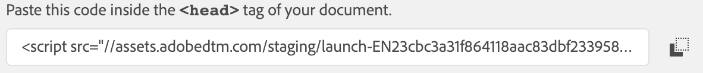

## Exercise 2.2.1 - Include your Launch-tag in v2 of the 'La Boutique' website

Let's re-install your Launch tag on v2 of the 'La Boutique'-website.

Go to [https://launch-demo.adobe.com/](https://launch-demo.adobe.com/) and login with your personal login details.

To find your development-library tag, navigate to the "Environments"-tab in the Launch UI.


Locate your Development Environment, and click on the "Install"-icon on the right side of the screen:


You'll see a screen like this one, which contains the tag to implement on the website:


Copy the <head> tag.

**On Mac** Go to the folder Applications > MAMP > htdocs > js and locate the launch.js file

**On Windows** Go to the folder C:\MAMP\htdocs\js and locate the launch.js file


Open the file launch.js in your favourite text editor.


Go to Line 1, where you'll see the following:

```javascript
var launchTagUrl = ""
```

On Line 1, replace "" with your launch tag:



This should be the result:

```javascript
var launchTagUrl = "//assets.adobedtm.com/staging/launch-EN23xxxxxxxxxxxxxxxxxxxxxxxxx-development.min.js"
```


Save your changes in the launch.js file and reload your La Boutique website.

After this change, the new version of 'La Boutique' is ready and will load your Launch configuration again!

[Next Step: Update your existing Launch configuration](./ex2.md)

[Go Back to Module 2](../README.md)

[Go Back to All Modules](/../../)


