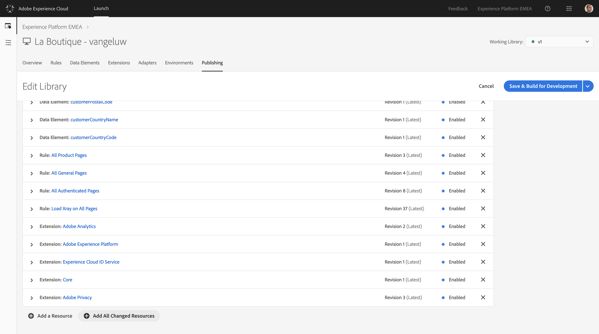
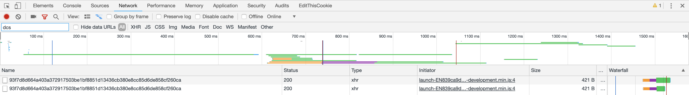

## Exercise 2.2.2 - Update your existing Launch configuration

### Exercise 2.2.2.1 - Update your configuration

On the new 'La Boutique'-website, there's an updated registration page.

  

On this updated page, there are a number of new fields that will capture valuable customer information. We need to update our Launch configuration with new data elements and also update our "All Authenticated Pages"-rule to send this new information to Platform.

The following fields have been added to the registration page:

| Field Name              | 
|:-----------------------:| 
| Gender                  | 
| BirthDay                | 
| BirthMonth              | 
| BirthYear               | 
| Street Address & Number | 
| City                    | 
| Postal Code             |  
| Mobile Nr.              | 
| Country Name            | 
| Country Code            | 
| Picture Image URL       | 
| Shoe Size               | 
| Shirt Size              | 
| Preferred Color         | 

As a consequence, you'll have to build new data elements to capture the values customers enter in those fields.

Go to [https://launch-demo.adobe.com/](https://launch-demo.adobe.com/) and login with your personal login details.

In the Launch UI, go to Data Elements and click on "Add Data Element".


The first data element we need is called **customerGender**. When a customer enters their gender in the registration form, Launch will capture it and assign it to this data element.

| Name        | Extension     | Data Element Type  | Local Storage Item Name | Storage Duration |
|-------------|:-------------:| :-----------------:| :----------------------:| :--------------: |
|customerGender| Core          | Local Storage      |gender| Session          |
    


Save your new data element.

Next, you need to create the data element **customerBirthDay**. When a customer enters their BirthDay in the registration form, Launch will capture it and assign it to this data element.

| Name        | Extension     | Data Element Type  | Local Storage Item Name | Storage Duration |
|-------------|:-------------:| :-----------------:| :----------------------:| :--------------: |
|customerBirthDay| Core     | Local Storage      |birthday| Session          |
    


Save your new data element.

Next, you need to create the data element **customerBirthMonth**. When a customer enters their BirthMonth in the registration form, Launch will capture it and assign it to this data element.

| Name        | Extension     | Data Element Type  | Local Storage Item Name | Storage Duration |
|-------------|:-------------:| :-----------------:| :----------------------:| :--------------: |
|customerBirthMonth| Core     | Local Storage      |birthmonth| Session          |
    


Save your new data element.

Next, you need to create the data element **customerBirthYear**. When a customer enters their BirthYear in the registration form, Launch will capture it and assign it to this data element.

| Name        | Extension     | Data Element Type  | Local Storage Item Name | Storage Duration |
|-------------|:-------------:| :-----------------:| :----------------------:| :--------------: |
|customerBirthYear| Core     | Local Storage      |birthyear| Session          |
    


Save your new data element.

Next, you need to create the data element **customerStreet**. When a customer enters their Street Address in the registration form, Launch will capture it and assign it to this data element.

| Name        | Extension     | Data Element Type  | Local Storage Item Name | Storage Duration |
|-------------|:-------------:| :-----------------:| :----------------------:| :--------------: |
|customerStreet| Core     | Local Storage      |street| Session          |
    


Save your new data element.

Next, you need to create the data element **customerCity**. When a customer enters their City in the registration form, Launch will capture it and assign it to this data element.

| Name        | Extension     | Data Element Type  | Local Storage Item Name | Storage Duration |
|-------------|:-------------:| :-----------------:| :----------------------:| :--------------: |
|customerCity| Core     | Local Storage      |city| Session          |
    


Save your new data element.

Next, you need to create the data element **customerPostalCode**. When a customer enters their Postal Code in the registration form, Launch will capture it and assign it to this data element.

| Name        | Extension     | Data Element Type  | Local Storage Item Name | Storage Duration |
|-------------|:-------------:| :-----------------:| :----------------------:| :--------------: |
|customerPostalCode| Core     | Local Storage      |postalcode| Session          |
    


Save your new data element.

Next, you need to create the data element **customerMobileNr**. When a customer enters their Mobile Nr. in the registration form, Launch will capture it and assign it to this data element.

| Name        | Extension     | Data Element Type  | Local Storage Item Name | Storage Duration |
|-------------|:-------------:| :-----------------:| :----------------------:| :--------------: |
| customerMobileNr | Core     | Local Storage      |mobilenr| Session          |
    


Save your new data element.

Next, you need to create the data element **customerCountryName**. When a customer enters their Country Name in the registration form, Launch will capture it and assign it to this data element.

| Name        | Extension     | Data Element Type  | Local Storage Item Name | Storage Duration |
|-------------|:-------------:| :-----------------:| :----------------------:| :--------------: |
|customerCountryName| Core     | Local Storage      |countryname| Session          |
    


Save your new data element.

Next, you need to create the data element **customerCountryCode**. When a customer enters their Country Code in the registration form, Launch will capture it and assign it to this data element.

| Name        | Extension     | Data Element Type  | Local Storage Item Name | Storage Duration |
|-------------|:-------------:| :-----------------:| :----------------------:| :--------------: |
|customerCountryCode| Core     | Local Storage      |countrycode| Session          |
    


Save your new data element.

Next, you need to create the data element **customerPictureImgUrl**. When a customer enters their Picture Image URL in the registration form, Launch will capture it and assign it to this data element.

| Name        | Extension     | Data Element Type  | Local Storage Item Name | Storage Duration |
|-------------|:-------------:| :-----------------:| :----------------------:| :--------------: |
|customerPictureImgUrl| Core     | Local Storage      |pictureurl| Session          |
    


Save your new data element.

Next, you need to create the data element **customerShoeSize**. When a customer enters their Shoe Size in the registration form, Launch will capture it and assign it to this data element.

| Name        | Extension     | Data Element Type  | Local Storage Item Name | Storage Duration |
|-------------|:-------------:| :-----------------:| :----------------------:| :--------------: |
|customerShoeSize| Core     | Local Storage      |shoesize| Session          |
    


Save your new data element.

Next, you need to create the data element **customerShirtSize**. When a customer enters their Shirt Size in the registration form, Launch will capture it and assign it to this data element.

| Name        | Extension     | Data Element Type  | Local Storage Item Name | Storage Duration |
|-------------|:-------------:| :-----------------:| :----------------------:| :--------------: |
|customerShirtSize| Core     | Local Storage      |shirtsize| Session          |
    


Save your new data element.

Next, you need to create the data element **customerPreferredColor**. When a customer enters their Preferred Color in the registration form, Launch will capture it and assign it to this data element.

| Name        | Extension     | Data Element Type  | Local Storage Item Name | Storage Duration |
|-------------|:-------------:| :-----------------:| :----------------------:| :--------------: |
|customerPreferredColor| Core     | Local Storage      |preferredcolor| Session          |
    


Save your new data element.

You've now finished creating your data elements!

Let's update our "All Authenticated Pages"-rule so that this data can actually be sent to Platform.

Go to [https://launch-demo.adobe.com/](https://launch-demo.adobe.com/) and login with your personal login details.

Go to the "Rules"-section of Launch and open your "All Authenticated Pages"-rule.


Look at the Actions below on the page and open the "Adobe Experience Platform - Send Beacon"-action.


In the "Adobe Experience Platform - Send Beacon"-action, you need to make some updates.


First of all, in the Identity Mapping fields, you need to add the MobileNr. as an Identity.

To do so, click the "Add Another"-button.


In the new Identity Mapping field, select you data element ```%customerMobileNr%``` out of the dropdown-list as the source value. Then select the **"mobilenr"**-namespace as the Identity Type out of the Identity Type dropdown-list and set the Authenticated State to "Authenticated".
The result should look like this:


The next step is to update the Schema Mapping.


The following configuration is already present:

| Source Value           | Target Schema Field                 |
|:-------------------------------------------| :------------------ |
|%customerFirstName%|person.name.firstName|
|%customerLastName%|person.name.lastName|
|%customerEmail%|personalEmail.address|
|%customerEmail%|_experienceplatform.identification.emailId|
|%pageTimeStamp%|\_repo.createDate|

Now, you need to add the following Keys and Values to the Send Beacon-action:

|Source Value| Target Schema Field|
|:-------------------------------------------| :------------------ |
|%customerGender%|person.gender| 
|%customerStreet%|homeAddress.street1|
|%customerCity%|homeAddress.city|
|%customerPostalCode%|homeAddress.postalCode|
|%customerCountryName%| homeAddress.country|
|%customerCountryCode%|homeAddress.countryCode|
|%customerPictureImgUrl%|profilePictureLink|
|%customerBirthYear%-%customerBirthMonth%-%customerBirthDay%|person.birthDate|
|%customerMobileNr%|mobilePhone.number|
|%customerShoeSize%|_experienceplatform.retailSizes.shoeSize|
|%customerShirtSize%|_experienceplatform.retailSizes.shirtSize|
|%customerPreferredColor%|_experienceplatform.retailSizes.preferredColor|

After adding the above Keys and Values, you should have a similar view on your "Adobe Experience Platform - Send Beacon"-action:


Attention! Check your configuration of the Keys to be sure that after copying, no extra spaces are added in the keys as this will generate errors in Platform.

Click "Keep Changes" to save your Action.

Click "Save" to save your changes.

What is important to note here, is that we'll capture the Customer's Mobile Nr. to assign it as a Profile value, but that we'll also use it as an additional identifier. This means that environments that would use the Mobile Nr. as the primary identifier, like f.i. a Call Center, can also easily query Platform's Unified Profile Service API's. 

Also important to note: the variables for Shoe Size, Shirt Size and Preferred Color are custom extensions of XDM. A company like "La Boutique" needs flexibility in terms of data capture and as such, expects a data model like XDM to adapt to their specific needs. A specific mixin has been created to accomodate for this need, this mixin is called "EMEA Profile Demo Data" and contains the "retailSizes"-fields. 


The "retailSizes"-mixin was built to capture those values, but these values need to be linked to a person, a profile. To make that happen, we extended the "EMEA Web Registration Data"-schema with the "EMEA Profile Demo Data"-mixin, which you can view [here](https://platform.adobe.com/schema/browse/https%3A%2F%2Fns.adobe.com%2Fexperienceplatform%2Fschemas%2Ff4df663350450a1e8bd8dd03e6c5d5cc)..

You can now publish these changes into your development environment. 

In the Launch UI, navigate to the menu option "Publishing".


In the "Development"-window, you'll see your current Development-environment. 
Click on little arrow to open a dropdown-list and click Edit to make changes to your development-library.


Scroll down to the bottom of the window, where you'll see a button called "+ Add All Changed Resources".



Click the "+ Add All Changed Resources"-button.


Click the "Save & Build for Development"-button.


After clicking the "Save & Build for Development"-button, your Development-library will be updated and your changes will be available for testing on your 'La Boutique'-website. It can take a couple of minutes until your Launch-code is updated, wait until you see a green dot next to your Development-library.

Go to your 'La Boutique'-website by going to [http://localhost:8888/](http://localhost:8888/).


In the menu bar of 'La Boutique', click on "Login/Register"


Fill out all the fields with your information and click on the "CREATE ACCOUNT"-button.

At this moment, all of the data that you've entered should've been sent to Platform.

To verify if calls are being sent and what data is part of the call, open the Chrome Developer Tools.


Open the Chrome Developer Tools on the "Network"-view and then refresh your page.

By refreshing your page, you'll see all the calls being sent from the page to various servers, including the calls to the DCS Endpoint of Platform.


To easily find the calls to Platform, you can apply a filter by entering "dcs" in the Filter-field.


With the "dcs"-filter in the Network-tab active, you're now seeing 2 calls being sent to Platform.



Select the first call and scroll down until you see the Request Payload.


Click on "view source" and copy the full raw payload.


Go to [https://jsonformatter.org/json-pretty-print
](https://jsonformatter.org/json-pretty-print
) and paste the copied raw text in the left window, then click on "Make Pretty" to see the full payload in a readable format.


You should see something similar to this:
```
{
  "header": {
    "datasetId": "5c880b9b45d3db1517d13afb",
    "imsOrgId": "907075E95BF479EC0A495C73@AdobeOrg",
    "source": {
      "name": "vangeluw - Launch"
    },
    "schemaRef": {
      "id": "https://ns.adobe.com/experienceplatform/schemas/f4df663350450a1e8bd8dd03e6c5d5cc",
      "contentType": "application/vnd.adobe.xed-full+json;version=1"
    }
  },
  "body": {
    "xdmMeta": {
      "schemaRef": {
        "id": "https://ns.adobe.com/experienceplatform/schemas/f4df663350450a1e8bd8dd03e6c5d5cc",
        "contentType": "application/vnd.adobe.xed-full+json;version=1"
      }
    },
    "xdmEntity": {
      "_repo": {
        "createDate": "2019-03-18T10:02:52Z"
      },
      "person": {
        "name": {
          "lastName": "Van Geluwe",
          "firstName": "Wouter"
        },
        "gender": "male",
        "birthDate": "1982-01-01"
      },
      "homeAddress": {
        "city": "Waregem",
        "country": "Belgium",
        "street1": "Bosstraat, 32",
        "postalCode": "8790",
        "countryCode": "BE"
      },
      "identityMap": {
        "ECID": [
          {
            "id": "17403431921341035514381613541323453523",
            "primary": true,
            "authenticatedState": "authenticated"
          }
        ],
        "mobilenr": [
          {
            "id": "0473622044-18032019-3",
            "authenticatedState": "authenticated"
          }
        ]
      },
      "mobilePhone": {
        "number": "0473622044-18032019-3"
      },
      "personalEmail": {
        "address": "vangeluw-18032019-3@adobe.com"
      },
      "profilePictureLink": "http://s7e4a.scene7.com/is/image/OmniPS/adobelogo?$generic%5Fimg%5Fpreset$",
      "_experienceplatform": {
        "retailSizes": {
          "shoeSize": "43",
          "shirtSize": "L",
          "preferredColor": "black"
        },
        "identification": {
          "emailId": "vangeluw-18032019-3@adobe.com"
        }
      }
    }
  }
}
```

After checking the content of the client-side call, you should verify whether Platform has received your call. This can take up to 15 minutes.

To log in to Platform, go to [https://platform.adobe.com/home](https://platform.adobe.com/home). 

Go to "Data" and locate your "Website Registrations - EMEA Profile Dataset (API)"- dataset.

Datasets in the UI of Platform are usually updated every 15minutes.

You can already immediately see if the ingestion of your last batch of data was successful:


By clicking on the Website Registrations - EMEA Profile Dataset (API)"- dataset, you can see all ingested batches.


You should also have a quick look at the "Preview" of Profile Data to see your ingested data and to verify whether it aligns with what you previously did on the Login/Register-page of your local La Boutique-website.


If the data you see here is correct, then your configuration is correct and you can continue with the next exercise.

[Next Step: Include the Platform X-ray panel on your website](./ex3.md)

[Go Back to Module 2](../README.md)

[Go Back to All Modules](/../../)


