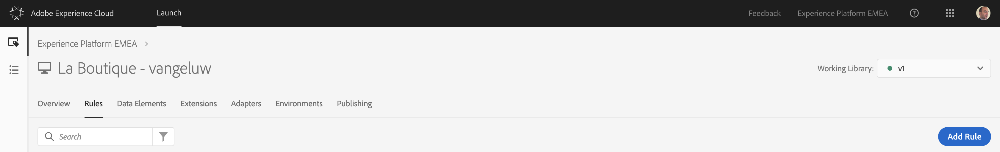
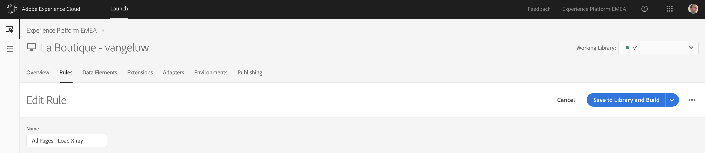
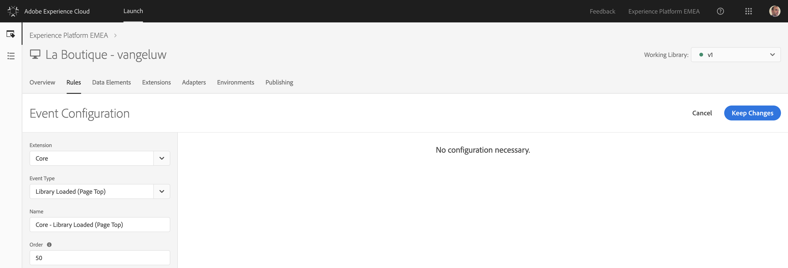
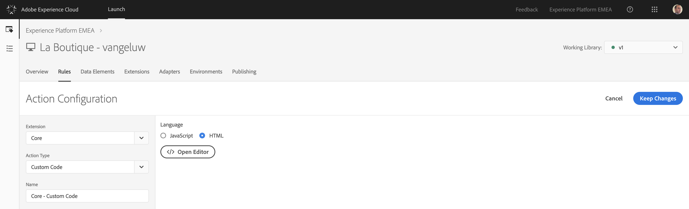
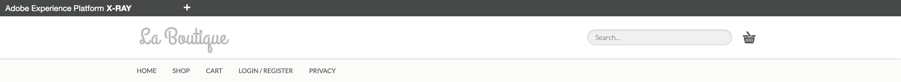
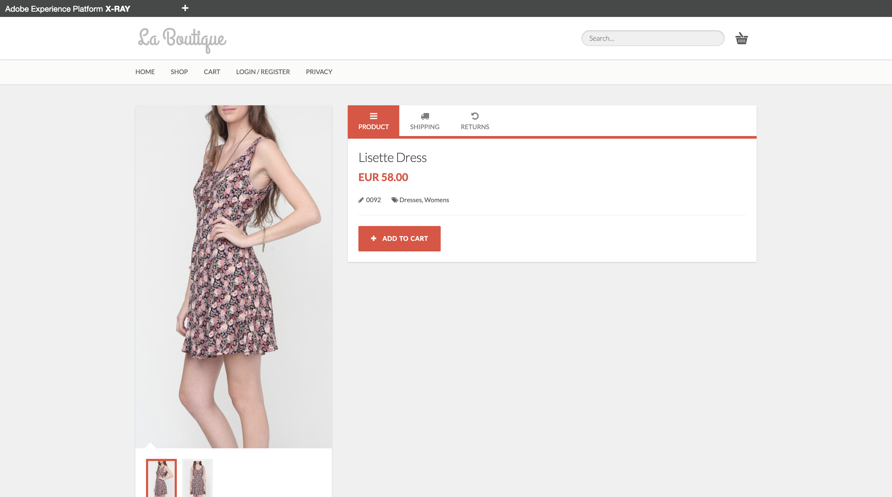

## Exercise 2.2.3 - Include the Platform X-ray panel on your website

We all know X-ray. X-ray was the result of a project led by the UK SC-team in 2017.

X-ray is an extremely interesting way of showing a customer what is happening behind the scenes, without having to go behind the scenes. It allows us to stay within a customer journey story without jumping back and forth between the story and the UI of our solutions.

The X-ray panel was now adjusted so that it can also be used in the context of Platform. 

To use X-ray, you'll have to implement it in Launch.

Go to [https://launch-demo.adobe.com/](https://launch-demo.adobe.com/) and login with your personal login details.

Go to the "Rules"-section of Launch.



Click on the "Add Rule"-button.


As a name for this rule, let's use "All Pages - Load X-ray".



We need to configure an Event to trigger this rule, so let's click on the + icon to Add an Event.


Our rule should fire on all pages, when the page has completely loaded.

| Extension     | Event Type       | Name             |
|:-------------:| :---------------:| :--------------: |
| Core          | Library Loaded (Page Top) | Core - Library Loaded (Page Top) |



Click "Keep Changes" to save your Event Configuration.

(If you plan on taking a pause here, don't forget to click "Save" to save your changes.)

After the Event configuration, we can now define the Action to be taken.

To add an action, click on the + icon.

Our first action will be to send the beacon to Platform, by configuring the options as follows:

| Extension| Action Type      | Name   | Language   |
|:------------:| :---------------:| :--------------: | :---------------:|
| Core   | Custom Code      | Core - Custom Code | HTML |



Open the Editor by clicking on "Open Editor".

Below is the custom code to enter here. Copy all this code.

```javascript
<!--XRAY -->
<script>
$(".header").prepend('<div class="top"><ul style="list-style: none;float: left; display: inline; margin: 0; padding: 0;"><li><a class="mcx" href="#" style="color:white"><span id="xraypanel_header_aec_text" style="color:white; padding-left:10px;padding-right:5px;">Adobe Experience Platform</span><span id="xraypanel_header_xray_text" style="color:white">X-Ray</span></a></li></ul></div>');

$('body').append('<div id="x-ray-panel" class="at-element-marker hide"><div class="accounts" style="display: none;"><div style="display:inline-block;" id="approval_status-header"><ul class="nav navbar-nav navbar-left xray"><li style="display:inline-block;" id="adobe-link"><a href="#" class="link_text active"></a></li></ul></div></div><script id="xray-template" type="text/x-handlebars-template"><div id="approval_status-adobe"><ul class="link_list"><li id="aam_link" class="aam_link" style="display:none;"><button class="accordion" style="padding-left: 80px;">Audience Manager</button><div class="approved"><h4 class=""><span>LOCAL</span></h4><h5>Profile Attributes</h5><span id="textaamsegments" class="analytics interest"></span><h5>Destinations</h5><span id="textaamdestinations" class="analytics">{{c}}</span><h4 class=""><span>CROSS-DEVICE</span></h4><h5>Profile Attributes</h5><span id="textaecsegments" class="analytics interest">{{cv}}</span><h5>Destinations</h5><span id="textaecdestinations" class="analytics">{{c}}</span></div></li><li id="aa_link" class="aa_link"  style="display:none;"><button class="accordion" style="padding-left: 80px;">Analytics</button></li><li id="at_link" class="at_link" style="display:none;"><button class="accordion" style="padding-left: 80px;">Target</button></li><li id="platform_ups_link" class="acp_link" style="display:block;"><button class="accordion" style="padding-left: 40px;">Unified Profile</button><div class="approved"><br/>Identities:<span id="textecid" class="analytics"></span><span id="textuuid" class="analytics"></span><span id="textcrmid" class="analytics"></span><span id="textmobilenr" class="analytics"></span><br/>Profile Information:<span id="platformFirstName" class="analytics"></span><span id="platformLastName" class="analytics"></span><span id="platformEmail" class="analytics"></span><span id="platformGender" class="analytics"></span><span id="platformAddress" class="analytics"></span><span id="platformCity" class="analytics"></span><span id="platformShoeSize" class="analytics"></span><span id="platformShirtSize" class="analytics"></span><span id="platformPreferredColor" class="analytics"></span><br/><span id="platformPicture" class="analytics"></span></div></li><li id="platform_ee_link" class="acp_link" style="display:block;"><button class="accordion" style="padding-left: 40px;">Experience Events</button><div class="approved"><br/>Viewed Products:<table id="browseActivity" style="width: 250px;font-size: 12px;"></table></div></li><li id="platform_sensei_link" class="acp_link" style="display:block;"><button class="accordion" style="padding-left: 40px;">Sensei Services</button><div class="approved"><br/><table id="browseActivity" style="width: 250px;font-size: 12px;></table></div></li></ul></div>');

    var xRayData = {};

    var source = $('#xray-template').html();
    template = Handlebars.compile(source);
    context = xRayData;
    html = template(context);
    contextCode = JSON.stringify(xRayData, null, 2);

    $('.accounts').append(html);
    $('.code code').text(contextCode);
    $('#x-ray-panel').prepend($('.accounts'));
    $('body').prepend($('#x-ray-panel'));

    $('li .mcx').click(function(){
        $('.accounts').toggle();
        $('.mcx').toggleClass('active');
    });
        
    $('#xray-open').click(function(){
        $('#xray-close').addClass('active').removeClass('hide');
        $('#xray-open').addClass('hide').removeClass('active');
        $('#x-ray-panel').addClass('active').removeClass('hide');      
    });
        
    $('#xray-close').click(function(){
        $('#xray-open').addClass('active').removeClass('hide');
        $('#xray-close').addClass('hide').removeClass('active');  
        $('#x-ray-panel').addClass('hide').removeClass('active');  
    });

    var acc = document.getElementsByClassName("accordion");
    var i;

    var browseActivity = document.getElementById("browseActivity");

    getEcId();
    getAAMData();
    getAECData();
    getAEPProfileFromPlatform();
    getAEPExperienceEventsFromPlatform();

    for (i = 0; i < acc.length; i++) {
        acc[i].onclick = function(){
            // Toggle between adding and removing the "active" class, to highlight the button that controls the panel
            this.classList.toggle("active");

            // Toggle between hiding and showing the active panel
            var approved = this.nextElementSibling;
            if (approved.style.display === "block") {
                approved.style.display = "none";
            } else {
                approved.style.display = "block";
            }
        }
    }

    
$.ajaxSetup({
    async: false
});

function getAAMData() {
$.ajax(
  {
      url: "http://experienceplatform.demdex.net/event?d_ptfm=browser&d_rtbd=json&d_dst=1&d_cb=myCallbackAAM", 
      dataType : "jsonp",
      success: function(response) {
      },
      error: function(code, status, error) {
        //console.log("Error : " + error);
      }
    }
  );
}  

function myCallbackAAM(response) {
        localStorage.setItem("uuid", response.uuid);
        textuuid.innerHTML = "Audience Manager ID: </br>" + localStorage.uuid + "</br></br>";
        var dcs = response.dcs_region;
        var segments = response.stuff[0].cv;
        var destinations = response.dests;
        
        var destinationsstring = "";
        
        if(response.hasOwnProperty('dests')){
            for (index = 0; index < destinations.length; ++index) {
                var str = destinations[index].c;
                destinationsstring += "<div>" + str + "</div>" + "</br>";
                //console.log(destinations[index].c);
            }
        }
        else{
            destinationsstring = "- No Active Destinations";
        }
        
        var array = new Array();
        array = segments.split(',');
        textuuid.innerHTML = "Audience Manager ID: </br>" + localStorage.uuid + "</br></br>";
        var fLen = array.length;
        var segmentstring = "";
        for (i = 0; i < fLen; i++) {
            str = array[i];
            str = str.replace("segments=", "");
            segmentstring += "<div>" + "- " + str + "</div>";
        }
        
        textaamsegments.innerHTML = segmentstring;
        textaamdestinations.innerHTML = destinationsstring;
}    

// get AEC data into X-ray Panel
function getAECData() {
    $.ajax(
        {
            url: "http://experienceplatformemea.sc.omtrdc.net/b/ss/epmeademoenvironment/10/JS-1.7.0-D6ZS/s16526409497834?AQB=1&ndh=1&pf=1&callback=s_c_il[1].doPostbacks&cid.&cusid.&id="+localStorage.crmid+"&as=1&.cusid&.cid&d.&nsid=0&jsonv=1&.d&mid="+ localStorage.ecid +"&aamlh=6&ce=UTF-8&ns=aamdemo&app", 
            dataType : "jsonp",
            success: function(response) {
                myCallbackAEC(response);
            },
            error: function(code, status, error) {
                //console.log("Error : " + error);
            }
        }
    );
}     
  
function myCallbackAEC(response) {
        var segments = response.stuff[0].cv;
        var destinations = response.dests;
        
        var destinationsstring = "";
        
        if(response.hasOwnProperty('dests')){
            for (index = 0; index < destinations.length; ++index) {
                var str = destinations[index].c;
                destinationsstring += "<div>" + str + "</div>" + "</br>";
                //console.log(destinations[index].c);
            }
        }
        else{
            destinationsstring = "- No Active Destinations";
        }
        
        var array = new Array();
        array = segments.split(',');
        var fLen = array.length;
        var segmentstring = "";
        for (i = 0; i < fLen; i++) {
            str = array[i];
            str = str.replace("segments=", "");
            segmentstring += "<div>" + "- " + str + "</div>";
        }
        
        textaecsegments.innerHTML = segmentstring;
        textaecdestinations.innerHTML = destinationsstring;
    }
    
function getEcId() {
    var ecid = _satellite.getVisitorId().getMarketingCloudVisitorID();
    localStorage.setItem("ecid", ecid);
    textecid.innerHTML = "Experience Cloud ID: </br>" + localStorage.ecid + "</br></br>";
}
function getCrmId() {
    var crmid = localStorage.getItem("email");
    textcrmid.innerHTML = "EMAIL ID: </br>" + crmid + "</br></br>";
}
function getMobileNr() {
    var mobilenr = localStorage.getItem("mobilenr");
    textmobilenr.innerHTML = "Mobile Number ID: </br>" + mobilenr + "</br></br>";
}
  
function getAEPProfileFromPlatform(){
  
    $.ajax(
            {
                url: "https://adobeioruntime.net/api/v1/web/vangeluw/aep/getAEPProfileInfo.json", 
                type: "GET",
                dataType : "json",
                contentType: "application/json",
                data: {"eventId": localStorage.ecid, "eventNS":"ecid"},
                success: function(response) {
                  var profileData = response.profileData;
                  displayProfilePull(profileData);
                },
                error: function(code, status, error) {
                    //console.log("Error : " + error);
                }
            }
        );
}

function getAEPExperienceEventsFromPlatform(){
  
    $.ajax(
            {
                url: "https://adobeioruntime.net/api/v1/web/vangeluw/aep/getAEPExperienceEventInfo.json", 
                type: "GET",
                dataType : "json",
                contentType: "application/json",
                data: {"eventId": localStorage.ecid, "eventNS":"ecid"},
                success: function(response) {
                  var experienceEventData = response.experienceEventData;
                  displayEEPull(experienceEventData);
                },
                error: function(code, status, error) {
                    //console.log("Error : " + error);
                }
            }
        );
}
 
function displayProfilePull(platformResponse) {
    var key = Object.keys(platformResponse)[0];
    console.log("Profile XID Key: " + key);

    if(key == "message" || key == "error_code" || key == "statusCode" || key == "message" || key == "cause"){
        platformFirstName.innerHTML = "";
        platformLastName.innerHTML = "";
        platformGender.innerHTML = "";
        platformEmail.innerHTML = "";
        platformAddress.innerHTML = "";
        platformCity.innerHTML = "";
        platformPicture.innerHTML = ""; 
        console.log("Profile Info Request: No Data Returned from Adobe I/O Runtime.");
    }
    else if(key == "retryAfterMs"){
      console.log("Profile Info Request: Our testing instance of Platform is receiving too many requests at this moment and couldn't respond to your request immediately.");
    }
    else{
        var entityObject = JSON.stringify(platformResponse[key].entity);
      
        if(entityObject !== '{}'){
            thisPerson = JSON.stringify(platformResponse[key].entity.person);
            if(typeof thisPerson !== 'undefined'){
              thisName = JSON.stringify(platformResponse[key].entity.person.name);
              if(typeof thisName !== 'undefined'){
                thisFirstName = JSON.stringify(platformResponse[key].entity.person.name.firstName);
                platformFirstName.innerHTML = "First Name: " + String(platformResponse[key].entity.person.name.firstName);
                thisLastName = JSON.stringify(platformResponse[key].entity.person.name.lastName);
                platformLastName.innerHTML = "Last Name: " + String(platformResponse[key].entity.person.name.lastName);
              }
              thisGender = JSON.stringify(platformResponse[key].entity.person.gender);
              if(typeof thisGender !== 'undefined'){
                platformGender.innerHTML = "Gender: " + String(platformResponse[key].entity.person.gender);
              }
            }

            thisCustomerExtension = JSON.stringify(platformResponse[key].entity._experienceplatform);
            if(typeof thisCustomerExtension !== 'undefined'){
                thisRetailSizesExtension = JSON.stringify(platformResponse[key].entity._experienceplatform.retailSizes);
                if(typeof thisRetailSizesExtension !== 'undefined'){
                platformShoeSize.innerHTML = "Shoe Size: " + String(platformResponse[key].entity._experienceplatform.retailSizes.shoeSize);
                platformShirtSize.innerHTML = "Shirt Size: " + String(platformResponse[key].entity._experienceplatform.retailSizes.shirtSize);
                platformPreferredColor.innerHTML = "Preferred Color: " + String(platformResponse[key].entity._experienceplatform.retailSizes.preferredColor);
                }
            }
            
            thisPictureUrl = JSON.stringify(platformResponse[key].entity.profilePictureLink);
            if(typeof thisPictureUrl !== 'undefined'){
                platformPicture.innerHTML = ""; 
            }
          
            thisHomeAddress = JSON.stringify(platformResponse[key].entity.homeAddress);
            if(typeof thisHomeAddress !== 'undefined'){
              platformAddress.innerHTML = "Address: " + String(platformResponse[key].entity.homeAddress.street1);
              platformCity.innerHTML = "City: " + String(String(platformResponse[key].entity.homeAddress.city));
            }
            thisEmail = JSON.stringify(platformResponse[key].entity.personalEmail);
            if(typeof thisEmail !== 'undefined'){
              profileEmail = String(platformResponse[key].entity.personalEmail.address);
              console.log("EMAIL from Profile: " + profileEmail);
              localStorage.setItem("email", profileEmail);
            }
            thisMobileNr = JSON.stringify(platformResponse[key].entity.mobilePhone);
            if(typeof thisMobileNr !== 'undefined'){
              profileMobileNr = String(platformResponse[key].entity.mobilePhone.number);
              thisMobileNr = profileMobileNr.replace(/"/g, "");
              console.log("MOBILENR from Profile: " + thisMobileNr);
              localStorage.setItem("mobilenr", thisMobileNr);
            }
        }
    }
    getCrmId();
    getMobileNr();
}

function displayEEPull(platformEEResponse) {
    var EEresponse = {};
    var SKUarray = {};
    var SKUcounter = 0;
    var key = Object.keys(platformEEResponse)[0];
    console.log("EE key: " + key);

    if(key == "message" || key == "error_code" || key == "statusCode" || key == "message" || key == "cause"){
        browseActivity.innerHTML = "";
        console.log("ExperienceEvent Info Request: No Data Returned from Adobe I/O Runtime, try again later.");
    }
    else if(key == "retryAfterMs"){
      console.log("ExperienceEvent Info Request: Our testing instance of Platform is receiving too many requests at this moment and couldn't respond to your request immediately.");
    }
    else{
    console.log(platformEEResponse);
    EEresponse = platformEEResponse;

    var EElength = EEresponse.children.length;
    SKUcounter = 0;
        
    for (i = 0; i < EElength; i++) { 
        try{
            var SKU = EEresponse.children[i].entity.productListItems[0].SKU;
            if(SKU !== null || SKU !== undefined){
                var prodArray = {};
                var prodName = SKU;
                var prodImg = EEresponse.children[i].entity._experienceplatform.productData.productUrl;
                
                console.log("Product Views Info: " + prodName + " - " + prodImg);
                prodArray["prodName"] = prodName;
                prodArray["prodImg"] = prodImg;
                SKUarray[SKUcounter] = prodArray;
                SKUcounter ++;
            }
        }catch(err) {
            //console.log(err.message);
        }
    }

    var finalSKUs = SKUcounter;
    var browseActivityString = "";

    for (i = 0; i < finalSKUs; i++){
        var productName = SKUarray[i]["prodName"];
        var productImg = SKUarray[i]["prodImg"];
        var prodViewCounter = SKUarray[i]["prodViewCounter"];
        str = "<tr>" + "<td align='left' style='padding-bottom: 1em;'>" + "</td><td align='left' style='padding-bottom: 1em;'>" + productName + "</td></tr>";
        browseActivityString += str;
    }

    browseActivity.innerHTML = browseActivityString;
}}
  
  
</script>
<!-- XRAY end -->
```

Copy all this code and paste it in the Editor-window.

Click "Save" to Save your changes.

Click "Keep Changes" to keep your changes.

Click "Save" one more time to finally and completely save your changes.

You can now publish these changes into your development environment. 

In the Launch UI, navigate to the menu option "Publishing".


In the "Development"-window, you'll see your current Development-environment. 
Click on little arrow to open a dropdown-list and click Edit to make changes to your development-library.


Scroll down to the bottom of the window, where you'll see a button called "+ Add All Changed Resources".


Click the "+ Add All Changed Resources"-button.


Click the "Save & Build for Development"-button.


After clicking the "Save & Build for Development"-button, your Development-library will be updated and your changes will be available for testing on your 'La Boutique'-website. It can take a couple of minutes until your Launch-code is updated, wait until you see a green dot next to your Development-library.

Go to your 'La Boutique'-website by going to [http://localhost:8888/](http://localhost:8888/). Refresh the page if needed. 

You should now see a gray bar at the top of the screen, with the text "Adobe Experience Platform X-RAY" and a "+"-icon.



Click the "+"-icon to open the X-ray panel.


You'll now see the X-ray panel opening up, and you should notice 3 tabs:

  * Unified Profile
  * Experience Events
  * Sensei Services  

Let's click on the "+"-icon for Unified Profile.


You should see a visual representation of all the Profile-data that you've entered on the registration page.

Now, let's go to a product page and see how a product view impacts the Experience Events-section of the X-ray panel.



Go to Experience Events, and you'll notice that the Product View is part of your Experience Events (You might have to refresh your page to see the updated Experience Events).


If you have both the Unified Profile and the Experience Events correctly populating, then you've successfully completed this exercise.

Let's now have a look at the standard demo scenario, applied to La Boutique.

[Next Step: Understanding Identity](../identity/README.md)

[Go Back to Module 2](../README.md)

[Go Back to All Modules](/../../)


