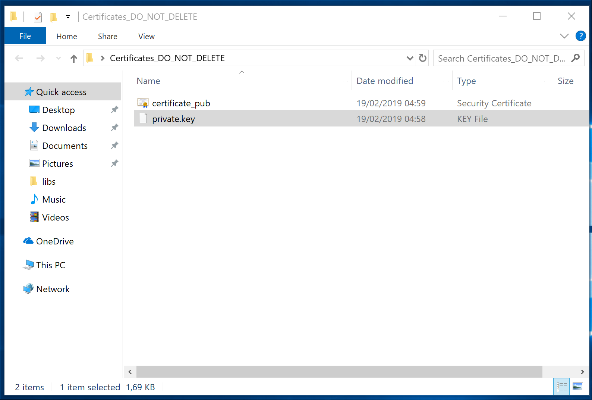
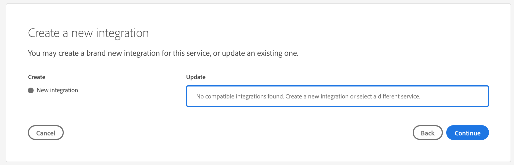
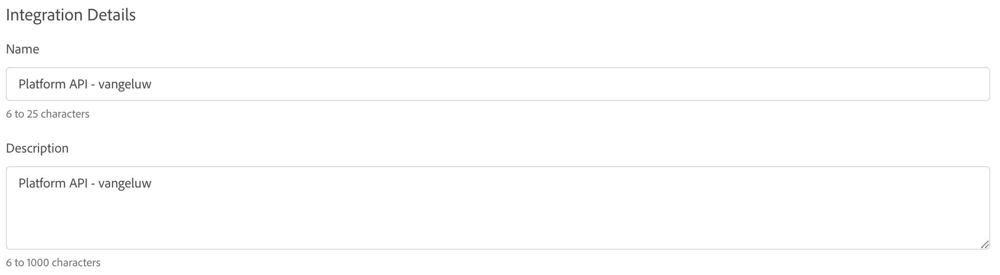
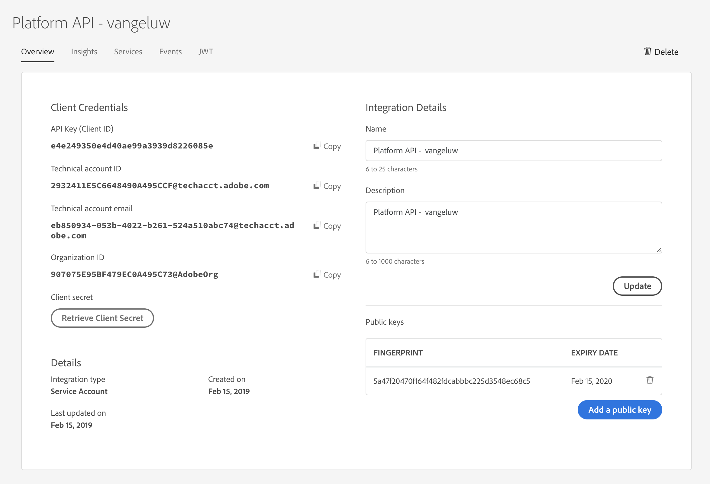

## Exercise 2.1.1 - Create your Security Certificates

In Module 2, we'll be using Adobe I/O quite intensively to query against Platform's API's. Please follow the below steps to setup Adobe I/O.

**Mac-users: please follow these steps - Windows-users, please scroll down**

In order to setup an Adobe I/O integration, you need to create a certificate.

* Open a new Terminal window

* Enter the following command:
	* `openssl req -x509 -sha256 -nodes -days 365 -newkey rsa:2048 -keyout private.key -out certificate_pub.crt` and hit the "Enter"-button.


* The terminal window will start a dialog and ask you some questions. use the below table and more specifically, the last column, as a reference to your answer:

| Requested Information     | Explanation | Example Answer    |
|:-------------:| :---------------:| :---------------:|
| Country Name (2 letter code) [AU] | _your country code_ | **BE** |
| State or Province Name (full name) [Some-State] | _your city_ | **Brussels** |
| Locality Name (eg, city) [] | _your city_ | **Brussels** |
| Organization Name (eg, company) [Internet Widgits Pty Ltd] | _your company name_ | **Adobe** |
| Organizational Unit Name (eg, section) []: | _your department_ | **ACS** |
| Common Name (e.g. server FQDN or YOUR name) [] | _your ldap_ | **vangeluw** |
| Email Address [] | _your email_ | **vangeluw@adobe.com** | 


* After this step, your certificates are generated and you can find them in your user's root directory on your Mac
	* Macintosh HD⁩ ▸ ⁨Users⁩ ▸ "ldap username"


* Make sure to copy these 2 files to a safe directory on your computer:
	* **certificate_pub.crt** 
	* **private.key**


_**End of Certificate creation for Mac-users. Please scroll down until you see the explanation of the different certificate files**_

**For Windows-users**

For Windows users, please make sure you have **OpenSSL** installed.

Download the OpenSSL client using this link: [OpenSSL](https://bintray.com/vszakats/generic/download_file?file_path=openssl-1.1.1-win64-mingw.zip)

Extract the downloaded zip file to the directory `C:\libs`. If the directory `C:\libs` doesn't exist yet, create it first.


After extracting the zip-file, you should see this directory-structure: `C:\libs\openssl-1.1.1-win64-mingw`.

 

In the directory `C:\libs\openssl-1.1.1-win64-mingw`, you should see the following files:


To open a Command Line Prompt, click on the Windows Start-button and type "command", after which you'll see the Command Prompt-executable and you can click "Open" to open it.


In the Command Prompt-window, paste the following command and hit "Enter".

```shell
set OPENSSL_CONF=C:/libs/openssl-1.1.1-win64-mingw/openssl.cnf
```


There is no visual confirmation of executing this command, you will just see a new command prompt being displayed.

Then, paste the following command and hit "Enter".

```shell
cd C:/libs/openssl-1.1.1-win64-mingw/
```


Finally, paste and execute this command and hit "Enter".

```shell
openssl req -x509 -sha256 -nodes -days 365 -newkey rsa:2048 -keyout private.key -out certificate_pub.crt
```


   
* The terminal window will start a dialog and ask you some questions. use the below table and more specifically, the last column, as a reference to your answer:

| Requested Information     | Explanation | Example Answer    |
|:-------------:| :---------------:| :---------------:|
| Country Name (2 letter code) [AU] | _your country code_ | **BE** |
| State or Province Name (full name) [Some-State] | _your city_ | **Brussels** |
| Locality Name (eg, city) [] | _your city_ | **Brussels** |
| Organization Name (eg, company) [Internet Widgits Pty Ltd] | _your company name_ | **Adobe** |
| Organizational Unit Name (eg, section) []: | _your department_ | **ACS** |
| Common Name (e.g. server FQDN or YOUR name) [] | _your ldap_ | **vangeluw** |
| Email Address [] | _your email_ | **vangeluw@adobe.com** | 


* After this step, your certificates are generated and you can find them in the directroy `C:\libs\openssl-1.1.1-win64-mingw`


* Make sure to copy these 2 files to a safe directory on your computer:
	* **certificate_pub.crt** 
	* **private.key**



_**End of Certificate creation for Windows-users**_

Some explanation about the certificate-files...

* **certificate_pub.crt** is your Public key certificate. From a security perspective, this is the certificate that is freely used to setup integrations with online applications.
* **private.key** is your Private key. This should never, ever be shared with anyone. The Private Key is what you use to authenticate to your API implementation and is supposed to be a secret. If you share your Private Key with anyone, they can access your implementation and abuse the API to ingest malicious data into Platform and extract all the data that is in Platform.
(P.S.: the same applies to your bitcoin wallet ;-), don't share your private key with anyone, for just the same reason!)

Once you've generated your security certificates, you can create your Adobe I/O integration.

### Exercise 2.1.2 - Create your Adobe I/O Integration

Go to [https://console.adobe.io/integrations#](https://console.adobe.io/integrations#)

Make sure to select the right Organization: Experience Platform EMEA.


Click on "New Integration"


Select "Access an API" and click "Continue".


Select "Experience Platform API" under Adobe Experience Platform and click "Continue".


Select "Create: New integration" and click "Continue".


Enter a Name and Description for your integration. As a naming convention, we'll use **Platform API - ldap**. Replace ldap with your ldap.
For instance, if your ldap is vangeluw, the name and description of your integration becomes Platform API - vangeluw.
It is required to also fill out the "Description"-field, so enter the same text there: **Platform API - ldap**.



In the "Public keys certificates"-area, drag and drop or select the public certificate that you created in exercise 2.1.1. The public key certificate is the one with the name "**certificate_pub.crt**".


After dragging and dropping or selecting the certificate, you should see a visual confirmation of this in the "Certificates"-area:


Next, you should select the Product Profiles to use the Adobe Experience Platform API. Please check all 3 boxes.


You're now ready to finalize the creation of your integration. Click the "Create Integration"-button to save your configuration.


Click "Continue to Integration details".


Find your integration details.


While setting up Postman in the next exercise, you'll need to come back to this screen because we will need to use some of these values in that configuration.

[Next Step: Setup and Configuration of Postman](./ex2.md)

[Go Back to Module 2](../README.md)

[Go Back to All Modules](/../../)


