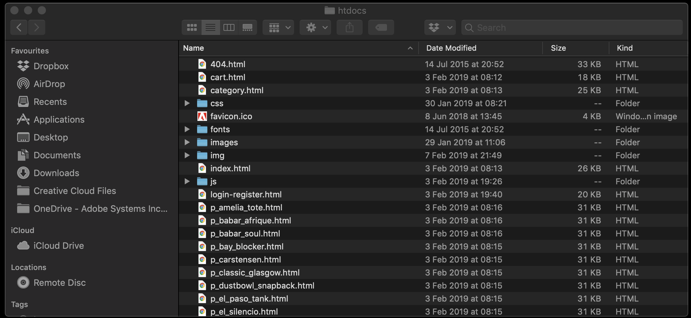

## Exercise 2.1.3: Update your La Boutique demo site 
In this exercise, the goal is to update your 'La Boutique' demo site to the latest standard, which is now ready to include the X-ray panel that is connected to Adobe Experience Platform.

Download the [v2 of the 'La Boutique' demo site zip package](./downloads/laboutique_demo_site_v2.zip) to your computer, unzip it in a directory of your choice, f.i. on your Desktop:


**Mac:** Go to Launchpad and click on the grey MAMP-icon to start MAMP.

**Windows:** Go to your Windows Desktop and double-click on the grey MAMP-icon to start MAMP.


MAMP will start and you'll see the below screen.


Click on Start Servers to start MAMP.


Servers are now running, and you can access the Start Page by clicking on 'Open WebStart page'.


Currently, v1 of the 'La Boutique' demo site is installed in MAMP. We need to delete v1 of La Boutique and replace it with the v2 of the 'La Boutique' demo website.

**Windows:** On you Windows machine, go directly to C:\MAMP\htdocs

**Mac:** On your MacBook, go to Applications and locate the MAMP folder in the Applications list.


**Only for Mac:** Double-click to go in the MAMP-folder.


**Only for Mac:** Open the folder 'htdocs'.



**Fot both Windows and Mac:** Delete all files in this folder.


Go to the folder where you unzipped the zip-package of the v2 of the La Boutique demo website. Copy all files and paste them in the 'htdocs' folder.


Go back to your web browser.


Click on 'My Website' to navigate to the La Boutique demo website.

You should now again see the 'La Boutique' website:


Please scroll down all the way untill you see the footer of the webpage. When checking the text in the footer, you should see this:
```© 2019 La Boutique - v2 - Module 2 · All Rights Reserved.```
This is the visual confirmation that you've loaded the newest version of the 'La Boutique' demo site.


**What's new in v2 of the 'La Boutique' demo site?**

  * Background changes to style sheets to accomodate the X-ray panel
  * Changes to the Login/Register-page to capture more details.
  


If v2 of the 'La Boutique' demo site is displayed, then you've successfully completed this exercise.

Let's update your Launch configuration now so you can use the X-ray panel, and also, so you can send all of the addition registration information to Platform.

[Next Step: Update Launch & Explore X-ray](../launch/README.md)

[Go Back to Module 2](../README.md)

[Go Back to All Modules](/../../)


