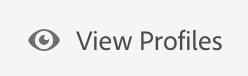

### Exercise 2.4.1 - Create a Segment Definition through the Platform UI

To log in to Platform, go to [https://platform.adobe.com/home](https://platform.adobe.com/home). 


Go to "Segments".


On this page, you can see an overview of all existing segments.

Click on the "Create Segment"-button to start creating a new segment.


Once you're in the new segment builder, you immediately notice the "Browse Attributes"-menu option and the "Profile"-reference.


Since XDM is the language that powers the experience business, XDM is also the foundation for the new segment builder. All data that is ingested in Platform should be mapped against XDM, and as such, all data becomes part of the same data model regardless of where that data comes from. This gives us a big advantage when building segments, as from this one segment builder UI, we can combine data from any origin in the same workflow. And once the connectors to solutions will be ready, segments built within this new, unified segmentation environment can be sent to solutions like Adobe Target, Adobe Campaign and Adobe Audience Manager for activation.

Let's build a segment which includes all male customers.

To get to the attribute gender, you need to understand and know XDM. 


Gender is an attribute of Person, which can be found under Attributes. So to get there, you'll start by clicking on Profile.


From the Profile-window, you can select Person now.


And in Person, you can find the Gender-attribute. Drag the Gender-attribute on the segment builder.

Now you can choose the specific gender out of the pre-populated options. In this case, let's pick "Male".


After selecting "Male", you'll see that an estimation of the segment's population is calculated. This is very helpful for a business audience, so that they understand the impact of certain attribute selections on segment size and addressable audience.


Next, we should refine our segment a bit. I'd like to build a segment out of all male customers that have viewed the "El Silencio"-product.

To build out this segment, you need to add an Experience Event. You can find all Experience Events by clicking on this icon on the left-side menu bar.


Next, you'll see the top level "Experience Events"-node. Click it.


To find customers that had an interaction of type "Product View", you need to go into "Experienceplatform".


Go to Product Data.


Drag and drop the "productInteraction"-object on the segment builder canvas. The comparison parameter should be "equals" and in the input field, enter "productView".


Next, we need to add our "El Silencio"-product to the segment. You can find the product name by selecting "productName".


Drag and drop "productName" on the segment builder canvas.


When dragging the "productName"-object onto the segment builder-canvas, be sure to drop it in the "productInteraction" object, in the box that says "Drop here to form a group".
In the productName equals-textbox, enter the name of the product, in this case El Silencio.
The result is a container with an AND-relationship that combines the event of Product Views with the SKU of El Silencio.

The segment population is being dynamically updated every step of the way.

So far, we've only used the UI to build our segment, but there's also a code-option to build a segment.
When building a segment, we're actually using the PQL-language: Profile Query Language. To visualize that code, you can click on the "Code View" switcher in the upper right corner of the segment builder.


Now you can see the full PQL-statement:

```
person.gender in ["male"] and (select var1 from xEvent where var1._experienceplatform.productData.productInteraction.equals("productView", false) and var1._experienceplatform.productData.productName.equals("El Silencio", false))
```


We'll go a bit deeper on PQL at a later stage.

You can also preview a sample of the customer profiles that are part of this segment, by clicking on "Preview Profiles".



Finally, let's give your segment a name and save it.

As a naming convention, we'll use:
  * **ldap** - Interest in **productName**

In my case, that becomes:
  * vangeluw - Interest in El Silencio

You can assign the name by clicking on the "Unnamed segment"-text in the upper left corner.


Then, click the "Save"-button to save your segment.


Congrats, you've built your first segment through the new UI :-)

[Next Step: Create a segment through the Platform API
](./ex2.md)

[Go Back to Module 2](../README.md)

[Go Back to All Modules](/../../)


