### Exercise 2.4.2 - Create a segment through the Platform API

Go to Postman.

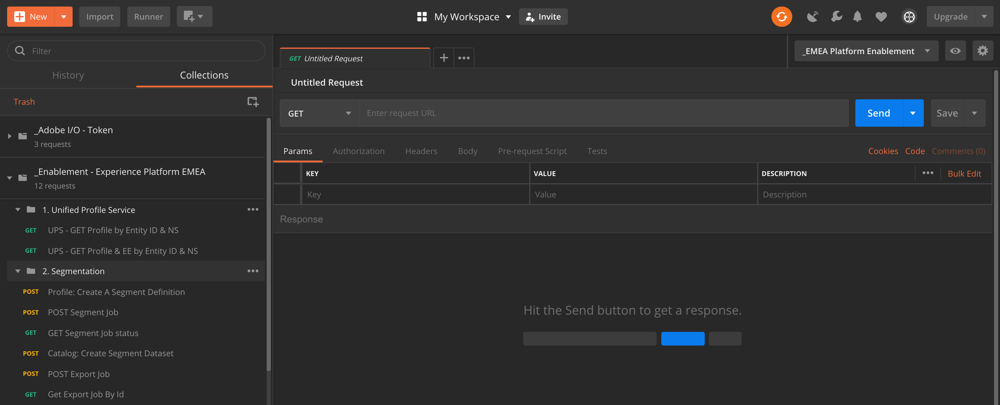

Locate the collection: _Enablement - Experience Platform EMEA. In this collection, you'll see a folder "2. Segmentation". We'll be using these calls in this exercise.

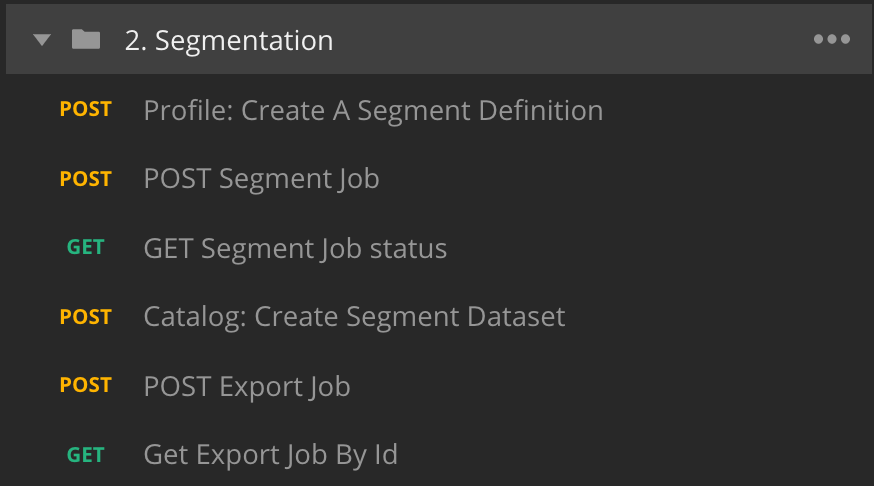

What we'll do next is follow all the required steps to create a segment through the API. We're going to build a simple segment: "ldap - All Female Customers".

#### Step 1 - Create a Segment Definition

Click on the call named "Profile: Create A Segment Definition"

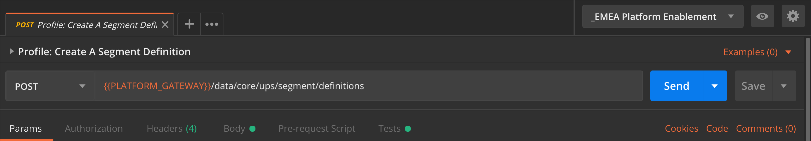

Go the the "Body" section of this call.

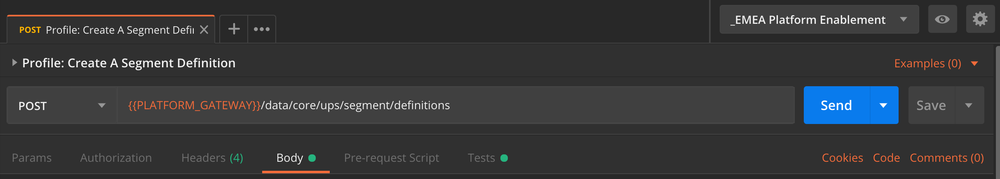

In the Body of this call, you'll see the following:


The language used for this call is called "PQL": Profile Query Language.
You can find more info and documentation about PQL [here](https://www.adobe.io/apis/experienceplatform/home/profile-identity-segmentation/profile-identity-segmentation-services.html#!api-specification/markdown/narrative/technical_overview/unified_profile_architectural_overview/unified_profile_pql.md). 

Attention: please update the variables **"name"** and **"parameter"** in the below call by replacing **"ldap"** with your specific **ldap**

```
{
    "name" : "ldap - API - All Females",
    "expression" : {"type":"PQL", "format":"pql/json", "value":"{\"nodeType\":\"fnApply\",\"fnName\":\"in\",\"params\":[{\"nodeType\":\"fieldLookup\",\"fieldName\":\"gender\",\"object\":{\"nodeType\":\"fieldLookup\",\"fieldName\":\"person\",\"object\":{\"nodeType\":\"literal\",\"literalType\":\"XDMObject\",\"value\":\"profile\"}}},{\"literalType\":\"List\",\"nodeType\":\"literal\",\"value\":[\"female\"]}]}"},
    "createdBy": "ldap",
    "schema" : { "name" : "_xdm.context.profile"},
    "ttlInDays" : 90
}
```
After adding your specific **ldap**, the Body should look similar to this:

```
{
    "name" : "vangeluw - API - All Females",
    "expression" : {"type":"PQL", "format":"pql/json", "value":"{\"nodeType\":\"fnApply\",\"fnName\":\"in\",\"params\":[{\"nodeType\":\"fieldLookup\",\"fieldName\":\"gender\",\"object\":{\"nodeType\":\"fieldLookup\",\"fieldName\":\"person\",\"object\":{\"nodeType\":\"literal\",\"literalType\":\"XDMObject\",\"value\":\"profile\"}}},{\"literalType\":\"List\",\"nodeType\":\"literal\",\"value\":[\"female\"]}]}"},
    "createdBy": "vangeluw",
    "schema" : { "name" : "_xdm.context.profile"},
    "ttlInDays" : 90
}
```

Now, click the blue "Send"-button to create the segment and view the results of that.

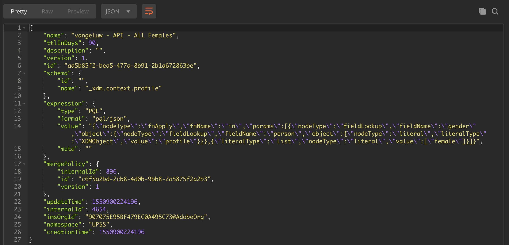

After this step, you can view your Segment Defintion in the Platform UI. To check this, log in to Platform and go to [https://platform.adobe.com/profile/segmentation](https://platform.adobe.com/profile/segmentation). 

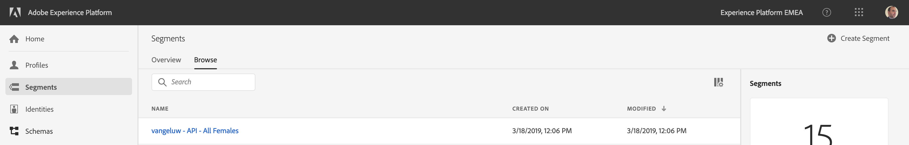

If you edit the Segment Definition for **ldap** - API - All Females, you'll see the UI-version of your segment query. (FYI: There is currently a small bug waiting to be squashed - it's currently not possible to view a segment that was created through the API in the UI)

#### Step 2 - Create a Segment POST Job

So far, whether done through the UI or the API, you've only built Segment Definitions. Creating a segment definition doesn't mean that the segment has actually run. At this moment, nobody qualifies for this segment. To make people qualify, the segment needs to run.

Currently, the UI doesn't allow really 'running' the segment yet, however it is already possible through the API.

Let's now POST a Segment Job.

Go to Postman.


In your Postman-collection, click on the call named "POST Segment Job"

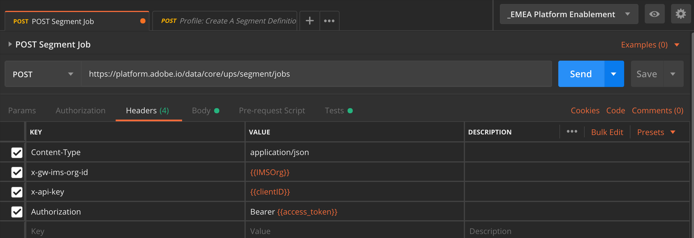

Click on the blue "Send"-button.

You should see a similar result:

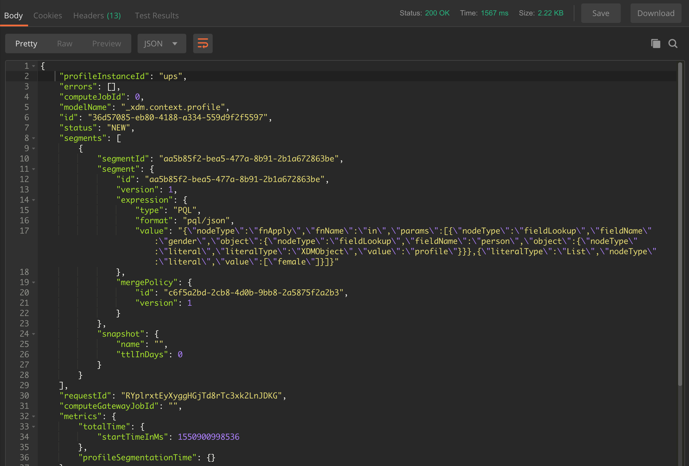

This Segment Job is now running, and this may take some time. In Step 3, you'll be able to check the status of this job.


#### Step 3 - GET Segment Job status

Go to Postman.


In your Postman-collection, click on the call named "GET Segment Job status"

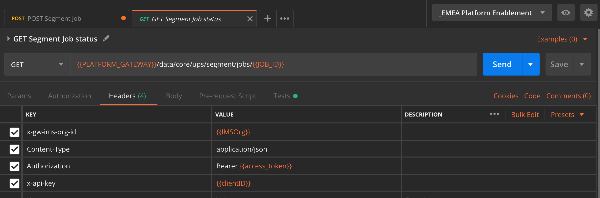

Click on the blue "Send"-button.

You should see a similar result:

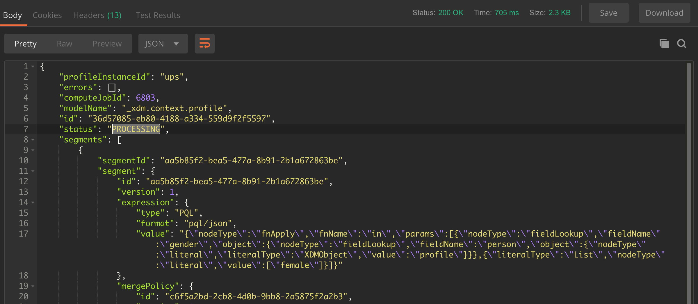

In this example, the "status" of the job is set to "PROCESSING".

Repeat this call by clicking the blue "Send"-button every couple of minutes untill the "status" is set to "SUCCEEDED".

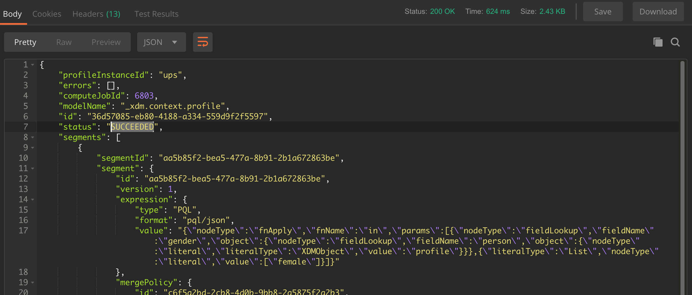

Once the status is "SUCCEEDED", you can continue to Step 4. Please wait to proceed until the status is "SUCCEEDED", otherwise the following exercises won't work.

#### Step 4 - Create a dataset to hold the results of your Segment Job

Once the segment has run, we're able to process the output of the segment job and save it in a dataset. By saving our output into a dataset, it becomes part of an exportable list that in this case, contains all female customers.

Go to Postman.


In your Postman-collection, click on the call named "Catalog: Create Segment Dataset"

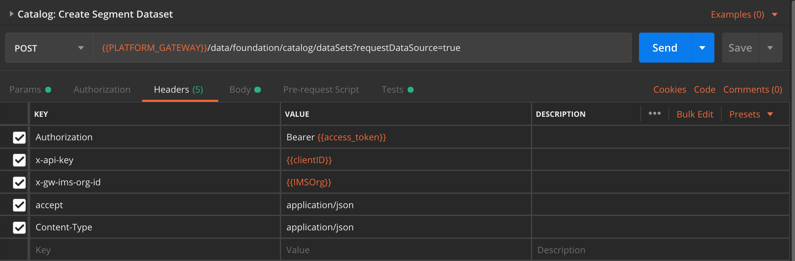

In the Body of this call, you'll see the following:

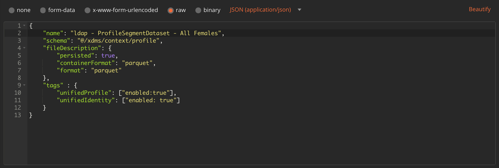

Attention: please update the variable **"name"** in the below call by replacing **"ldap"** with your specific **ldap**

```
{
    "name": "ldap - ProfileSegmentDataset - All Females",
    "description" : "ldap - ProfileSegmentDataset - All Females",
    "schemaRef": {
        "id": "https://ns.adobe.com/experienceplatform/schemas/9bae5cf9659536806e95d310d657a1a2",
        "contentType": "application/vnd.adobe.xed-full+json;version=1"
   },
    "fileDescription": {
        "persisted": true,
        "containerFormat": "parquet",
        "format": "parquet"
    },
   "streamingIngestionEnabled": "false",
    "tags":
    {
           "unifiedIdentity": ["enabled:true"],
           "unifiedProfile": ["enabled:true"]
    }
}
```

After adding your specific **ldap**, the Body should look similar to this:

```
{
    "name": "vangeluw - ProfileSegmentDataset - All Females",
    "description" : "vangeluw - ProfileSegmentDataset - All Females",
    "schemaRef": {
        "id": "https://ns.adobe.com/experienceplatform/schemas/9bae5cf9659536806e95d310d657a1a2",
        "contentType": "application/vnd.adobe.xed-full+json;version=1"
   },
    "fileDescription": {
        "persisted": true,
        "containerFormat": "parquet",
        "format": "parquet"
    },
   "streamingIngestionEnabled": "false",
    "tags":
    {
           "unifiedIdentity": ["enabled:true"],
           "unifiedProfile": ["enabled:true"]
    }
}
```

Now, click the blue "Send"-button to create the segment and view the results of that.

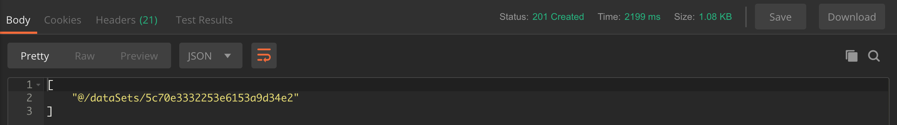

You've now successfully created a dataset in Platform through the API.

You can now view your dataset in the Platform UI. To check this, log in to Platform and go to [https://platform.adobe.com/profile/datasets](https://platform.adobe.com/profile/datasets). 

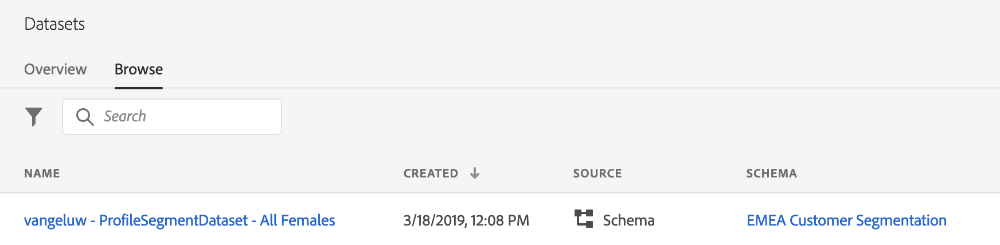

The dataset you created doesn't have data yet, you'll do that in Step 5.

#### Step 5 - Create an Export Job

We now have a successful Segment Job and a dataset in Platform to store the result of the Segment Job. In this step, you need to Start a Job to Export that information.

Go to Postman.


In your Postman-collection, click on the call named "POST Export Job"

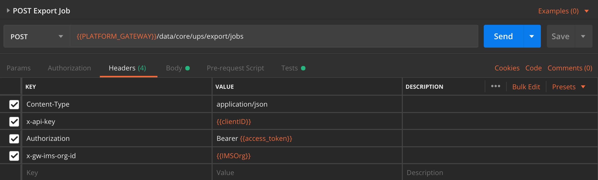

Click on the blue "Send"-button.

You should see a similar result:

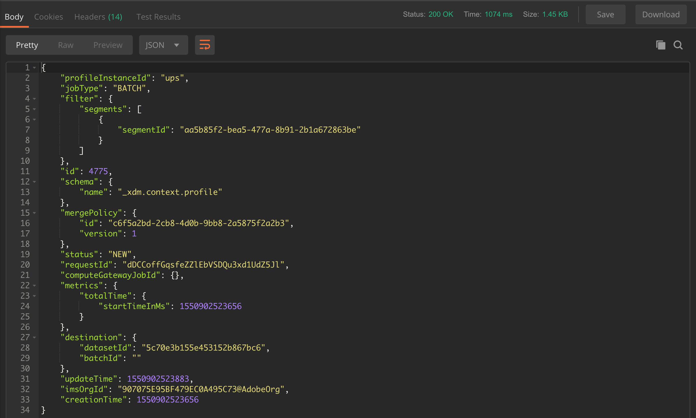

The Export Job to the dataset is now running. Go to Step 6 to check up on the status of this job.

#### Step 6 - Verify Job Status

Go to Postman.


In your Postman-collection, click on the call named "Get Export Job By Id"

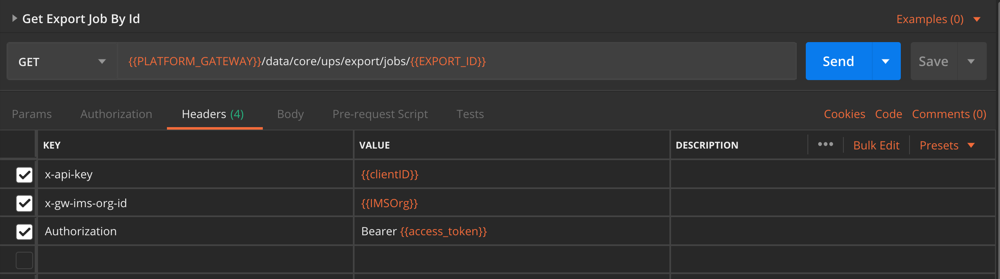

Click on the blue "Send"-button.

You should see a similar result:

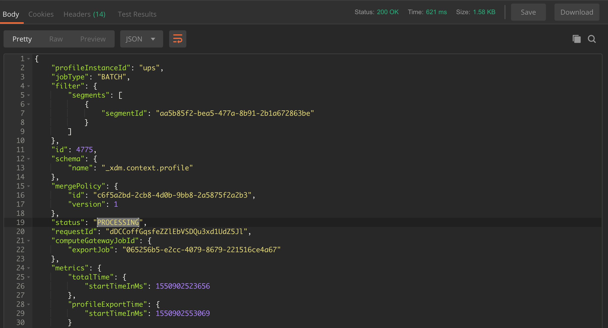

In this example, the "status" of the job is set to "PROCESSING".

Repeat this call by clicking the blue "Send"-button every couple of minutes untill the "status" is set to "SUCCEEDED".

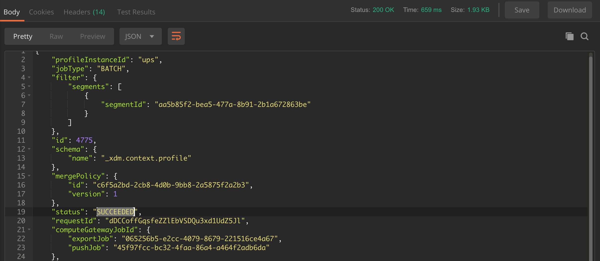

Once the status is "SUCCEEDED", you can now view your Segment Definition's data in the Platform UI. To check this, log in to Platform and go to [https://platform.adobe.com/datasets](https://platform.adobe.com/datasets). 

Click on your dataset "ldap - ProfileSegmentDataset". You should see a batch that is currently processing.

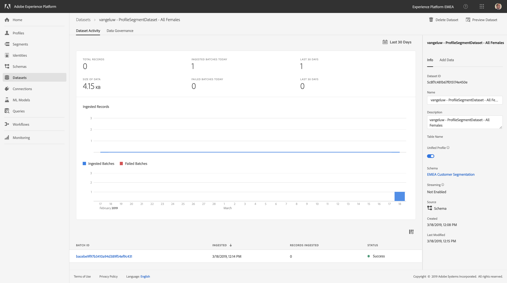

After a couple of minutes, the status of the batch will become "Success".

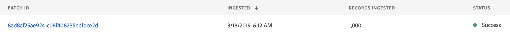

You're now able to preview the data in that dataset:

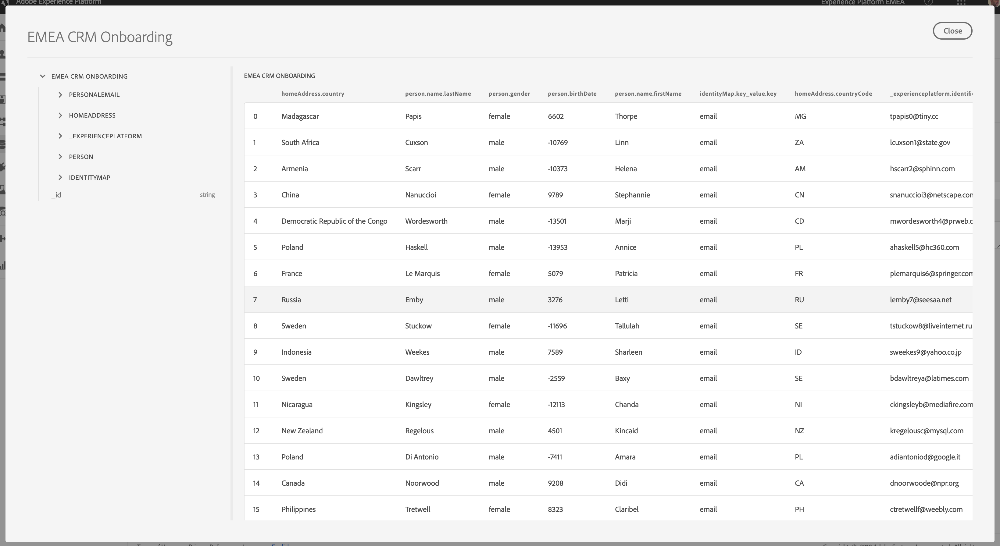

You can also visually check to see that all of the people in this segment have a gender of "female".

Congrats, you've successfully completed the Segmentation exercise.

[Next Step: Walkthrough of Demo Scenario](../demo)

[Go Back to Module 2](../README.md)

[Go Back to All Modules](/../../)


