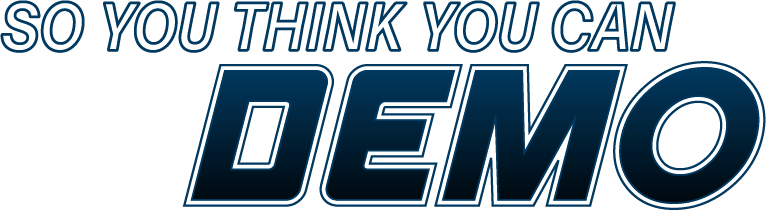

## Module 2 Bonus: So You Think You Can Demo

In the past 4 weeks, you've used the following solutions to do a lot of things:

  * **Launch**
    * You've configured a **Launch company** for your website, and in that Launch company, you've configured extensions for **Adobe Analytics, Adobe Audience Manager, Adobe Experience Platform**.
    * You've built **data elements** to capture on-page information out of a **data layer**.
    * You've built **rules** that decide when to capture which information and when to send it to our Adobe solutions.
  * **MAMP Web Server** to run the La Boutique website
  * **Adobe I/O** to query against our **Adobe Experience Platform API's**
  * **Adobe Experience Platform**
    * You've created **datasets**
    * You've applied **data governance settings** to your dataset
    * You've linked your dataset to **Unified Profile**
    * You've built segments with the new **Segment Builder**
  * You've installed your own version of the **X-ray panel** for Adobe Experience Platform
  * You've installed and used a **mobile application** that is connected to your demo website
  * You've run through a **standard demo scenario** using "La Boutique" as the imaginary brand in which your behavior on your **desktop computer** was synced in **real-time** with your behavior in the **mobile app**, and which is available in real-time to other channels, such as a **call center** or an **in-store POS** environment. With this demo scenario, you're able to demo a **real, live cross-device customer journey**.

While you've done a lot already and all of the above is a remarkable achievement, the end goal of these initial 2 modules, hasn't been reached yet.
The only true end goal has been, and will always be, to be able to deliver a fully personalized demo experience to our customers and prospects.

In this bonus module, the goal is to combine everything that you've done and build a fully personalized demo site for **your** prospect. A process which should not take more then 5 minutes for an initial demo for a first customer meeting.

Before you can build your demo, we'll do some fine-tuning to our setup, after which you'll be able to build your personalized demo site.

The goal for every participant is to configure your own demo environment and then record a 5 minute video of the story and business value of Platform for the brand you've chosen. The video needs to be uploaded here, and the top 3 video's will be rewarded.
 
As a little inspiration on what is possible in terms of demo personalization, have a look [here](https://adobe.ly/2INcnPs).

### [Exercise 2B.1 - Update your La Boutique demo site](./ex1.md)
In this exercise, you'll be updating your La Boutique demo site to a new version with new functionality.

### [Exercise 2B.2 - Cleaning Up & Optimization](./ex2.md)
**This exercise is only intended for the people who finished module 1 and module 2 before last week's update of Adobe Experience Platform on March 13.** 

**If you finished module 2 after March 16, you can skip this exercise.**

In this exercise, participants who finished module 1 and module 2 before March 16 need to do some cleaning up and optimization of our Launch setup. 

### [Exercise 2B.3: Build your quick and not so dirty personalized demo in 5 minutes](./ex3.md)
In this exercise, you'll build a quick and not so dirty demo environment which allows you to deliver a fully personalized customer demo for a first customer meeting.

### Exercise 2B.4: Build your fully functional and personalized e-commerce demo in 30 minutes
This exercise will be released by Monday, April 8.

For your second meeting and beyond, you may need a bit more then just quick and clean. In this exercise you'll configure a second demo environment, with a more detailed setup, in under 30 minutes.

### [SYTYCD Contest: Video Submission](./contest.md)
Instructions on how to submit your video to participate in the SYTYCD-contest can be found here.

[Go Back to All Modules](/../../)

