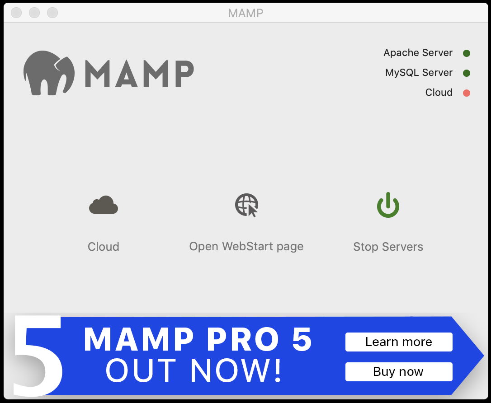
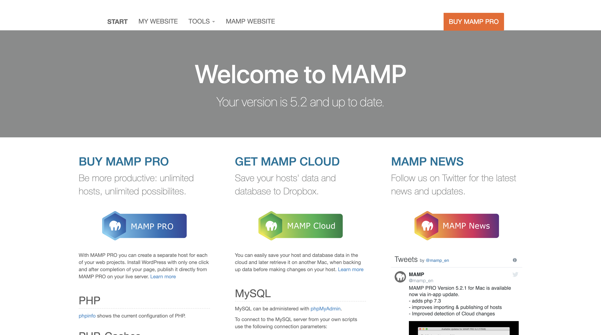
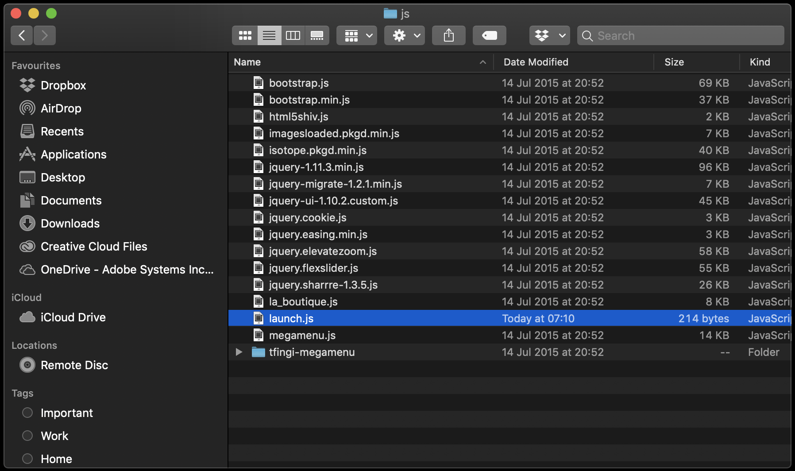
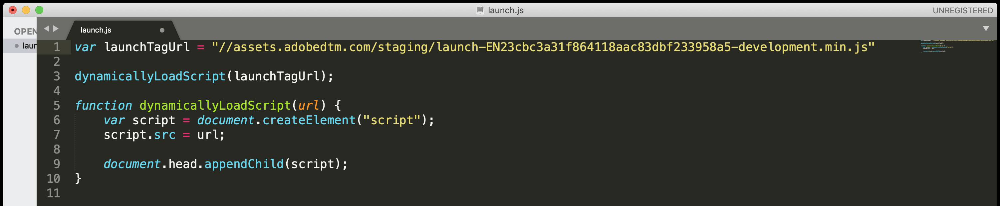

### Exercise 2B.1 - Update your La Boutique demo site


In this exercise, the goal is to update your 'La Boutique' demo site to the latest standard, which makes it now really easy to be customised and personalized for your customer.

Download the [v3 of the 'La Boutique' demo site zip package](./downloads/laboutique_demo_site_v3.zip) to your computer, unzip it in a directory of your choice, f.i. on your Desktop:


**Mac:** Go to Launchpad and click on the grey MAMP-icon to start MAMP.

**Windows:** Go to your Windows Desktop and double-click on the grey MAMP-icon to start MAMP.


MAMP will start and you'll see the below screen.


Click on Start Servers to start MAMP.



Servers are now running, and you can access the Start Page by clicking on 'Open WebStart page'.



Currently, v2 of the 'La Boutique' demo site is installed in MAMP. We need to delete v2 of La Boutique and replace it with the v3 of the 'La Boutique' demo website.

**Windows:** On you Windows machine, go directly to C:\MAMP\htdocs

**Mac:** On your MacBook, go to Applications and locate the MAMP folder in the Applications list.


**Only for Mac:** Double-click to go in the MAMP-folder.


**Only for Mac:** Open the folder 'htdocs'.


**Fot both Windows and Mac:** Delete all files in this folder.


Go to the folder where you unzipped the zip-package of the v3 of the La Boutique demo website. Copy all files and paste them in the 'htdocs' folder.


Go back to your web browser.


Click on 'My Website' to navigate to the La Boutique demo website.

You should now see a new version of the 'La Boutique' website:


Please scroll down all the way untill you see the footer of the webpage. When checking the text in the footer, you should see this:
```© 2019 Wouter Van Geluwe - v3 - Module 2 SYTYCD · All Rights Reserved.```

This is the visual confirmation that you've loaded the newest version of the 'La Boutique' demo site.


**What's new in v3 of the 'La Boutique' demo site?**

  * Admin Menu Option
  * Changes to template of the "La Boutique" website to make the website serializable.

Let's re-install your Launch tag on v3 of the 'La Boutique'-website.

Go to [https://launch-demo.adobe.com/](https://launch-demo.adobe.com/) and login with your personal login details.

To find your development-library tag, navigate to the "Environments"-tab in the Launch UI.


Locate your Development Environment, and click on the "Install"-icon on the right side of the screen:


You'll see a screen like this one, which contains the tag to implement on the website:


Copy the <head> tag.

**On Mac** Go to the folder Applications > MAMP > htdocs > js and locate the launch.js file

**On Windows** Go to the folder C:\MAMP\htdocs\js and locate the launch.js file



Open the file launch.js in your favourite text editor.


Go to Line 1, where you'll see the following:

```javascript
var launchTagUrl = ""
```

On Line 1, replace "" with your launch tag:


This should be the result:

```javascript
var launchTagUrl = "//assets.adobedtm.com/staging/launch-EN23xxxxxxxxxxxxxxxxxxxxxxxxx-development.min.js"
```



Save your changes in the launch.js file and reload your La Boutique website.

After this change, the new version of 'La Boutique' is ready and will load your Launch configuration again!

If v3 of the 'La Boutique' demo site is displayed and launch is successfully installed, then you've successfully completed this exercise.

Let's now optimize and clean up your Launch code.

[Next Step: Cleaning Up & Optimization](./ex2.md)

[Go Back to Module 2 Bonus](../README.md)

[Go Back to All Modules](/../../)


