### Exercise 2B.2 - Cleaning Up & Optimization

___
**This exercise is only intended for the people who finished module 1 and module 2 before the update of Adobe Experience Platform on March 13.** 

**If you have finished module 2 after March 18, you can skip this exercise and go to the next one immediately.**
___


Go to [https://launch-demo.adobe.com/](https://launch-demo.adobe.com/) and login with your personal login details. Select your own company.

### Exercise 2B.2.1 - Upgrade Adobe Experience Platform Extension

First of all, due to an update to the Launch Extension for Adobe Experience Platform, you'll need to upgrade the Launch extension in your Launch configuration.

Go to [https://launch-demo.adobe.com/](https://launch-demo.adobe.com/) and login with your personal login details. Select your company.

In the Launch UI, go to Extensions.

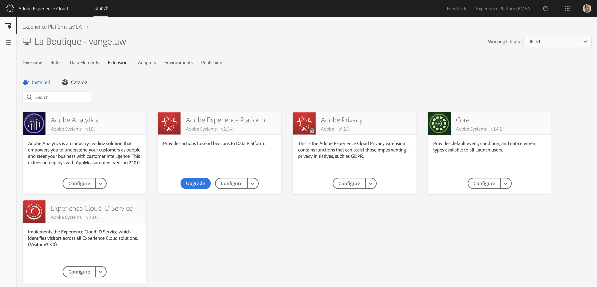

Click on the blue "Upgrade"-button on the Adobe Experience Platform-extension.

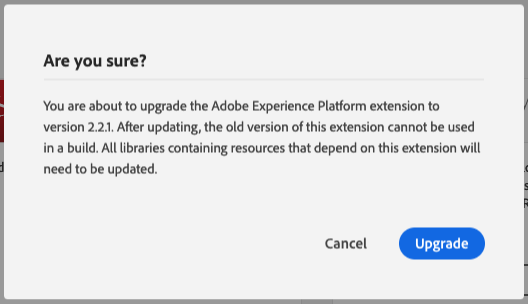

Your Adobe Experience Platform extension is now upgraded.
A couple of changes and bugfixes were introduced in the new version of this extension. 

The biggest change is a visual selector-window that allows you to pick the specific XDM field you need rather than having to type it while configuring a rule.

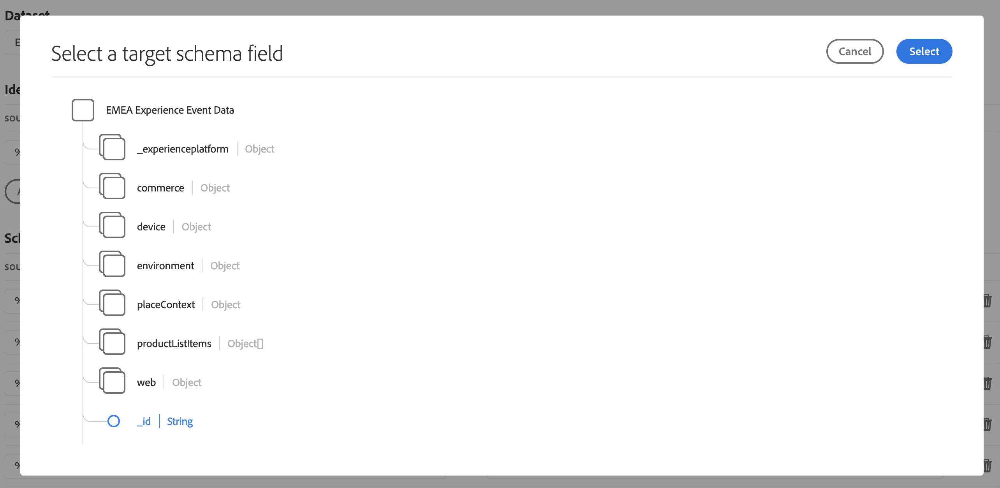

### Exercise 2B.2.2 - Update Adobe Analytics Extension: Change Report Suite

Until this moment, for every product view, Launch has been sending 2 hits to Adobe Experience Platform:

  * 1 hit that went to Adobe Analytics first, and which was then forwarded to Platform
  * 1 hit that was sent directly to 	a DCS Streaming Endpoint

To optimize our configuration and for demo purposes, we'll now send the call to Adobe Analytics to a report suite that isn't forwarding the call to Platform.

This way, we can still have a conversation around sending data to Adobe Analytics and at the same time talk about streaming data directly to Platform (and also, optimize resource usage :-)).

In the Launch UI, go to Extensions.


Click on the "Configure"-button for the Adobe Analytics extension.

Change the Report Suites for Development, Staging and Production to ```epmeaplatformdemo```.

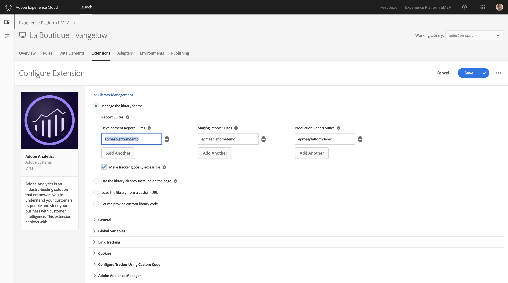

Click "Save" to save your changes.

### Exercise 2B.2.3 - Update Rules and Data Elements
With the update of the new XDM version (v0.9.9.9), all your Launch Rules need to be reconfigured.
We will also start using shared datasets to ingest data into Platform. For this purpose, 2 datasets have been created:

  * EMEA Profile Dataset (API)
    
    
  
  * EMEA EE Dataset (API)

    

This means that we won't be using ldap-branded datasets anymore in the Experience Platform EMEA-org. Everyone should use these datasets.

For your Launch Rules-configuration, update your configuration as follows:

  * Rule: All General Pages should be linked to the dataset: **EMEA EE Dataset (API)**
  * Rule: All Product Pages should be linked to the dataset: **EMEA EE Dataset (API)**
  * Rule: All Authenticated Pages should be linked to the dataset: **EMEA Profile Dataset (API)**

### Exercise 2B.2.3.1 - Update Rule: All General Pages

In the Launch UI, go to Rules.

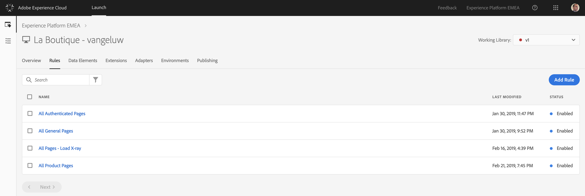

Open your "All General Pages"-rule.

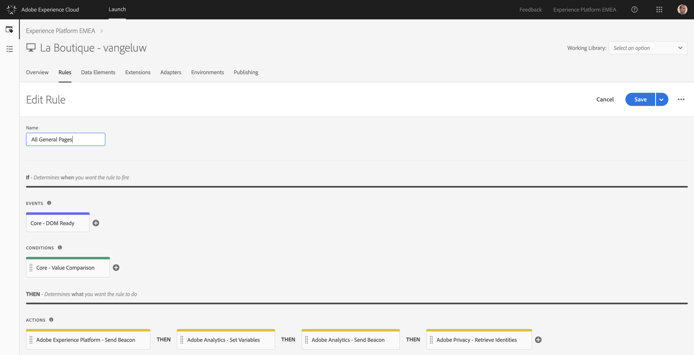

Open the action "Adobe Experience Platform - Send Beacon"

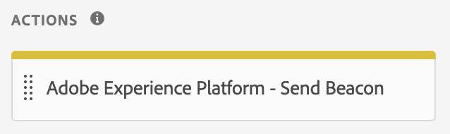

First of all, you need to change the Dataset selection to **EMEA EE Dataset (API)**

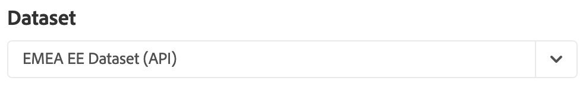

Next, in, Identity Mapping, you need to define a Primary Identifier for this dataset. Our primary identifier for Experience Events will be the Experience Cloud ID. Configure your Identity Mapping as follows:

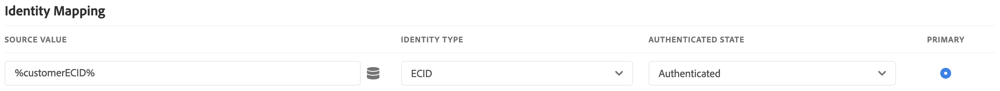

**!! Attention !!** - The UI has changed a bit with the upgrade of the Adobe Experience Platform extension.
In Schema Mapping, there's a new, visual way of selecting XDM-fields. By clicking on this icon:

 

With a click on that icon, you're able to open up the XDM Schema that is linked to the dataset **EMEA EE Dataset (API)**.


Let's redo the configuration of the field in your All General Pages-rule.
In Schema Mapping, You need to add the following Keys and Values to the Send Beacon-action:

| Source Value                 | Target Schema Field               |
|:-------------------------------------------| :------------------ |
|%pageHitId%|_id| 
|%pageName%|web.webPageDetails.name|
|%pageTimeStamp%|timestamp|
|%pageUserAgent%|environment.browserDetails.userAgent|
|%customerLanguage%|environment.browserDetails.acceptLanguage|
|%customerECID%|_experienceplatform.identification.ecid|

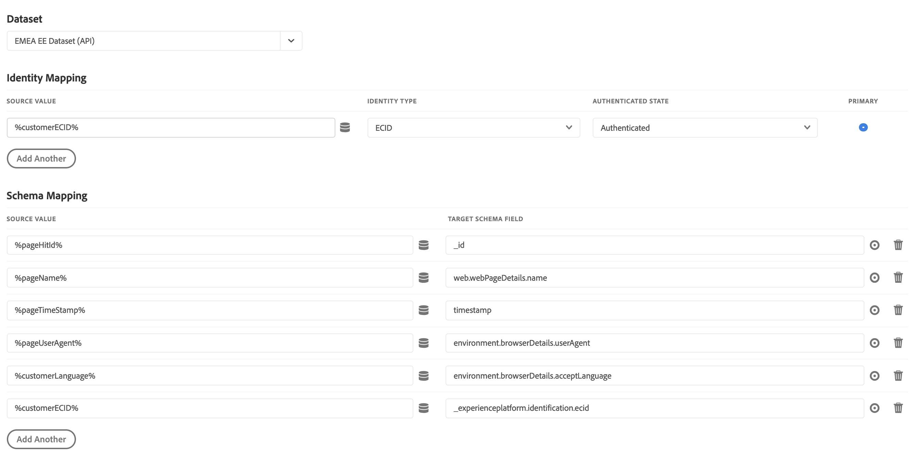

Don't forget to Save your changes!

### Exercise 2B.2.3.2 - Update Rule: All Product Pages

In the Launch UI, go to Data Elements and click on "Create New Data Element".

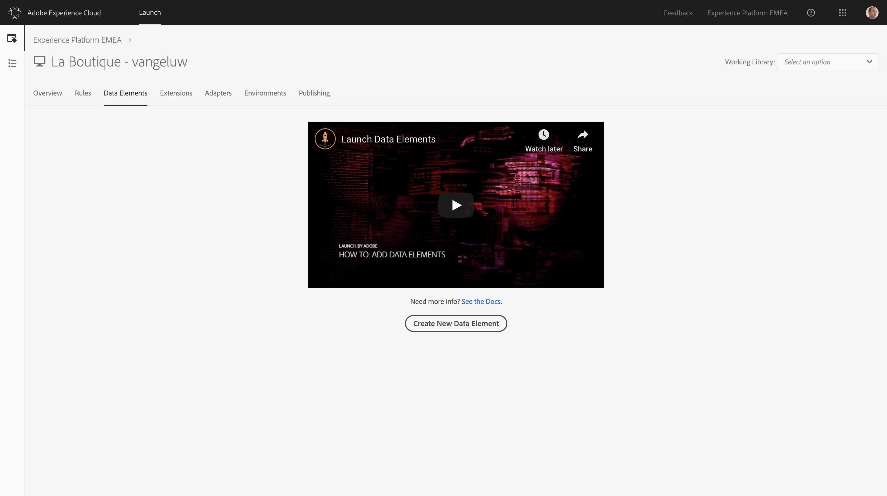

Next: **productInteraction**. For every product view, we need to capture the type of interaction (View, Add To Cart, Purchase, etc) and send it to Platform.

| Name              | Extension     | Data Element Type       | JavaScript variable name     | Storage Duration |
| ----------------- |:-------------:| :----------------------:| :---------------------------:| :--------------: |
| productInteraction   | Core          | JavaScript Variable     | digitalData.product.interaction | Pageview         |

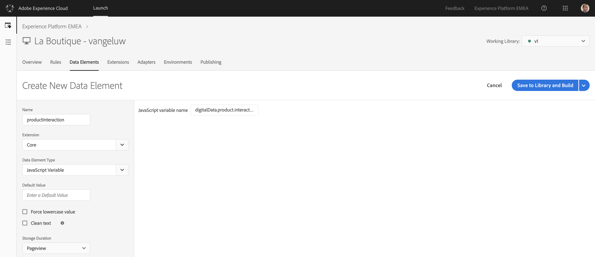

Save your new data element.

In the Launch UI, go to Rules.


Open your "All Product Pages"-rule.

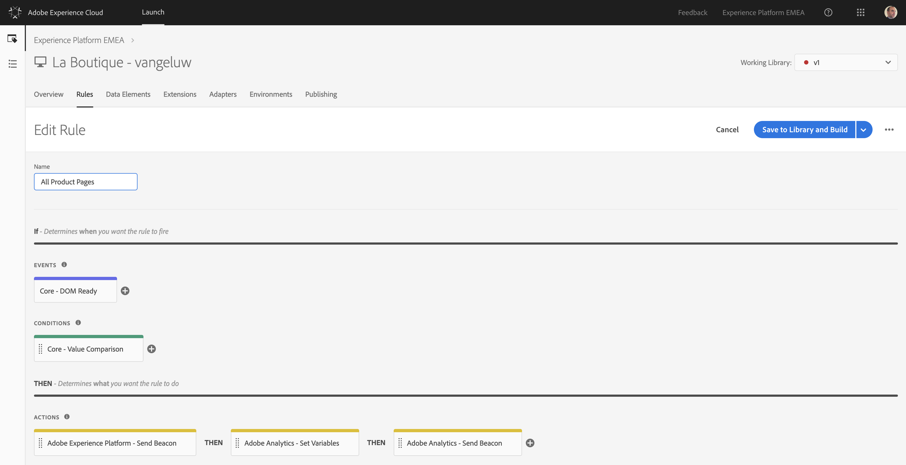

Open the action "Adobe Experience Platform - Send Beacon"


First of all, you need to change the Dataset selection to **EMEA EE Dataset (API)**


Next, in, Identity Mapping, you need to define a Primary Identifier for this dataset. Our primary identifier for Experience Events will be the Experience Cloud ID. Configure your Identity Mapping as follows:


**!! Attention !!** - The UI has changed a bit with the upgrade of the Adobe Experience Platform extension.
In Schema Mapping, there's a new, visual way of selecting XDM-fields. By clicking on this icon:

 

With a click on that icon, you're able to open up the XDM Schema that is linked to the dataset **EMEA EE Dataset (API)**.


Let's redo the configuration of the field in your All Product Pages-rule.
In Schema Mapping, You need to add the following Keys and Values to the Send Beacon-action:

| Source Value                 | Target Schema Field               |
|:-------------------------------------------| :------------------ |
|%pageHitId%|_id| 
|%pageName%|web.webPageDetails.name|
|%pageTimeStamp%|timestamp|
|%pageUserAgent%|environment.browserDetails.userAgent|
|%customerLanguage%|environment.browserDetails.acceptLanguage|
|%customerECID%|_experienceplatform.identification.ecid|
|%productName%|productListItems[0].SKU|
|%productImageUrl%|_experienceplatform.productData.productUrl|
|%productName%|_experienceplatform.productData.productName|
|%productInteraction%|_experienceplatform.productData.productInteraction|

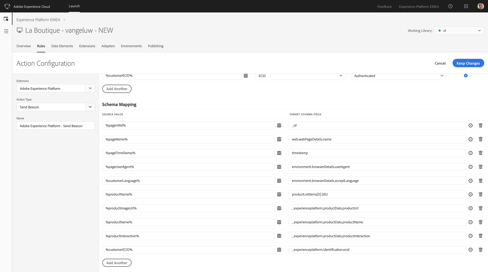

Don't forget to Save your changes!

### Exercise 2B.2.3.3 - Update Rule: All Authenticated Pages

In the Launch UI, go to Rules.


Open your "All Authenticated Pages"-rule.

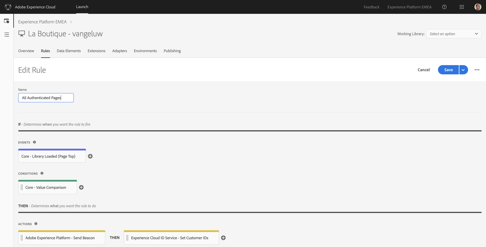

Open the action "Adobe Experience Platform - Send Beacon"


First of all, you need to change the Dataset selection to **EMEA Profile Dataset (API)**

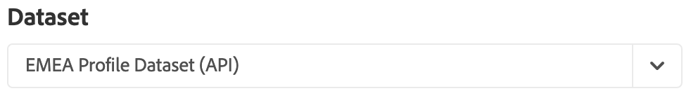

Next, in, Identity Mapping, you need to define a Primary Identifier for this dataset. Our primary identifier for Experience Events will be the Email ID. We are also adding secondary identifiers, like MobileNr. and ECID. Configure your Identity Mapping as follows:

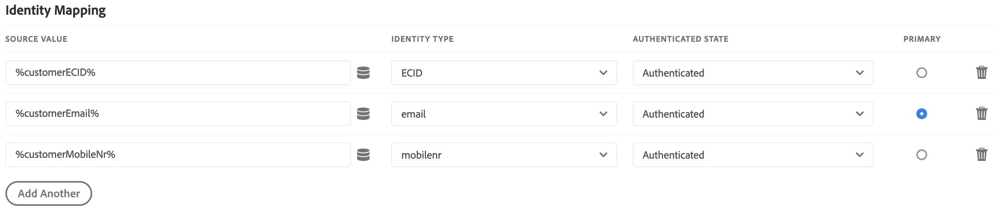

**!! Attention !!** - The UI has changed a bit with the upgrade of the Adobe Experience Platform extension.
In Schema Mapping, there's a new, visual way of selecting XDM-fields. By clicking on this icon:

 

With a click on that icon, you're able to open up the XDM Schema that is linked to the dataset **EMEA Profile Dataset (API)**.

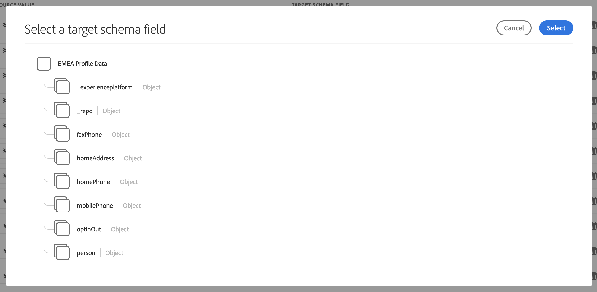

Let's redo the configuration of the field in your All Product Pages-rule.
In Schema Mapping, You need to add the following Keys and Values to the Send Beacon-action:

| Source Value                 | Target Schema Field               |
|:-------------------------------------------| :------------------ |
|%pageTimeStamp%|_repo.createDate| 
|%pageTimeStamp%|_repo.modifyDate|
|%customerLastName%|person.name.lastName|
|%customerFirstName%|person.name.firstName|
|%customerGender%|person.gender|
|%customerBirthYear%-%customerBirthMonth%-%customerBirthDay%|person.birthDate|
|%customerCity%|homeAddress.city|
|%customerCountryName%|homeAddress.country|
|%customerStreet%|homeAddress.street1|
|%customerPostalCode%|homeAddress.postalCode|
|%customerCountryCode%|homeAddress.countryCode|
|%customerMobileNr%|mobilePhone.number|
|%customerEmail%|personalEmail.address|
|%customerPictureImgUrl%|profilePictureLink|
|%customerShoeSize%|_experienceplatform.retailSizes.shoeSize|
|%customerShirtSize%|_experienceplatform.retailSizes.shirtSize|
|%customerPreferredColor%|_experienceplatform.retailSizes.preferredColor|
|%customerEmail%|_experienceplatform.identification.emailId|

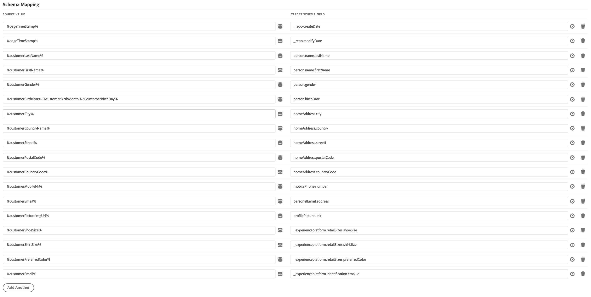

Don't forget to Save your changes!

### Exercise 2B.2.3.4 - Update Rule: All Pages - Load X-ray

In the Launch UI, go to Rules.


Open your "All Pages - Load X-ray"-rule.

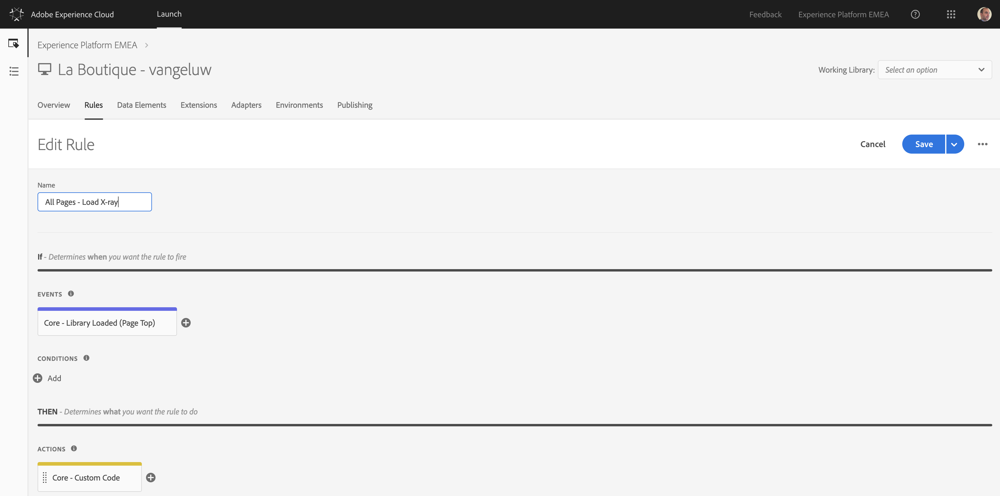

Open the action "Core - Custom Code"

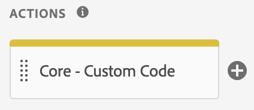

In the "Core - Custom Code" - action, click on "Open Editor".

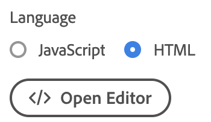

Select all the code that's there already, and delete it. Make sure that everything is gone completely.
When everything is deleted, paste the following code in the Editor.

```
<!--XRAY -->
<script>
$(".header").prepend('<div class="top"><ul style="list-style: none;float: left; display: inline; margin: 0; padding: 0;"><li><a class="mcx" href="#" style="color:white"><span id="xraypanel_header_aec_text" style="color:white; padding-left:10px;padding-right:5px;">Adobe Experience Platform</span><span id="xraypanel_header_xray_text" style="color:white">X-Ray</span></a></li></ul></div>');

$('body').append('<div id="x-ray-panel" class="at-element-marker hide"><div class="accounts" style="display: none;"><div style="display:inline-block;" id="approval_status-header"><ul class="nav navbar-nav navbar-left xray"><li style="display:inline-block;" id="adobe-link"><a href="#" class="link_text active"></a></li></ul></div></div><script id="xray-template" type="text/x-handlebars-template"><div id="approval_status-adobe"><ul class="link_list"><li id="aam_link" class="aam_link" style="display:none;"><button class="accordion" style="padding-left: 80px;">Audience Manager</button><div class="approved"><h4 class=""><span>LOCAL</span></h4><h5>Profile Attributes</h5><span id="textaamsegments" class="analytics interest"></span><h5>Destinations</h5><span id="textaamdestinations" class="analytics">{{c}}</span><h4 class=""><span>CROSS-DEVICE</span></h4><h5>Profile Attributes</h5><span id="textaecsegments" class="analytics interest">{{cv}}</span><h5>Destinations</h5><span id="textaecdestinations" class="analytics">{{c}}</span></div></li><li id="aa_link" class="aa_link"  style="display:none;"><button class="accordion" style="padding-left: 80px;">Analytics</button></li><li id="at_link" class="at_link" style="display:none;"><button class="accordion" style="padding-left: 80px;">Target</button></li><li id="platform_ups_link" class="acp_link" style="display:block;"><button class="accordion" style="padding-left: 40px;">Unified Profile</button><div class="approved"><br/>Identities:<span id="textecid" class="analytics"></span><span id="textuuid" class="analytics"></span><span id="textcrmid" class="analytics"></span><span id="textmobilenr" class="analytics"></span><br/>Profile Information:<span id="platformFirstName" class="analytics"></span><span id="platformLastName" class="analytics"></span><span id="platformEmail" class="analytics"></span><span id="platformGender" class="analytics"></span><span id="platformAddress" class="analytics"></span><span id="platformCity" class="analytics"></span><span id="platformShoeSize" class="analytics"></span><span id="platformShirtSize" class="analytics"></span><span id="platformPreferredColor" class="analytics"></span><br/><span id="platformPicture" class="analytics"></span></div></li><li id="platform_ee_link" class="acp_link" style="display:block;"><button class="accordion" style="padding-left: 40px;">Experience Events</button><div class="approved"><br/>Viewed Products:<table id="browseActivity" style="width: 250px;font-size: 12px;"></table></div></li><li id="platform_sensei_link" class="acp_link" style="display:block;"><button class="accordion" style="padding-left: 40px;">Sensei Services</button><div class="approved"><br/><table id="browseActivity" style="width: 250px;font-size: 12px;></table></div></li></ul></div>');

    var xRayData = {};

    var source = $('#xray-template').html();
    template = Handlebars.compile(source);
    context = xRayData;
    html = template(context);
    contextCode = JSON.stringify(xRayData, null, 2);

    $('.accounts').append(html);
    $('.code code').text(contextCode);
    $('#x-ray-panel').prepend($('.accounts'));
    $('body').prepend($('#x-ray-panel'));

    $('li .mcx').click(function(){
        $('.accounts').toggle();
        $('.mcx').toggleClass('active');
    });
        
    $('#xray-open').click(function(){
        $('#xray-close').addClass('active').removeClass('hide');
        $('#xray-open').addClass('hide').removeClass('active');
        $('#x-ray-panel').addClass('active').removeClass('hide');      
    });
        
    $('#xray-close').click(function(){
        $('#xray-open').addClass('active').removeClass('hide');
        $('#xray-close').addClass('hide').removeClass('active');  
        $('#x-ray-panel').addClass('hide').removeClass('active');  
    });

    var acc = document.getElementsByClassName("accordion");
    var i;

    var browseActivity = document.getElementById("browseActivity");

    getEcId();
    getAAMData();
    getAECData();
    getAEPProfileFromPlatform();
    getAEPExperienceEventsFromPlatform();

    for (i = 0; i < acc.length; i++) {
        acc[i].onclick = function(){
            // Toggle between adding and removing the "active" class, to highlight the button that controls the panel
            this.classList.toggle("active");

            // Toggle between hiding and showing the active panel
            var approved = this.nextElementSibling;
            if (approved.style.display === "block") {
                approved.style.display = "none";
            } else {
                approved.style.display = "block";
            }
        }
    }

    
$.ajaxSetup({
    async: false
});

function getAAMData() {
$.ajax(
  {
      url: "http://experienceplatform.demdex.net/event?d_ptfm=browser&d_rtbd=json&d_dst=1&d_cb=myCallbackAAM", 
      dataType : "jsonp",
      success: function(response) {
      },
      error: function(code, status, error) {
        //console.log("Error : " + error);
      }
    }
  );
}  

function myCallbackAAM(response) {
        localStorage.setItem("uuid", response.uuid);
        textuuid.innerHTML = "Audience Manager ID: </br>" + localStorage.uuid + "</br></br>";
        var dcs = response.dcs_region;
        var segments = response.stuff[0].cv;
        var destinations = response.dests;
        
        var destinationsstring = "";
        
        if(response.hasOwnProperty('dests')){
            for (index = 0; index < destinations.length; ++index) {
                var str = destinations[index].c;
                destinationsstring += "<div>" + str + "</div>" + "</br>";
                //console.log(destinations[index].c);
            }
        }
        else{
            destinationsstring = "- No Active Destinations";
        }
        
        var array = new Array();
        array = segments.split(',');
        textuuid.innerHTML = "Audience Manager ID: </br>" + localStorage.uuid + "</br></br>";
        var fLen = array.length;
        var segmentstring = "";
        for (i = 0; i < fLen; i++) {
            str = array[i];
            str = str.replace("segments=", "");
            segmentstring += "<div>" + "- " + str + "</div>";
        }
        
        textaamsegments.innerHTML = segmentstring;
        textaamdestinations.innerHTML = destinationsstring;
}    

// get AEC data into X-ray Panel
function getAECData() {
    $.ajax(
        {
            url: "http://experienceplatformemea.sc.omtrdc.net/b/ss/epmeademoenvironment/10/JS-1.7.0-D6ZS/s16526409497834?AQB=1&ndh=1&pf=1&callback=s_c_il[1].doPostbacks&cid.&cusid.&id="+localStorage.crmid+"&as=1&.cusid&.cid&d.&nsid=0&jsonv=1&.d&mid="+ localStorage.ecid +"&aamlh=6&ce=UTF-8&ns=aamdemo&app", 
            dataType : "jsonp",
            success: function(response) {
                myCallbackAEC(response);
            },
            error: function(code, status, error) {
                //console.log("Error : " + error);
            }
        }
    );
}     
  
function myCallbackAEC(response) {
        var segments = response.stuff[0].cv;
        var destinations = response.dests;
        
        var destinationsstring = "";
        
        if(response.hasOwnProperty('dests')){
            for (index = 0; index < destinations.length; ++index) {
                var str = destinations[index].c;
                destinationsstring += "<div>" + str + "</div>" + "</br>";
                //console.log(destinations[index].c);
            }
        }
        else{
            destinationsstring = "- No Active Destinations";
        }
        
        var array = new Array();
        array = segments.split(',');
        var fLen = array.length;
        var segmentstring = "";
        for (i = 0; i < fLen; i++) {
            str = array[i];
            str = str.replace("segments=", "");
            segmentstring += "<div>" + "- " + str + "</div>";
        }
        
        textaecsegments.innerHTML = segmentstring;
        textaecdestinations.innerHTML = destinationsstring;
    }
    
function getEcId() {
    var ecid = _satellite.getVisitorId().getMarketingCloudVisitorID();
    localStorage.setItem("ecid", ecid);
    textecid.innerHTML = "Experience Cloud ID: </br>" + localStorage.ecid + "</br></br>";
}
function getCrmId() {
    var crmid = localStorage.getItem("email");
    textcrmid.innerHTML = "EMAIL ID: </br>" + crmid + "</br></br>";
}
function getMobileNr() {
    var mobilenr = localStorage.getItem("mobilenr");
    textmobilenr.innerHTML = "Mobile Number ID: </br>" + mobilenr + "</br></br>";
}
  
function getAEPProfileFromPlatform(){
  
    $.ajax(
            {
                url: "https://adobeioruntime.net/api/v1/web/vangeluw/aep/getAEPProfileInfo.json", 
                type: "GET",
                dataType : "json",
                contentType: "application/json",
                data: {"eventId": localStorage.ecid, "eventNS":"ecid"},
                success: function(response) {
                  var profileData = response.profileData;
                  displayProfilePull(profileData);
                },
                error: function(code, status, error) {
                    //console.log("Error : " + error);
                }
            }
        );
}

function getAEPExperienceEventsFromPlatform(){
  
    $.ajax(
            {
                url: "https://adobeioruntime.net/api/v1/web/vangeluw/aep/getAEPExperienceEventInfo.json", 
                type: "GET",
                dataType : "json",
                contentType: "application/json",
                data: {"eventId": localStorage.ecid, "eventNS":"ecid"},
                success: function(response) {
                  var experienceEventData = response.experienceEventData;
                  displayEEPull(experienceEventData);
                },
                error: function(code, status, error) {
                    //console.log("Error : " + error);
                }
            }
        );
}
 
function displayProfilePull(platformResponse) {
    var key = Object.keys(platformResponse)[0];
    console.log("Profile XID Key: " + key);

    if(key == "message" || key == "error_code" || key == "statusCode" || key == "message" || key == "cause"){
        platformFirstName.innerHTML = "";
        platformLastName.innerHTML = "";
        platformGender.innerHTML = "";
        platformEmail.innerHTML = "";
        platformAddress.innerHTML = "";
        platformCity.innerHTML = "";
        platformPicture.innerHTML = ""; 
        console.log("Profile Info Request: No Data Returned from Adobe I/O Runtime.");
    }
    else if(key == "retryAfterMs"){
      console.log("Profile Info Request: Our testing instance of Platform is receiving too many requests at this moment and couldn't respond to your request immediately.");
    }
    else{
        var entityObject = JSON.stringify(platformResponse[key].entity);
      
        if(entityObject !== '{}'){
            thisPerson = JSON.stringify(platformResponse[key].entity.person);
            if(typeof thisPerson !== 'undefined'){
              thisName = JSON.stringify(platformResponse[key].entity.person.name);
              if(typeof thisName !== 'undefined'){
                thisFirstName = JSON.stringify(platformResponse[key].entity.person.name.firstName);
                platformFirstName.innerHTML = "First Name: " + String(platformResponse[key].entity.person.name.firstName);
                thisLastName = JSON.stringify(platformResponse[key].entity.person.name.lastName);
                platformLastName.innerHTML = "Last Name: " + String(platformResponse[key].entity.person.name.lastName);
              }
              thisGender = JSON.stringify(platformResponse[key].entity.person.gender);
              if(typeof thisGender !== 'undefined'){
                platformGender.innerHTML = "Gender: " + String(platformResponse[key].entity.person.gender);
              }
            }

            thisCustomerExtension = JSON.stringify(platformResponse[key].entity._experienceplatform);
            if(typeof thisCustomerExtension !== 'undefined'){
                thisRetailSizesExtension = JSON.stringify(platformResponse[key].entity._experienceplatform.retailSizes);
                if(typeof thisRetailSizesExtension !== 'undefined'){
                platformShoeSize.innerHTML = "Shoe Size: " + String(platformResponse[key].entity._experienceplatform.retailSizes.shoeSize);
                platformShirtSize.innerHTML = "Shirt Size: " + String(platformResponse[key].entity._experienceplatform.retailSizes.shirtSize);
                platformPreferredColor.innerHTML = "Preferred Color: " + String(platformResponse[key].entity._experienceplatform.retailSizes.preferredColor);
                }
            }
            
            thisPictureUrl = JSON.stringify(platformResponse[key].entity.profilePictureLink);
            if(typeof thisPictureUrl !== 'undefined'){
                platformPicture.innerHTML = ""; 
            }
          
            thisHomeAddress = JSON.stringify(platformResponse[key].entity.homeAddress);
            if(typeof thisHomeAddress !== 'undefined'){
              platformAddress.innerHTML = "Address: " + String(platformResponse[key].entity.homeAddress.street1);
              platformCity.innerHTML = "City: " + String(String(platformResponse[key].entity.homeAddress.city));
            }
            thisEmail = JSON.stringify(platformResponse[key].entity.personalEmail);
            if(typeof thisEmail !== 'undefined'){
              profileEmail = String(platformResponse[key].entity.personalEmail.address);
              console.log("EMAIL from Profile: " + profileEmail);
              localStorage.setItem("email", profileEmail);
            }
            thisMobileNr = JSON.stringify(platformResponse[key].entity.mobilePhone);
            if(typeof thisMobileNr !== 'undefined'){
              profileMobileNr = String(platformResponse[key].entity.mobilePhone.number);
              thisMobileNr = profileMobileNr.replace(/"/g, "");
              console.log("MOBILENR from Profile: " + thisMobileNr);
              localStorage.setItem("mobilenr", thisMobileNr);
            }
        }
    }
    getCrmId();
    getMobileNr();
}

function displayEEPull(platformEEResponse) {
    var EEresponse = {};
    var SKUarray = {};
    var SKUcounter = 0;
    var key = Object.keys(platformEEResponse)[0];
    console.log("EE key: " + key);

    if(key == "message" || key == "error_code" || key == "statusCode" || key == "message" || key == "cause"){
        browseActivity.innerHTML = "";
        console.log("ExperienceEvent Info Request: No Data Returned from Adobe I/O Runtime, try again later.");
    }
    else if(key == "retryAfterMs"){
      console.log("ExperienceEvent Info Request: Our testing instance of Platform is receiving too many requests at this moment and couldn't respond to your request immediately.");
    }
    else{
    console.log(platformEEResponse);
    EEresponse = platformEEResponse;

    var EElength = EEresponse.children.length;
    SKUcounter = 0;
        
    for (i = 0; i < EElength; i++) { 
        try{
            var SKU = EEresponse.children[i].entity.productListItems[0].SKU;
            if(SKU !== null || SKU !== undefined){
                var prodArray = {};
                var prodName = SKU;
                var prodImg = EEresponse.children[i].entity._experienceplatform.productData.productUrl;
                
                console.log("Product Views Info: " + prodName + " - " + prodImg);
                prodArray["prodName"] = prodName;
                prodArray["prodImg"] = prodImg;
                SKUarray[SKUcounter] = prodArray;
                SKUcounter ++;
            }
        }catch(err) {
            //console.log(err.message);
        }
    }

    var finalSKUs = SKUcounter;
    var browseActivityString = "";

    for (i = 0; i < finalSKUs; i++){
        var productName = SKUarray[i]["prodName"];
        var productImg = SKUarray[i]["prodImg"];
        var prodViewCounter = SKUarray[i]["prodViewCounter"];
        str = "<tr>" + "<td align='left' style='padding-bottom: 1em;'>" + "</td><td align='left' style='padding-bottom: 1em;'>" + productName + "</td></tr>";
        browseActivityString += str;
    }

    browseActivity.innerHTML = browseActivityString;
}}
  
  
</script>
<!-- XRAY end -->
```

Click "Save" to save your changes.
Click "Keep Changes" to keep your changes.
Click "Save" one more time to save your changes.

### Exercise 2B.2.3.5 - Publish your changes

You can now publish these changes into your development environment. 

In the Launch UI, navigate to the menu option "Publishing".


In the "Development"-window, you'll see your current Development-environment. 
Click on little arrow to open a dropdown-list and click Edit to make changes to your development-library.

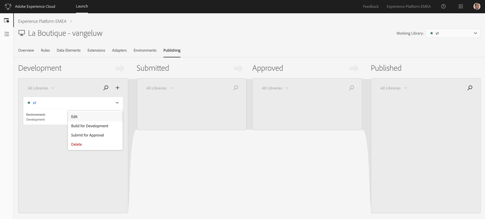

Scroll down to the bottom of the window, where you'll see a button called "+ Add All Changed Resources".

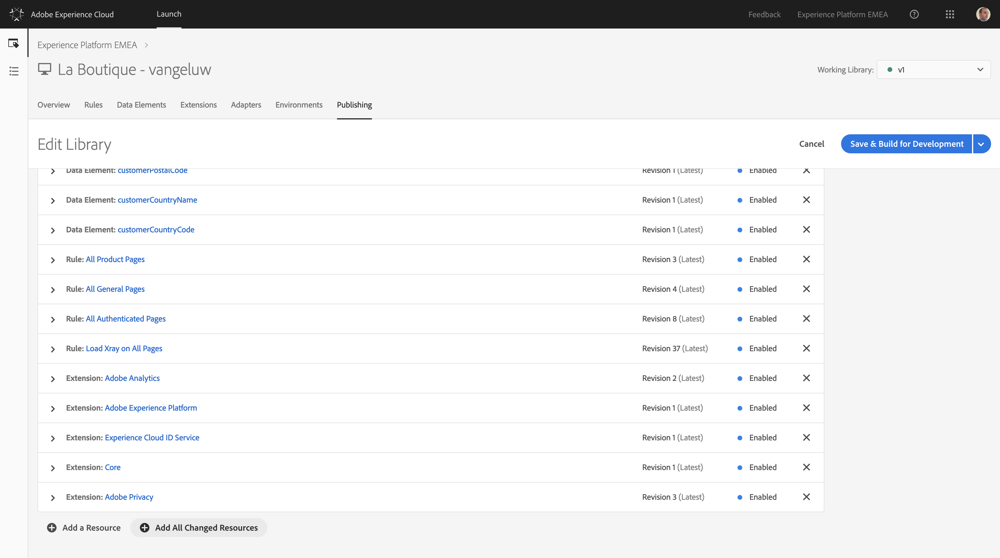

Click the "+ Add All Changed Resources"-button.


Click the "Save & Build for Development"-button.


With these changes, you've optimized and cleaned up your configuration and you're now ready for the next step!

[Next Step: Build your quick and not so dirty personalized demo in 5 minutes](./ex3.md)

[Go Back to Module 2 Bonus](../README.md)

[Go Back to All Modules](/../../)


