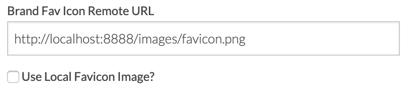

### Exercise 2B.3: Build your quick and not so dirty personalized demo in 5 minutes


So far, the only productized way of doing a live demo of our Adobe solutions has always been to use a generic demo website like La Boutique, weRetail or Luma.

While all of these websites are great ways of showing the power of our Adobe solutions, it wasn't as personal as it could be. An imaginary fashion/outdoor retail website is a good way of demoing our solutions to a fashion/outdoor retail brand, but not for a Bank, an Insurance Company, a Car Manufacturer or a Telco. And while we have generic websites for a limited amount of other industries, they're still generic and they can never be completely personal.

What we from Adobe have been saying to our customers, is that they have to build Personal Experiences to win the hearts of their customers. We from Adobe should also build Personal Experiences to win the hearts of our customers. 

That being said, it was never the intention of this enablement to introduce a new generic demo brand. La Boutique is a simple website that is built on a simple template, and with this release, we will **destroy** La Boutique.

In the Quick And Not So Dirty-setup, the goal is to update the template of the demo website as soon as possible, so that the website can be used in a first customer meeting to show your though leadership. Opening a first meeting with a personalized live demo is always a good idea, as it will guarantee a common starting point for your discussions, it will trigger ideas in your customer's mind and it will lead to an open discussion with the customer, which is the best kind of discovery that you can do during a first meeting.

**VERY IMPORTANT FOR YOU**

**For your exercise, please pick any brand that you can think of. It's important that everyone selects a brand of their own choice and builds out the demo environment for their own brand. Think of a customer that you'd like to introduce to Platform, and think of use-cases that could be interesting for that customer.**


For this exercise, I'll be using Volkswagen as my brand to prepare my live demo site.

You can view a 10-minute video that shows you how to destroy "La Boutique" and replace it by the brand of Volkswagen here: [So You Think You Can Demo: Volkswagen](http://bit.ly/2u02Ha6).

Go to the homepage of your "La Boutique" website. You'll notice the new Menu.


In the menu, click on "Admin".


First of all, you have to select the type of demo you want to build:
- Quick And Not So Dirty
- Full E-Commerce Ready


For this exercise, you should choose the **Quick And Not So Dirty** setup type.

For the Quick And Not So Dirty setup, you need to update 2 things:

  * Brand Details
  * Custom Page Details


### Exercise 2B.3.1 - Overview: Brand Settings

The **Brand Details** are the standard settings that apply to your company.

In order to personalize my website, I'll have to update 6 settings in the Brand Details-section:

  * Brand Name
  
    
    
    Logically, enter the brand's name here. The brand's name will be used as the title for the homepage.
  
    
  
  * Brand Logo
    
    

    The Brand Logo URL is the logo of the brand you've chosen. The goal is to specify which image represents the logo of your brand. This will replace the La Boutique logo on all pages. 
    You have the choice between using a remote Image URL or a local Image URL.
    
    * _Brand Logo Remote URL_
    
      This is the default option and expects you to paste in the full public Image URL of your brand's logo.
      
      
     
    * _Brand Logo Local URL_
    
      
    
      When checking the checkbox "Use Local Logo Image?", the system defaults to a predefined Local Image filename, which is ```logoimage.png```. This cannot be changed. The system expects you to paste the file ```logoimage.png``` in the folder ```htdocs\images``` of your MAMP Application Folder.
      
  * Brand Fav Icon

    

    The favicon is the icon being shown on the tab of every page in the browser. Personalisation is all about the details, and this little detail can easily be customized for your specific brand.
    
    * _Fav Icon Remote URL_
    
      This is the default option and expects you to paste in the full Public Image URL of your brand's fav icon.
      
      
     
    * _Fav Icon Local URL_
    
      
    
      When checking the checkbox "Use Local Favicon Image?", the system defaults to a predefined Local Favicon filename, which is ```favicon.png```. This cannot be changed. The system expects you to paste the file ```favicon.png``` in the folder ```htdocs\images``` of your MAMP Application Folder.

  
  * Brand Hero Image
  
    

    On the homepage of our website, a hero image is being shown. The hero image now needs to reflect the brand you've chosen, so it should be replaced by an image coming from your brand's website. 
    
    * _Hero Image Remote URL_
    
      This is the default option and expects you to paste in the full Public Image URL of your brand's hero image.
      
      
     
    * _Hero Image Local URL_
    
      
    
      When checking the checkbox "Use Local Hero Image?", the system defaults to a predefined Local Hero Image filename, which is ```heroimage.png```. This cannot be changed. The system expects you to paste the file ```heroimage.png``` in the folder ```htdocs\images``` of your MAMP Application Folder.
  
  * Hero Img CTA
    

    A hero image isn't worth anything without a good Call To Action (CTA). In this input field, you should enter the CTA for your brand which will replace the current CTA "Buy the Lisette Dress Now!" (which wasn't that good of a CTA anyway :-))
    
    
  
  * Hero Img CTA URL
  
    

    Finally, when a customer clicks on the CTA, the customer is sent to a next page. You should select the correct next page out of the dropdown list. In the Quick And Not So Dirty exercise, you should select one of the "Custom Pages".


### Exercise 2B.3.2 - Customize: Brand Settings

The brand I've chosen for my Quick And Not So Dirty demo is Volkswagen. Let's now customize the Brand Settings for Volkswagen.

  * Brand Name: 

    Update the Brand Name to "Volkswagen"

    
  
  * Brand Logo URL

    I need find an Image URL of the Volkswagen logo. What better  place to do that then to go to the Volkswagen website?
On the homepage of http://www.vw.be, I can see the Volkswagen logo and by right-clicking on the logo, I can select "Copy Image Address".

    

    After copying the Image Address, let's go back to the "Admin"-page and past the the Image Address in the Brand Logo URL input field.
  
    
    
    **FYI**
    Not all brands makes it possible in their website setup to easily copy the brand's logo. Sometimes you won't see the option to "Copy Image Address". If that is the case, you always use Google Image Search to find a brand's logo so you can copy the Image Address. Alternatively, you can also search for a logo and download the logo image locally, and check the "Use Local Logo Image?"-checkbox. When you want to use a local image, the filename for the logo is predefined and should be ```logoimage.png```.

  * Brand Fav Icon URL

    I need to find the favicon of Volkswagen. The best place to find the favicon, is on the Volkswagen website, and on that website I'm very likely to find the favicon-URL in the Page Source. To go into the Page Source, I need to right-click on the webpage (TIP: don't right-click on an image, you won't see the option "View Page Source". You need to right-click on a 'normal' HTML-element.

    
  
    In the Page Source - screen, I search for the word "favicon" to find the reference to the favicon.

    
    
    If you have multiple favicon-urls being returned, select the one with the highest resolution, in this case, 32x32.
    
    
    
    I clicked on that short url and now I'm seeing the specific favicon in a new tab, with access to the full URL of the favicon.
    
    
    
    I'm selecting the full URL in the browser and copying it.
    
    
    
    By going back to the Admin page, I can now paste the URL in the Brand Fav Icon URL input field.
    
    

  * Brand Hero Image URL

    I want a beautiful hero image on the homepage of my Volkswagen-branded demo site. To be as relevant as possible, I'll go onto the Volkswagen website and copy their current hero image.
    So on the VW-website, I'm right-clicking on the hero image and clicking "Copy Image Address".
    
    
    
    After copying the hero image address, I can paste it in the Brand Hero Image URL input field on the Admin-page of my website.
    
    
    
  * Hero Img CTA

    Every great hero image needs a great CTA. In my case, I'll copy the CTA from the Volkswagen-website and turn it into "Discover the special series IQ.DRIVE" and enter that in the Hero Img CTA input-field.
    
    
    
  * Hero Img CTA URL

    When someone clicks on my hero image, they should be sent to a next page. In the Hero Img CTA URL dropdown-list, I'm able to select an existing page in my custom demo project. In this Quick And Not So Dirty demo project, I should only select one of the Custom Pages. I'll pick Custom Page 1, and in the next step I'll update what's being shown on Custom Page 1.
    
    
    
    
    
I've now finished configuring my Brand Details. The full new settings look like this:


Let's set up the custom pages now.

### Exercise 2B.3.3 - Overview: Custom Page Settings

In the Quick And Not So Dirty approach, I need to have a superfast way of simulating a customer's website on my demo website. The fastest way of achieving that, is by making making full-page screenshots and including those screenshots on my Custom Pages.
In this initial version of the SYTYCD-demo project, 5 Custom Pages have been prebuilt.

It is up to you, for your project, to activate and configure the pages you might need.

Every Custom Page has 4 settings:

  * A checkbox to activate the page
  * A title input field to give a name to the page
  * A URL which is predefined and cannot be changed
  * A Hero Image URL which is predefined and cannot be changed


The expected naming of the Hero Image URL is really important for you. If you decide to use Custom Page 1, you'll have to make a screenshot and name it "custompage1.png". If you decide to use Custom Page 2, you'll have to make a screenshot and name it "custompage2.png", and so on for all Custom Pages.

The images itself will need to be copied into a specific folder in your MAMP Application directory, in htdocs\images:


To conclude the overview:

**For every Custom Page that you want to use**, you'll need to:

  * Activate the page
  * Give it a title
  * Make sure a screenshot that matches the expected name of the Hero Image URL

### Exercise 2B.3.4 - Customize: Custom Page Settings

Let's now apply this to my Volkswagen brand. I want to be able to tell a story of an anonymous customer browsing the website and showing an interest in some Volkswagen products and an intent to do a Test Drive. I've decided that for my scenario, I'll configure the Custom Pages as follows:

  * **Custom Page 1** will be the landing page after clicking the Hero Image CTA on the homepage. The Hero Image on the homepage refers to the Special Series IQ.DRIVE, so I'll need a screenshot of the Special Series IQ.DRIVE page of the Volkswagen website.
  * **Custom Page 2** will be a simple product page, and I'll display the Golf R product on this page. As such, I'll need a screenshot of the Golf R product page of the Volkswagen website.
  * **Custom Page 3** will be another simple product page, and I'll display the Tiguan Allspace product on this page. As such, I'll need a screenshot of the Tiguan Allspace product page of the Volkswagen website.
  * **Custom Page 4** will be one more simple product page, and I'll displat the Touran product on this page. As such, I'll need a screenshot of the Touran product page of the Volkswagen website.
  * **Custom Page 5** will be used to showcase the Test Drive page to measure the intent and interest of a customer. As such, I'll need a screenshot of the Test Drive page of the Volkswagen website.

  **TIP**: It's always a good idea if you can link your demo story to a personal and real customer journey. In my example, the above anonymous customer behaviour demonstrates my own customer journey of needing to buy a new and bigger car as my family was growing from 3 to 4 children. I recently ordered a Tiguan Allspace car, so this personal story is an additional layer to the story which makes it more real.
  
  Let's now grab the screenshots.
  
  Making screenshots is best done like this:
  
  **On Mac**
  Go to Settings - Keyboard - Shortcuts - Screenshots
  
  The shortcut "Save picture of selected area as a file" is what I'm using to select a specific area of my screen and then save the screenshot to my desktop.
  
  
  
  **On Windows**
  Windows has its own application to make Screenshots. It's called "Snipping Tool" and you can find it by entering "Snipping Tool" in the search field on the Windows Start-button.
  
  
  
  **Custom Page 1**
  
  I'm navigating to the Special Series IQ.DRIVE landing page of the Volkswagen website (https://www.volkswagen.be/nl/modellen/speciale-serie-iq-drive.html) and making my screenshot. After making my screenshot on Mac, it's named ```Screenshot 2019-03-12 at 06.16.10.png``` and is stored on my desktop.
  
  
  
  **Custom Page 2**
  
  I'm navigating to the Golf R product page of the Volkswagen website (https://www.volkswagen.be/nl/modellen/golf-r.html) and making my screenshot. After making my screenshot on Mac, it's named ```Screenshot 2019-03-12 at 06.16.34.png``` and is stored on my desktop.
  
  
  
  **Custom Page 3**
  
  I'm navigating to the Tiguan Allspace product page of the Volkswagen website (https://www.volkswagen.be/nl/modellen/tiguan-allspace.html) and making my screenshot. After making my screenshot on Mac, it's named ```Screenshot 2019-03-12 at 06.16.48.png``` and is stored on my desktop.
  
  
  
  **Custom Page 4**
  
  I'm navigating to the Touran product page of the Volkswagen website (https://www.volkswagen.be/nl/modellen/touran.html) and making my screenshot. After making my screenshot on Mac, it's named ```Screenshot 2019-03-12 at 06.17.06.png``` and is stored on my desktop.
  
  
  
  **Custom Page 5**
  
  I'm navigating to the Tiguan Allspace product page of the Volkswagen website (https://forms.volkswagen.be/vw/testdrive/modelselection/nl/web?model=TOU) and making my screenshot. After making my screenshot on Mac, it's named ```Screenshot 2019-03-12 at 06.17.17.png``` and is stored on my desktop.
  
  
  
  I now have 5 screenshots on my desktop, which need to be renamed to fit the expected naming of my demo website.
  
  
  
  * ```Screenshot 2019-03-12 at 06.16.10.png``` becomes ```custompage1.png```
  * ```Screenshot 2019-03-12 at 06.16.34.png``` becomes ```custompage2.png```
  * ```Screenshot 2019-03-12 at 06.16.48.png``` becomes ```custompage3.png```
  * ```Screenshot 2019-03-12 at 06.17.06.png``` becomes ```custompage4.png```
  * ```Screenshot 2019-03-12 at 06.17.17.png``` becomes ```custompage5.png```
  
  
  
  After changing the names of the screenshots, I'm copying them into my MAMP Application - folder, into ```htdocs\images```.
  
  
  
  After making the screenshots, renaming and copying them, I still have to update my Admin-page and activate my 5 Custom Pages and provide a Title.
  
  

I've now finished my Quick And Not So Dirty configuration. I scroll down on the Admin page until I see the button "Generate Brand Property File"


By clicking the "Generate Property File"-button, the site will compile a file called "brandprofile.json" and will download it to your computer's preferred download location.
When you open this file, copy the file content and paste it in a tool like [JSON Pretty Print](https://jsonformatter.org/json-pretty-print), you can easily visualize the results of my customization work for Volkswagen.


I now need to provide the ```brandprofile.json``` - file to my website's directory. 
In your MAMP Application folder, go to ```htdocs\json```.


In this folder, you'll find 2 things there already:

  * An existing ```brandprofile.json``` file. This file contains the La Boutique standard configuration.
  * A directory called ```backup```. In this backup-directory, you'll find a backup-file of the La Boutique brandprofile.json file.

In the ```htdocs\json``` I need to paste my new ```brandprofile.json``` - file, which contains my custom Volkswagen-configuration.
When pasting in my new ```brandprofile.json``` - file, I need to confirm my action. 


By clicking "Replace", I'm effectively destroying La Boutique and replacing it with Volkswagen.

Let's go back to our website, to the Homepage where I'm still seeing La Boutique.


By scrolling down to the footer-section of the page, I see a button called "Reload".


By clicking "Reload", the website will now load the information from the brandprofile.json file into the website's local storage context and from there, the La Boutique website will now become the Volkswagen website.

**TIP: Sometimes, your browser will be a bit stubborn and will refuse to load the new version of your brandprofile.json file. If that is the case, just quit your browser completely, reopen an incognito window and voilà, your configuration will be reloaded.**

Let's refresh the page, and voilà, the Volkswagen branded website is now ready for demo!


You will notice the following changes:

  * A new page title: Volkswagen Home
  * A new favicon: Volkswagen's favicon
  * A new logo: Volkswagen's logo
  * A new menu bar, containing the names of the Custom Pages you configured
  * A new hero image on the homepage, the Special Series IQ.DRIVE
  * A new CTA: Discover the Special Series IQ.DRIVE
  * And when clicking the CTA on the homepage, I'll be sent to the landing page, which is custompage1.html
  
    
    
  * When clicking on the Golf R menu option, I'm seeing Custom Page 2

    
    
  * When clicking on the Tiguan Allspace menu option, I'm seeing Custom Page 3

    
    
  * When clicking on the Touran menu option, I'm seeing Custom Page 4

    
    
  * When clicking on the Test Drive menu option, I'm seeing Custom Page 5

    

And for the final touch, when opening the X-ray panel, I'm seeing all my Custom Page visits reflected as Experience Events.


[Go Back to Module 2 Bonus](../README.md)

[Go Back to All Modules](/../../)


