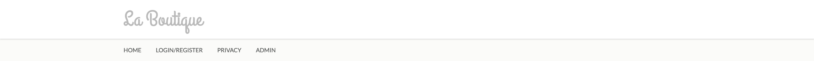
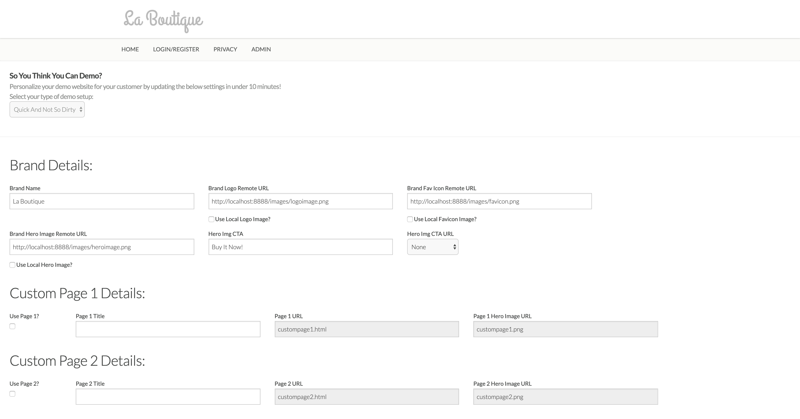
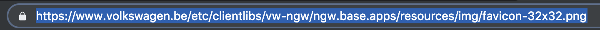
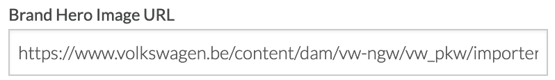
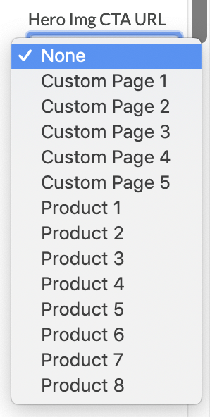
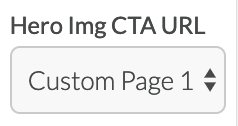
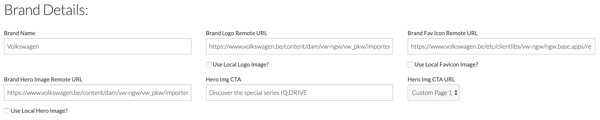

### Exercise 2XL.4: Build your fully functional and personalized e-commerce demo in 30 minutes

In the Full E-commerce Ready-setup, the goal is to update the template of the demo website to match your personal brand in a full, e-commerce ready environment where Product Views, Add-To-Cart, Checkout and Purchase events are working fine.

**VERY IMPORTANT FOR YOU**

**For your exercise, please pick any brand that you can think of. It's important that everyone selects a brand of their own choice and builds out the demo environment for their own brand. Think of a customer that you'd like to introduce to Platform, and think of use-cases that could be interesting for that customer.**

For this exercise, I'll be using H&M as my brand to prepare my live demo site.

Go to the homepage of your "La Boutique" website.

In the menu, click on "Admin".

First of all, you have to select the type of demo you want to build:
- Quick And Not So Dirty
- Full E-Commerce Ready

For this exercise, you should choose the **Full E-Commerce Ready** setup type.

For the Full E-Commerce Ready setup, you need to update 3 things:

  * Brand Details
  * Custom Page Details
  * Product Details (up to 8 products)

### Exercise 2B.4.1 - Customize: Brand Settings

The brand I've chosen for my Quick And Not So Dirty demo is Volkswagen. Let's now customize the Brand Settings for Volkswagen.

  * Brand Name: 

    Update the Brand Name to "Volkswagen"

    
  
  * Brand Logo URL

    I need find an Image URL of the Volkswagen logo. What better  place to do that then to go to the Volkswagen website?
On the homepage of http://www.vw.be, I can see the Volkswagen logo and by right-clicking on the logo, I can select "Copy Image Address".

    

    After copying the Image Address, let's go back to the "Admin"-page and past the the Image Address in the Brand Logo URL input field.
  
    

  * Brand Fav Icon URL

    I need to find the favicon of Volkswagen. The best place to find the favicon, is on the Volkswagen website, and on that website I'm very likely to find the favicon-URL in the Page Source. To go into the Page Source, I need to right-click on the webpage (TIP: don't right-click on an image, you won't see the option "View Page Source". You need to right-click on a 'normal' HTML-element.

    
  
    In the Page Source - screen, I search for the word "favicon" to find the reference to the favicon.

    
    
    If you have multiple favicon-urls being returned, select the one with the highest resolution, in this case, 32x32.
    
    
    
    I clicked on that short url and now I'm seeing the specific favicon in a new tab, with access to the full URL of the favicon.
    
    
    
    I'm selecting the full URL in the browser and copying it.
    
    
    
    By going back to the Admin page, I can now paste the URL in the Brand Fav Icon URL input field.
    
    

  * Brand Hero Image URL

    I want a beautiful hero image on the homepage of my Volkswagen-branded demo site. To be as relevant as possible, I'll go onto the Volkswagen website and copy their current hero image.
    So on the VW-website, I'm right-clicking on the hero image and clicking "Copy Image Address".
    
    
    
    After copying the hero image address, I can paste it in the Brand Hero Image URL input field on the Admin-page of my website.
    
    
    
  * Hero Img CTA

    Every great hero image needs a great CTA. In my case, I'll copy the CTA from the Volkswagen-website and turn it into "Discover the special series IQ.DRIVE" and enter that in the Hero Img CTA input-field.
    
    
    
  * Hero Img CTA URL

    When someone clicks on my hero image, they should be sent to a next page. In the Hero Img CTA URL dropdown-list, I'm able to select an existing page in my custom demo project. In this Quick And Not So Dirty demo project, I should only select one of the Custom Pages. I'll pick Custom Page 1, and in the next step I'll update what's being shown on Custom Page 1.
    
    
    
    
    
I've now finished configuring my Brand Details. The full new settings look like this:

Let's set up the custom pages now.

[Go Back to Module 2XL](../README.md)

[Go Back to All Modules](/../../)

