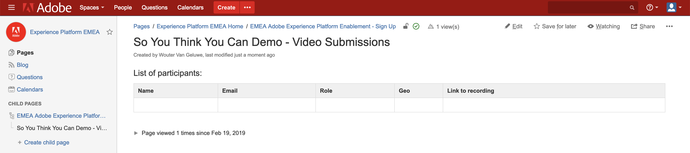

### So You Think You Can Demo: Instructions to submit your video

#### Expectations:
Please consider the following guidelines for the creation of your SYTYCD-video submission:

  * Your video should focus on the business value of what the Unified Profile brings to a brand. Your video should _not_ be about the technical features and functions at all.
  * If you're a Solution Consultant, the context is that you're presenting to a brand to evangelize what Adobe Experience Platform means to them and how it will impact them. You're in a competitive sales pitch and in the 5 minutes that you have, you need to clearly explain why Adobe Experience Platform is a must for your brand by articulating the benefits against a use-case background.
  * If you're a Consultant, the context is that you're speaking to an existing customer who already has some Adobe solutions. Your mission is to use these 5 minutes as an elevator pitch to evangelize to your customer what the impact will be on their Adobe setup and how it will benefit them.
  * Your video should not be longer than 5 minutes
  * Please respect the Adobe Experience Platform Branding Guidelines as documented here: [Adobe\_Experience\_Platform\_Guidelines.pdf](./downloads/Adobe_Experience_Platform_Guidelines.pdf)

If you want to be inspired by what has been done before, have a look here: [https://wiki.corp.adobe.com/display/expplatformemea/EMEA+Personalized+Customer+Demo%27s+-+Adobe+Experience+Platform](https://wiki.corp.adobe.com/display/expplatformemea/EMEA+Personalized+Customer+Demo%27s+-+Adobe+Experience+Platform)

If you need help or inspiration, please contact Wouter Van Geluwe on vangeluw@adobe.com

#### Video submission
To submit your video, go to [https://wiki.corp.adobe.com/display/expplatformemea/So+You+Think+You+Can+Demo+-+Video+Submissions](https://wiki.corp.adobe.com/display/expplatformemea/So+You+Think+You+Can+Demo+-+Video+Submissions)

Enter your name, email-address, role, geo and the link to your recording. 

The link of your recording can be to a shared Dropbox file, Sharepoint location or even an unlisted YouTube video.

[Go Back to Module 2 Bonus](../README.md)

[Go Back to All Modules](/../../)

