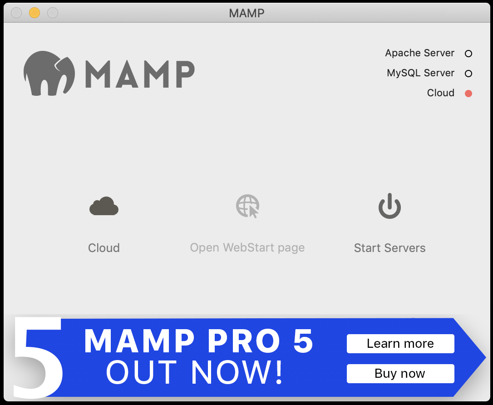
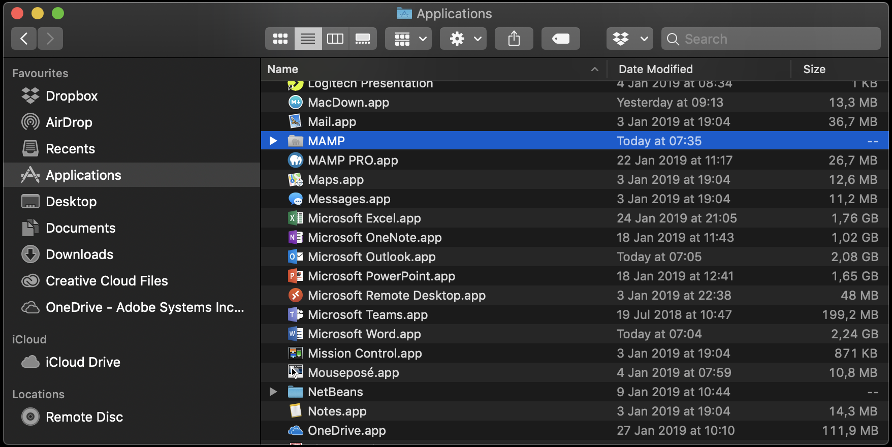
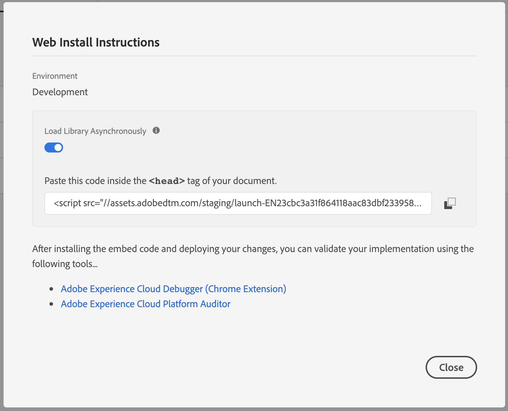

### Exercise 3.1 - Update your demo website template


In this exercise, the goal is to update your demo website - template to the latest standard of the SYTYCD-website, which makes it now really easy to be customised and personalized for your customer.

Download the [new version of the SYTYCD-website zip package](./downloads/sytycd_demo_site_v1.zip) to your computer, unzip it in a directory of your choice, f.i. on your Desktop:


**Mac:** Go to Launchpad and click on the grey MAMP-icon to start MAMP.

**Windows:** Go to your Windows Desktop and double-click on the grey MAMP-icon to start MAMP.


MAMP will start and you'll see the below screen.



Click on Start Servers to start MAMP.


Servers are now running, and you can access the Start Page by clicking on 'Open WebStart page'.


Currently, the old version of the 'La Boutique' demo site is installed in MAMP. You need to delete that and replace it with the new version of the SYTYCD - website.

**Windows:** On you Windows machine, go directly to C:\MAMP\htdocs

**Mac:** On your MacBook, go to Applications and locate the MAMP folder in the Applications list.



**Only for Mac:** Double-click to go in the MAMP-folder.


**Only for Mac:** Open the folder 'htdocs'.


**Fot both Windows and Mac:** Delete all files in this folder.


Go to the folder where you unzipped the zip-package of the new version of the SYTYCD - website. Copy all files and paste them in the 'htdocs' folder.


Go back to your web browser.


Click on ```My Website``` to navigate to the new Platform demo website.

You should now see the ```Admin``` - page of the new SYTYCD website:


This is the visual confirmation that you've loaded the newest version of the SYTYCD - website.

To load one of the generic demo - brands, click on ```Select Brand```.


On the next page, wait 1-2 seconds and select any of the available generic demo-brands from the dropdown


Click ```Save``` to save your brand selection. 


You'll see a spinner on your screen and after 10 seconds, you'll see the configuration of the brand that you selected.


Let's re-install your Launch tag on the SYTYCD-website.

Go to [https://launch-demo.adobe.com/](https://launch-demo.adobe.com/) and login with your personal login details.

Open the Launch-property that you built in one of the previous modules. This Launch-property is called ```La Boutique - ldap``` (replace ldap with your ldap).

To find your development-library tag, navigate to the "Environments"-tab in the Launch UI.


Locate your Development Environment, and click on the "Install"-icon on the right side of the screen:


You'll see a screen like this one, which contains the tag to implement on the website:



Copy the <head> tag.

**On Mac** Go to the folder Applications > MAMP > htdocs > js and locate the launch.js file

**On Windows** Go to the folder C:\MAMP\htdocs\js and locate the launch.js file


Open the file launch.js in your favourite text editor.


Go to Line 1, where you'll see the following:

```javascript
var launchTagUrl = ""
```

On Line 1, replace "" with your launch tag:


This should be the result:

```javascript
var launchTagUrl = "//assets.adobedtm.com/staging/launch-EN23xxxxxxxxxxxxxxxxxxxxxxxxx-development.min.js"
```


Save your changes in the launch.js file and reload your website.

After this change, the new version of the demo website template is ready and will load your Launch configuration again!

Let's now optimize and clean up your Launch code.

[Next Step: Update Launch Configuration & X-ray panel](./ex2.md)

[Go Back to Module 3](./README.md)

[Go Back to All Modules](../README.md)


