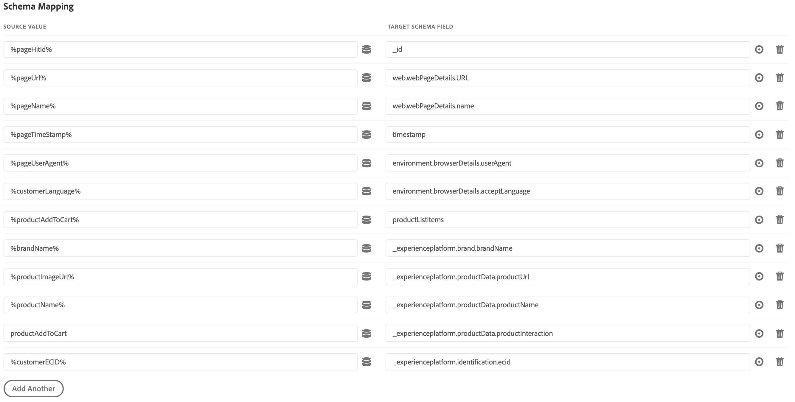
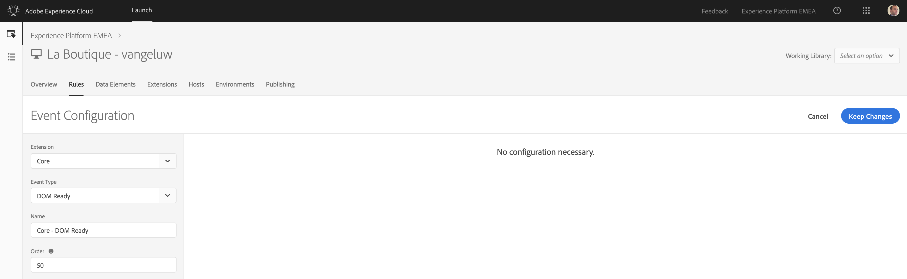
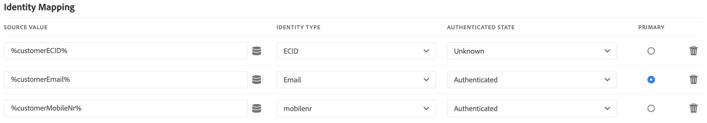
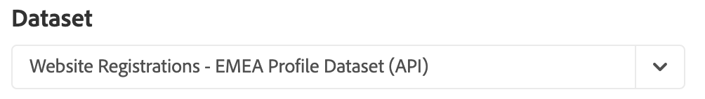

### Exercise 3.2: Update Launch Configuration & X-ray panel

Go to [https://launch-demo.adobe.com/](https://launch-demo.adobe.com/) and login with your personal login details. Select your own company.


### Exercise 3.2.1 - Update Data Elements
Since everybody loves creating data elements... for the new demo-website template, there are a number of new data elements to configure in Launch.
 
So first of all, you need to update your Launch configuration with new data elements to send this new information to Platform.

The following data elements need to be added to the registration page:

| Field Name              | 
|:-----------------------:| 
| brandName               |  
| callFeeling             | 
| callFromNumber          | 
| callInteraction         | 
| callTopic               | 
| contractCancelled       | 
| customerChurnScore      | 
| customerEstimatedAge    | 
| customerEstimatedEmotion|  
| customerEstimatedEyeMakeup|  
| customerEstimatedGender |  
| customerEstimatedGlasses| 
| customerEstimatedLipMakeup|
| customerOptInDirectMail |
| customerOptInEmail      |
| customerOptInPhone      |
| customerOptInSms        |  
| customerReLoggedIn      | 
| loadXray                |  
| productAddToCart        |  
| productProductView      | 
| purchaseCart            |  
| purchaseCurrency        | 
| purchaseOrderId         | 
| purchasePaymentType     | 
| purchaseTotalAmount     |
| testdriveCarType        |
| testdriveDate           |
| testdriveDealer         |
| testdriveTime           |

As a consequence, you'll have to build new data elements to capture the values customers enter in those fields.

Go to [https://launch-demo.adobe.com/](https://launch-demo.adobe.com/) and login with your personal login details.

In the Launch UI, go to Data Elements and click on ```Add Data Element```.


The first data element will be **brandName**. When you select a brand to demo from the new ```Admin``` - menu, the brandName will be sent to Adobe Experience Platform.

| Name              | Extension     | Data Element Type  | Local Storage Item Name | Storage Duration |
| ----------------- |:-------------:| :-----------------:| :----------------------:| :--------------: |
| brandName | Core          | Local Storage      | brandName               | Pageview          |


Save your new data element.


The next data element will be **callFeeling**. When a customer has called the call center, this data element will store the customer feeling that was logged by the call center employee.

| Name              | Extension     | Data Element Type  | Local Storage Item Name | Storage Duration |
| ----------------- |:-------------:| :-----------------:| :----------------------:| :--------------: |
| callFeeling | Core          | Local Storage      | callFeeling               | None          |


Save your new data element.

The next data element will be **callFromNumber**. When a customer calls the call center, this data element will store the phone number of that customer.

| Name              | Extension     | Data Element Type  | Local Storage Item Name | Storage Duration |
| ----------------- |:-------------:| :-----------------:| :----------------------:| :--------------: |
| callFromNumber | Core          | Local Storage      | callFromNumber               | None          |


Save your new data element.

The next data element will be **callInteraction**. When a customer calls the call center, this data element will store the type of interaction.

| Name              | Extension     | Data Element Type  | Local Storage Item Name | Storage Duration |
| ----------------- |:-------------:| :-----------------:| :----------------------:| :--------------: |
| callInteraction | Core          | Local Storage      | callInteraction               | None          |


Save your new data element.

The next data element will be **callTopic**. When a customer calls the call center, this data element will store the topic of that call.

| Name              | Extension     | Data Element Type  | Local Storage Item Name | Storage Duration |
| ----------------- |:-------------:| :-----------------:| :----------------------:| :--------------: |
| callTopic | Core          | Local Storage      | callTopic               | None          |


Save your new data element.

The next data element will be **contractCancelled**. When a customer cancels, the data element will store the cancellation status.

| Name              | Extension     | Data Element Type  | Local Storage Item Name | Storage Duration |
| ----------------- |:-------------:| :-----------------:| :----------------------:| :--------------: |
| contractCancelled | Core          | Local Storage      | contractcancelled               | None          |


Save your new data element.

The next data element will be **customerChurnScore**. In this data element we'll store the churn score so we can tell the Sensei Services story. This is a simulation for now.

| Name              | Extension     | Data Element Type  | Local Storage Item Name | Storage Duration |
| ----------------- |:-------------:| :-----------------:| :----------------------:| :--------------: |
| customerChurnScore | Core          | Local Storage      | churnscore               | None          |


Save your new data element.


The next data element will be **customerEstimatedAge**. When a customer takes a picture with his webcam when creating an account, this picture will be analysed by Microsoft's Cognitive Services (Face Detection) and the customer's estimated age will be stored in this data element.

| Name              | Extension     | Data Element Type  | Local Storage Item Name | Storage Duration |
| ----------------- |:-------------:| :-----------------:| :----------------------:| :--------------: |
| customerEstimatedAge | Core          | Local Storage      | profileEstimatedAge               | None          |


Save your new data element.

The next data element will be **customerEstimatedEmotion**. When a customer takes a picture with his webcam when creating an account, this picture will be analysed by Microsoft's Cognitive Services (Face Detection) and the customer's estimated emotion will be stored in this data element.

| Name              | Extension     | Data Element Type  | Local Storage Item Name | Storage Duration |
| ----------------- |:-------------:| :-----------------:| :----------------------:| :--------------: |
| customerEstimatedEmotion | Core          | Local Storage      | profileEstimatedEmotion               | None          |


Save your new data element.

The next data element will be **customerEstimatedEyeMakeup**. When a customer takes a picture with his webcam when creating an account, this picture will be analysed by Microsoft's Cognitive Services (Face Detection) and if the face detection service detects Eye Makeup, the value ```true``` will be stored in this data element. In the other case, ```false``` will be stored.

| Name              | Extension     | Data Element Type  | Local Storage Item Name | Storage Duration |
| ----------------- |:-------------:| :-----------------:| :----------------------:| :--------------: |
| customerEstimatedEyeMakeup | Core          | Local Storage      | profileEstimatedEyeMakeup               | None          |


Save your new data element.

The next data element will be **customerEstimatedGender**. When a customer takes a picture with his webcam when creating an account, this picture will be analysed by Microsoft's Cognitive Services (Face Detection) and the estimated gender will be stored in this data element.

| Name              | Extension     | Data Element Type  | Local Storage Item Name | Storage Duration |
| ----------------- |:-------------:| :-----------------:| :----------------------:| :--------------: |
| customerEstimatedGender | Core          | Local Storage      | profileEstimatedGender               | None          |


Save your new data element.

The next data element will be **customerEstimatedGlasses**. When a customer takes a picture with his webcam when creating an account, this picture will be analysed by Microsoft's Cognitive Services (Face Detection) and if the face detection service detects that the customer is wearing glasses, the type of glasses will be stored in this data element. 

| Name              | Extension     | Data Element Type  | Local Storage Item Name | Storage Duration |
| ----------------- |:-------------:| :-----------------:| :----------------------:| :--------------: |
| customerEstimatedGlasses | Core          | Local Storage      | profileEstimatedGlasses               | None          |


Save your new data element.

The next data element will be **customerEstimatedLipMakeup**. When a customer takes a picture with his webcam when creating an account, this picture will be analysed by Microsoft's Cognitive Services (Face Detection) and if the face detection service detects Lip Makeup, the value ```true``` will be stored in this data element. In the other case, ```false``` will be stored.

| Name              | Extension     | Data Element Type  | Local Storage Item Name | Storage Duration |
| ----------------- |:-------------:| :-----------------:| :----------------------:| :--------------: |
| customerEstimatedLipMakeup | Core          | Local Storage      | profileEstimatedLipMakeup               | None          |


Save your new data element.

The next data element will be **customerOptInDirectMail**. When a customer decides to opt in or opt out, this preference will be stored in this data element.

| Name              | Extension     | Data Element Type  | Local Storage Item Name | Storage Duration |
| ----------------- |:-------------:| :-----------------:| :----------------------:| :--------------: |
| customerOptInDirectMail | Core          | Local Storage      | optin_dm               | Session          |


Save your new data element.

The next data element will be **customerOptInEmail**. When a customer decides to opt in or opt out, this preference will be stored in this data element.

| Name              | Extension     | Data Element Type  | Local Storage Item Name | Storage Duration |
| ----------------- |:-------------:| :-----------------:| :----------------------:| :--------------: |
| customerOptInEmail | Core          | Local Storage      | optin_email               | Session          |


Save your new data element.

The next data element will be **customerOptInPhone**. When a customer decides to opt in or opt out, this preference will be stored in this data element.

| Name              | Extension     | Data Element Type  | Local Storage Item Name | Storage Duration |
| ----------------- |:-------------:| :-----------------:| :----------------------:| :--------------: |
| customerOptInPhone | Core          | Local Storage      | optin_phone               | Session          |


Save your new data element.

The next data element will be **customerOptInSms**. When a customer decides to opt in or opt out, this preference will be stored in this data element.

| Name              | Extension     | Data Element Type  | Local Storage Item Name | Storage Duration |
| ----------------- |:-------------:| :-----------------:| :----------------------:| :--------------: |
| customerOptInSms | Core          | Local Storage      | optin_sms               | Session          |


Save your new data element.

The next data element will be **customerReLoggedIn**. When a customer logs in again, the data element will store the re-logged in status.

| Name              | Extension     | Data Element Type  | Local Storage Item Name | Storage Duration |
| ----------------- |:-------------:| :-----------------:| :----------------------:| :--------------: |
| customerReLoggedIn | Core          | Local Storage       | reloggedin               | Pageview          |


Save your new data element.

The next data element will be **loadXray**. This is used to control on which pages the X-Ray panel will load.

| Name              | Extension     | Data Element Type  | JavaScript Variable Name | Storage Duration |
| ----------------- |:-------------:| :-----------------:| :----------------------:| :--------------: |
| loadXray | Core          | JavaScript Variable     | digitalData.page.loadxray                | Pageview          |


Save your new data element.

The next data element we need is called **productAddToCart**. When a customer adds a product to their cart, this data element will store the add-to-cart information.

| Name          | Extension     | Data Element Type  | Storage Duration |
| ------------- |:-------------:| :-----------------:| :--------------: |
| productAddToCart  | Core          | Custom Code        | Pageview          |
    


Open the Editor by clicking on ```Open Editor```.

This is the custom code to enter here:

```javascript
return JSON.parse(localStorage.getItem("thisAddToCart"));
```


Save your code fragment and then click "Save" again to save your data element configuration.


The next data element we need is called **productProductView**. When a customer view a product, this data element will store the product view information.

| Name          | Extension     | Data Element Type  | Storage Duration |
| ------------- |:-------------:| :-----------------:| :--------------: |
| productProductView  | Core          | Custom Code        | Pageview          |
    


Open the Editor by clicking on ```Open Editor```.

This is the custom code to enter here:

```javascript
return JSON.parse(localStorage.getItem("thisProductView"));
```


Save your code fragment and then click "Save" again to save your data element configuration.


The next data element we need is called **purchaseCart**. When a customer makes an order, the data element will store the full cart information.

| Name          | Extension     | Data Element Type  | Storage Duration |
| ------------- |:-------------:| :-----------------:| :--------------: |
| purchaseCart  | Core          | Custom Code        | None          |
    


Open the Editor by clicking on ```Open Editor```.

This is the custom code to enter here:

```javascript
return JSON.parse(localStorage.getItem("cartP"));
```


Save your code fragment and then click "Save" again to save your data element configuration.

The next data element will be **purchaseCurrency**. When a customer makes an order, the data element will store the currency of the order.

| Name              | Extension     | Data Element Type  | Local Storage Item Name | Storage Duration |
| ----------------- |:-------------:| :-----------------:| :----------------------:| :--------------: |
| purchaseCurrency | Core          | Local Storage      | brandcurrency               | None          |


Save your new data element.

The next data element will be **purchaseOrderId**. When a customer makes an order, the data element will store the purchase order ID.

| Name              | Extension     | Data Element Type  | Local Storage Item Name | Storage Duration |
| ----------------- |:-------------:| :-----------------:| :----------------------:| :--------------: |
| purchaseOrderId | Core          | Local Storage      | orderId               | None          |


Save your new data element.

The next data element will be **purchasePaymentType**. When a customer makes an order, the data element will store the payment type.

| Name              | Extension     | Data Element Type  | Local Storage Item Name | Storage Duration |
| ----------------- |:-------------:| :-----------------:| :----------------------:| :--------------: |
| purchasePaymentType | Core          | Local Storage      | paymentType               | None          |


Save your new data element.

The next data element we need is called **purchaseTotalAmount**. When a customer makes an order, the data element will store the total purchase amount.

| Name          | Extension     | Data Element Type  | Storage Duration |
| ------------- |:-------------:| :-----------------:| :--------------: |
| purchaseTotalAmount  | Core          | Custom Code        | None          |
    


Open the Editor by clicking on ```Open Editor```.

This is the custom code to enter here:

```javascript
return Number(localStorage.totalAmount)
```


Save your code fragment and then click "Save" again to save your data element configuration.

The next data element will be **testdriveCarType**. When a customer makes an appointment for a test drive, the data element will store the car type.

| Name              | Extension     | Data Element Type  | Local Storage Item Name | Storage Duration |
| ----------------- |:-------------:| :-----------------:| :----------------------:| :--------------: |
| testdriveCarType | Core          | Local Storage      | testdriveCarType               | Pageview          |


Save your new data element.

The next data element will be **testdriveDate**. When a customer makes an appointment for a test drive, the data element will store the date of the appointment.

| Name              | Extension     | Data Element Type  | Local Storage Item Name | Storage Duration |
| ----------------- |:-------------:| :-----------------:| :----------------------:| :--------------: |
| testdriveDate | Core          | Local Storage      | testdriveDate               | Pageview          |


Save your new data element.

The next data element will be **testdriveDealer**. When a customer makes an appointment for a test drive, the data element will store the dealer name.

| Name              | Extension     | Data Element Type  | Local Storage Item Name | Storage Duration |
| ----------------- |:-------------:| :-----------------:| :----------------------:| :--------------: |
| testdriveDealer | Core          | Local Storage      | testdriveDealer               | Pageview          |


Save your new data element.

The next data element will be **testdriveTime**. When a customer makes an appointment for a test drive, the data element will store the time of the appointment.

| Name              | Extension     | Data Element Type  | Local Storage Item Name | Storage Duration |
| ----------------- |:-------------:| :-----------------:| :----------------------:| :--------------: |
| testdriveTime | Core          | Local Storage      | testdriveTime               | Pageview          |


Save your new data element.

You've now finished configuring the required data elements (for now :-) ).


### Exercise 3.2.2 - Update Rules

### Exercise 3.2.2.1 - Create Rule: Add To Cart

In the Launch UI, go to Rules.


Click on ```Add Rule```.

 

As a name for this rule, let's use ```Add To Cart```.


We need to configure an Event to trigger this rule, so let's click on the + icon to Add an Event.


Our rule should only fire when called directly, which happens when a customer adds a product to their cart.

| Extension     | Event Type       | Name             | Identifier             |
|:-------------:| :---------------:| :--------------: | :--------------: |
| Core          | Direct Call | Core - Direct Call | addtocart |


Click "Keep Changes" to save your Event Configuration.

(If you plan on taking a pause here, don't forget to click "Save" to save your changes.)

After defining the event, you should now define the Action to be taken.

To add an action, click on the ```+ Add``` - button.


The action to configure will be to send the beacon to Platform, by configuring the options as follows:

| Extension                   | Action Type      | Name                                    |
|:---------------------------:| :---------------:| :-------------------------------------: |
| Adobe Experience Platform   | Send Beacon      | Adobe Experience Platform - Send Beacon |

After selecting the Platform - Send Beacon option, a dataset needs to be selected. In Exercise 1.2.4, we defined the 2 datasets to use:

* Website Interaction Dataset name: 
  
  * **Website Interactions - EMEA EE Dataset (API)**

* Website Registration name: 
  
  * **Website Registrations - EMEA Profile Dataset (API)**

In this case, we need to select the ```Website Interactions - EMEA EE Dataset (API)``` - dataset from the dropdown-list.


Next, in, Identity Mapping, you need to define a Primary Identifier for this dataset. Our primary identifier for Experience Events will be the Experience Cloud ID. Configure your Identity Mapping as follows:


In Schema Mapping, there's a visual way of selecting XDM-fields. By clicking on this icon:

 

With a click on that icon, you're able to open up the XDM Schema that is linked to the dataset **Website Interactions - EMEA EE Dataset (API)**.


In Schema Mapping, You need to add the following Keys and Values to the Send Beacon-action:

| Source Value                 | Target Schema Field               |
|:-------------------------------------------| :------------------ |
|%pageHitId%|_id| 
|%pageUrl%|web.webPageDetails.URL|
|%pageName%|web.webPageDetails.name|
|%pageTimeStamp%|timestamp|
|%pageUserAgent%|environment.browserDetails.userAgent|
|%customerLanguage%|environment.browserDetails.acceptLanguage|
|%productAddToCart%|productListItems|
|%brandName%|_experienceplatform.brand.brandName|
|%productImageUrl%|_experienceplatform.productData.productUrl|
|%productName%|_experienceplatform.productData.productName|
|productAddToCart|_experienceplatform.productData.productInteraction|
|%customerECID%|_experienceplatform.identification.ecid|



Attention! Check your configuration of the Keys to be sure that after copying, no extra spaces are added in the keys as this will generate errors in Platform.

Click ```Keep Changes``` to save your Action.

Click ```Save```to save your changes.


### Exercise 3.2.2.2 - Create Rule: Purchase Confirmation

In the Launch UI, go to Rules.


Click on ```Add Rule```.

 

As a name for this rule, let's use ```Purchase Confirmation```.


We need to configure an Event to trigger this rule, so let's click on the + icon to Add an Event.


Our rule should fire on a page, when the page has completely loaded.

| Extension     | Event Type       | Name             |
|:-------------:| :---------------:| :--------------: |
| Core          | Core - DOM Ready | Core - DOM Ready |



Click "Keep Changes" to save your Event Configuration.

(If you plan on taking a pause here, don't forget to click "Save" to save your changes.)

Now we need to add a condition so that this Rule only fires on the General Pages. Click on the + icon to add a Condition


Our rule should only fire on the General pages, so we're reading out the Site Section information from the datalayer and are comparing it to find the pages that are classified as General.

| Logic Type    | Extension     | Condition Type       | Name             | Return true if       | Equals |
|:-------------:|:-------------:| :-------------------:| :--------------: | :------------------------------: | :-----------: |
| Regular       | Core          | Value Comparison             | Core - Value Comparison  | %pageType% | Purchase      |


Click "Keep Changes" to save your Event Condition.

(If you plan on taking a pause here, don't forget to click "Save" to save your changes.)

After the Event and Condition, we can now define Actions to be taken.


To add an action, click on the ```+ Add``` - button.


The action to configure will be to send the beacon to Platform, by configuring the options as follows:

| Extension                   | Action Type      | Name                                    |
|:---------------------------:| :---------------:| :-------------------------------------: |
| Adobe Experience Platform   | Send Beacon      | Adobe Experience Platform - Send Beacon |

After selecting the Platform - Send Beacon option, a dataset needs to be selected. In Exercise 1.2.4, we defined the 2 datasets to use:

* Website Interaction Dataset name: 
  
  * **Website Interactions - EMEA EE Dataset (API)**

* Website Registration name: 
  
  * **Website Registrations - EMEA Profile Dataset (API)**

In this case, we need to select the ```Website Interactions - EMEA EE Dataset (API)``` - dataset from the dropdown-list.


Next, in, Identity Mapping, you need to define a Primary Identifier for this dataset. Our primary identifier for Experience Events will be the Experience Cloud ID. Configure your Identity Mapping as follows:


In Schema Mapping, there's a visual way of selecting XDM-fields. By clicking on this icon:

 

With a click on that icon, you're able to open up the XDM Schema that is linked to the dataset **Website Interactions - EMEA EE Dataset (API)**.


In Schema Mapping, You need to add the following Keys and Values to the Send Beacon-action:

| Source Value                 | Target Schema Field               |
|:-------------------------------------------| :------------------ |
|%pageHitId%|_id| 
|%pageUrl%|web.webPageDetails.URL|
|%pageName%|web.webPageDetails.name|
|%pageTimeStamp%|timestamp|
|%pageUserAgent%|environment.browserDetails.userAgent|
|%purchasePaymentType%|commerce.order.payments[0].paymentType|
|%purchaseCurrency%|commerce.order.payments[0].currencyCode|
|%purchaseTotalAmount%|commerce.order.payments[0].paymentAmount|
|%purchaseOrderId%|commerce.order.payments[0].transactionID|
|%purchaseTotalAmount%|commerce.order.priceTotal|
|%purchaseCurrency%|commerce.order.currencyCode|
|%purchaseOrderId%|commerce.order.purchaseOrderNumber|
|%customerLanguage%|environment.browserDetails.acceptLanguage|
|%purchaseCart%|productListItems|
|%brandName%|_experienceplatform.brand.brandName|
|productPurchase|_experienceplatform.productData.productInteraction|
|%customerECID%|_experienceplatform.identification.ecid|

(FYI: For the Target Schema Fields that reference ```commerce.order.payments[0].```, you should copy and paste the Target Schema Fields into the Launch window. It's not possible to select the [0] through the XDM Schema UI.)


Attention! Check your configuration of the Keys to be sure that after copying, no extra spaces are added in the keys as this will generate errors in Platform.

Click ```Keep Changes``` to save your Action.

Click ```Save```to save your changes.

### Exercise 3.2.2.3 - Create Rule: Call Center Interaction

In the Launch UI, go to Rules.


Click on ```Add Rule```.

 

As a name for this rule, let's use ```Call Center Interaction```.


We need to configure an Event to trigger this rule, so let's click on the + icon to Add an Event.


Our rule should only fire when called directly, which happens when a customer adds a product to their cart.

| Extension     | Event Type       | Name             | Identifier             |
|:-------------:| :---------------:| :--------------: | :--------------: |
| Core          | Data Element Change | Core - Data Element Change | callInteraction |


Click "Keep Changes" to save your Event Configuration.

(If you plan on taking a pause here, don't forget to click "Save" to save your changes.)

After defining the event, you should now define the Action to be taken.

To add an action, click on the ```+ Add``` - button.


The action to configure will be to send the beacon to Platform, by configuring the options as follows:

| Extension                   | Action Type      | Name                                    |
|:---------------------------:| :---------------:| :-------------------------------------: |
| Adobe Experience Platform   | Send Beacon      | Adobe Experience Platform - Send Beacon |

After selecting the Platform - Send Beacon option, a dataset needs to be selected. 

In this exercise, we need to select the ```EMEA Call Center Interactions``` - dataset from the dropdown-list.


Next, in, Identity Mapping, you need to define a Primary Identifier for this dataset. Our primary identifier for Experience Events will be the Mobile Number. Configure your Identity Mapping as follows:


In Schema Mapping, there's a visual way of selecting XDM-fields. By clicking on this icon:

 

With a click on that icon, you're able to open up the XDM Schema that is linked to the dataset **EMEA Call Center Interactions**.


In Schema Mapping, You need to add the following Keys and Values to the Send Beacon-action:

| Source Value                 | Target Schema Field               |
|:-------------------------------------------| :------------------ |
|%pageHitId%|_id| 
|%pageTimeStamp%|timestamp|
|%callTopic%|_experienceplatform.callDetails.callTopic|
|%callFeeling%|_experienceplatform.callDetails.callFeeling|
|%contractCancelled%|_experienceplatform.callDetails.contractCancelled|
|%callInteraction%|_experienceplatform.callDetails.callInteractionType|
|%callFromNumber%|_experienceplatform.identification.mobilenr|


Attention! Check your configuration of the Keys to be sure that after copying, no extra spaces are added in the keys as this will generate errors in Platform.

Click ```Keep Changes``` to save your Action.


Click ```Save```to save your changes.

### Exercise 3.2.2.4 - Create Rule: Re-Login

In the Launch UI, go to Rules.


Click on ```Add Rule```.

 

As a name for this rule, let's use ```Re-Login```.


We need to configure an Event to trigger this rule, so let's click on the + icon to Add an Event.


Our rule should fire on a page, when the page has completely loaded.

| Extension     | Event Type       | Name             |
|:-------------:| :---------------:| :--------------: |
| Core          | Library Loaded (Page Top) | Core - Library Loaded (Page Top) |


Click "Keep Changes" to save your Event Configuration.

(If you plan on taking a pause here, don't forget to click "Save" to save your changes.)

Now we need to add 2 conditions so that this Rule only fires when someone is actually logging in again. Click on the + icon to add a first Condition


Your first condition is that the rule should only fire when someone is actually logging in again, so we're reading out a data element that is set to ```Yes``` when someone is logging in with an existing account.

| Logic Type    | Extension     | Condition Type       | Name             | Return true if       | Equals |
|:-------------:|:-------------:| :-------------------:| :--------------: | :------------------------------: | :-----------: |
| Regular       | Core          | Value Comparison             | Core - Value Comparison  | %customerReLoggedIn% | Yes      |


Your second condition is that the rule should only fire when someone actually has a valid email address, so we're reading out a data element that has the value ```Not Available``` if no valid email-address is available. This rule can as such only fire when an email-address is available.

| Logic Type    | Extension     | Condition Type       | Name             | Return true if       | Does Not Equal |
|:-------------:|:-------------:| :-------------------:| :--------------: | :------------------------------: | :-----------: |
| Regular       | Core          | Value Comparison             | Core - Value Comparison  | %customerEmail% | Not Available      |


Click "Keep Changes" to save your Event Condition.

(If you plan on taking a pause here, don't forget to click "Save" to save your changes.)

After the Event and Condition, we can now define Actions to be taken.


To add an action, click on the ```+ Add``` - button.


The action to configure will be to send the beacon to Platform, by configuring the options as follows:

| Extension                   | Action Type      | Name                                    |
|:---------------------------:| :---------------:| :-------------------------------------: |
| Adobe Experience Platform   | Send Beacon      | Adobe Experience Platform - Send Beacon |

After selecting the Platform - Send Beacon option, a dataset needs to be selected. In Exercise 1.2.4, we defined the 2 datasets to use:

* Website Interaction Dataset name: 
  
  * **Website Interactions - EMEA EE Dataset (API)**

* Website Registration name: 
  
  * **Website Registrations - EMEA Profile Dataset (API)**

In this case, we need to select the ```Website Interactions - EMEA EE Dataset (API)``` - dataset from the dropdown-list.


Next, in, Identity Mapping, you need to define a Primary Identifier for this dataset. Our primary identifier for Experience Events will be the Experience Cloud ID and you also need to set the secondary identifier to ```Email``` to make sure that the ECID and the Email get linked to eachother. Configure your Identity Mapping as follows:


In Schema Mapping, You need to add the following Keys and Values to the Send Beacon-action:

| Source Value                 | Target Schema Field               |
|:-------------------------------------------| :------------------ |
|%pageHitId%|_id| 
|%pageTimeStamp%|timestamp|
|%customerECID%|_experienceplatform.identification.ecid|


Attention! Check your configuration of the Keys to be sure that after copying, no extra spaces are added in the keys as this will generate errors in Platform.

Click "Keep Changes" to save your Action.

(If you plan on taking a pause here, don't forget to click "Save" to save your changes.)

Your second action for this rule will be the configuration of the Experience Cloud ID Service and the ID-sync between the ECID and the email ID, by configuring the Action as follows:

| Extension                   | Action Type        | Name                                           |
|:---------------------------:| :-----------------:| :--------------------------------------------: |
| Experience Cloud ID Service | Set Customer ID's  | Experience Cloud ID Service - Set Customer IDs |


The following variables need to be configured here:

| Integration Code       | Value             | Auth State        |
|:-----------------------| :---------------- | :---------------- |
| CustomerID             | %customerEmail%   | Authenticated     |


Click ```Keep Changes``` to save your Action.

Click ```Save``` to save your Rule Configuration.


### Exercise 3.2.2.5 - Create Rule: Test Drive Page

In the Launch UI, go to Rules.


Click on ```Add Rule```.

 

As a name for this rule, let's use ```Test Drive Page```.


We need to configure an Event to trigger this rule, so let's click on the + icon to Add an Event.


Our rule should only fire when called directly, which happens when a customer adds a product to their cart.

| Extension     | Event Type       | Name             | Identifier             |
|:-------------:| :---------------:| :--------------: | :--------------: |
| Core          | Direct Call | Core - Direct Call | testdrive |


Click "Keep Changes" to save your Event Configuration.

(If you plan on taking a pause here, don't forget to click "Save" to save your changes.)

After defining the event, you should now define the 2 Actions to be taken.

To add an action, click on the ```+ Add``` - button.


The first action to configure will be to send the beacon as an Experience Event to Platform, by configuring the options as follows:

| Extension                   | Action Type      | Name                                    |
|:---------------------------:| :---------------:| :-------------------------------------: |
| Adobe Experience Platform   | Send Beacon      | Adobe Experience Platform - Send Beacon |

After selecting the Platform - Send Beacon option, a dataset needs to be selected. In Exercise 1.2.4, we defined the 2 datasets to use:

* Website Interaction Dataset name: 
  
  * **Website Interactions - EMEA EE Dataset (API)**

* Website Registration name: 
  
  * **Website Registrations - EMEA Profile Dataset (API)**

In this case, we need to select the ```Website Interactions - EMEA EE Dataset (API)``` - dataset from the dropdown-list.


Next, in, Identity Mapping, you need to define a Primary Identifier for this dataset. Our primary identifier for Experience Events will be the Experience Cloud ID. Configure your Identity Mapping as follows:


In Schema Mapping, You need to add the following Keys and Values to the Send Beacon-action:

| Source Value                 | Target Schema Field               |
|:-------------------------------------------| :------------------ |
|%pageHitId%|_id| 
|%pageUrl%|web.webPageDetails.URL|
|%pageName%|web.webPageDetails.name|
|%pageTimeStamp%|timestamp|
|%pageUserAgent%|environment.browserDetails.userAgent|
|%customerLanguage%|environment.browserDetails.acceptLanguage|
|%brandName%|_experienceplatform.brand.brandName|
|%testdriveDate%|_experienceplatform.testDrive.testdriveDate|
|%testdriveTime%|_experienceplatform.testDrive.testdriveTime|
|%testdriveDealer%|_experienceplatform.testDrive.testdriveDealer|
|%testdriveCarType%|_experienceplatform.testDrive.testdriveCarType|
|%customerECID%|_experienceplatform.identification.ecid|


Attention! Check your configuration of the Keys to be sure that after copying, no extra spaces are added in the keys as this will generate errors in Platform.

Click "Keep Changes" to save your Action.

(If you plan on taking a pause here, don't forget to click "Save" to save your changes.)

Scroll down to ```Actions``` and click the ```+``` - icon to add a second action.


The second action to configure will be to send the beacon with Profile Information to Platform, by configuring the options as follows:

| Extension                   | Action Type      | Name                                    |
|:---------------------------:| :---------------:| :-------------------------------------: |
| Adobe Experience Platform   | Send Beacon      | Adobe Experience Platform - Send Beacon |

After selecting the Platform - Send Beacon option, a dataset needs to be selected. In Exercise 1.2.4, we defined the 2 datasets to use:

* Website Interaction Dataset name: 
  
  * **Website Interactions - EMEA EE Dataset (API)**

* Website Registration name: 
  
  * **Website Registrations - EMEA Profile Dataset (API)**

In this case, we need to select the ```Website Registrations - EMEA Profile Dataset (API)``` - dataset from the dropdown-list.


Next, in Identity Mapping, you need to define a Primary Identifier for this dataset. Our primary identifier for Experience Events will be the Email, while we have 2 secondary ID's as well with the ECID and the Mobile Number. Configure your Identity Mapping as follows:



In Schema Mapping, You need to add the following Keys and Values to the Send Beacon-action:

| Source Value                 | Target Schema Field               |
|:-------------------------------------------| :------------------ |
|%pageTimeStamp%|_repo.createDate|
|%customerLastName%|person.name.lastName|
|%customerFirstName%|person.name.firstName|
|%customerEmail%|_experienceplatform.identification.emailId|


Attention! Check your configuration of the Keys to be sure that after copying, no extra spaces are added in the keys as this will generate errors in Platform.

Click ```Keep Changes``` to save your Action.

Click ```Save``` to save your Rule.

### Exercise 3.2.2.6 - Update Rule: All Pages - Load X-ray

In the Launch UI, go to Rules.


Open your ```All Pages - Load X-ray```-rule.

You now have to add a Condition to this rule. The Condition will check if the X-Ray panel needs to be loaded on the page that's being loaded, by checking a data element.


| Logic Type    | Extension     | Condition Type       | Name             | Return true if       | Return true if |
|:-------------:|:-------------:| :-------------------:| :--------------: | :------------------------------: | :-----------: |
| Regular       | Core          | Value Comparison             | Core - Value Comparison  | %loadXray% | Is True      |


Click "Keep Changes" to save your Event Condition.

Open the action "Core - Custom Code"


In the "Core - Custom Code" - action, click on "Open Editor".


Select all the code that's there already, and delete it. Make sure that everything is gone completely.
When everything is deleted, paste the following code in the Editor.

```
<!--XRAY -->
<script>
$(".header").prepend('<div class="top"><ul style="list-style: none;float: left; display: inline; margin: 0; padding: 0;"><li><a class="mcx" href="#" style="color:white"><span id="xraypanel_header_aec_text" style="color:white; padding-left:10px;padding-right:5px;">Adobe Experience Platform</span><span id="xraypanel_header_xray_text" style="color:white">X-Ray</span></a></li></ul></div>');

$('body').append('<div id="x-ray-panel" class="at-element-marker hide"><div class="accounts" style="display: none;"><div style="display:inline-block;" id="approval_status-header"><ul class="nav navbar-nav navbar-left xray"><li style="display:inline-block;" id="adobe-link"><a href="#" class="link_text active"></a></li></ul></div></div><script id="xray-template" type="text/x-handlebars-template"><div id="approval_status-adobe"><ul class="link_list"><li id="aam_link" class="aam_link" style="display:none;"><button class="accordion" style="padding-left: 70px;">Audience Manager</button><div class="approved"><h4 class=""><span>CROSS-DEVICE</span></h4><h5>Profile Attributes</h5><span id="textaecsegments" class="analytics interest">{{cv}}</span><h5>Destinations</h5><span id="textaecdestinations" class="analytics">{{c}}</span></div></li><li id="aa_link" class="aa_link" style="display:none;"><button class="accordion" style="padding-left: 70px;">Analytics</button><div class="approved"><h4 class=""><span>Adobe Analytics</span></h4></div></li><li id="at_link" class="at_link" style="display:none;"><button class="accordion" style="padding-left: 70px;">Target</button><div class="approved"><h4 class=""><span>Adobe Target</span></h4></div></li><li id="acs_link" class="acs_link" style="display:none;"><button class="accordion" style="padding-left: 70px;">Campaign</button><div class="approved"><h4 class=""><span>Adobe Campaign</span></h4></div></li><li id="marketo_link" class="marketo_link" style="display:none;"><button class="accordion" style="padding-left: 70px;">Marketo</button><div class="approved"><h4 class=""><span>Lead Info</span></h4><span id="textmarketoleadid" class="analytics"></span><span id="textmarketocompany" class="analytics"></span><span id="textmarketofirstname" class="analytics"></span><span id="textmarketolastname" class="analytics"></span><span id="textmarketocarcolor" class="analytics"></span><span id="textmarketotestdrivedealer" class="analytics"></span><span id="textmarketotestdrivedate" class="analytics"></span></div></li><li id="platform_ups_link" class="acp_link" style="display:block;"><button class="accordion" style="padding-left: 70px;">Real Time Customer Profile</button><div class="approved"><br/>Identities:<span id="textecid" class="analytics"></span><span id="textuuid" class="analytics"></span><span id="textcrmid" class="analytics"></span><span id="textmobilenr" class="analytics"></span><span id="textmarketoid" class="analytics"></span><br/>Profile Information:<span id="platformFirstName" class="analytics"></span><span id="platformLastName" class="analytics"></span><span id="platformEmail" class="analytics"></span><span id="platformGender" class="analytics"></span><span id="platformAddress" class="analytics"></span><span id="platformCity" class="analytics"></span><span id="platformShoeSize" class="" style="display:none;font-weight:100;"></span><span id="platformShirtSize" class="" style="display:none;font-weight:100;"></span><span id="platformPreferredColor" class="" style="display:none;font-weight:100;"></span><br/><span id="platformPicture" class="analytics"></span></div></li><li id="platform_ee_link" class="acp_link" style="display:block;"><button class="accordion" style="padding-left: 70px;">Experience Events</button><div class="approved"><br/>Browse Activity:<table id="productViewActivity" style="width: 250px;font-size: 12px;"></table><br/>Product - Add To Cart:<table id="addToCartActivity" style="width: 250px;font-size: 12px;"></table><br/>Product - Purchases:<table id="purchaseActivity" style="width: 250px;font-size: 12px;"></table></div></li><li id="platform_sensei_link" class="acp_link" style="display:block;"><button class="accordion" style="padding-left: 70px;">Sensei Services</button><div class="approved"><br/><span id="platformChurnScore" class="analytics"></span></div></li></ul></div></div>');
    var xRayData = {};

    var source = $('#xray-template').html();
    template = Handlebars.compile(source);
    context = xRayData;
    html = template(context);
    contextCode = JSON.stringify(xRayData, null, 2);

    $('.accounts').append(html);
    $('.code code').text(contextCode);
    $('#x-ray-panel').prepend($('.accounts'));
    $('body').prepend($('#x-ray-panel'));
  
    $('li .mcx').click(function(){
        $('.accounts').toggle();
        $('.mcx').toggleClass('active');
    });
        
    $('#xray-open').click(function(){
        $('#xray-close').addClass('active').removeClass('hide');
        $('#xray-open').addClass('hide').removeClass('active');
        $('#x-ray-panel').addClass('active').removeClass('hide');      
    });
        
    $('#xray-close').click(function(){
        $('#xray-open').addClass('active').removeClass('hide');
        $('#xray-close').addClass('hide').removeClass('active');  
        $('#x-ray-panel').addClass('hide').removeClass('active');  
    });

    var acc = document.getElementsByClassName("accordion");
    var i;

    var browseActivity = document.getElementById("browseActivity");

    getAAMData();
    setTimeout(getEcId, 500);
  
    if(localStorage.getItem('brandUseMKT') === "true"){
      setTimeout(getMarketoId, 500);
      setTimeout(getMarketoLeadInfo, 700);
    }
    
    getAECData();
    setTimeout(getAEPProfileFromPlatform, 600);
    setTimeout(getAEPExperienceEventsFromPlatform, 600);

    for (i = 0; i < acc.length; i++) {
        acc[i].onclick = function(){
            // Toggle between adding and removing the "active" class, to highlight the button that controls the panel
            this.classList.toggle("active");

            // Toggle between hiding and showing the active panel
            var approved = this.nextElementSibling;
            if (approved.style.display === "block") {
                approved.style.display = "none";
            } else {
                approved.style.display = "block";
            }
        }
    }

    
$.ajaxSetup({
    async: false
});

function getAAMData() {
$.ajax(
  {
      url: "https://experienceplatform.demdex.net/event?d_ptfm=browser&d_rtbd=json&d_dst=1&d_cb=myCallbackAAM", 
      dataType : "jsonp",
      success: function(response) {
      },
      error: function(code, status, error) {
        //console.log("Error : " + error);
      }
    }
  );
}  

function myCallbackAAM(response) {
        localStorage.setItem("uuid", response.uuid);
        textuuid.innerHTML = "Audience Manager ID: </br>" + localStorage.uuid + "</br></br>";
        var dcs = response.dcs_region;
        var segments = response.stuff[0].cv;
        var destinations = response.dests;
        
        var destinationsstring = "";
        
        if(response.hasOwnProperty('dests')){
            for (index = 0; index < destinations.length; ++index) {
                var str = destinations[index].c;
                destinationsstring += "<div>" + str + "</div>" + "</br>";
                //console.log(destinations[index].c);
            }
        }
        else{
            destinationsstring = "- No Active Destinations";
        }
        
        var array = new Array();
        array = segments.split(',');
        textuuid.innerHTML = "Audience Manager ID: </br>" + localStorage.uuid + "</br></br>";
        var fLen = array.length;
        var segmentstring = "";
        for (i = 0; i < fLen; i++) {
            str = array[i];
            str = str.replace("segments=", "");
            segmentstring += "<div>" + "- " + str + "</div>";
        }
} 
  
function getMarketoLeadInfo() {
  if((localStorage.hasOwnProperty('email') && localStorage.getItem("email") !== "Not Available") || (localStorage.hasOwnProperty('pdf_email') && localStorage.getItem("pdf_email") !== "Not Available")){
    console.log("email is ok");
    var email = "";
    var mktEndpoint = _satellite.getVar("mktEndpoint");
    var mktFields = _satellite.getVar("mktFields");
    var mktClientId = _satellite.getVar("mktClientId");
    var mktClientSecret = _satellite.getVar("mktClientSecret");
    
    var pdf_email = localStorage.getItem("pdf_email");
    var reg_email = localStorage.getItem("email");
    if(reg_email == "Not Available"){
      email = pdf_email;
    }else{
      email = reg_email;
    }
    
    console.log("Retrieved email is: " + email);
    
    if(localStorage.hasOwnProperty('mktClientId') && mktClientId !== ""){
      /// Prepare to call Lambda function
              lambdaMarketo = new AWS.Lambda({region: 'us-west-2', apiVersion: '2015-03-31'});
              var pullMarketoLeadParams = {
                  FunctionName : 'getMarketoLeadInfo',
                  InvocationType : 'RequestResponse',
                  Payload: JSON.stringify({'email': email,'mktEndpoint' : mktEndpoint, 'mktFields' : mktFields, 'mktClientId' : mktClientId, 'mktClientSecret' : mktClientSecret}),
                  LogType : 'None'
              };
                  // Call the Lambda function to collect the spin results
                  lambdaMarketo.invoke(pullMarketoLeadParams, function(err, data) {
                      if (err) {
                          prompt(err);
                      } else {
                          pullMarketoLeadParams = JSON.parse(JSON.parse(data.Payload));
                          displayMarketoPull(pullMarketoLeadParams);
                      }
                  });
      }
    }else{
      console.log("no email available");
      }
  }
  
function displayMarketoPull(pullMarketoLeadParams) {
  //console.log("pullMarketoLeadParams: " + pullMarketoLeadParams);
  
  var leadId = JSON.stringify(pullMarketoLeadParams.result[0].id);
  
  var company = pullMarketoLeadParams.result[0].company;
  var firstName = pullMarketoLeadParams.result[0].firstName;
  var lastName = pullMarketoLeadParams.result[0].lastName;
  
  var testDriveDealer = pullMarketoLeadParams.result[0].testdrivedealername;
  var testDriveDate = pullMarketoLeadParams.result[0].testdrivedate;
  var testDriveTime = pullMarketoLeadParams.result[0].testdrivetime;
  var carColor = pullMarketoLeadParams.result[0].carcolor;
  
  console.log("Marketo Lead Id: " + leadId);
  //console.log("Company: " + company);
  //console.log("First Name: " + firstName);
  //console.log("Last Name: " + lastName);
  //console.log("Car Dealer: " + testDriveDealer);
  //console.log("Appointment: " + testDriveDate + " at " + testDriveTime);
  
  if(leadId !== "" && leadId !== "0"){
    textmarketoleadid.innerHTML = "Marketo Lead ID: " + leadId;
    if(typeof(company) !== "undefined"){textmarketocompany.innerHTML = "Company: " + company;}
    if(typeof(firstName) !== "undefined"){textmarketofirstname.innerHTML = "First Name: " + firstName;}
    if(typeof(lastName) !== "undefined"){textmarketolastname.innerHTML = "Last Name: " + lastName;}
    
    if(typeof(carColor) === "undefined" || carColor === "" || carColor === "0" || carColor === null){
      //do nothing 
    }else{
      textmarketocarcolor.innerHTML = "Preferred Car Color: " + carColor;
    }
    if(typeof(testDriveDealer) === "undefined" || testDriveDealer === "" || testDriveDealer === "0" || testDriveDealer === null){
      //do nothing 
    }else{
      textmarketotestdrivedealer.innerHTML = "Car Dealer: " + testDriveDealer;
      textmarketotestdrivedate.innerHTML = "Test Drive Appointment: " + testDriveDate + " at " + testDriveTime;
    }
  }
}
  
// get AEC data into X-ray Panel
function getAECData() {
    $.ajax(
        {
            url: "https://experienceplatformemea.sc.omtrdc.net/b/ss/epmeademoenvironment/10/JS-1.7.0-D6ZS/s16526409497834?AQB=1&ndh=1&pf=1&callback=s_c_il[1].doPostbacks&cid.&cusid.&id="+localStorage.crmid+"&as=1&.cusid&.cid&d.&nsid=0&jsonv=1&.d&mid="+ localStorage.ecid +"&aamlh=6&ce=UTF-8&ns=aamdemo&app", 
            dataType : "jsonp",
            success: function(response) {
                myCallbackAEC(response);
            },
            error: function(code, status, error) {
                //console.log("Error : " + error);
            }
        }
    );
}     
  
function myCallbackAEC(response) {
        var segments = response.stuff[0].cv;
        var destinations = response.dests;
        
        var destinationsstring = "";
        
        if(response.hasOwnProperty('dests')){
            for (index = 0; index < destinations.length; ++index) {
                var str = destinations[index].c;
                destinationsstring += "<div>" + str + "</div>" + "</br>";
                //console.log(destinations[index].c);
            }
        }
        else{
            destinationsstring = "- No Active Destinations";
        }
        
        var array = new Array();
        array = segments.split(',');
        var fLen = array.length;
        var segmentstring = "";
        for (i = 0; i < fLen; i++) {
            str = array[i];
            str = str.replace("segments=", "");
            segmentstring += "<div>" + "- " + str + "</div>";
        }
        
        textaecsegments.innerHTML = segmentstring;
        textaecdestinations.innerHTML = destinationsstring;
    }
    
function getEcId() {
    var ecid = _satellite.getVar("customerECID");
    localStorage.setItem("ecid", ecid);
    textecid.innerHTML = "Experience Cloud ID: </br>" + localStorage.ecid + "</br></br>";
}
function getMarketoId() {
    var marketoId = _satellite.getVar("customerMarketoId");
    localStorage.setItem("marketoId", marketoId);
    textmarketoid.innerHTML = "Marketo ID: </br>" + localStorage.marketoId + "</br></br>";
}
  
function getCrmId() {
    var crmid = localStorage.getItem("email");
    textcrmid.innerHTML = "EMAIL ID: </br>" + crmid + "</br></br>";
}
function getMobileNr() {
    var mobilenr = localStorage.getItem("mobilenr");
    textmobilenr.innerHTML = "Mobile Number ID: </br>" + mobilenr + "</br></br>";
}
  
function getAEPProfileFromPlatform(){
  
    $.ajax(
            {
                url: "https://adobeioruntime.net/api/v1/web/vangeluw/aep/getAEPProfileInfo.json", 
                type: "GET",
                dataType : "json",
                contentType: "application/json",
                data: {"eventId": _satellite.getVar("customerECID"), "eventNS":"ecid"},
                success: function(response) {
                  var profileData = response.profileData;
                  displayProfilePull(profileData);
                },
                error: function(code, status, error) {
                    //console.log("Error : " + error);
                }
            }
        );
}

function getAEPExperienceEventsFromPlatform(){
  
    $.ajax(
            {
                url: "https://adobeioruntime.net/api/v1/web/vangeluw/aep/getAEPExperienceEventInfo.json", 
                type: "GET",
                dataType : "json",
                contentType: "application/json",
                data: {"eventId": _satellite.getVar("customerECID"), "eventNS":"ecid"},
                success: function(response) {
                  var experienceEventData = response.experienceEventData;
                  displayEEPull(experienceEventData);
                },
                error: function(code, status, error) {
                    //console.log("Error : " + error);
                }
            }
        );
}
 
function displayProfilePull(platformResponse) {
    var key = Object.keys(platformResponse)[0];
    console.log("Profile XID Key: " + key);

    if(key == "message" || key == "error_code" || key == "statusCode" || key == "message" || key == "cause"){
        platformFirstName.innerHTML = "";
        platformLastName.innerHTML = "";
        platformGender.innerHTML = "";
        platformEmail.innerHTML = "";
        platformAddress.innerHTML = "";
        platformCity.innerHTML = "";
        platformPicture.innerHTML = ""; 
        console.log("Profile Info Request: No Data Returned from Adobe I/O Runtime.");
    }
    else if(key == "retryAfterMs"){
      console.log("Profile Info Request: Our testing instance of Platform is receiving too many requests at this moment and couldn't respond to your request immediately.");
    }
    else{
        var entityObject = JSON.stringify(platformResponse[key].entity);
      
        if(entityObject !== '{}'){
            thisPerson = JSON.stringify(platformResponse[key].entity.person);
            if(typeof thisPerson !== 'undefined'){
              thisName = JSON.stringify(platformResponse[key].entity.person.name);
              if(typeof thisName !== 'undefined'){
                thisFirstName = JSON.stringify(platformResponse[key].entity.person.name.firstName);
                platformFirstName.innerHTML = "First Name: " + String(platformResponse[key].entity.person.name.firstName);
                thisLastName = JSON.stringify(platformResponse[key].entity.person.name.lastName);
                platformLastName.innerHTML = "Last Name: " + String(platformResponse[key].entity.person.name.lastName);
              }
              thisGender = JSON.stringify(platformResponse[key].entity.person.gender);
              if(typeof thisGender !== 'undefined'){
                platformGender.innerHTML = "Gender: " + String(platformResponse[key].entity.person.gender);
              }
            }else{
              platformFirstName.innerHTML = "Not Available";
            }

            thisCustomerExtension = JSON.stringify(platformResponse[key].entity._experienceplatform);
            if(typeof thisCustomerExtension !== 'undefined'){
                thisRetailSizesExtension = JSON.stringify(platformResponse[key].entity._experienceplatform.retailSizes);
                if(typeof thisRetailSizesExtension !== 'undefined'){
                  if(String(platformResponse[key].entity._experienceplatform.retailSizes.shoeSize) !== ""){
                    platformShoeSize.innerHTML = "Shoe Size: " + String(platformResponse[key].entity._experienceplatform.retailSizes.shoeSize);
                  }
                  if(String(platformResponse[key].entity._experienceplatform.retailSizes.shirtSize) !== ""){
                    platformShirtSize.innerHTML = "Shirt Size: " + String(platformResponse[key].entity._experienceplatform.retailSizes.shirtSize);
                  }
                  if(String(platformResponse[key].entity._experienceplatform.retailSizes.preferredColor) !== ""){
                    platformPreferredColor.innerHTML = "Preferred Color: " + String(platformResponse[key].entity._experienceplatform.retailSizes.preferredColor);
                  }
                }
              
              
            thisChurnExtension = JSON.stringify(platformResponse[key].entity._experienceplatform.churnInformation);
                if(typeof thisChurnExtension !== 'undefined'){
                  if(String(platformResponse[key].entity._experienceplatform.churnInformation.churnScore) !== ""){
                    platformChurnScore.innerHTML = "Churn Score: " + String(platformResponse[key].entity._experienceplatform.churnInformation.churnScore);
                  }
                }
            }
          
            
            thisPictureUrl = JSON.stringify(platformResponse[key].entity.profilePictureLink);
            if(typeof thisPictureUrl !== 'undefined'){
                platformPicture.innerHTML = ""; 
            }
          
            thisHomeAddress = JSON.stringify(platformResponse[key].entity.homeAddress);
            if(typeof thisHomeAddress !== 'undefined'){
              platformAddress.innerHTML = "Address: " + String(platformResponse[key].entity.homeAddress.street1);
              platformCity.innerHTML = "City: " + String(String(platformResponse[key].entity.homeAddress.city));
            }
            thisEmail = JSON.stringify(platformResponse[key].entity.personalEmail);
            if(typeof thisEmail !== 'undefined'){
              profileEmail = String(platformResponse[key].entity.personalEmail.address);
              console.log("EMAIL from Profile: " + profileEmail);
              localStorage.setItem("email", profileEmail);
            }else{
              localStorage.setItem("email", "Not Available");
            }
            thisMobileNr = JSON.stringify(platformResponse[key].entity.mobilePhone);
            if(typeof thisMobileNr !== 'undefined'){
              profileMobileNr = String(platformResponse[key].entity.mobilePhone.number);
              thisMobileNr = profileMobileNr.replace(/"/g, "");
              console.log("MOBILENR from Profile: " + thisMobileNr);
              localStorage.setItem("mobilenr", thisMobileNr);
            }else{
              localStorage.setItem("mobilenr", "Not Available");
            }
        }
    }
    getCrmId();
    getMobileNr();
}

function displayEEPull(platformEEResponse) {
    var EEresponse = {};
    var productViewSKUarray = {};
    var productViewSKUcounter = 0;
    var productAddToCartSKUarray = {};
    var productAddToCartSKUcounter = 0;
    var productPurchaseSKUarray = {};
    var productPurchaseSKUcounter = 0;
    var key = Object.keys(platformEEResponse)[0];
    console.log("EE key: " + key);

    if(key == "message" || key == "error_code" || key == "statusCode" || key == "message" || key == "cause"){
        browseActivity.innerHTML = "Not Available";
        console.log("ExperienceEvent Info Request: No Data Returned from Adobe I/O Runtime, try again later.");
    }
    else if(key == "retryAfterMs"){
      browseActivity.innerHTML = "Not Available";
      console.log("ExperienceEvent Info Request: Our testing instance of Platform is receiving too many requests at this moment and couldn't respond to your request immediately.");
    }
    else{
        console.log(platformEEResponse);
        EEresponse = platformEEResponse;

        var EElength = EEresponse.children.length;
        productViewSKUcounter = 0;
        productAddToCartSKUcounter = 0;
        productPurchaseSKUcounter = 0;
        
        for (i = 0; i < EElength; i++) { 
            try{
                var SKUlength = EEresponse.children[i].entity.productListItems.length;
                //console.log("SKUlength: " + SKUlength);
                for (sku = 0; sku < SKUlength; sku++){
                    var interactionType = EEresponse.children[i].entity._experienceplatform.productData.productInteraction;
                    console.log("Interaction Type: " + interactionType);
                    if(interactionType == "productView"){
                        var prodArray = {};
                        var prodName = EEresponse.children[i].entity.productListItems[sku].name;
                        var prodImg = EEresponse.children[i].entity.productListItems[sku].product;
                        var prodQty = EEresponse.children[i].entity.productListItems[sku].quantity;
                        var prodChannel = EEresponse.children[i].entity.productListItems[sku].productAddMethod;
                        
                        console.log(">>>>> X-ray - Product Viewed Info: " + prodName + " - " + prodImg);
                        prodArray["prodName"] = prodName;
                        prodArray["prodImg"] = prodImg;
                        prodArray["prodQty"] = prodQty;
                        prodArray["prodChannel"] = prodChannel;
                        productViewSKUarray[productViewSKUcounter] = prodArray;
                        productViewSKUcounter ++;
                    }
                    if(interactionType == "productAddToCart"){
                        var prodArray = {};
                        var prodName = EEresponse.children[i].entity.productListItems[sku].name;
                        var prodImg = EEresponse.children[i].entity.productListItems[sku].product;
                        var prodQty = EEresponse.children[i].entity.productListItems[sku].quantity;
                        var prodChannel = EEresponse.children[i].entity.productListItems[sku].productAddMethod;
                        
                        console.log(">>>>> X-ray - Product Add To Cart Info: " + prodName + " - " + prodImg);
                        prodArray["prodName"] = prodName;
                        prodArray["prodImg"] = prodImg;
                        prodArray["prodQty"] = prodQty;
                        prodArray["prodChannel"] = prodChannel;
                        productAddToCartSKUarray[productAddToCartSKUcounter] = prodArray;
                        productAddToCartSKUcounter ++;
                    }
                    if(interactionType == "productPurchase"){
                        var prodArray = {};
                        var prodName = EEresponse.children[i].entity.productListItems[sku].name;
                        var prodImg = EEresponse.children[i].entity.productListItems[sku].product;
                        var prodQty = EEresponse.children[i].entity.productListItems[sku].quantity;
                        var prodChannel = EEresponse.children[i].entity.productListItems[sku].productAddMethod;
                        
                        console.log(">>>>> X-ray - Product Purchase Info: " + prodName + " - " + prodImg + " - (Qty: " + prodQty + " - Channel: " + prodChannel + ")");
                        prodArray["prodName"] = prodName;
                        prodArray["prodImg"] = prodImg;
                        prodArray["prodQty"] = prodQty;
                        prodArray["prodChannel"] = prodChannel;
                        productPurchaseSKUarray[productPurchaseSKUcounter] = prodArray;
                        productPurchaseSKUcounter ++;
                    }
                }
            }catch(err) {
                //console.log(err.message);
            }
        }

    var productViewSKUs = productViewSKUcounter;
    var productAddToCartSKUs = productAddToCartSKUcounter;
    var productPurchaseSKUs = productPurchaseSKUcounter;
    var productViewActivityString = "";
    var addToCartActivityString = "";
    var purchaseActivityString = "";
    
    if(productViewSKUs > 0){
      for (i = 0; i < productViewSKUs; i++){
          var productName = productViewSKUarray[i]["prodName"];
          var productImg = productViewSKUarray[i]["prodImg"];
          var productQty = productViewSKUarray[i]["prodQty"];
          var productChannel = productViewSKUarray[i]["prodChannel"];
          str = "<tr>" + "<td align='left' style='padding-bottom: 1em;'>" + "</td><td align='left' style='padding-bottom: 1em;padding-left:10px;'>" + productName + "<br/>Quantity: " + productQty + " <br/>Channel: " + productChannel + "</td></tr>";
          productViewActivityString += str;
      }
    }else{
      productViewActivityString = "Not Available";
    }

    if(productAddToCartSKUs > 0){
      for (i = 0; i < productAddToCartSKUs; i++){
          var productName = productAddToCartSKUarray[i]["prodName"];
          var productImg = productAddToCartSKUarray[i]["prodImg"];
          var productQty = productAddToCartSKUarray[i]["prodQty"];
          var productChannel = productAddToCartSKUarray[i]["prodChannel"];
          str = "<tr>" + "<td align='left' style='padding-bottom: 1em;'>" + "</td><td align='left' style='padding-bottom: 1em;padding-left:10px;'>" + productName + "<br/>Quantity: " + productQty + " <br/>Channel: " + productChannel + "</td></tr>";
          addToCartActivityString += str;
      }
    }else{
      addToCartActivityString = "Not Available";
    }
    if(productPurchaseSKUs > 0){
      for (i = 0; i < productPurchaseSKUs; i++){
          var productName = productPurchaseSKUarray[i]["prodName"];
          var productImg = productPurchaseSKUarray[i]["prodImg"];
          var productQty = productPurchaseSKUarray[i]["prodQty"];
          var productChannel = productPurchaseSKUarray[i]["prodChannel"];
          str = "<tr>" + "<td align='left' style='padding-bottom: 1em;'>" + "</td><td align='left' style='padding-bottom: 1em;padding-left:10px;'>" + productName + "<br/>Quantity: " + productQty + " <br/>Channel: " + productChannel + "</td></tr>";
          purchaseActivityString += str;
        }
      }else{
        purchaseActivityString = "Not Available";
      }

    productViewActivity.innerHTML = productViewActivityString;
    addToCartActivity.innerHTML = addToCartActivityString;
    purchaseActivity.innerHTML = purchaseActivityString;
}}
  
  
</script>
<!-- XRAY end -->
```

Click ```Save``` to save your changes.

Click ```Keep Changes``` to keep your changes.

Click ```Save``` one more time to save your changes.

### Exercise 3.2.2.7 - Update Rule: All Product Pages

In the Launch UI, go to Rules.


Open your ```All Product Pages```-rule.


First of all, the event to activate this rule needs to change. The current event is set to ```Core - DOM Ready``` and needs to change.


Click on the current event ```Core - DOM Ready``` to open it.
You need to change the Event Type from ```DOM Ready``` to ```Direct Call```:

| Extension     | Event Type       | Name             | Identifier             |
|:-------------:| :---------------:| :--------------: | :--------------: |
| Core          | Data Direct Call | Core - Direct Call | productview |


Click ```Keep Changes``` to keep your changes.

Next, click to open the action ```Adobe Experience Platform - Send Beacon```.


In this action, you need to make 2 changes...

  * Add the Schema Mapping for ```%brandName%``` 
  * Change the Schema Mapping for ```productListItems```

To add the Schema Mapping for ```%brandName%```, do the following:

|Source Value|Target Schema Field|
|:---------------------------:|:---------------:|
|%brandName%|_experienceplatform.brand.brandName|

To change the Schema Mapping for ```productListItems```, do the following:

**DELETE** the Schema Mapping for:

|Source Value|Target Schema Field|
|:---------------------------:|:---------------:|
|%productName%|productListItems[0].SKU|

**REPLACE THE ABOVE BY CREATING** the Schema Mapping for: 

|Source Value|Target Schema Field|
|:---------------------------:|:---------------:|
|%productProductView%|productListItems|


Click ```Keep Changes``` to keep your changes.

Click ```Save``` one more time to save your changes.

### Exercise 3.2.2.8 - Update Rule: All Authenticated Pages

In the Launch UI, go to Rules.


Open your ```All Authenticated Pages```-rule.

 

You need to add a second condition for this rule.

Your second condition is that the rule should only fire when someone actually has a valid email address, so we're reading out a data element that has the value ```Not Available``` if no valid email-address is available. This rule can as such only fire when an email-address is available.

| Logic Type    | Extension     | Condition Type       | Name             | Return true if       | Does Not Equal |
|:-------------:|:-------------:| :-------------------:| :--------------: | :------------------------------: | :-----------: |
| Regular       | Core          | Value Comparison             | Core - Value Comparison  | %customerEmail% | Not Available      |


Click ```Keep Changes``` to save your Event Condition.

Click to open the action ```Adobe Experience Platform - Send Beacon```.


In this action, you need to make a couple of changes...

First of all, you should verify the Dataset selection. It should be set to ``` Website Registrations - EMEA Profile Dataset (API)```. If it's blank or set to something else, please update so that the Dataset you use here is the right one.
 

 
The following Schema Mapping needs to be removed:

  * ```%customerCountryCode%```

The following Schema Mappings need to be added:

| Source Value                 | Target Schema Field               |
|:-------------------------------------------| :------------------ |
|%customerOptInSms%|optInOut._channels.sms| 
|%customerOptInEmail%|optInOut._channels.email|
|%customerOptInPhone%|optInOut._channels.phone|
|%customerOptInDirectMail%|optInOut._channels.directMail|
|%customerEstimatedAge%|_experienceplatform.faceDetection.estimatedAge|
|%customerEstimatedGender%|_experienceplatform.faceDetection.estimatedGender|
|%customerEstimatedEmotion%|_experienceplatform.faceDetection.estimatedEmotion|
|%customerEstimatedGlasses%|_experienceplatform.faceDetection.estimatedGlasses|
|%customerEstimatedEyeMakeup%|_experienceplatform.faceDetection.estimatedEyeMakeup|
|%customerEstimatedLipMakeup%|_experienceplatform.faceDetection.estimatedLipMakeup|
|%customerChurnScore%|_experienceplatform.churnInformation.churnScore|

Click ```Keep Changes``` to keep your changes.

Click ```Save``` one more time to save your changes.

You can now publish these changes into your development environment. 

In the Launch UI, navigate to the menu option ```Publishing```.


Under Development, you'll see your current Development-environment. 
Click on little arrow to open a dropdown-list and click Edit to make changes to your development-library.


Scroll down to the bottom of the window, where you'll see a button called ```+ Add All Changed Resources```.


Click the ```+ Add All Changed Resources``` - button.


Click the ```Save & Build for Development``` - button.


After clicking the ```Save & Build for Development``` - button, your Development-library will be updated and your changes will be available for testing on your SYTYCD - website. It can take a couple of minutes until your Launch-code is updated, wait until you see a green dot next to your Development-library.

(FYI: sometimes the Launch library is cached in your browser so you might have to clear your cache)

With these changes, you've optimized and cleaned up your configuration and you're now ready for the next step!

[Next Step: Activate Email Alias & Demo Best Practices](./ex3.md)

[Go Back to Module 3](./README.md)

[Go Back to All Modules](../README.md)


