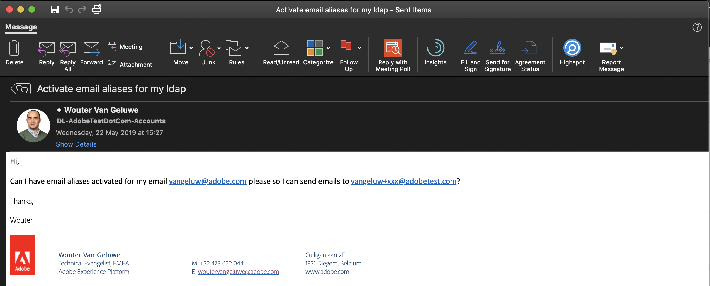

### Exercise 3.3 - Activate Email Alias for your Adobe LDAP

In future enablement content, we'll start to use Adobe Campaign's Triggered Journey's feature. To do this, you need to specify a valid email-address when creating an account on the demo website.

Since every demo requires a fresh, clean profile we need a way of using disposable email-addresses that actually 'work' and can be used to receive emails. To achieve this, you need email aliases.

In this exercise, the goal is for you to request the activation of email aliases for your Adobe email account.

After activation of email aliases, you'll be able to create disposable profiles in your demo's by using an email-address that references the ```@adobetest.com``` - domain.

Example:

LDAP: vangeluw
Email - address: vangeluw@adobe.com

After activation of email aliases, profiles can be created using this format:

```LDAP+**********@adobetest.com```

********** can be replaced by any combination of letters and numbers. Special characters are not allowed.

With the above LDAP, the following emailaddresses all become available:

```vangeluw+ABC@adobetest.com```

```vangeluw+123@adobetest.com```

```vangeluw+22052019-1@adobetest.com```

Every mail that is sent to any of the aliases, is forwarded to your 'normal' Adobe email-address. So it's perfect to use when creating profiles and actually receiving emails that are sent by Adobe Campaign's Triggered Journeys feature.

#### How to activate email aliases?

Send an email to ```adobetestdotcom-accounts@adobe.com``` and ask the team to activate email aliases for your LDAP



[Next Step: Install the new SYTYCD Mobile Application](./ex4.md)

[Go Back to Module 3](./README.md)

[Go Back to All Modules](../README.md)


