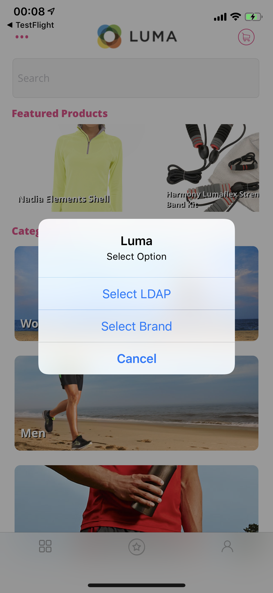
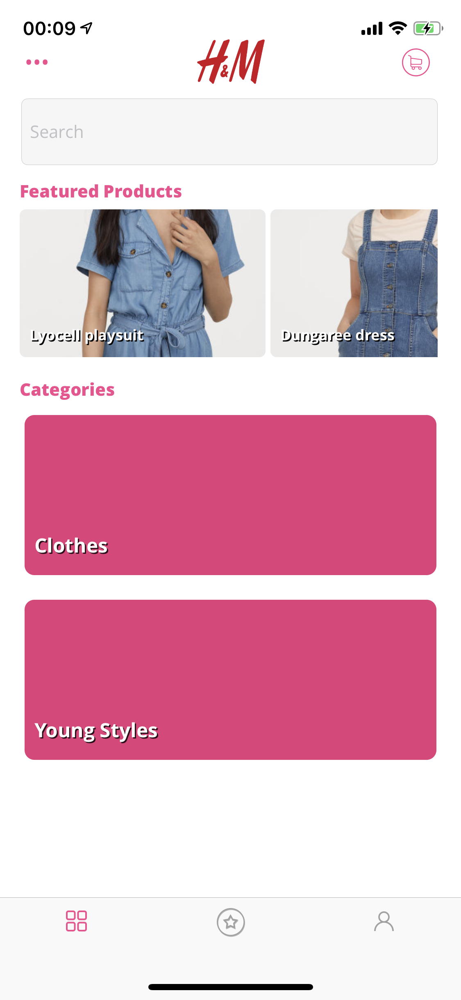

### Exercise 3.4 - Install the new SYTYCD Mobile Application

In this exercise, the goal is to install and use the new ```SYTYCD``` Mobile Application.

The ```SYTYCD```-mobile application is a variation of the ```Luma```-application which was built by Mathieu Hannouz from the Evangelist-team. If you're looking for the source-code of the app, you can find it here: [https://git.corp.adobe.com/hannouz/Luma-Platform-iOS](https://git.corp.adobe.com/hannouz/Luma-Platform-iOS)

The mobile application is only available for iOS devices at this moment. An Android-version of the mobile app is scheduled and will be delivered by mid-July.

To use the new mobile app, you need to install the ```SYTYCD```-mobile app. To get access to the mobile application, [click here to add yourself as a tester of the SYTYCD-demo app](https://testflight.apple.com/join/UfazvMKx).

TIP: Please click the above link from your iPhone directly.

After getting access the app, you can start the below exercise.

### Exercise 3.4.1 - Install the iOS application by making use of Testflight


On your iPhone, go to the App Store and search for ```testflight```.


Install the app TestFlight on your iPhone.

Look out for an invitation by email to test the ```SYTYCD``` mobile application.


Once you've received the email invitation, click on the ```View in TestFlight```-button in the email.

In the TestFlight-app, click on the ```INSTALL```-button.


After installing the app, open the ```SYTYCD```-app.

You'll have to respond to 2 questions asking for your permission to track your location and to send you push notifications. If you'd like to use Beacons in combination with your mobile app to track your location and if you'd like to receive personalized push notifications, please accept both questions.


Click ```Always Allow``` so that the application can always track your location.


Click ```Allow``` to receive push notifications from SYTYCD.

With this new mobile application, it's now possible to load multiple brands dynamically inside this app.

On the homepage of the app, you'll now see that the default brand is ```Luma```. The brand selection for ```Luma``` has dynamically loaded the Luma Products and Categories. However, you can now easily change the brand by clicking the 3-dots icon in the top left corner of your screen.


When clicking the 3-dots icon, you see this menu:



Now select ```Select Brand```.
On the next screen, you can make a choice between the available generic demo brands in our SYTYCD-environment.

 

Scroll to ```La Boutique``` and click ```Save```.

You're now redirected to the homepage of the app, and you should now see the ```La Boutique``` brand instead of Luma.

 

Click the 3-dots icon again to show the menu, and then click ```Select LDAP```.

 

On the next screen, you can choose your LDAP. 

 

In my case, I'm choosing ```vangeluw``` after which I'm redirected back to the homepage of the app.


From the homepage, click the 3-dots icon again, and now click ```Select Brand```, after which you're sent to the Brand Selection screen again. 


If you have created custom demo brands, you're able to select them from this screen.


Next, click on the ```user```-icon to go to the login-screen. In this example, I'm selecting H&M and then clicking ```Save```. 

After clicking ```Save```, I'm redirected back to the app's homepage and now I'm seeing the H&M brand loaded in the same app.



You've now explored the new ```SYTYCD``` mobile app. In the next exercises, we'll walk you through a typical demo scenario.

[Next Step: Demo Best Practices](./ex5.md)

[Go Back to Module 3](./README.md)

[Go Back to All Modules](../README.md)


