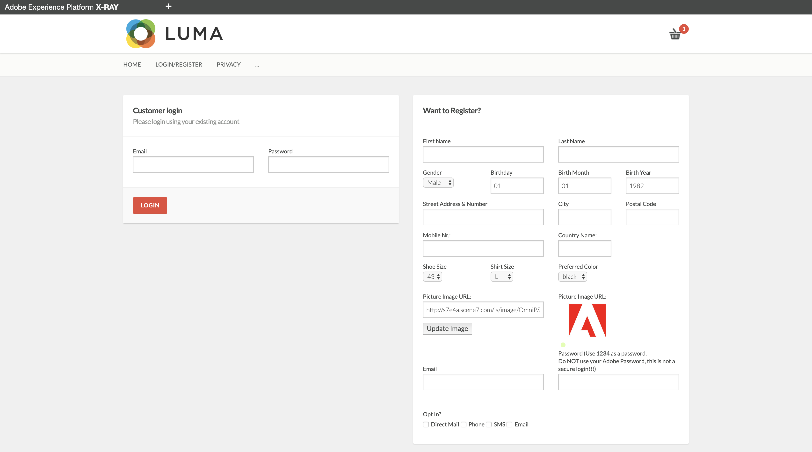
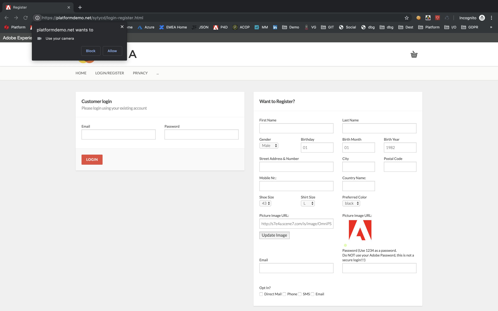
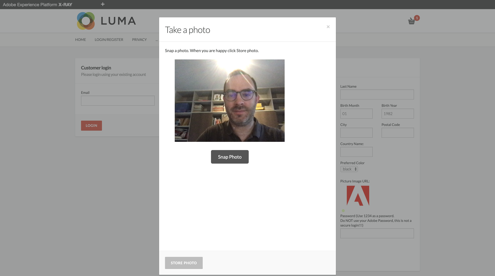
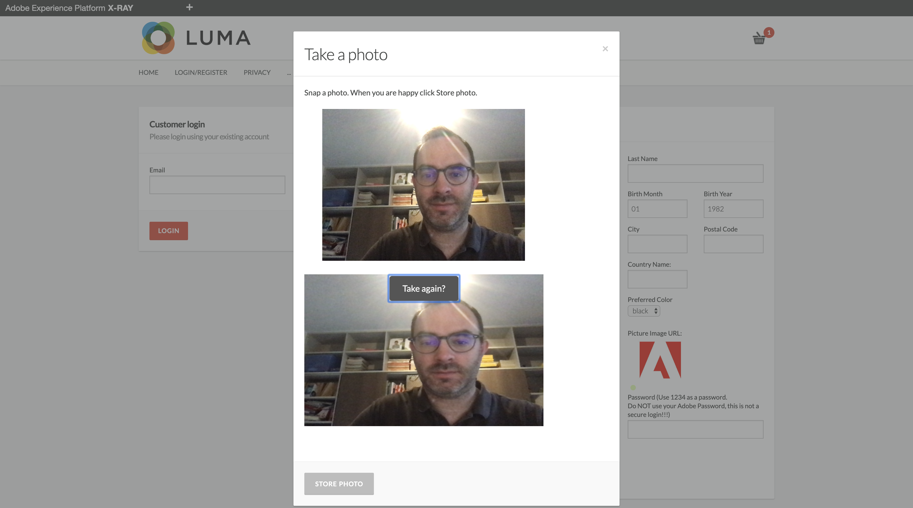
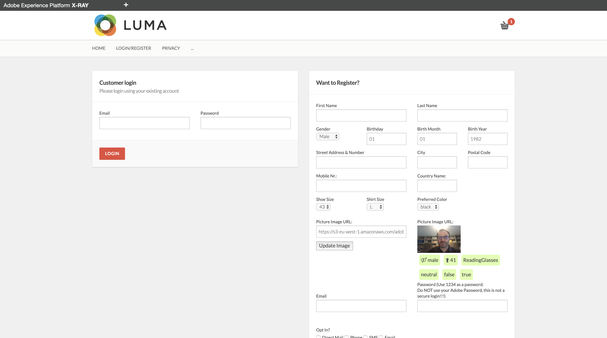

### Exercise 3.7: Using Microsoft's Cognitive Services - Face Detection

As part of the new SYTYCD-environment, we've implemented Microsoft's Cognitive Services - Face Detection on the Login/Register page.

This means that while creating your customer profile, you can make a picture of yourself and have that picture analyzed by Microsoft's Cognitive Services and return to the website a number of derived attributes.

The attributes that were implemented are:
  * Estimated Age
  * Estimated Emotion
  * Estimated Type of Glasses
  * Estimated Gender
  * Estimated Eye Makeup
  * Estimated Lip Makeup

Once Microsoft's Coginitive Services have returned this to the page, these attributes will be sent to Adobe Experience Platform and will become part of the customer's Real-Time Customer Profile.

In one of the previous exercises, you created a number of data elements to capture those attributes.

#### **FYI**
Accessing the webcam from the browser's context isn't always allowed.
If the website you're using doesn't run on HTTPS, like is most probably the case with your localhost configuration, Google Chrome will automatically block access to the webcam and the below Demo Flow won't work.

On your local machine, you should be able to access it through Firefox.

In order to have a more 'safe' solution for this HTTPS - requirement, an SSL Certificate has been bought for the doman: ```platformdemo.net```.
This means that you can go to [https://platformdemo.net/sytycd](https://platformdemo.net/sytycd) in an incognito session and you'll be able to use this feature. All other functionality described in this module 3 is also available on this hosted domain.

#### **Demo flow:**

  * Go to the ```Login/Register``` - page on your local machine in a Firefox window, or go to that page on [https://platformdemo.net/sytycd](https://platformdemo.net/sytycd) in Chrome.
  
  
 
  * When loading the ```Login/Register``` - page, the website will request your permission to activate the webcam. Click ```Allow```.
  
  
  
  * Next, to activate the webcam, click the Adobe-logo on the ```Login/Register``` - page, which will open up this window:
  
  

  * Click on ```Snap Photo``` to take a picture.

  
  
  * Click on ```Store Photo``` to store this picture. 
  
  **FYI**: the picture will be stored on an Amazon S3-bucket, and from there it will be made available to Microsoft's Cognitive Services. After 1-2 seconds, Microsoft will inform the page of the estimated attributes, which will be displayed below the picture.

  

  * If you fill out the other fields and then click ```CREATE ACCOUNT```, the picture will be linked to this customer's Real-Time Customer Profile and will be shown on the X-Ray panel, but also on the Mobile App after having logged in.
  
With this, you've successfully completed this exercise.

[Next Step: So You Think You Can Demo - Build out your demo environment](./ex8.md)

[Go Back to Module 3](./README.md)

[Go Back to All Modules](../README.md)


