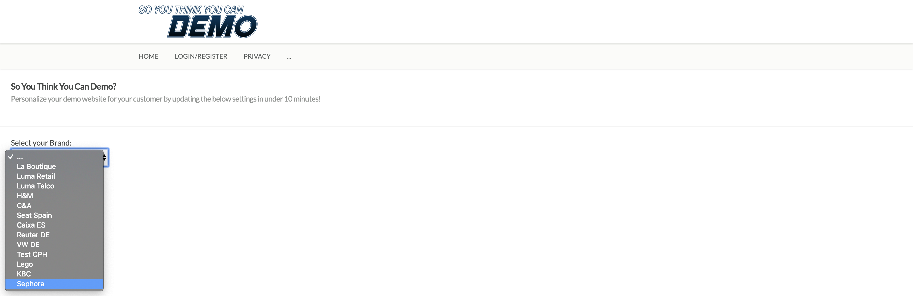

### Exercise 3.8: So You Think You Can Demo - Build out your demo environment

It's now time to build your own custom, personalized demo environment for a brand of choice.

**FYI:** This exercise is not optional and is a requirement to have access to future enablement content.

To be clear, the video needs to show:

  * Showcase your customized demo environment for a brand of choice
  * Follow the demo script as detailed in [Exercise 3.6 - Walkthrough of Demo Scenario](./ex6.md)
  * Only video is required, sound is not a requirement.

Please upload your video in a service of choice (Youtube Unlisted Video, Dropbox, Sharepoint, ...) and post your name, email address and link to the video [here](https://wiki.corp.adobe.com/display/expplatformemea/SYTYCD+-+Module+3%3A+Video+Submissions).

#### In this exercise, the brand Sephora will be used as an example to create the demo environment.

To start the configuration of your own personalized demo brand, go to the ```Admin``` - section of the SYTYCD - website, by clicking the 3-dots in the site's menu bar.


After clicking ```Admin```, you'll see the ```Admin``` - page.


From the ```Admin``` - page, the first thing to do is to ```Select Your LDAP```.

### Exercise 3.8.1 - LDAP

Click the ```Select Your LDAP``` - button.


On the ```Select LDAP``` - page, you'll see a dropdown. After 1-2 seconds, you'll find all available LDAPs in this dropdown. If your LDAP isn't part of that list, please reach out to ```vangeluw@adobe.com```.


If you LDAP is part of the list, select it and click the ```Save``` - button.

After clicking the ```Save``` - button, you'll be redirected back to the ```Admin``` - page, where you'll now see that your LDAP is selected.


Let's now create your Brand.

### Exercise 3.8.2 - Brand

From the ```Admin``` - page, click on ```Create New Brand```.


On the ```Create Brand``` - page, you'll see a list of choices that you need to make.


For my sample brand, Sephora, the following choices need to be made.

#### Demo Type


For the Demo Type, there are only 2 option. For this exercise, please select ```Full E-Commerce Ready```.

#### Which industry?


An Industry - choice needs to be made. It's important to know that based on the Industry choice, predefined templates may automatically be added to your custom demo environment. For example, when selecting the Industry ```Car Manufacturer```, a template will be added that provides you with a Test Drive - page automatically, and you'll have an easy way of configuring the fields of that template in this wizard.

For our brand, Sephora, let's take ```Retail```.

#### Currency?


For the currency, there are a couple of options. Let's take ```EUR``` in this example

#### Leading Background Color?


The Leading Background Color references a hexadecimal color code. The default background color code is set to white (#FFFFFF). You can select your preferred color code [here](https://htmlcolorcodes.com/).

For Sephora, I'll leave the default background color, ```#FFFFFF```.

#### Leading Text Color?


The Leading Text Color has 2 options: Light or Dark. The default text color is set to Dark. In most cases you can leave it like that, however, if you decided to change the Leading Background Color in the previous step, you might need to change it from Dark to Light here, depening on the Background Color you selected.

For Sephora, I'll leave the default text color, ```Dark```.

#### Use custom Profile Attributes?


This option allows you to activate or deactivate custom attributes like Shirt Size, Shoe Size, etc. This option will grow over time, and will be linked to the industry choice by activating or deactivating specific attributes for the Industry that you selected.

The only custom attributes that exist today, are the Retail-specific ones like Shirt Size, Shoe Size and Preferred Color.

For Sephora, I'll use the custom profile attributes and set this dropdown to ```Yes```.

#### Use Call Center?


This option allows you to activate or deactivate the Call Center from this brand's configuration. If you want to use the Call Center as part of your custom demo, select ```Yes```. Else, select ```No```.

For Sephora, I'll use the Call Center and set this dropdown to, ```Yes```.

#### Use Personal Shopper?

This option allows you to activate or deactivate the Personal Shopper Dashboard from this brand's configuration. If you want to use the Personal Shopper Dashboard as part of your custom demo, select ```Yes```. Else, select ```No```.

For Sephora, I'll use the Personal Shopper Dashboard and set this dropdown to, ```Yes```.


#### Which solutions on X-ray?


This option allows you to start choosing which solutions to show on the X-Ray panel. Currently, Adobe Experience Platform is always pre-selected, and you can choose to add Adobe Audience Manager. Other solutions like Adobe Analytics and Adobe Target will be added soon.

For Sephora, I'll only use Adobe Experience Platform on the X-Ray panel.

This leaves us with this configuration:

 

Once all your choices are valid, you'll notice that a second section pops up here: the Brand Details section.

 

The first thing to do here, is to enter a name for our Brand. In this example, I'll add Sephora as name.

 

After adding the name, you need to verify if this brand doesn't exist already in our shared demo environment. You can do that by clicking the ```Verify Brand Name``` - button.

  

After successfully verifying that the Brand Name is available, you can continue with the next steps, which also pop up automatically.


To continue this configuration, I need a

  * Brand Logo
  * Brand Favourite Icon
  * Brand Hero Image

These 3 images can easily be taken from the real Sephora website. So by going to http://www.sephora.com, I'm able to quickly make screenshots of the Brand Logo and the Brand Hero Image.


I'll use these images:

  * Brand Logo
  
  
  
  * Brand Favourite Icon
  
  
  
  * Brand Hero Image
  
  

#### Brand Logo Image

(Accepted File Format: PNG/JPG/JPEG)


In this option, I'll click on ```Choose File``` and then I'll select from my local drive the image I want to use here. This is a required field.


#### Brand Fav Icon Image

(Accepted File Format: PNG/JPG/JPEG)


In this option, I'll click on ```Choose File``` and then I'll select from my local drive the image I want to use here. This is a required field.


#### Brand Hero Image

(Accepted File Format: PNG/JPG/JPEG)


In this option, I'll click on ```Choose File``` and then I'll select from my local drive the image I want to use here. This is a required field.


#### Call To Action Settings


The CTA has become optional and is inactive by default. If you wish to use, please check the ```Use CTA-box?```, after which you can select the location of the CTA on the Hero Image and also the text for the CTA. These fields are optional.


The CTA & Hero Image URL is a required fields and this will be the next page after clicking the CTA and/or the Hero Image on your website. 

For Sephora, I'll select ```Product 1``` as the next page when clicking the hero image.

This leaves me with this configuration:


I can now click the ```Create Brand``` - button, which will save all of the above Brand Configuration and Images on a centralised, cloud-based back-end. (FYI: We use back4app.com for this).
By clicking the ```Create Brand``` - button, you'll see a spinner and after a couple of seconds you'll be redirected to the next step of the Brand Configuration Process, which is the configuration of Custom Pages.

### Exercise 3.8.3 - Custom Pages

After having saved your Brand Configuration, you can now create ```Custom Pages```.
```Custom Pages``` are pages that should be used for non-product pages and they are optional.

If you don't wish to configure ```Custom Pages```, you can simply click the ```Continue Without Custom Pages``` - button.

If you wish to configure Custom Pages, all you need is a Page Title and a Page Hero Image.
In the case of Sephora, I'll configure 1 Custom Page, the ```Community Page```.


I made a screenshot of that page, which only focuses on the Hero Image and that doesn't have any of the real Sephora - site headers:


#### Custom Page 1

Based on the above, I'll activate the checkbox to Use Page 1, I'll enter a title ```Community``` and I'll upload the screenshot I took.

(Accepted File Format: PNG/JPG/JPEG)


With that, I can now click ```Save Custom Pages``` to save the Custom Page configuration in the cloud-based Back4App backend.

After saving the Custom Page configuration, you'll be redirected to Categories automatically.

### Exercise 3.8.4 - Categories

Categories are currently used in the SYTYCD Mobile App, but will soon be used as well on the desktop website.

It's required to have at least 1 Category for your brand.

A Category doesn't need much:

  * Check the ```Use Category``` - checkbox
  * Give the Category a Name
  * Upload a background image to use for this Category (Accepted File Format: PNG/JPG/JPEG)

A category in the app requires an image as background. It's not easy to get the resolution of this image right, so the advise here is to use the pink background image below. If you wish to use the below ```bg_pink.jpg``` - image, you can right-click it and select ```Save Image As...``` to save it to your local computer so you can upload it during the Category - creation process.


For Sephora, I need 1 Category: ```Makeup```. Below you can see the completed configuration.


With that, I can now click ```Save Categories``` to save the Category configuration in the cloud-based Back4App backend.

After saving the Category configuration, you'll be redirected to Products automatically.

### Exercise 3.8.5 - Products

The Product - configuration allows you to create real products that will be part of your custom demo environment and you'll be able to interact with these products by viewing them, adding them to your cart and purchasing them.

In the current setup of the SYTYCD-environment, you can create a maximum of 8 custom products. This limitation of 8 will change in the next release to become unlimited.

So for Sephora, I need to create a couple of relevant products. To find my Products, their names, prices and images, I'm going to the Sephora website, into the Shop - section, to the Makeup - categpory.


From there, I can easily take a number of products with their names and prices, and take screenshots of the product images.

So I'm choosing my products...

  * Product 1: Fenty Beauty by Rihanna	I 

    Product 1 Screenshot:
    
    

  * Product 2: Too Faced	
    
    Product 2 Screenshot:
    
    

  * Product 3: Nars
    
    Product 3 Screenshot:
    
    

  * Product 4: Huda Beauty
    
    Product 4 Screenshot:
    
    

With the above choice, my final Product Configuration looks like this:


A couple of things to know:

   * Is featured product?
  
     Activating this option will make sure that this product is shown as a featured product in the app. It doesn't impact the desktop website yet, this is coming in the next release.
   
   * Product 1 Page Url
   
     The Page URL's cannot be changed at this moment.
     
   * Product 1 Category

     For the Category, you'll notice that in this dropdown-list, the categories that you created in the previous step are automatically shown
     
   * Product 1 Price
   
     Price is an optional field. If you don't want to use a price, uncheck the ```Use Price``` - checkbox.
     
   * Product 1 Image
   
     Upload your screenshots of your products here. (Accepted File Format: PNG/JPG/JPEG)
     
     This image will be used on the product detail pages on the desktop site, the mobile app and any other device that connects to your demo environment. This image is also used as the thumbnail on the X-Ray panel.

After configuring valid products, click the ```Save Products``` - button. This will save your products in the cloud-based Back4App backend.

After saving the Product configuration, your Custom Brand Configuration is finished and you'll be redirected to the main Admin - screen automatically.

### Exercise 3.8.6 - Select Your New Brand

Now that you've successfully finished your Brand Configuration, you can load your brand in the SYTYCD - environment.

To do so, click the ```Select Brand``` - button on the Admin - screen.


Wait 1-2 seconds for the brand list to be loaded, then open the dropdown - list and select the brand that you just created.

Click the ```Save``` - button and wait 5-10 seconds. While waiting, the website is loading all of the Brand Settings, Custom Pages, Categories and Products and once done, the screen will redirect to the site's homepage.



As you can see, the SYTYCD - homepage has now changed. It's no longer showing La Boutique or Luma, instead your custom brand is being shown, which is Sephora in this case.


And it's not just the desktop website. If you open the SYTYCD Mobile App, you can select your LDAP in the app as explained in [Exercise 3.4: Install the new Mobile Application](./ex4.md).

After selecting your LDAP, you can then go to the ```Select Brand``` option in the Mobile App and from there, select your custom brand as well.


Click ```Save``` to save your Brand Selection and voilà, the SYTYCD Mobile App is now showing your custom brand as well, which is Sephora in this case.


You can now record your video by following the demo script on [Exercise 3.6: Walkthrough of Demo Scenario](./ex6.md), but now in the context of your custom brand.

To be clear, the video needs to show:

  * Showcase your customized demo environment for a brand of choice
  * Follow the demo script as detailed in [Exercise 3.6 - Walkthrough of Demo Scenario](./ex6.md)
  * Only video is required, sound is not a requirement.

Please upload your video in a service of choice (Youtube Unlisted Video, Dropbox, Sharepoint, ...) and post your name, email address and link to the video [here](https://wiki.corp.adobe.com/display/expplatformemea/SYTYCD+-+Module+3%3A+Video+Submissions).

Congratulations, you've now finished Module 3.

[Go Back to Module 3](./README.md)

[Go Back to All Modules](../README.md)


