# Exercise 4.2: Define your Alexa skill

## Introduction

This module will guide you through all the necessary steps to define and configure a new Amazon Alexa skill.

### Prerequisites

Before you can create and configure an Amazon Alexa skill, ensure you are signed up for an Amazon developer account and signed in. Also, ensure your are signed up for an AWS account and signed in. See [Setup exercises](../setup/README.md) for more details.

## Exercise 4.2.1: Create an Alexa skill

To create a new skill, follow these steps:

1. At the **Amazon Developer Dashboard** screen ([https://developer.amazon.com/dashboard](https://developer.amazon.com/dashboard)), select **Alexa Skills Kit** from the **Alexa** menu.

2. In the **alexa developer console**, click the **Create Skill** button.
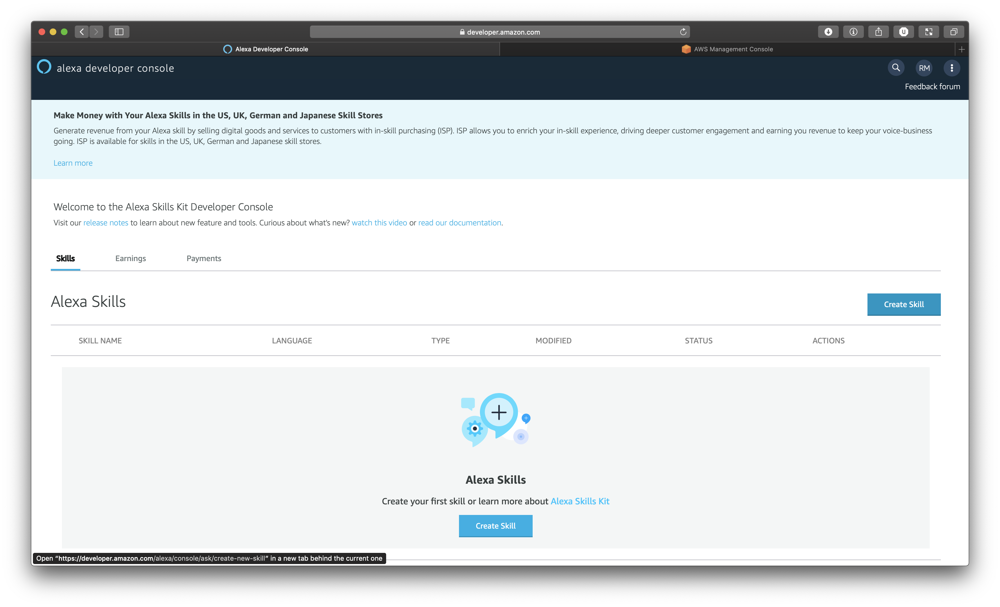
3. In the **Create a new skill** screen:
   1. Specify ``AEP`` as the **Skill name**.
   2. Select ``English (UK)``or ``English (US)`` as the **Default Language**.
   3. Select **Custom** as the model to use below **Choose a model to add to your skill**.
   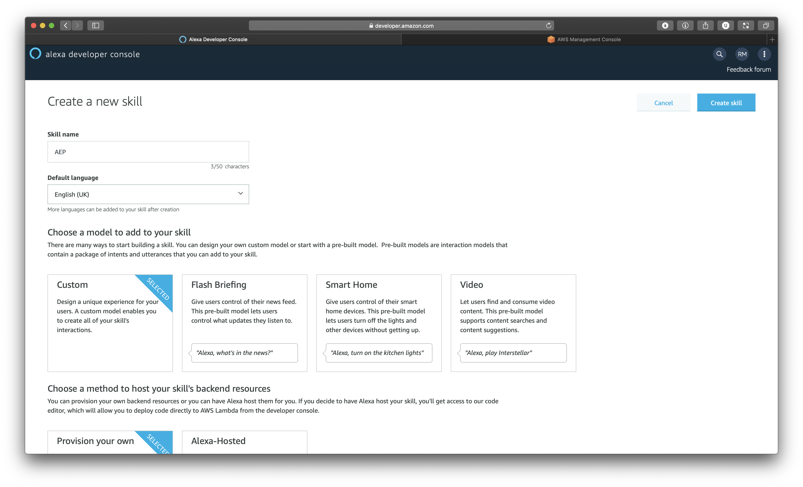
   4. Select **Provision your own** as the method to use below **Choose a method to host your skill's backend** resources.
   
   Your screen might look a bit different dependent on the **Default language** you have selected.
   5. Click **Create skill**.
4. In the **Choose a template** screen:
   1. Select **Start from scratch** as the template to use below **Choose a template**.
   
   2. Click **Choose**.
5. You will end up in your **AEP** skill main screen, which should look like
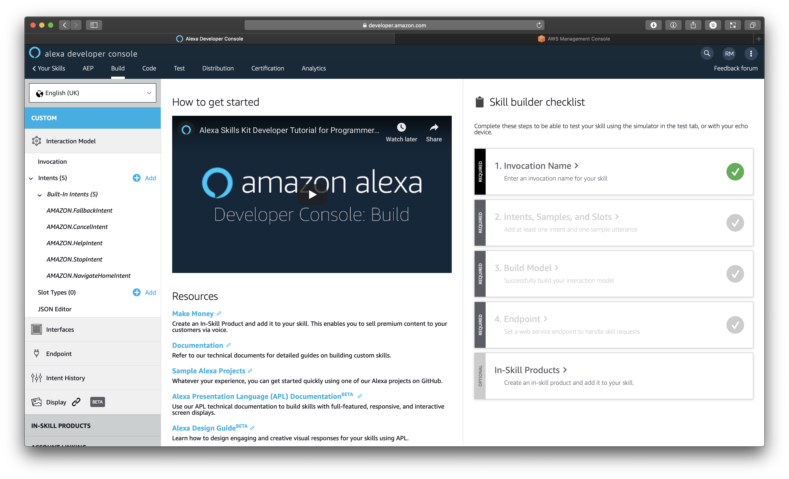

## Exercise 4.2.2: Define invocation name

For your skill to be invoked, it needs an invocation name. To define this:

1. Click on **Invocation** in the left rail, or on the **1. Invocation name >** button in the **Skill builder checklist** of the **AEP** skill main screen.
2. In the **Invocation** panel, replace ``aep`` with ``adobe experience platform`` as the **Skill Invocation Name**.
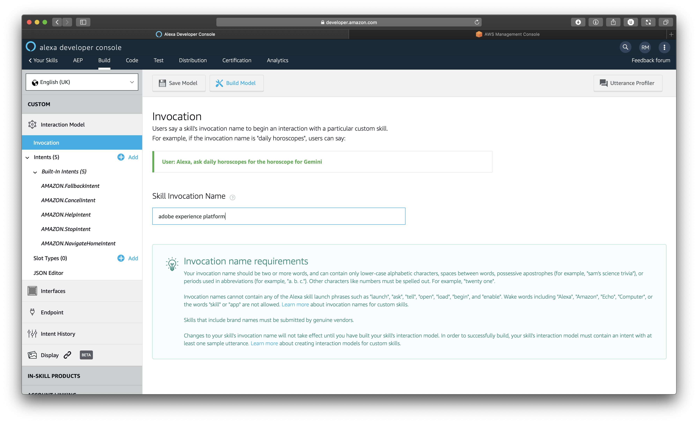
Click on **Save Model**.
This will update the invocation of your Alexa skill so you can say ``Alexa, open adobe experience platform``.

## Exercise 4.2.3: Define Intents, Samples and Slots

The next step is to configure the interaction with our skill. Interaction with an Alexa skill happens through so called intents, of which Amazon provides 5 built-in intents (e.g. **AMAZON.HelpIntent**, to ask for help). Each intent defines sample utterances; phrases you use to invoke the intent. And each intent can have one or more slot values; values you provide as input to the intent.

Rather than let you define step by step the various intents, utterances and slot values we do require for our skill, we will use a JSON file to set this all up in one go. To do so:

1. Click on **JSON Editor** in the left rail.
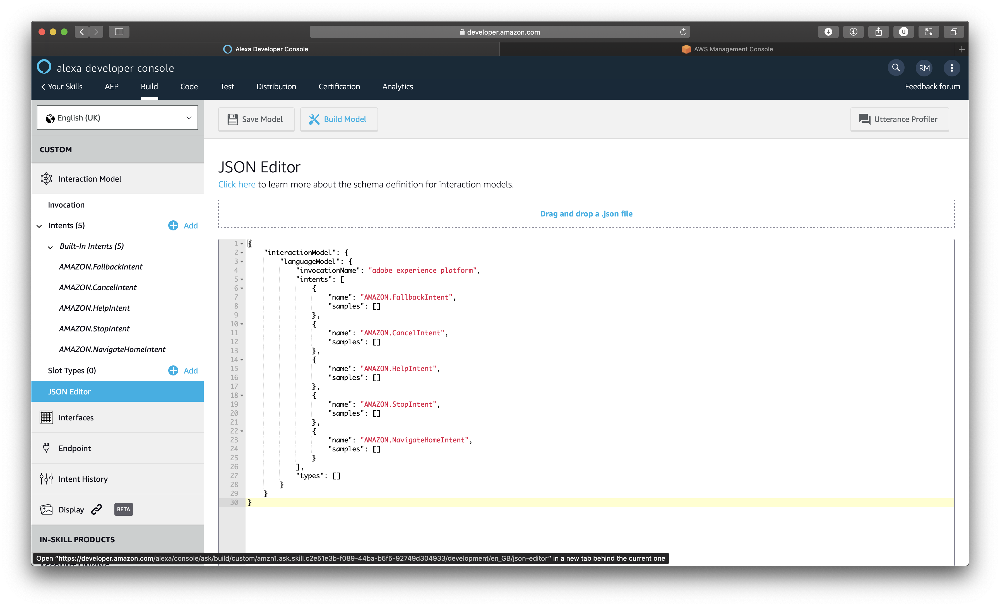
2. Go [here](skill/aepskillinteractionmodel.json). Click on ``Raw``.

   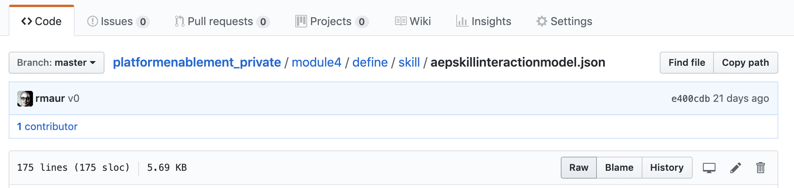
   
    Select everything and then, copy everything.

   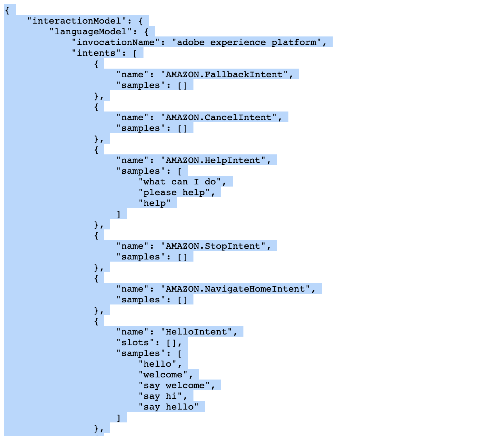
3. In the **JSON Editor** panel on the right, select everything and paste the code that you copied in the previous step, by overwriting the text that was there already. 
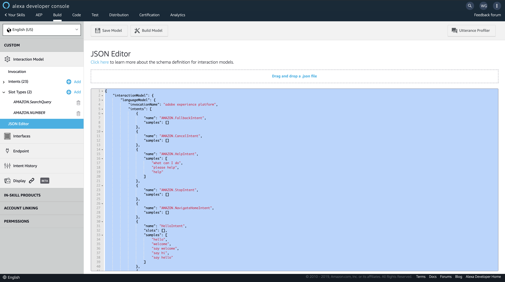
This will load the interaction model.
4. Click **Save Model** to save the model.
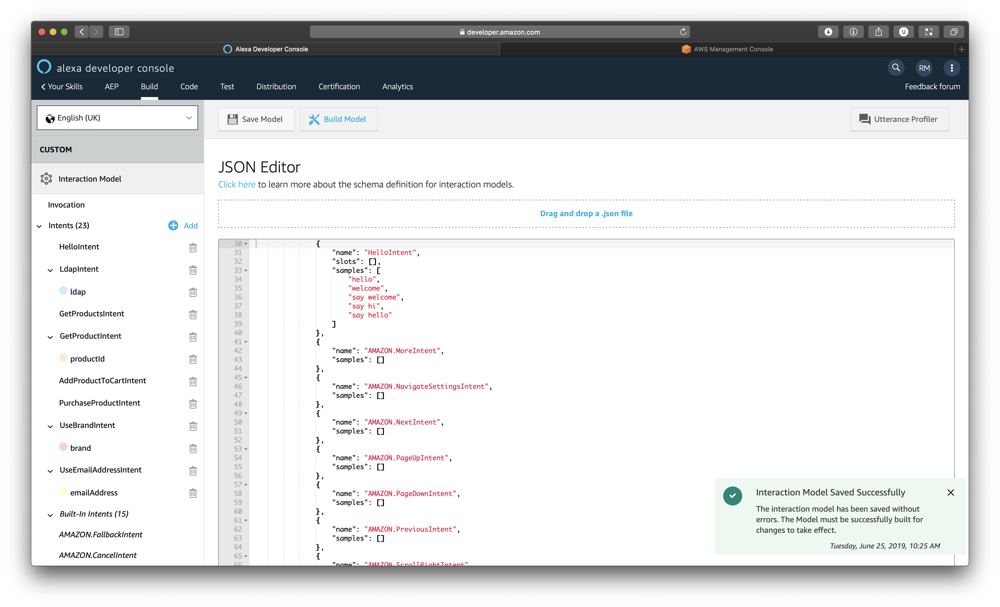
You will now see the various specific intents for our skill on the left rail, e.g. **LdapIntent**, **GetProductIntent**, .... **UseEmailAddressIntent**. Some of these intents do have a slot, e.g. like **productId** for **GetProductIntent**.

## Exercise 4.2.3: Define the interfaces

We will now define the interface for the skill. Interfaces define how you interact with your skill: only through voice or will the skill also support display and touch? As if we  want our skill to use the display and touch events, we need to enable that interface. Also our skill's implementation will use the Amazon Presentation Language (BETA). To properly configure this:

1. Click on **Intents** to collapse all intents. Then click on **Interfaces** in the left rail.

2. In the **Interfaces** panel, enable **Display Interface** and **Alexa Presentation Language BETA**.
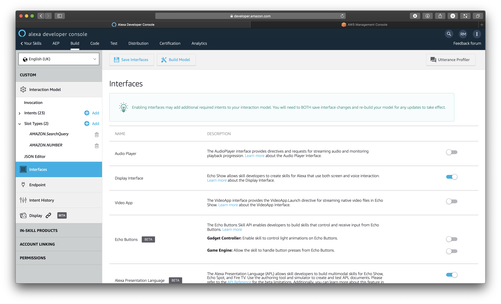
Click on **Save Interfaces**.

## Exercise 4.2.4: Setup the implementation

Our skill's logic is implemented using the [NodeJS Alexa SDK v2](https://developer.amazon.com/docs/alexa-skills-kit-sdk-for-nodejs/overview.html). See [here](./lambda/README.md) for more details on the implementation.

We need our functionality deployed in AWS Lambda so that we can invoke it from the skill. And then we also need to tell our skill where to find that serverless functionality so that it can invoke it when so required.

Let's first set up our server-less functionality for the skill. To do so:

1. Ensure you are logged in to your **AWS Management Console** ([https://us-east-2.console.aws.amazon.com/console/home](https://us-east-2.console.aws.amazon.com/console/home)).
2. Pick a datacenter you prefer from the dropdown listbox at the top right menu. E.g. ``US East (Ohioa)`` or ``EU (Ireland)``.
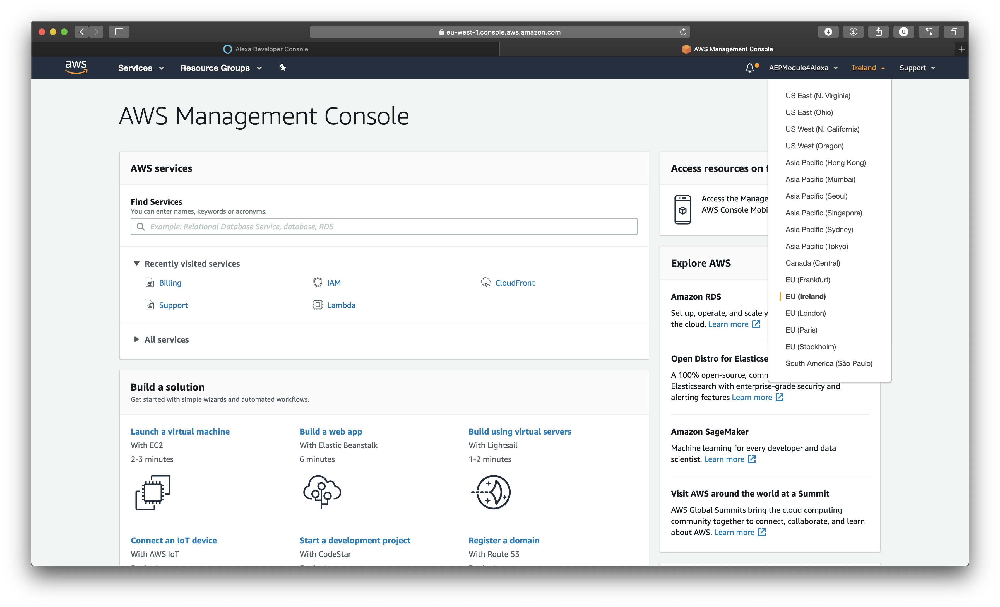
3. In **Find Services** type ``lambda``and press Enter.
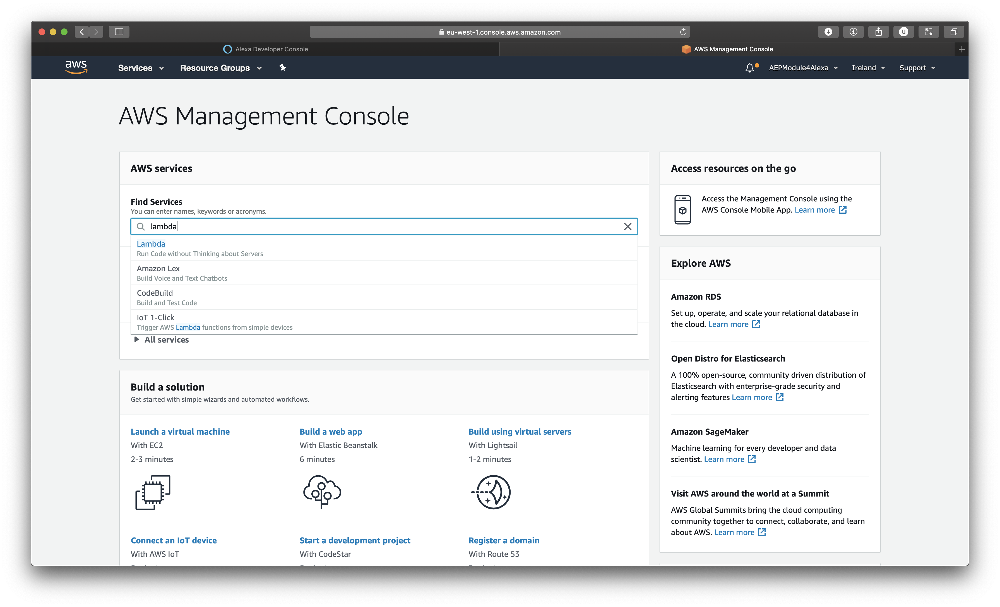
4. You will end up at the **AWS Lambda** home screen.
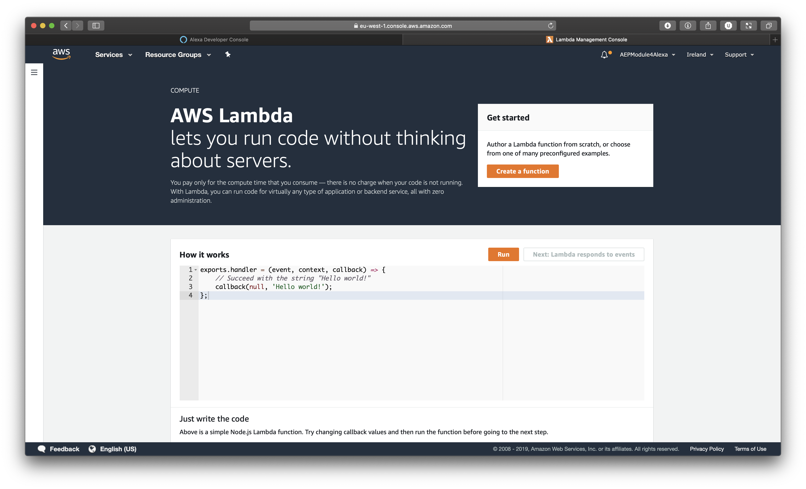
Click on **Create a function**.
5. In the **Create function** screen:
   1. Select **Author from scratch**.
   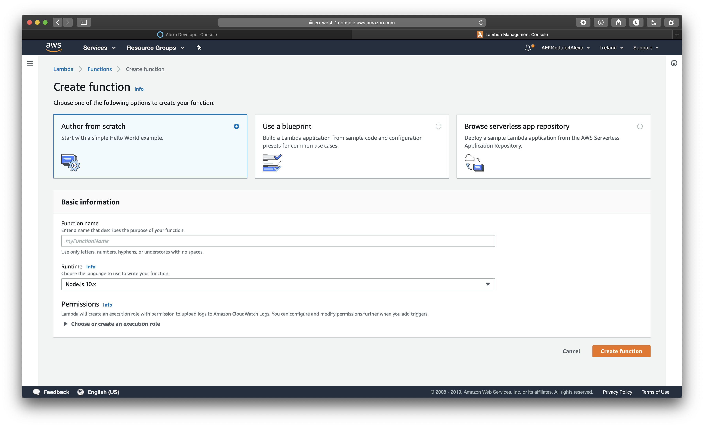
   2. Give your skill function a **Function name**, e.g. ``aep``.
   
   3. Select ``Node.js 8.10`` from the **Runtime** dropdown list.
   
   4. Click on **Choose or create an execution role** below **Permissions**. Then select ``Create a new role with basic Lambda permissions``from the **Execution role** dropdown list. Your screen should look like
   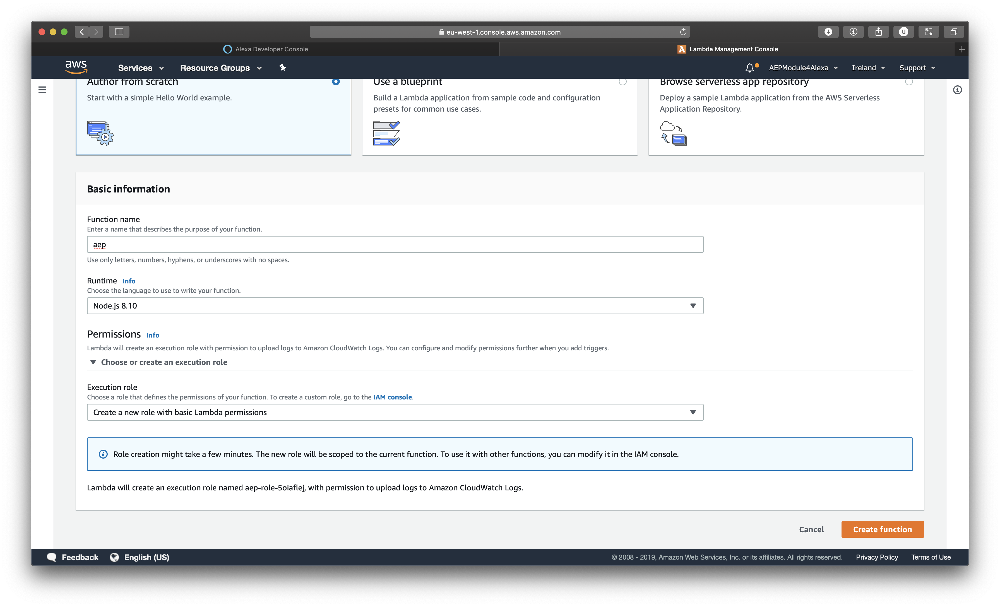
   5. Click on **Create function**. It will take a while to finish that creation.
   6. You will end up in your **aep** function definition screen, with the **Configuration** tab active.
   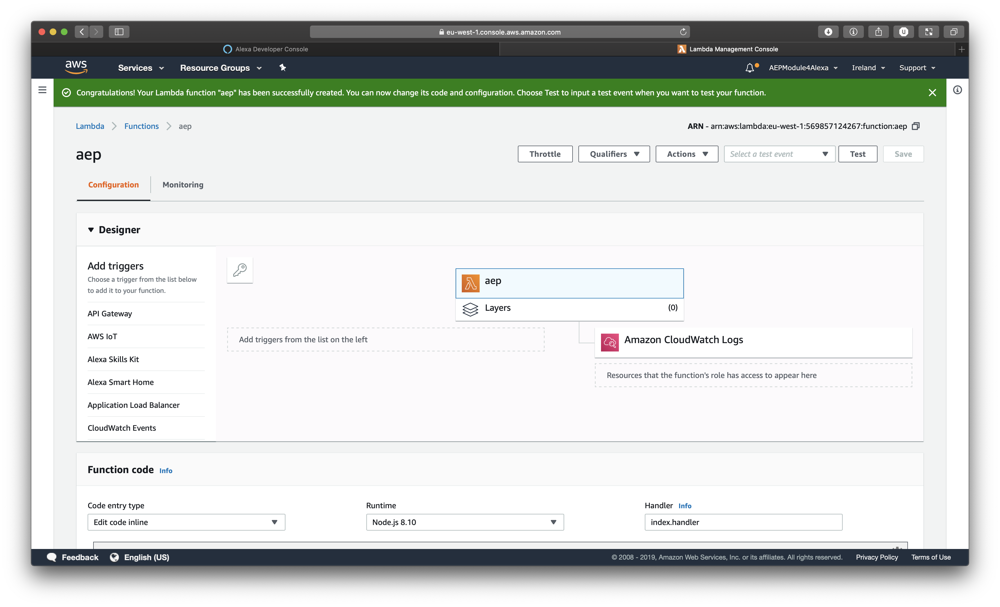
   7. In the list of triggers listed below **Add triggers**, select **Alexa Skills Kit**. You will see that the skill is added to the definition screen, with the remark **Configuration required**.
   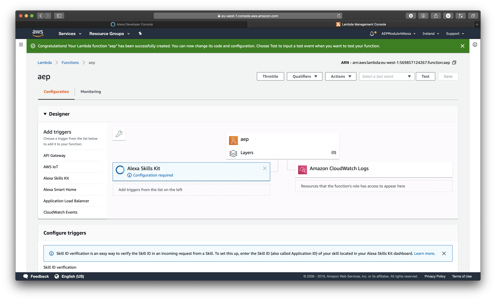
   **Note**: if **Alexa Skills Kit** is not available in the **Add triggers** list, the data center you selected does not support it. Select another datacenter (e.g. `EU (Ireland)`) that provides the **Alexa Skills Kit** trigger.
6. Move over to your **Alexa developer console** ([https://developer.amazon.com/alexa/console/ask](https://developer.amazon.com/alexa/console/ask)).

   1. Click on **Endpoint**. Then select **AWS Lambda ARN**. This will show your skill id.
   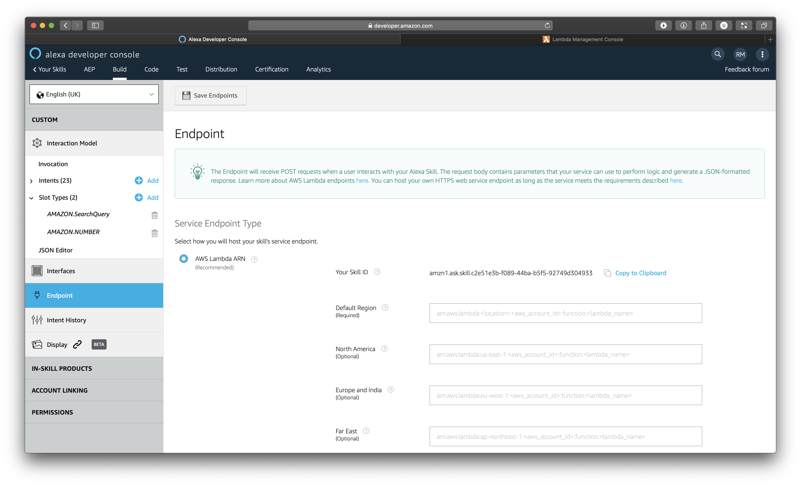
   Click on **Copy to Clipboard** to copy the skill.
7. Move back to your **aep** function definition screen in the **AWS Lambda** home screen.
   1. Paste the skill id in the **Skill ID** field below the **Skill ID Verification**. Ensure **Enable** is selected, which is the default and recommended setting.
   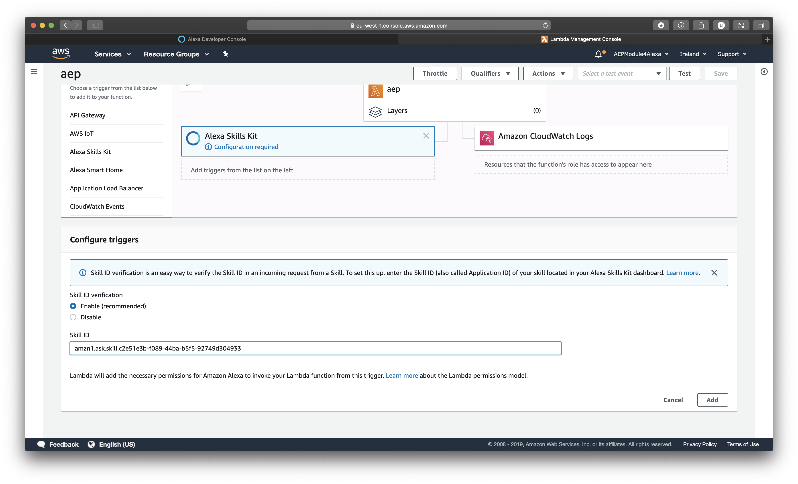
   2. Click on **Add** in the **Configure Triggers** panel.
   3. Then click on **Save**.
8. Continue, in the **aep** definition screen.
   1. Click on **aep** box in the **Designer** panel.
   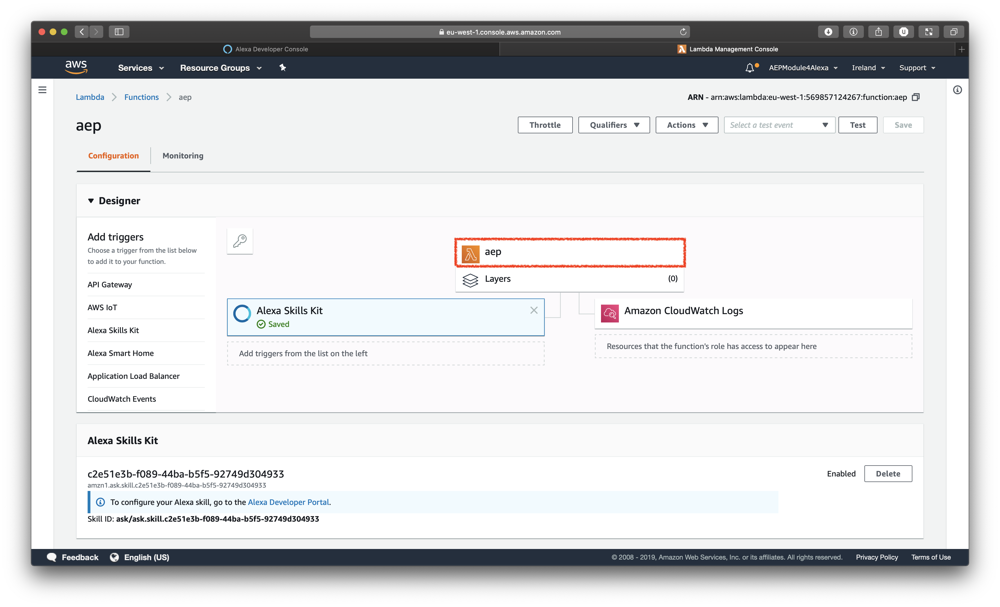
   2. In the **Function code** panel, from the **Code entry type** dropdown list, select ``Upload a .zip file``.
   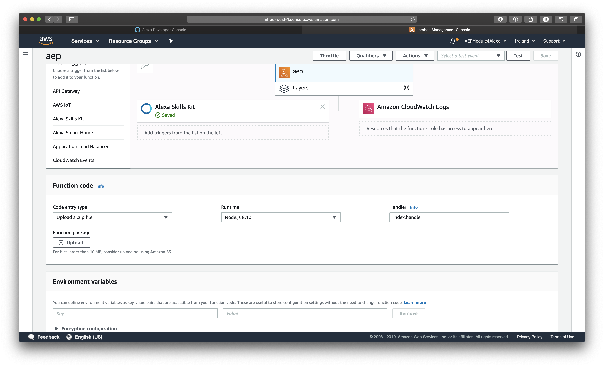
   3. Go [here](lambda/aepskill.zip), download and save the file somewhere on your computer as `aepskill.zip`.
   4. Click on the **Upload** button. Pick the `aepskill.zip` you saved on your computer from the file browser dialog.
   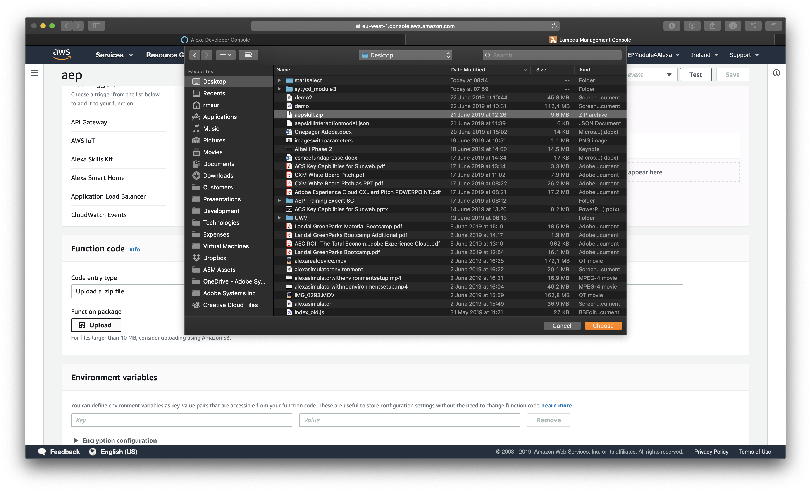
   5. Click **Save**.
9. Continue in the **aep** definition screen
    1. Scroll down until you see the **Environment Variables** panel.
    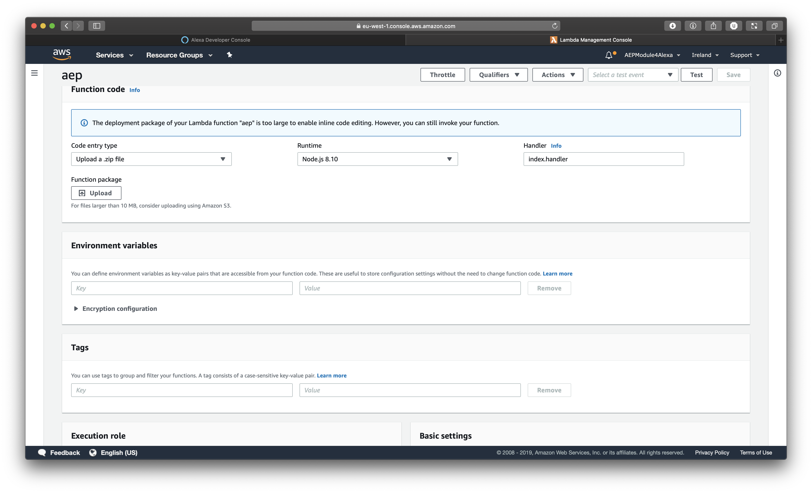
    2. Add the key value pairs from the table below, so your **Environment variables** panel will look like below.
    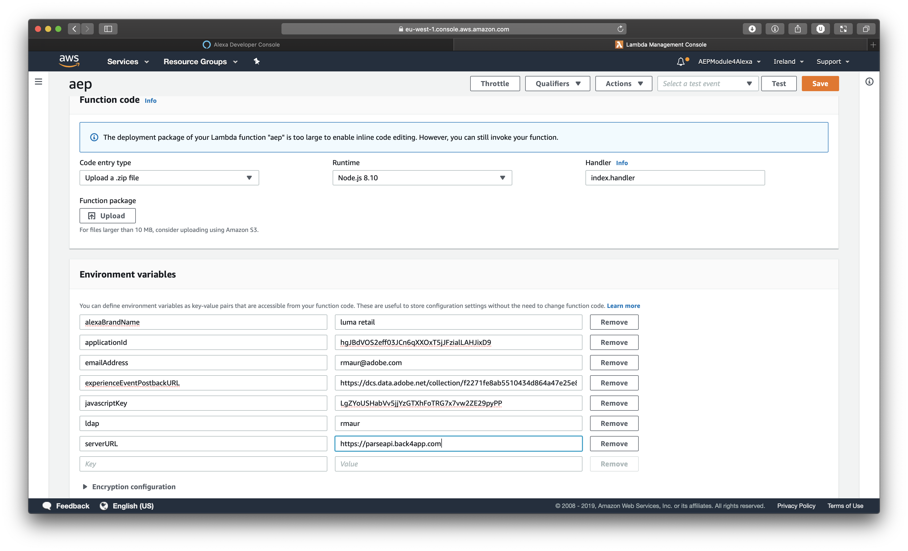
    
	    ### Environment variables
	
		Key | Value
		---------|----------
		 `alexaBrandName` | `luma retail`
		 ```applicationId``` | ```hgJBdVOS2eff03JCn6qXXOxT5jJFzialLAHJixD9```
		 ```emailAddress``` | ```rmaur@adobe.com```
		 ```experienceEventPostbackURL``` | `https://dcs.data.adobe.net/collection/f2271fe8ab5510434d864a47e25e8b94ff4a56d5a8ae19cf545858decbf7813e`
		 ```javascriptKey``` | ```LgZYoUSHabVv5jjYzGTXhFoTRG7x7vw2ZE29pyPP```
		 ```ldap``` | ```rmaur```
		 ```serverURL``` | ```https://parseapi.back4app.com```
    
    Ensure you replace `alexaBrandName`, `ldap` and `emailAddress` with your specific configuration details.
    **Also very important**:
       - define your `alexaBrandName` as the lowercase version of your brand name (e.g. Luma Retail as `luma retail`),
       - if your brand name contains an `&` replace it with ` and `.
    So H&M becomes `h and m`.
    3. Click **Save**.
10. As a final step, we need to copy the Amazon Resource Name that represents this functionality to our skill. To do so,
    1. In the **aep** function definition screen, click on the copy icon right from the **ARN - arm:aws.lambda:.....** text at the top right of the screen.
    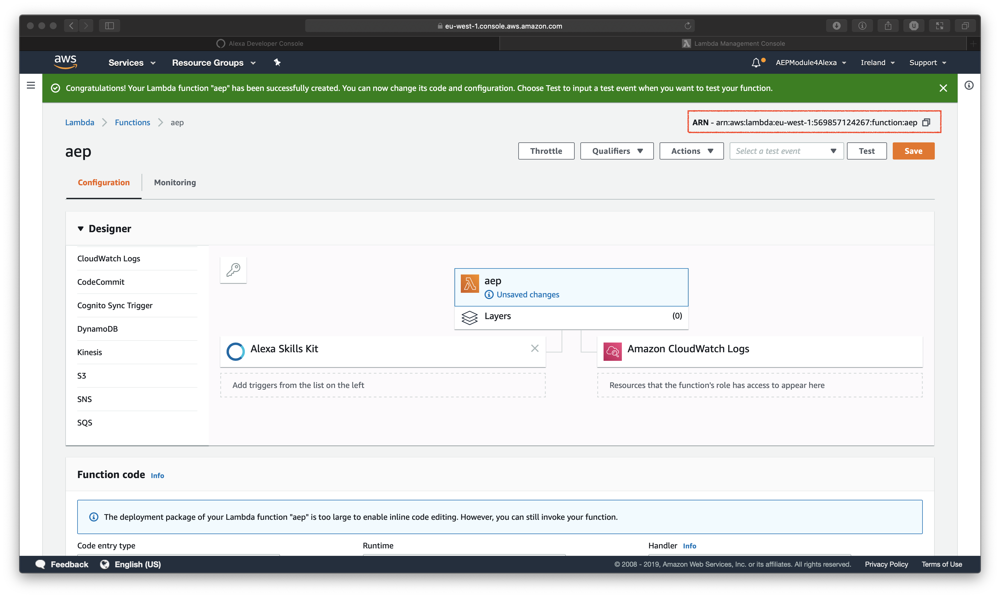
    1. A **copied** will indicate the value has been copied.
11. Move over to your **alexa developer console**.
     1. In the **Endpoint** config screen.
     2. Paste the copied ARN from the previous step in the **Default Region (Required)** field.
    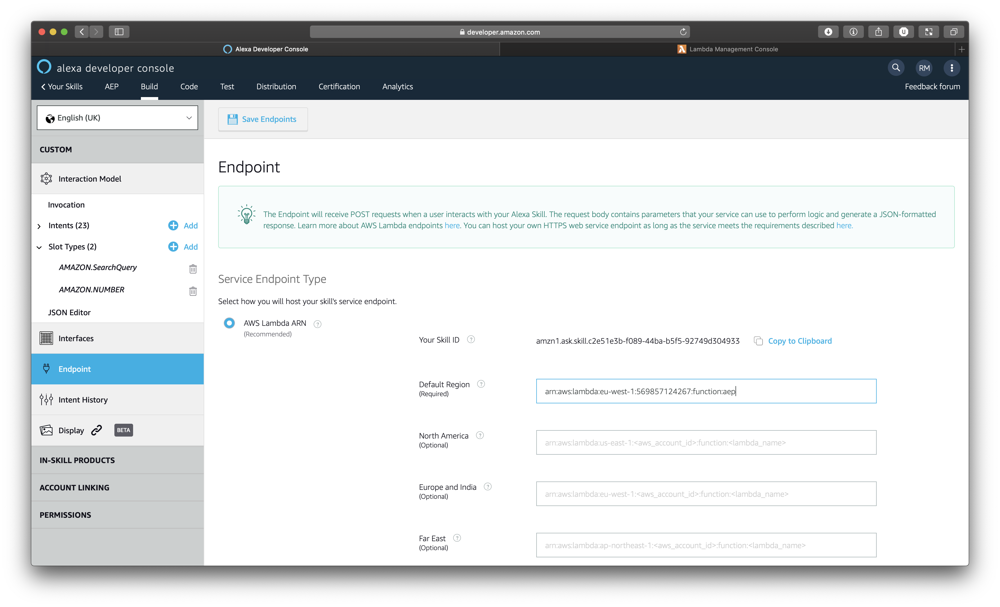
     3. Click on **Save Endpoints**.

## Exercise 4.2.5: Finalizing the skill

After we have setup invocation, intents, interfaces and endpoint, our final step is to build the final version of our skill.

1. The final step for the skill is to build the model. To do so:
    1. Select **Invocation** from the left rail.
    2. Click on **Build Model**. This will build the skill's model. This might take a while.
    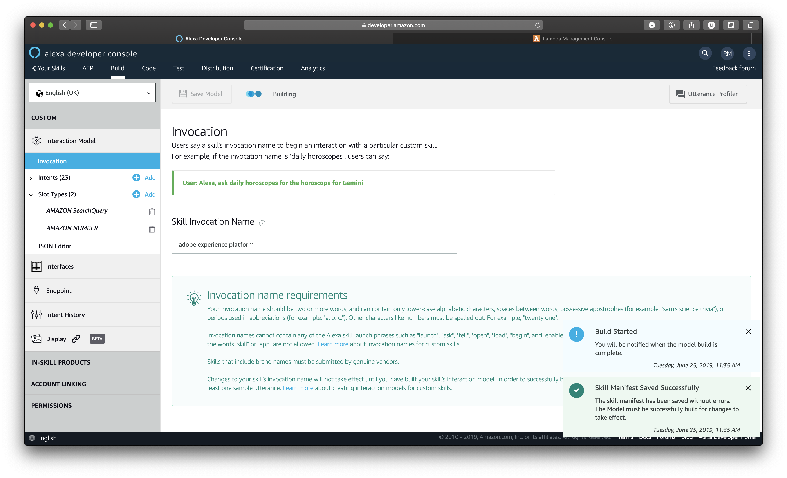
2. Verify that on your skill's main screen all the items on the **Skill builder checklist** (except for the optional **In-skill products**) are checked. To do so:
    1. Click on **Build**.
    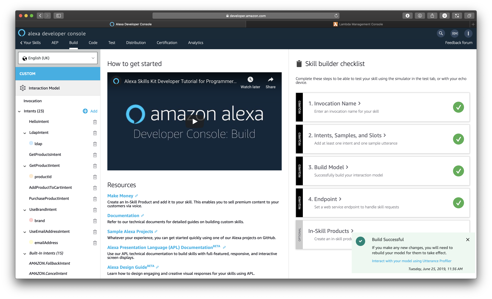
    1. Your **alexa developer console** should display green checkmarks for the first four items in the **Skill builder checklist**.
3. Your skill and its implementation are now ready to be used.

You have finished this exercise. Go to [next exercise](../use/README.md) to continue this module.

[Go Back to All Modules](../README.md)
