### Exercise 4.4 - Walkthrough of Demo Scenario, now including Alexa

Below is a standard script to walk through the demo scenario in the context of Luma Retail. The same script can be applied to any other brand of choice, like La Boutique or your own custom brand.

The goal of this exercise is to get to know the standard path to demo the SYTYCD-environment including the Alexa skill that you just built, and to use the below demo script in combination with the personalized demo website that you built in Module 3.

It's now time to use your own custom, personalized demo environment and follow the below script.

**FYI:** This exercise is not optional and is a requirement to have access to future enablement content.

To be clear, the video needs to show:

  * Showcase your customized demo environment for a brand of choice, now including Alexa.
  * Follow the demo script here
  * Only video is required, sound is not required.

Please upload your video in a service of choice (Youtube Unlisted Video, Dropbox, Sharepoint, ...) and post your name, email address and link to the video [here](https://wiki.corp.adobe.com/display/expplatformemea/SYTYCD+-+Module+4%3A+Alexa+Video+Submissions).

#### **Demo flow:**

#### Step 1 - Unknown visitor browses the Luma website

  * Go to the Luma Homepage
  
  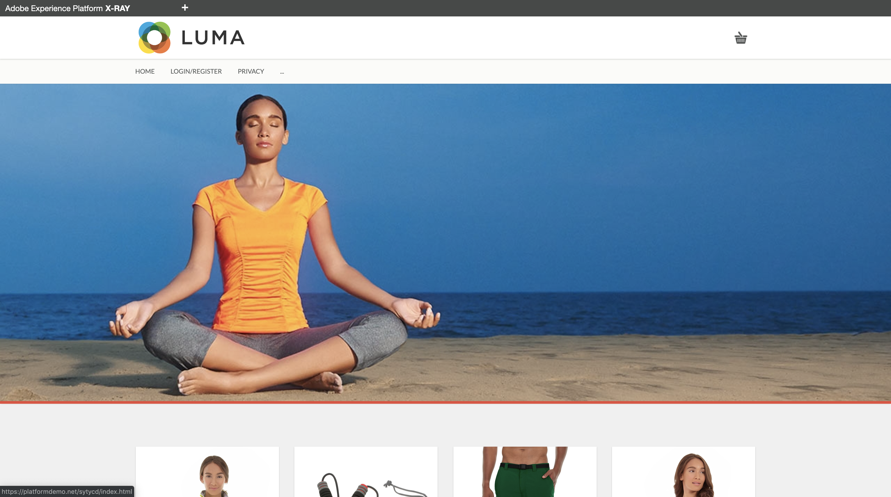
  
  * Introduce the X-ray panel and explain the Real-Time Customer Profile:
    * **ECID** as the internal Adobe identifier
    * **Audience Manager ID** as the external identifier, and stress the importance and unique role of Audience Manager as the door and gateway between the internal 'owned' world and the external, paid media world.
      
  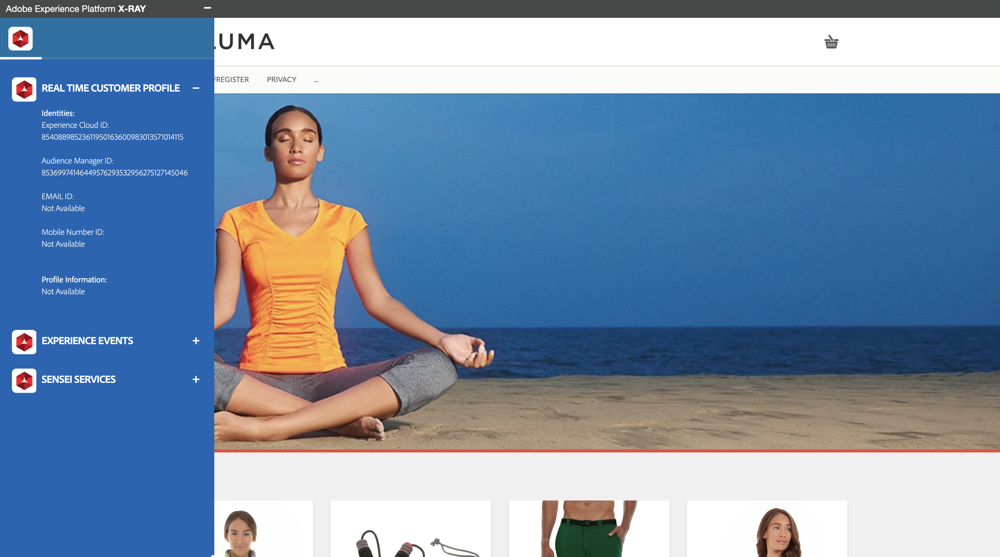

  * Introduce the concept of Experience Events

  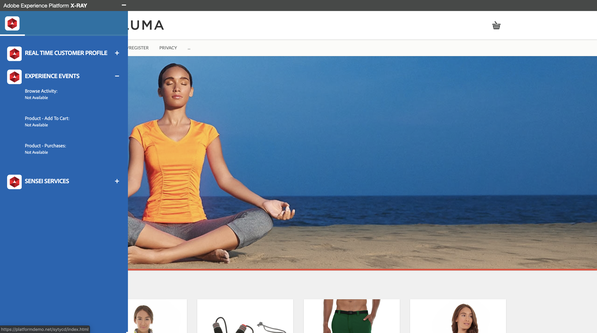
  
  * Scroll down on the page until you see the products, click on the Nadia Elements Shell.
  
  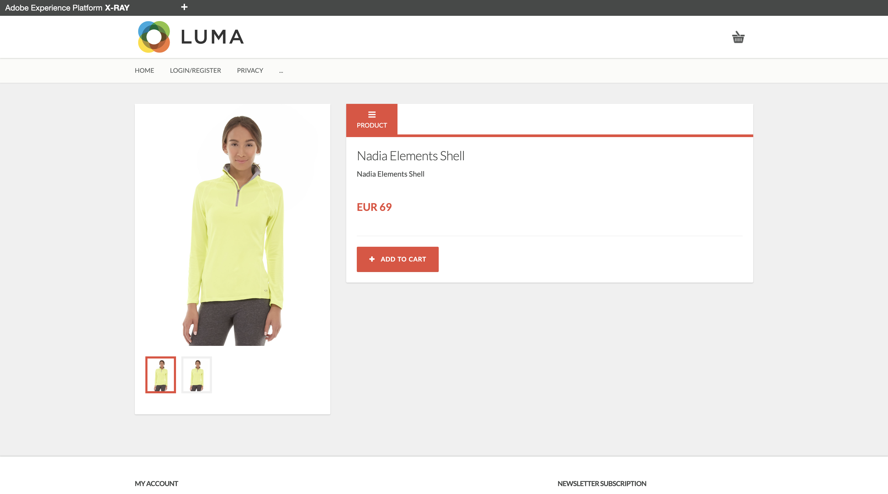
  
  * Have a look at the product, explain that an Experience Event of type ```Product View``` has been sent to Platform and then click on the ```+ Add To Cart``` - button.
  
  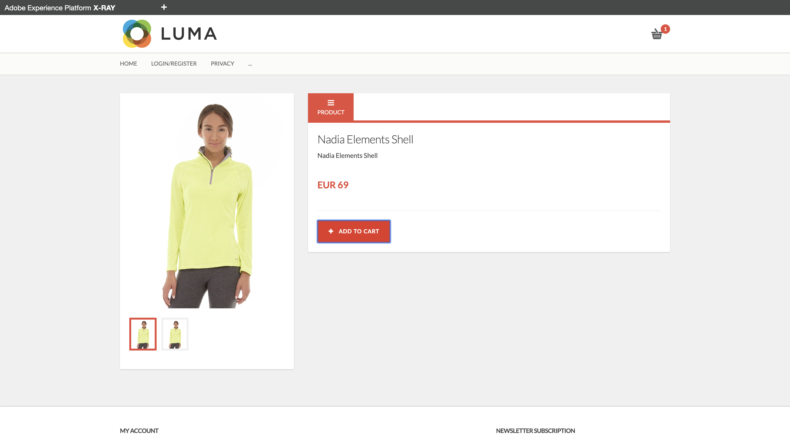
  
  * Explain that an Experience Event of type ```Add To Cart``` has been sent to Platform. Next, click on the cart icon in the top right corner of your screen to visualize the cart.
  
  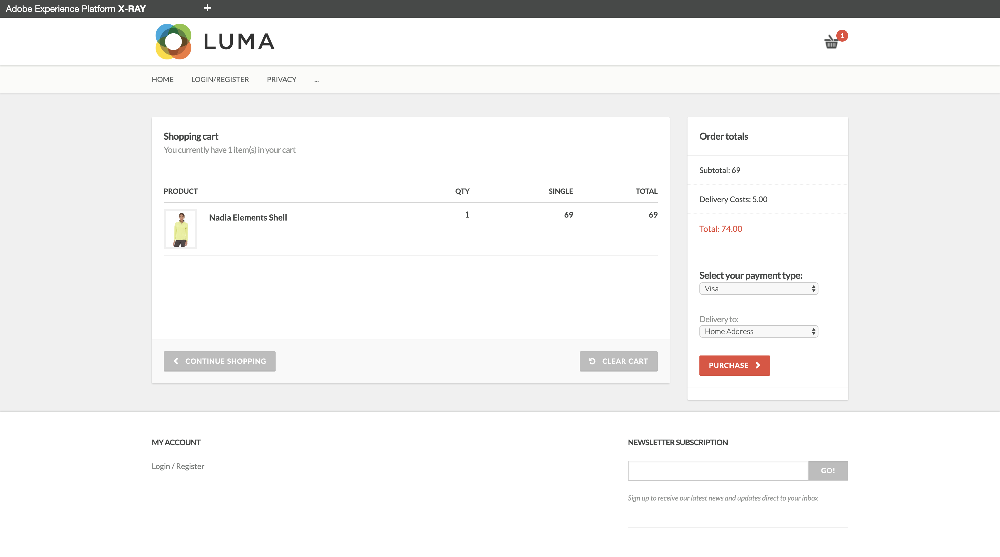
  
  * Open the X-Ray panel and go to Experience Events. You'll now see an Experience Event as Browse Activity and also an Experience Event as Add To Cart Activity.
  
  
  
  * While the behaviour is anonymous, Luma is able to track every click and store in in Platform. Once the anonymous customer becomes known, Luma will be able to merge all anonymous behaviour automatically to the know profile.
  
#### Step 2 - Unknown visitor registers on the Luma website

As a best practice, please use the following convention for identifiers:

  * Email Address identifier: **ldap**+**DDMMYY**-**number**@adobetest.com
  * Mobile Nr identifier: **yourmobilenumber**-**DDMMYY**-**number**

As an example, for the ldap ```vangeluw```:
On Monday June 17 2019, this should be the first set of identifiers of the day.
  
  * Email Address identifier: **vangeluw**+**17062019**-**1**@adobetest.com
  * Mobile Nr identifier: **0473622044**-**17062019**-**1**

  * Go to the Login/Register page
  
  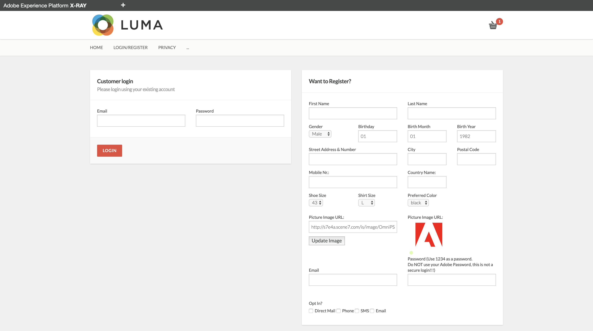
  
  ATTENTION: please remember [the Platform Demo Best Practices guidelines](./ex5.md)
  
  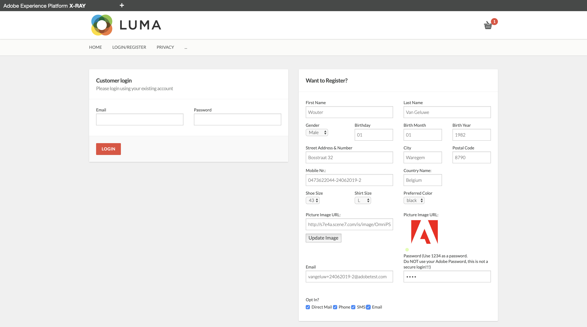 
 
  * Fill out your registration details and opt-in preferences and click ```CREATE ACCOUNT```.
  
  * After login, go to the Homepage of the Luma website and open the X-ray panel, go to Real-Time Customer Profile. On the X-ray panel, you should see all of your personal data displayed.
  
  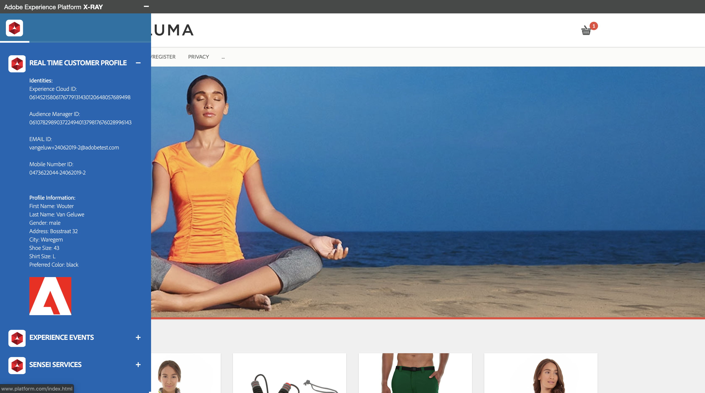

  * On the X-ray panel, go to Experience Events. You should see the Browse Activity and the Add To Cart activity that was there before.

  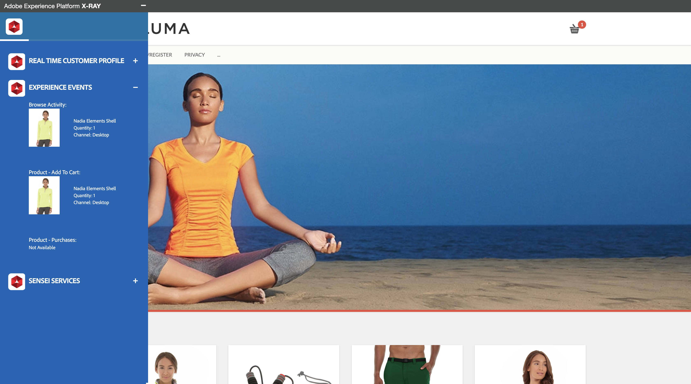

After becoming a known customer, it's time to install the ```SYTYCD```-mobile app on your iPhone and then login to the app. 

#### Step 3 - Known visitor registers on the Luma website

To use the new mobile app, you need to install the ```SYTYCD```-mobile app. To get access to the mobile application, [click here to add yourself as a tester of the SYTYCD-demo app](https://testflight.apple.com/join/UfazvMKx).

  * Open the SYTYCD mobile app.
  
  

  * Go to the Account-screen.
  
  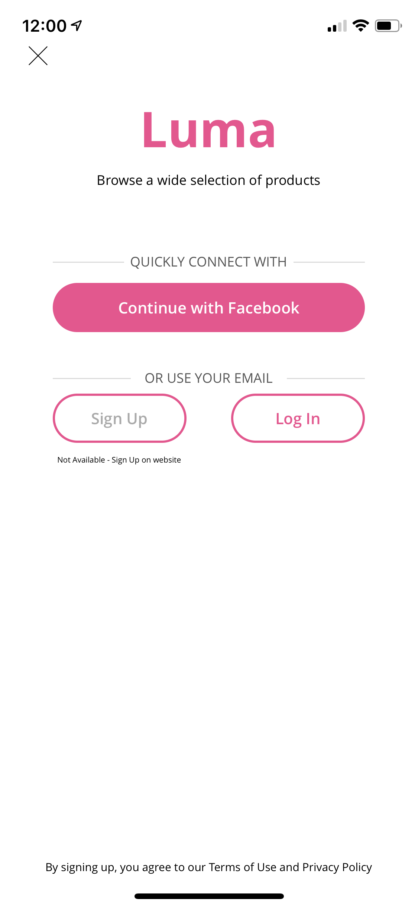

  * Login with the Email ID you used in the previous exercise and the password of 1234.
  
  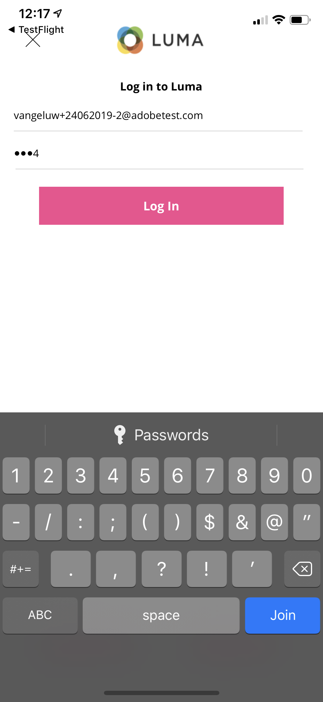

  * See your Real-Time Customer Profile data appear in the application, along with your Desktop Browse Activity

  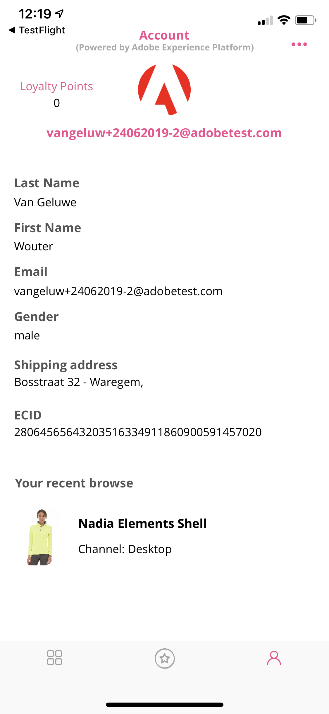

  * Go to the app's Homepage
  
  

  * Go to the ```Mens```-category
  
  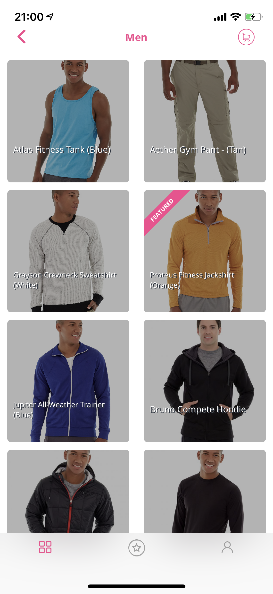

  * Click on the product ```Proteus Fitness Jackshirt (Orange)``` and view the product.
  
  

  * Go back to the previous screen
  
  

  * Go to the Account-screen and your Real-Time Customer Profile data will be refreshed, after which you'll see the ```Proteus Fitness Jackshirt (Orange)``` - product be part of your receent browse activity. Please note the fact that the channel on which the browse activity happened is being shown now.
  
  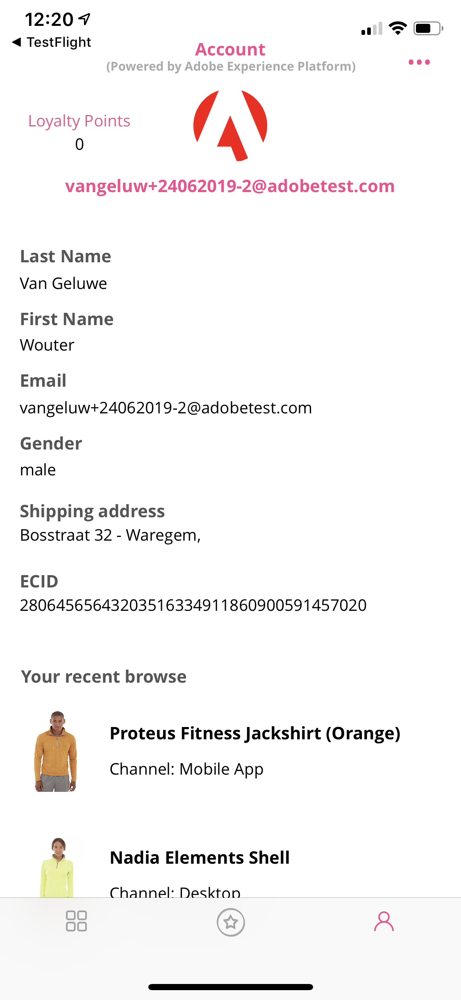

  * Now go back to your desktop computer and refresh the Luma homepage, after which you'll see the ```Proteus Fitness Jackshirt (Orange)``` - product also appear there. Please note the fact that the channel on which the browse activity happened is being shown now.
  
  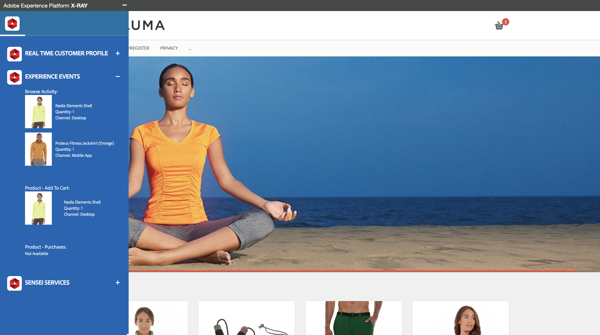

#### Step 4 - Known visitor interacts with Alexa skill

Let's put Alexa into the demo story.

  * Open the Alexa simulator and make sure you only have the option ```Device Display``` activated. Deselect ```Skill I/O```.
  
  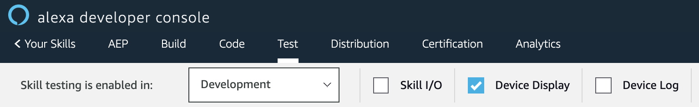
  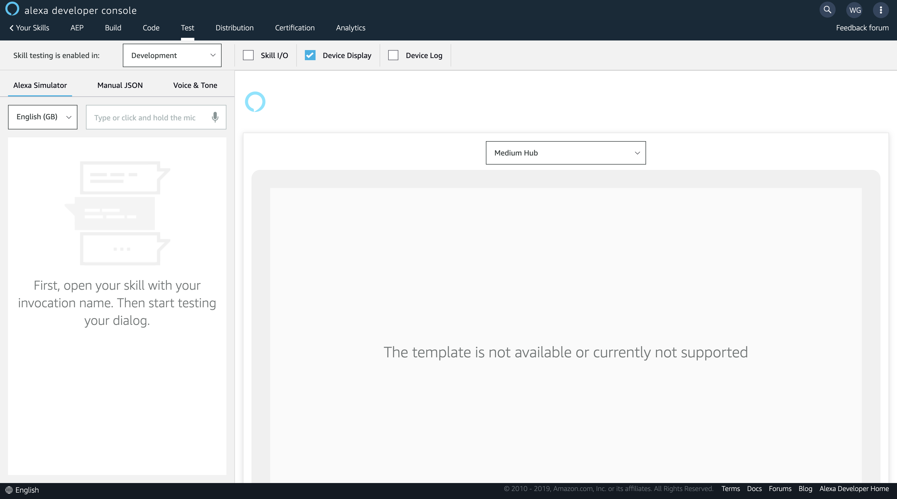

  * Enter the command ```Ask Adobe Experience Platform``` by either typing it or speaking it (to record your voice, click and hold the microphone-icon, release when you've finished speaking).
  
  
  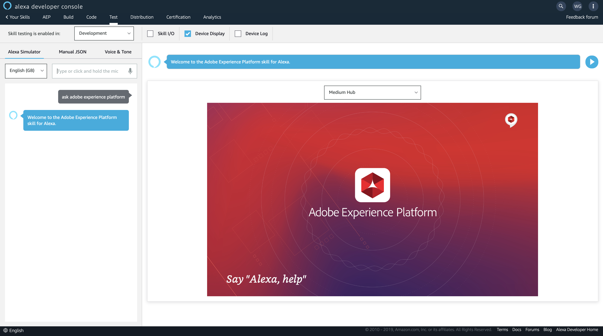

  * Enter the command ```Get Products``` by either typing it or speaking it (to record your voice, click and hold the microphone-icon, release when you've finished speaking). 
  
  
  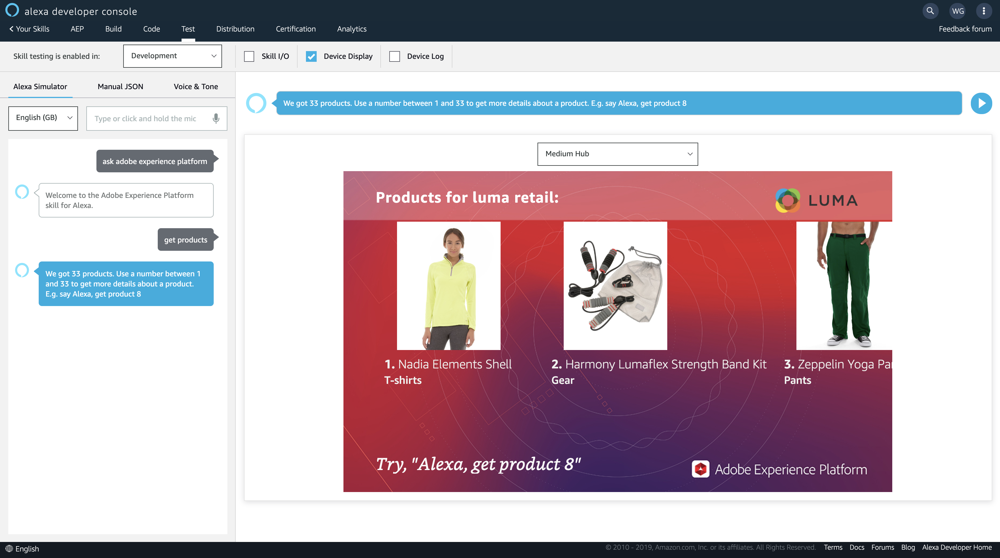

  * Enter the command ```Get Product 3``` by either typing it or speaking it (to record your voice, click and hold the microphone-icon, release when you've finished speaking). 

  
  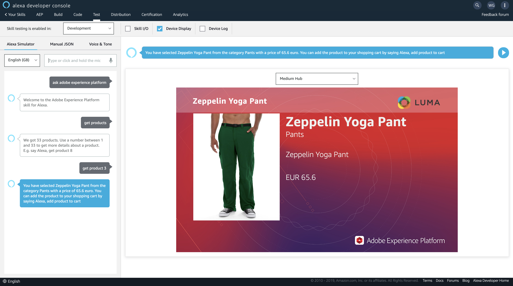

  * Enter the command ```Add Product To Cart``` by either typing it or speaking it (to record your voice, click and hold the microphone-icon, release when you've finished speaking). 
  
  
  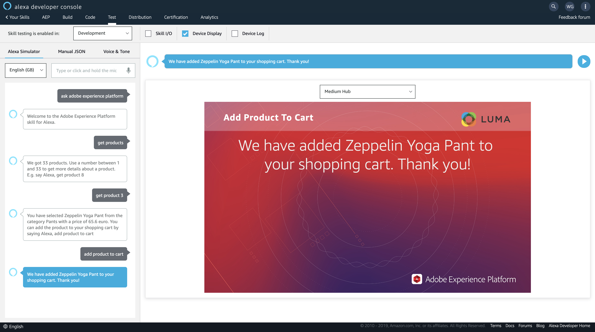

  * Enter the command ```Purchase Product``` by either typing it or speaking it (to record your voice, click and hold the microphone-icon, release when you've finished speaking). 
  
  
  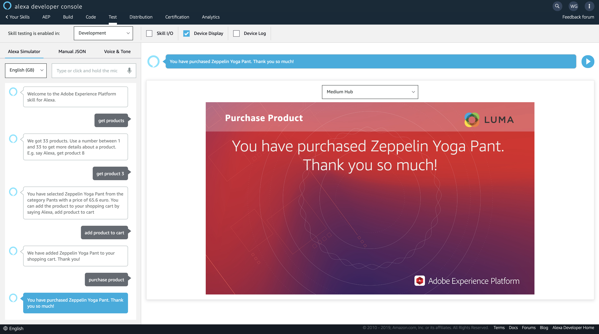

  * Now go back to your desktop computer and refresh the Luma homepage, after which you'll see the ```Zeppelin Yoga Pant``` - product also appear there, in Browse Activity, Add To Cart and Purchase. Please note the fact that the channel on which the activity happened is being shown, so you can clearly indicate which Experience Event happened on which device.
  
  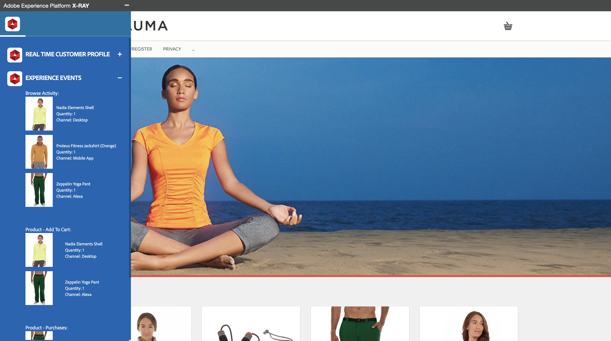
  
#### Step 5 - Personal advice in the brick-and-mortar store
  
  #### **Demo flow:**

  * To access the Personal Shopper Dashboard, click on the 3-dots in the desktop site's menu and select ```Personal Shopper```.

  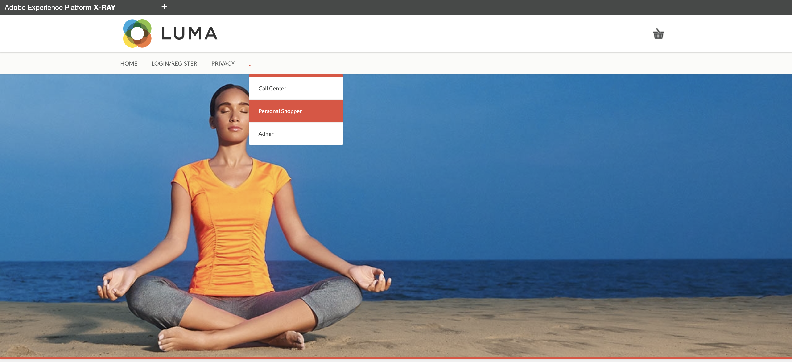
  
  * In the Personal Shopper Dashboard, you'll notice that the Email Address you used to register on the Luma - website has beeen filled out automatically for you. You can also enter any other email-address of choice to retrieve the customer profile. 
  
  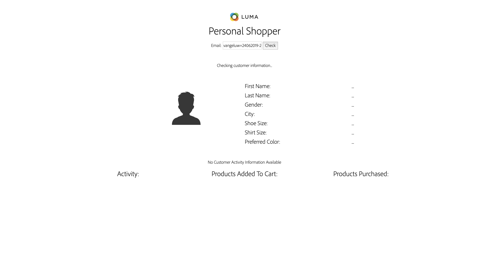
  
  * Click the ```Check``` - button. After 1-2 seconds, your Real-Time Customer Profile data is being shown to the store employee, including your browsing behaviour from the last couple of seconds and all of the important information like shoe size, shirt size and preferred color.
  
  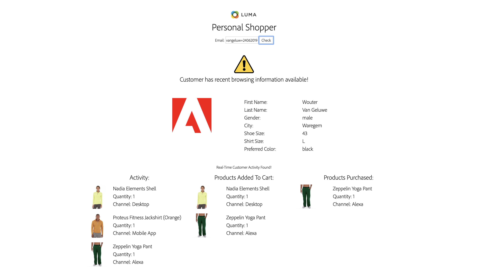
  
  
#### Step 6 - Call the most personal Call Center ever!

#### **Demo flow:**

  * To access the Call Center Dashboard, click on the 3-dots in the desktop site's menu and select ```Personal Shopper```.

  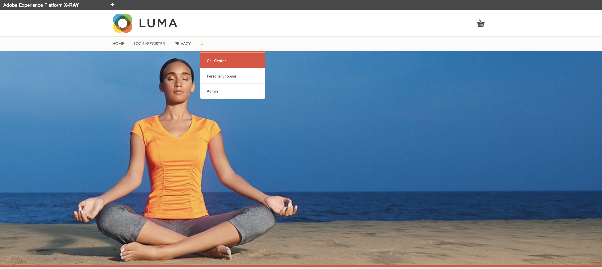
  
  * In the Call Center, you'll notice that the Mobile Number you used to register on the Luma - website has beeen filled out automatically for you. You can also enter any other mobile number of choice to retrieve the customer profile. 
  
  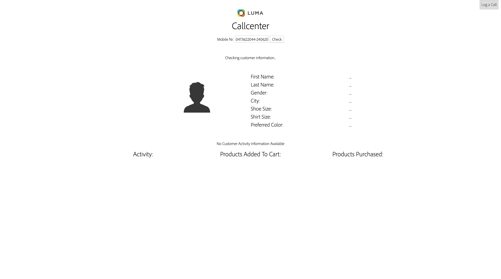
  
  * Click the ```Check``` - button. After 1-2 seconds, your Real-Time Customer Profile data is being shown to the call center employee, including your browsing behaviour from the last couple of seconds.
  
  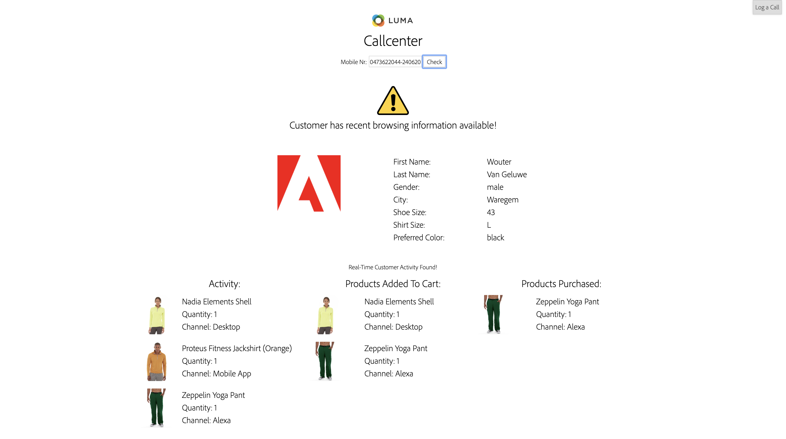 
  
With this, you've successfully completed this exercise. You can now record your video and submit it.

Congratulations, you've now finished Module 4.

[Go Back to Module 4](../README.md)

[Go Back to All Modules](../../README.md)


