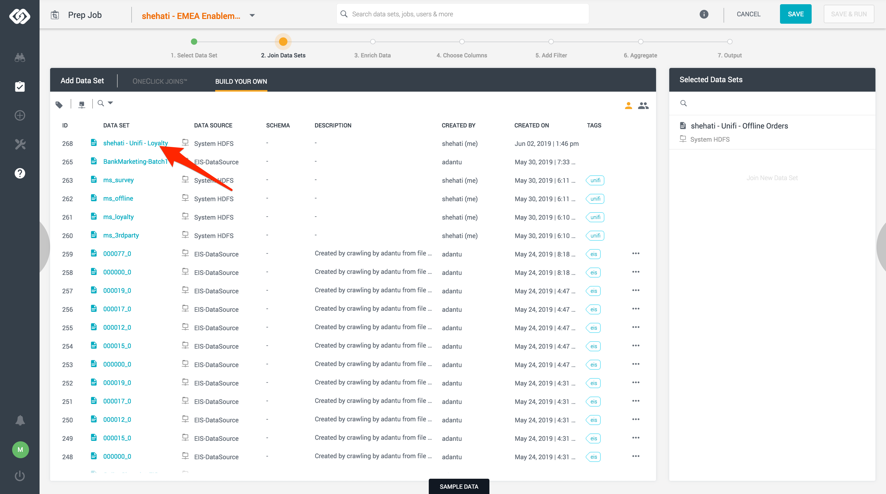
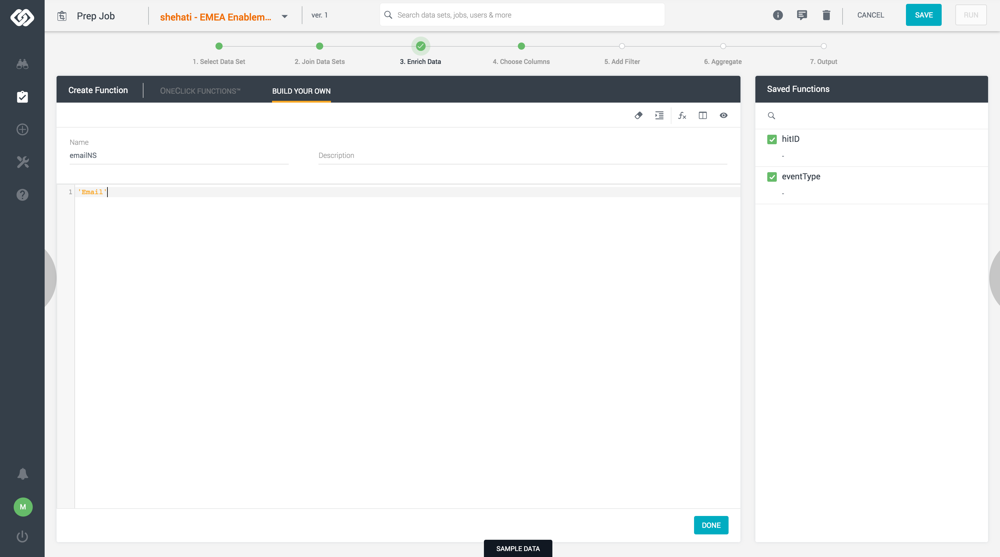

## Exercise 5.1: Using Unifi to Ingest Offline Order Events
In this exercise, the goal is to learn how to import Experience Event data into Unifi, join data sets, and ingest the data into Adobe Experience Platform.

### Learning Objectives

- Learn how to create datasets in Unifi
- Learn how to create jobs in Unifi. 
- Understand the process to join data sets, enrich exprerince events data, and ingest it in Platfrom.

### Lab Resources

- Unifi: [https://adobe-demo.westus2.cloudapp.azure.com/datai/#/dashboard](https://adobe-demo.westus2.cloudapp.azure.com/datai/#/dashboard)
- Experience Platform UI: [https://platform.adobe.com/](https://platform.adobe.com/)
- Sample data: [Offline Orders](../data/offline_orders.csv.zip)
- Sample data: [Loyalty Profiles](../data/loyalty_data.csv.zip)

### Lab Tasks

- Create datasets in Unifi for Offline Orders and Loyalty Program Profiles
- Create a job to join the above data sets, enrich and filter the data.
- Run the job to ingest the desired events into Platform

### Story: Using Unifi to ingest offline orders events into Platform.

La Boutique fashion brand, in addition to its online presence has brick and mortar stores all over the world. So far the marketing team has struggled to make use of the offline orders data to optimize their online experience. Recently, they introduced a new loyalty program that allows customers to collect points when purchasing in store using their loyalty card. The marketing team receives regularly a flat file with all the offline orders as well and has a record of all customers who have joined the loyalty program. With the help of Unifi, we will join the two data sources, enrich the result so that it can be ingested into Platform, then hydrate the profile with the offline order events.

### Exercise 5.1.1 - Create Unifi Data Sets

In this exercise, you'll create two data sets in Unifi, one for the offline orders events, one for the loylaty profiles.

1. Download and unzip the two .csv files provided in the lab resoruces above and save them in a folder of your choice in your local machine.

2. Go to <a href="https://adobe-demo.westus2.cloudapp.azure.com/datai/#/dashboard" _target="blank">Unifi site</a>, and login using the credentials provided. Upon successful login you should see the Unifi Dashboard.


3. Using the left side navigation, go to **Build > Data Set**


4. On the modal, select ``Local System``.


5. Click on ``Upload File`` and select the ``offline_orders.csv`` file downloaded above. 


6. Input the Data Set Name following the below format. Click on ``Create``.

Name Format: **ldap - Unifi - Offline Orders** 


6. Click ``Save`` on the top right corner, to save the new data set.


You have created your fist data set! This data set contains the following data:

| Column     | Description                           |
|:----       | :--------                             |
| id         | Row number                            |
| timestamp  | Timestampe when product was purchased |
| account_id | Loyalty program account id            |
| product    | Product sku                           |
| price      | Product price                         |
| currency   | Currency of the product price         |


7. Repeat steps 3-6 for ``loyalty_data.csv``. Please name the data set as per below:

Name Format: **ldap - Unifi - Loyalty** 

You have created your second data set! This data set contains the following data:

| Column     | Description                           |
|:----       | :--------                             |
| account_id | Loyalty program account id            |
| first_name | Customer's first name                 |
| last_name  | Customer's last name                  |
| email      | Customer's email address              |
| gender     | Customer's gender                     |
| points     | Customer's number of collected points |


You have now created the data sets required for this exercise!


### Exercise 5.1.2 - Create Unifi Job

In this exercise, you'll create the job to join the above create data sets, enrich the data, and ingest it in Platform.

1. Go to <a href="https://adobe-demo.westus2.cloudapp.azure.com/datai/#/dashboard" _target="blank">Unifi site</a>, and login using the credentials provided. Upon successful login you should see the Unifi Dashboard.


2. Using the left side navigation, go to **Build > Job**


3. On the modal, name the job **"ldap - EMEA Enablement - Offline Orders"**. Click ``Create``.


You have now entered the Job workflow.  


4. Select the offline orders data set created on the previous exercise. Name Format: **ldap - Unifi - Offline Orders** 


5. Move to step 2 **Join Data Sets**.


6. Select the loyalty data set created on the previous exercise. Name Format: **ldap - Unifi - Loyalty** 



* The aim of this join is to enrich the orders data with attributes available on the loyalty data. So, we would use a Left Outer Join. For mor info on joins please go <a href="https://en.wikipedia.org/wiki/Join_(SQL)" target="_blank">here.</a>


* As we know from the above exercise, the two data sets have one attribute in common, ``account_id``. We will use this to stich the two data set together. Once selected click ``Done``.


7. Move to step 3 **Enrich Data**.


8. On the **Enrich Data** step we will enrich the data sets with what few other fields required before we can ingest the data in Platform.


We know from previous past modules that when ingesting Experience event data we have 2 fields that are required:
- Hit ID
- Timestamp

Additionally the ``eventType`` variable gives meaning to the event happening.

From the imported data sources we only have the ``timestamp``. We need to add the other two.

**Creating the hitID attribute**
- On the **3. Enrich Data** interface, ``Create Function`` form, give the function the name ``hitID``, and define it to be ```rand() * 1000000000000```.


Click ``Done``. The function should appear on the ``Saved Functions`` section.


**Creating the eventType attribute**
- On the **3. Enrich Data** interface, ``Create Function`` form, give the function the name ``eventType``, and define it to be ```'offline_order'``` (include the quotes). Click Done.


We know from previous past modules that when ingesting Identity object data we have 4 fields that are required:
- ID namespace
- ID
- Authenticated State
- Primary Identity

From the imported data sources we only have the ``ID``. We need to add the other three. On the data imported we have two identities avaialble. For this exercise we will only use the ``Email`` id. The account_id attribute is only necessary to stich the two sources together.

**Creating the emailNS attribute**
- On the **3. Enrich Data** interface, ``Create Function`` form, give the function the name ``emailNS``, and define it to be ```'Email'```(include the quotes). Click Done.



**Creating the authenticatedState attribute**
- On the **3. Enrich Data** interface, ``Create Function`` form, give the function the name ``authenticatedState``, and define it to be ```'Authenticated'```(include the quotes). Click Done.


**Creating the primaryID attribute**
- On the **3. Enrich Data** interface, ``Create Function`` form, give the function the name ``primaryID``, and define it to be ```1```. Click Done.


You should have now created 5 functions as per below:


9. Move to step 4 **Choose Columns**.


10. On the **Choose Columns** step, we are going to select all the columns that want to ingest into Platform. So, please select the following:
	* all the defined Funtions
	* from the **ldap - Unifi - Offline Orders** select ``timestamp``, ``product``, ``price``, ``currency``
	* from the **ldap - Unifi - Loyaly** select ``email`` and ``points``

	

11. Move to step 5 **Add Filter**.


12. On this step we will filter the data to prevent unnecesary rows to be ingested in Platform.

When placing in store orders, not every single customer will have a loyaly card, thus meaning that some orders will be missing the ``account_id`` attribute. We would want to filter this rows out, as they will not be hydrating any profile since they will not belong to any identifier.

To filter out as per the above, on the ``Create filter`` form, name the filter ``Remove missing account_id rows``, and click ``ADD CONDITION``. 


On the condition interface, ``Select Column`` **ldap - Unifi - Offline Orders.account_id**, on the operator drop down select ``IS NOT NULL``. 


Click done.

13. Move to step 5 **Aggregate**.


14. On this step you are able to perform any aggregate funtions, or grouping the data. To learn more about aggreagate functions click <a href="https://en.wikipedia.org/wiki/Aggregate_function" target="_blank">here.</a>

For this use case we do not require to use any functions, so we will only be selecting all columns.


13. Move to final step **Output**.


14. On the final step, you will be map the output of the Job to a Schema in Platform and ingest the data.

* On the right hand side configure the Output as per below:

| Setting         | Value                    |
| :---            | :---                     |
| Type            | AEP                      |
| Data Source     | Experience Platform EMEA |
| Select Data Set | Unifi - Offline Orders   |


* You should now see on the UI, the data set schema as Target. If you see that mappings have already been made, delete them first so that you start with a clean overview. Mappings can be deleted/reset by clicking the ``Reset Connections`` - button.

 


* Map the Output to the Schema attributes as per below:

| Output                                    | Target                                                 |
| :---                                      | :---                                                   |
| ldap - Unifi - Offline Orders.timestamp | timestamp                                              |
| ldap - Unifi - Offline Orders.product   | \_experienceplatform.unifi_offlineOrders.product_sku   |
| ldap - Unifi - Offline Orders.price     | \_experienceplatform.unifi_offlineOrders.product_price |
| ldap - Unifi - Offline Orders.currency  | \_experienceplatform.unifi_offlineOrders.currency      |
| ldap - Unifi - Loyalty.email            | identityMap[0].id                                      |
| ldap - Unifi - Loyalty.points           | \_experienceplatform.unifi_loyalty.points              |
| hitID                                     | _id                                                    |
| eventType                                 | eventType                                              |
| emailNS                                   | identityMap[identityMapKey]                            |
| authenticatedState                        | identityMap[0].authenticatedState                      |
| primaryID                                 | identityMap[0].primary                                 |

In the below screenshot you see colored lines. When first configuring this mapping, the lines will be gray. After saving, they will have similar colors as below.


* Click Save & Run


Uppon completion, in the log UI find the batch ID.


15. Open the Platform UI and go to ``Datasets`` > ``Unifi``. Find the batch with the above id. You should see a success message.


Congratulations you have now successfully used Unifi to ingest Experience Event data to Adobe Expereince Platform! Please input the batch id on <a href="https://wiki.corp.adobe.com/display/expplatformemea/Module+5%3A+Unifi" target="_blank">this page</a> to complete the exercise.

[Next Step: Ingest Partner Profile Attributes](../profile/README.md)

[Go Back to Module 5](../README.md)

[Go Back to All Modules](../../README.md)


