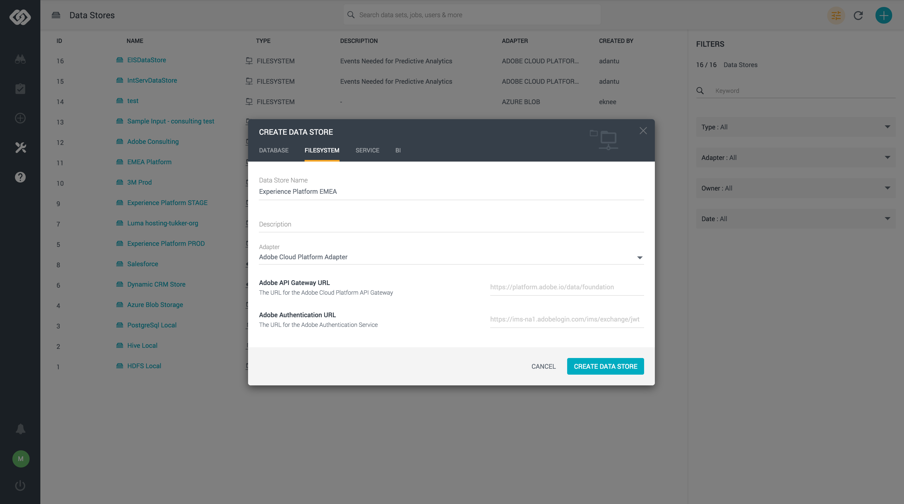
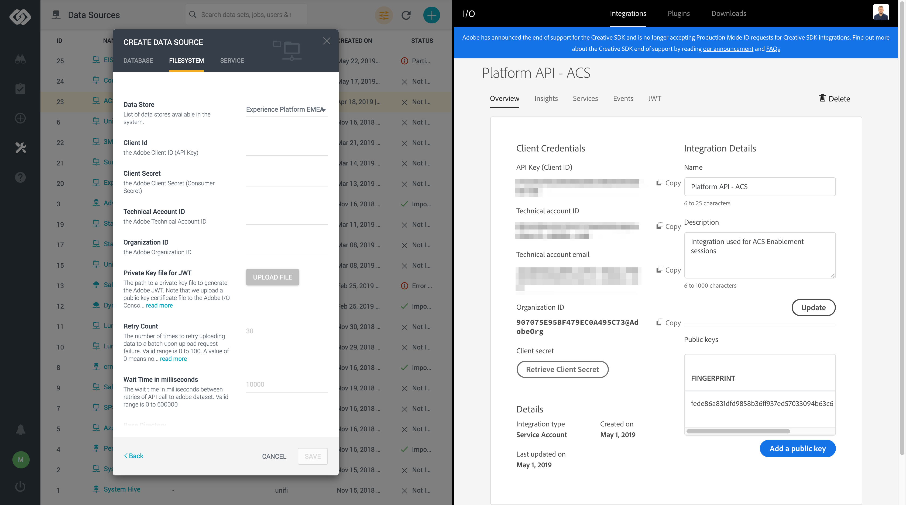

## Installing Adobe Experience Platform on Unifi (FYI only)
In this section, the goal is to configure everything that is needed to connect Adobe Experience Platform with Unifi.

| Please note:                |
| :-------------------------- |
| The steps described on this section are for informational purpose only. The integration is already configured on the Unifi instance that you will be using to complete the exercises to follow. 
**You do NOT need to configure this again**|

### Create your Adobe I/O integration

Go to <a href="https://git.corp.adobe.com/vangeluw/platformenablement/blob/master/module2/prerequisites/ex1.md" target="_blank">Module 2 - Exercise 2.1.1</a> and follow the steps there to configure your Adobe I/O integration. 

In case you already have an existing integration in place you are able to use that as well. 

### Install Adobe Experience Platform Adapter

1. Go to <a href="https://adobe-demo.westus2.cloudapp.azure.com/datai/#/login" _target="blank">Unifi site</a>, and login using the credentials provided. 

2. Upon successful login you should see the Unifi Dashboard. In this dashboard you should be able to see useful information regarding recent user activity, as well as statistics regarding the data managed via Unifi.

3. Using the left side navigation, go to **Manage > Adapters**

4. On the ``Adapters`` view, search for ``Adobe``

5. Hover on the **Adobe Cloud Platform | Beta** Adapter and click on the ``+`` icon. In case there is a tick mark in the top left corner of the adapter, it indicates that the adapter has been already installed.

6. After successful installation you should see a tick on the left top corner.

### Create a Data Store

Once the adapter is installed, we need to create a data store in Unifi which will contain the information regarding Adobe API Gateway URL and Adobe Authentication URL. These URL’s will be the same for each of Int, Stage and Prod environments.

1. Go to <a href="https://adobe-demo.westus2.cloudapp.azure.com/datai/#/dashboard" _target="blank">Unifi site</a>, and login using the credentials provided. Upon successful login you should see the Unifi Dashboard.

2. Using the left side navigation, go to **Manage > Data Stores**

3. On the top right corner, click the ``+`` icon to create a new data store.

4. On the modal, select ``Filesystem``.

5. Fill in the data store name (i.e. Experience Platform EMEA). Give it a description of choice. Select Adapter ``Adobe Cloud Platform Adapter``. The ``Adobe API Gateway URL`` and ``Adobe Authentication URL`` fields are prefilled.

6. After successful installation you should the new data store on the list.

### Create a Data Source

Once the adapter is installed, and data store created, we need to create a data source in Unifi which will contain the connection details specific to your IMS Org integration created above. 

1. Go to <a href="https://adobe-demo.westus2.cloudapp.azure.com/datai/#/dashboard" _target="blank">Unifi site</a>, and login using the credentials provided. Upon successful login you should see the Unifi Dashboard.

2. Using the left side navigation, go to **Manage > Data Sources**

3. On the top right corner, click the ``+`` icon to create a new data source.

4. On the modal, select ``Filesystem``.

5. Fill in the data source name (i.e. Experience Platform EMEA). Give it a description of choice. Click ``Next``.

6. Select the ``Experience Platform EMEA`` data store created above.

7. Fill in all the required fields with the details from the Adobe I/O integration you created above. Tick the box ``Allow as Output Destination``. Click ``Save``.

6. After successful creating the data source you should the new data source on the list.

Congratulations you have now successfully connected Unifi to Adobe Experience Platform!

[Next Step: Using Unifi to Ingest Offline Order Events](../orders/README.md)

[Go Back to Module 5](../README.md)

[Go Back to All Modules](../../README.md)

