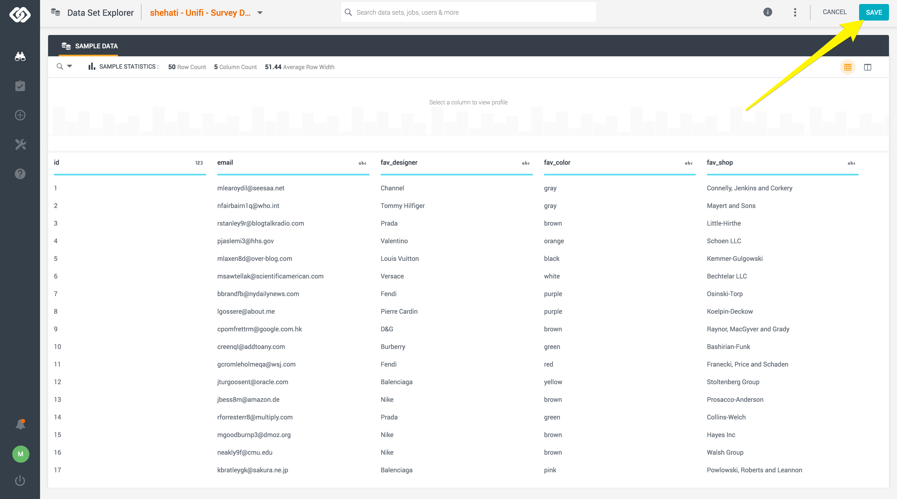
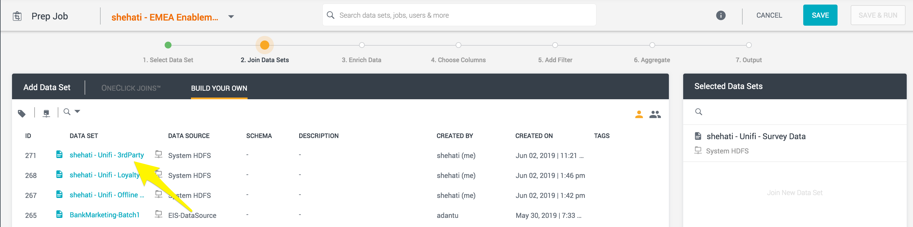
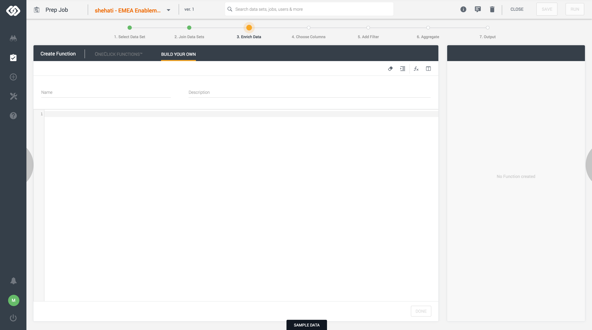
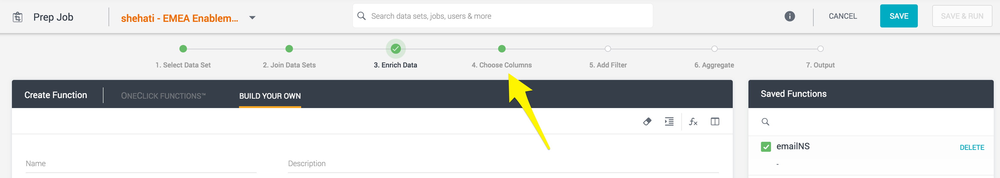

## Exercise 5.2: Using Unifi to Ingest 2nd & 3rd Party Profiles
In this exercise, the goal is to learn how to import Profile data into Unifi, join data sets, and ingest the data into Adobe Experience Platform.

### Learning Objectives

- Learn how to create datasets in Unifi
- Learn how to create jobs in Unifi. 
- Understand the process to join data sets, enrich profile data, and ingest it in Platfrom.

### Lab Resources

- Unifi: [https://adobe-demo.westus2.cloudapp.azure.com/datai/#/dashboard](https://adobe-demo.westus2.cloudapp.azure.com/datai/#/dashboard)
- Experience Platform UI: [https://platform.adobe.com/](https://platform.adobe.com/)
- Sample data: [Survey Data](../data/survey_data.csv.zip)
- Sample data: [Demographics Data](../data/3rdparty_data.csv.zip)

### Lab Tasks

- Create datasets in Unifi for Survey and Demographics data.
- Create a job to join the above data sets, enrich and filter the data.
- Run the job to ingest the profiles into Platform

### Story: Using Unifi to ingest 2nd and 3rd party data into Platform.

La Boutique fashion brand, has a partnership with Survey corp which has agreed to share their latest survey results on people preferences on designers, colors, and brands. La Boutique has also decided to buy some demographics data from a marketplace from Money Corp, providing details on people income and credit score. By combining these two data sets La Boutique is aiming to target their customer with more meaning experiences to their preferences as well as income.

### Exercise 5.2.1 - Create Unifi Data Sets

In this exercise, you'll create two data sets in Unifi, one for the profiles from survey data, one for the 3rd party profiles.

1. Download and unzip the two .csv files provided in the lab resources above and save them in a folder of your choice in your local machine.

2. Go to <a href="https://adobe-demo.westus2.cloudapp.azure.com/datai/#/dashboard" _target="blank">Unifi site</a>, and login using the credentials provided. Upon successful login you should see the Unifi Dashboard.


3. Using the left side navigation, go to **Build > Data Set**


4. On the modal, select ``Local System``.


5. Click on ``Upload File`` and select the ``survey_data.csv`` file downloaded above. 


6. Input the Data Set Name following the below format. Click on ``Create``.

Name Format: **ldap - Unifi - Survey Data** 


6. Click ``Save`` on the top right corner, to save the new data set.



You have created your fist data set! This data set contains the following data:

| Column       | Description                           |
|:----         | :--------                             |
| id           | Row number                            |
| email        | Email ID                              |
| fav_designer | Person's favourite designer           |
| fav_color    | Person's favourite color              |
| fav_shop     | Person's favourite brand              |


7. Repeat steps 3-6 for ``3rdparty_data.csv``. Please name the data set as per below:

Name Format: **ldap - Unifi - 3rdParty** 

You have created your second data set! This data set contains the following data:

| Column        | Description                           |
|:----          | :--------                             |
| id            | Row Number                            |
| first_name    | Customer's first name                 |
| last_name     | Customer's last name                  |
| email         | Customer's email address              |
| yearly_income | Customer's yearly income              |
| credit-score  | Customer's current credit score       |


You have now created the data sets required for this exercise!


### Exercise 5.2.2 - Create Unifi Job

In this exercise, you'll create the job to join the above create data sets, enrich the data, and ingest it in Platform.

1. Go to <a href="https://adobe-demo.westus2.cloudapp.azure.com/datai/#/dashboard" _target="blank">Unifi site</a>, and login using the credentials provided. Upon successful login you should see the Unifi Dashboard.


2. Using the left side navigation, go to **Build > Job**


3. On the modal, name the job **``ldap - EMEA Enablement - 2nd_3rd_Party``**. Click ``Create``.


You have now entered the Job workflow.  


4. Select the Survey Data - dataset created on the previous exercise. Name Format: **ldap - Unifi - Survey Data** 


5. Move to step 2 **Join Data Sets**.


6. Select the 3rd Party Data - dataset created on the previous exercise. Name Format: **ldap - Unifi - 2nd_3rd_Party** 



* The aim of this join is to enrich both the profiles from the survey data and demographics data with the attributes on either source. So, we would use a Full Outer Join. For mor info on joins please go <a href="https://en.wikipedia.org/wiki/Join_(SQL)" target="_blank">here.</a>

* As we know from the above exercise, the two data sets have one attribute in common, ``email``. We will use this to stich the two datasets together. Once selected click ``Done``.


7. Move to step 3 **Enrich Data**.


8. On the **Enrich Data** step we will enrich the datasets with a few other required fields before we can ingest the data in Platform.



We know from previous past modules that when ingesting Identity object data we have 4 fields that are required:
- ID namespace
- ID
- Authenticated State
- Primary Identity

From the imported data sources we only have the ``ID``. We need to add the other three.

**Creating the emailNS attribute**
- On the **3. Enrich Data** interface, ``Create Function`` form, give the function the name ``emailNS``, and define it to be ```'Email'``` (include the quotes). Click ``Done``.


**Creating the authenticatedState attribute**
- On the **3. Enrich Data** interface, ``Create Function`` form, give the function the name ``authenticatesState``, and define it to be ```'Authenticated'```(include the quotes). Click ``Done``.


**Creating the primaryID attribute**
- On the **3. Enrich Data** interface, ``Create Function`` form, give the function the name ``primaryID``, and define it to be ```1```. Click ``Done``.


Additionally to the above, we know that the ``yearly_income`` attribute is currently a number indicating the persons income. This number is not of very high importance to the La Boutique marketing team, but the team has instead categorized the yearly income in 3 groups: high salary - >100K, medium salary - >50K & <100K, low salary <50K. To manage this create the function the name ``salaryGroup``, and define it to be:
 
```case when [yourLDAP - Unifi - 3rdParty.yearly_income] > 100000 then 'high' when [yourLDAP - Unifi - 3rdParty.yearly_income] > 50000 then 'medium' else 'low' end```. 

Replace ``yourLDAP`` with your LDAP in the above lines of code.

Click Done.


You should have now created 4 functions as per below:


9. Move to step 4 **Choose Columns**.



10. On the **Choose Columns** step, we are going to select all the columns that want to ingest into Platform. So, please select the following:
	* all the defined Funtions
	* from the **ldap - Unifi - Survey Data** select ``email``, ``fav_designer``, ``fav_color``, ``fav_shop``
	* from the **ldap - Unifi - 2nd_3rd_Party** select ``yearly_income`` and ``credit-score``

	

11. For these data sets we won't need to apply any filters, so we will skip step 5 **Add Filter** and move to step 6 **Aggregate**.


14. On this step you are able to perform any aggregate funtions, or grouping the data. To learn more about aggreagate functions click <a href="https://en.wikipedia.org/wiki/Aggregate_function" target="_blank">here.</a>

For this use case we do not require to use any functions, so we will only be selecting all columns.


13. Move to final step **Output**.


14. On the final step, you will be map the output of the Job to a Schema in Platform and ingest the data.

* On the right hand side configure the Output as per below:

| Setting         | Value                    |
| :---            | :---                     |
| Type            | AEP                      |
| Data Source     | Experience Platform EMEA |
| Select Data Set | Unifi - 2nd_3rd_Party    |


* You should now see on the UI, the data set schema as Target. If you see that mappings have already been made, delete them first so that you start with a clean overview. Mappings can be deleted/reset by clicking the ``Reset Connections`` - button.

 


* Map the Output to the Schema attributes as per below:

| Output                                    | Target                                                 |
| :---                                      | :---                                                   |
| ldap - Unifi - Survey Data.email        | identityMap[0].id                                      |
| ldap - Unifi - Survey Data.fav_designer | \_experienceplatform.customer_preferences.fav_designer |
| ldap - Unifi - Survey Data.fav_color    | \_experienceplatform.customer_preferences.fav_color    |
| ldap - Unifi - Survey Data.fav_shop.    | \_experienceplatform.customer_preferences.fav_brand    |
| ldap - Unifi - 3rdParty.credit-score    | \_experienceplatform.customer_demographics.credit_score|
| emailNS                                   | identityMap[identityMapKey]                            |
| authenticatedState                        | identityMap[0].authenticatedState                      |
| primaryID                                 | identityMap[0].primary                                 |
| salaryGroup                               | \_experienceplatform.customer_demographics.income      |

In the below screenshot you see colored lines. When first configuring this mapping, the lines will be gray. After saving, they will have similar colors as below.


* Click Save & Run


Uppon completion, in the log UI find the batch ID.


15. Open the Platform UI and go to ``Datasets`` > ``Unifi`` . Find the batch with the above id. You should see a success message.


Congratulations you have now successfully used Unifi to ingest Profile data to Adobe Experience Platform! Please input the batch id on <a href="https://wiki.corp.adobe.com/display/expplatformemea/Module+5%3A+Unifi" target="_blank">this page</a> to complete the exercise.


[Go Back to Module 5](../README.md)

[Go Back to All Modules](../../README.md)


