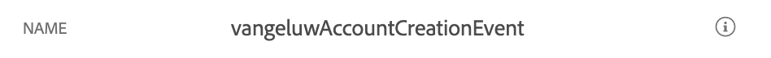
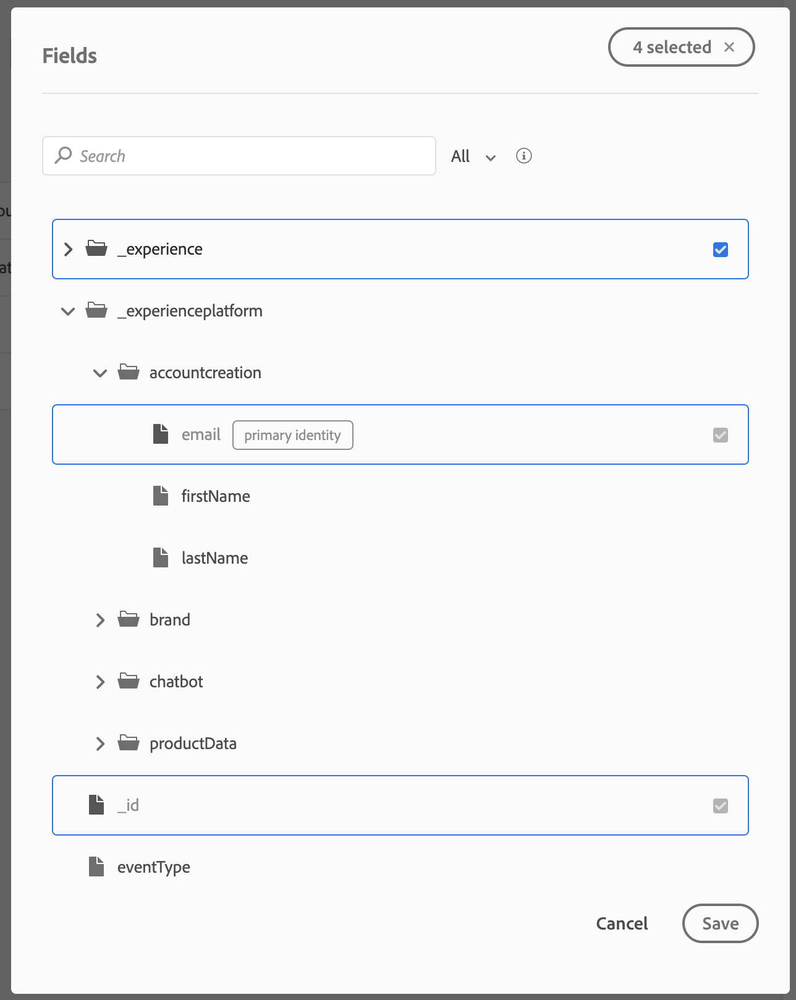

### Exercise 6.1: Triggered Journeys: Setup Event

The end goal of this module is to receive an email after creating your account on the SYTYCD-website.

In future modules, we'll expand a bit on this by adding push notifications and more contextual data.

To configure a trigger journey, you need access to Adobe Campaign On Platform. Once you've successfully completed Module 5, you'll be given access to ACOP automatically.

Once you have access to ACOP, you can login to ACOP by clicking this link: [https://experienceplatform-mkt-prod1.campaign.adobe.com/](https://experienceplatform-mkt-prod1.campaign.adobe.com/).

After logging in to ACOP, you'll see this screen.

 

From there, click on ``Triggered Journeys``

You'll be redirected to the ``Journeys`` - view in Triggered Journeys.

In the menu, click ``Events``.

In events, you'll see a similar view to this:

Click the ``Add`` - button.

You'll then see an empty Event configuration.

First of all, give your Event a Name like this: ``ldapAccountCreationEvent`` and replace **ldap** with your ldap.

Next, add a description like this ``Account Creation Event``.

Next is the Schema selection. A schema was prepared for this exercise. Please use the schema ``EMEA Account Creation v.1``.

After selecting the Schema, you'll see a number of fields being selected in the ``Payload`` - section. You should now hover over the ``Payload`` - section and you'll see 3 icons popup. Click on the ``Edit`` - icon.

You'll see a ``Fields`` - window popup, in which you need to select the fields that we need to personalize the email.

In the object ``_experienceplatform.accountcreation``, please make sure to select the fields ``firstName`` and ``lastName``. The field ``email`` is preselected as it's a required field.

In the object ``_experienceplatform.brand``, please make sure to select the fields ``brandLogo`` en ``brandName``.

Click ``Save`` to save your changes.

Click ``Save`` once more to save your changes.

Your Event is now configured and saved.

Click on your event again to open up the ``Edit Event`` - screen again.

Hover over the ``Payload`` - field again to see the 3 icons again.

Click on the ``View`` - icon. You'll now see an example of the expected payload.

This payload will be built in Launch in Exercise 3. For now, it's important to know that your Event has a unique ID, which you can find by scrolling down in that payload until you see ``_experience.campaign.orchestration.eventID``.

The event ID is what needs to be sent to Platform to trigger the Jounery that you'll build in exercise 2. Remember this eventID, as you'll need it in exercise 3.
``"eventID": "aa00b8ac11f4b75bb4166874152ce86e23960a422a2c7f22c9e672c3c729b050"``

Click ``Close``.

You've now finished this exercise.

Next Step: [Exercise 6.2: Triggered Journeys: Setup Journey](./ex2.md)

[Go Back to Module 6](./README.md)

[Go Back to All Modules](../README.md)

