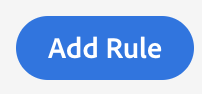
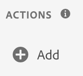
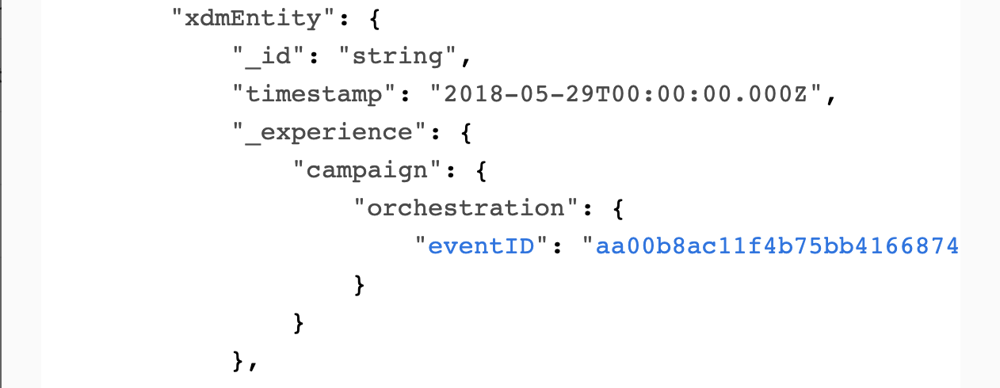

### Exercise 6.3: Configure Launch to trigger your Event

In this exercise, you'll configure Launch so that the Event you created in Exercise 1 is now triggered, and activates the Journey that you built in exercise 2.

Go to [https://launch-demo.adobe.com/](https://launch-demo.adobe.com/) and login with your personal login details. Select your own company.

### Exercise 6.3.1 - Create New Data Element
Since everybody loves creating data elements... 

The following data element need to be added to the registration page:

| Field Name              | 
|:-----------------------:| 
| brandLogo               | 

Go to [https://launch-demo.adobe.com/](https://launch-demo.adobe.com/) and login with your personal login details.

In the Launch UI, go to Data Elements and click on ```Add Data Element```.


The first data element will be **brandLogo**. When you select a brand to demo from the new ```Admin``` - menu, the brandLogo will be sent to Adobe Experience Platform so that Adobe Campaign can use it.

| Name              | Extension     | Data Element Type  | Local Storage Item Name | Storage Duration |
| ----------------- |:-------------:| :-----------------:| :----------------------:| :--------------: |
| brandLogo | Core          | Local Storage      | brandlogo               | None          |


Save your new data element.

### Exercise 6.3.2 - Create Rule: Create Account

In the Launch UI, go to Rules.


Click on ```Add Rule```.

 

As a name for this rule, let's use ```Create Account```.


We need to configure an Event to trigger this rule, so let's click on the + icon to Add an Event.


Our rule should fire when the customer clicks the ``Create Account`` - button on the SYTYCD - website. This is done through a Direct Call in this example.

| Extension     | Event Type       | Name             | Identifier             |
|:-------------:| :---------------:| :--------------: | :--------------: |
| Core          | Direct Call | Core - Direct Call | createaccount |

 

Click ``Keep Changes`` to save your Event Configuration.

Let's define the Action to be taken.

To add an action, click on the ```+ Add``` - button.



The action to configure will be to send the beacon to Platform, by configuring the options as follows:

| Extension                   | Action Type      | Name                                    |
|:---------------------------:| :---------------:| :-------------------------------------: |
| Adobe Experience Platform   | Send Beacon      | Adobe Experience Platform - Send Beacon |

After selecting the Platform - Send Beacon option, a dataset needs to be selected. 

In this case, we need to select the ```EMEA Account Creation (API)``` - dataset from the dropdown-list.


Next, in, Identity Mapping, you need to define a Primary Identifier for this dataset. Our primary identifier for Experience Events will be the Experience Cloud ID. As a Secondary Identifier, you need to configure the Email Address. Configure your Identity Mapping as follows:


In Schema Mapping, You need to add the following Keys and Values to the Send Beacon-action:

| Source Value                 | Target Schema Field               |
|:-------------------------------------------| :------------------ |
|%pageHitId%|_id|
|%pageTimeStamp%|timestamp|
|**YourEventID**|_experience.campaign.orchestration.eventID|
|%brandName%|_experienceplatform.brand.brandName|
|%brandLogo%|_experienceplatform.brand.brandLogo|
|%customerEmail%|_experienceplatform.accountcreation.email|
|%customerLastName%|_experienceplatform.accountcreation.lastName|
|%customerFirstName%|_experienceplatform.accountcreation.firstName|

The reference to **YourEventID** refers specifically to the EventID of the Event that you configured in Exercise 1. Retrieve the Event ID as indicated in Exercise 1 and paste it by replacing **YourEventID** with your Event ID.

Go to Adobe Campaign On Platform, to Triggered Journeys, to Events. Select your event and view the Payload, scroll down to your eventID:


After the above configuration, your rule looks like this:


Attention! Check your configuration of the Keys to be sure that after copying, no extra spaces are added in the keys as this will generate errors in Platform.

Click ```Keep Changes``` to save your Action.

Click ```Save```to save your changes.

You can now publish these changes into your development environment. 

In the Launch UI, navigate to the menu option ```Publishing```.


Under Development, you'll see your current Development-environment. 
Click on little arrow to open a dropdown-list and click Edit to make changes to your development-library.


Scroll down to the bottom of the window, where you'll see a button called ```+ Add All Changed Resources```.


Click the ```+ Add All Changed Resources``` - button.


Click the ```Save & Build for Development``` - button.


After clicking the ```Save & Build for Development``` - button, your Development-library will be updated and your changes will be available for testing on your SYTYCD - website. It can take a couple of minutes until your Launch-code is updated, wait until you see a green dot next to your Development-library.

(FYI: sometimes the Launch library is cached in your browser so you might have to clear your cache)

Once your Launch - configuration is published, go to your SYTYCD-website, select and load any brand of choice and navigate to the page Login/Register.
Enter your credentials by following the Demo Best Practices as documented [here](../module3/ex5.md).


Click the ``Create Account`` - button. If all goes well, you should receive an email from Adobe Experience Platform a couple of seconds later.

If you've finished your setup and have received your email, please go to this page: [https://wiki.corp.adobe.com/display/expplatformemea/Module+6%3A+Adobe+Campaign+On+Platform](https://wiki.corp.adobe.com/display/expplatformemea/Module+6%3A+Adobe+Campaign+On+Platform) and enter your Full Name, Email and most importantly, your Triggered Journeys Event ID there. 
This will mark your participation in Module 6 as completed and you'll get access to Module 7.

You've now finished this exercise and this module!

[Go Back to Module 6](./README.md)

[Go Back to All Modules](../README.md)


