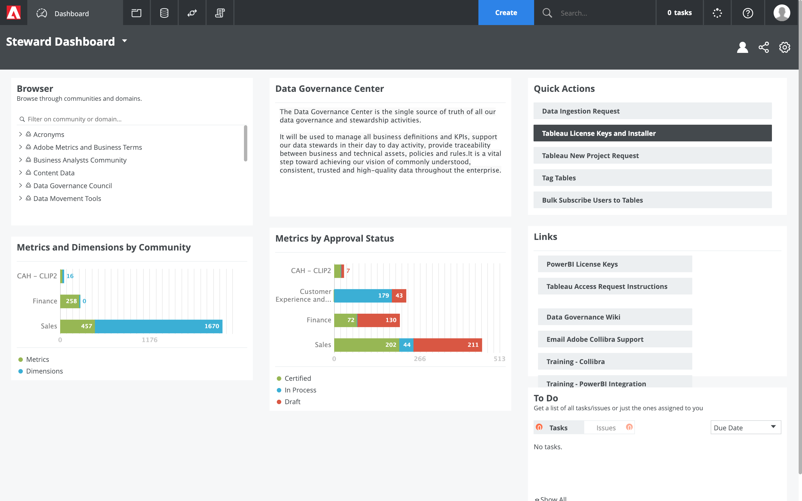
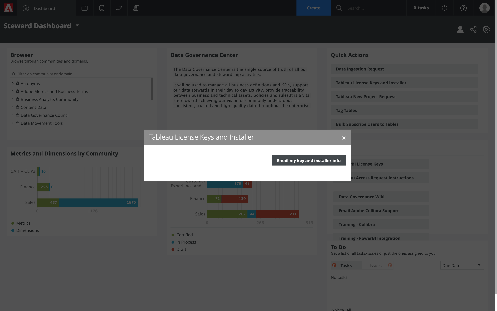
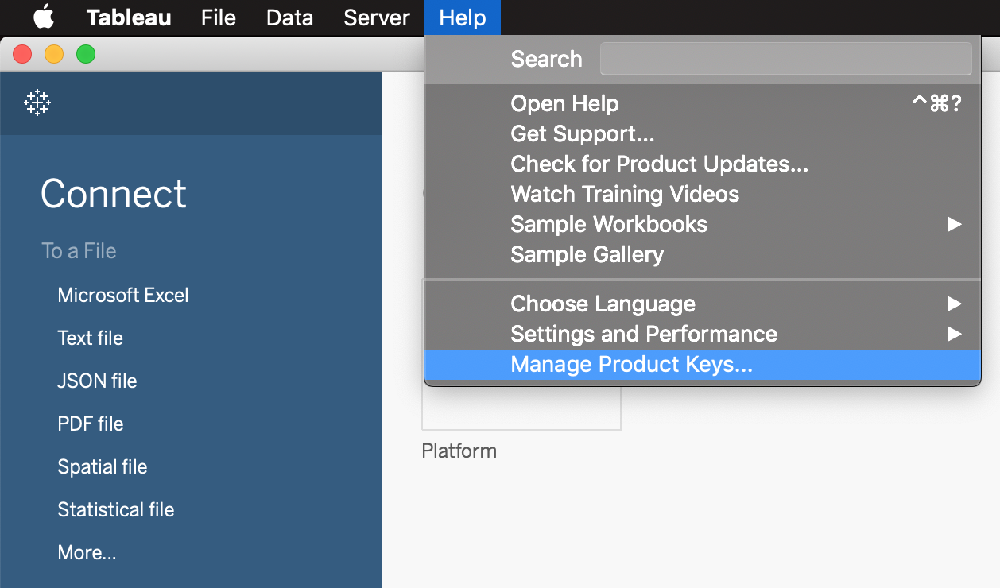

## Pre-requisites

### Install psql command line utility

Follow the instruction outlined in the Adobe Experience Platform documentation to install the psql client:
[psql install guide](https://www.adobe.io/apis/experienceplatform/home/services/query-service/query-service.html#!end-user/markdown/query-service/qs-clients-psql.md)

### Install Power BI

Only for Windows users

[Install Microsoft Power BI](https://www.adobe.io/apis/experienceplatform/home/services/query-service/query-service.html#!acpdr/end-user/markdown/query-service/qs-clients-powerbi.md)

Make sure that you install the exact version of "npgsql" as mentioned on the document, otherwise you will not be able to connect Power BI to Adobe Experience Platform Query Service.

### Install Tableau

For Windows or Mac users

[Install Tableau Desktop](https://www.adobe.io/apis/experienceplatform/home/services/query-service/query-service.html#!acpdr/end-user/markdown/query-service/qs-clients-tableau.md) as per the documentation.

Tableau gives you a 14-day trial period automatically.

If you want to use Tableau beyond those 14 days, you'll need a license key. 
You can get the license key from this page: [https://adobe.collibra.com/dashboard](https://adobe.collibra.com/dashboard)

Have a look at Quick Actions and select Tableau License Keys and Installer:

Click on Email my key and installer info:

You'll receive an email with your license key.
Open Tableau and go to Tableau Desktop > Help > Manage Product Keys, then click Activate to enter your license key.

Next Step: [Exercise 7.1: Exercise 1 - Getting Started](./1-getting-started.md)

[Go Back to Module 7](../README.md)

[Go Back to All Modules](../../README.md)
