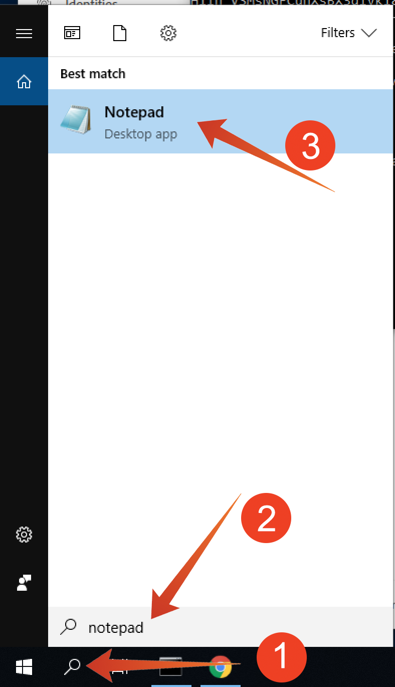

# Exercise 7.2 - Using the Query Service

## Objective

- Find and explore datasets
- Learn how to address Experience Data Models objects and attributes in your queries


## Exercise Context

In this exercise you will learn how to use PSQL to retrieve information about the available datasets, how to write a queries for Experience Data Model (XDM), and write your first simple reporting queries using the Query Service and Luma Telco datasets.

## Exercise 7.2.1

In this exercise you will learn about the methods to retrieve information about the available datasets and how to properly retrieve data with a query from an XDM dataset.

All the datasets hat we have explored via Adobe Experience Platform UI in the beginning of exercise 1, are also available for access via a SQL interface as tables. To list those tables you can use the "show tables;" command. 

Execute **show tables;** in your **PSQL command-line interface**. (do not forget to end your command with a semicolon).

Copy the command ``show tables;`` and paste it at the **all >** prompt:


You will see the following result:

```text
all=> 
all=> show tables;
                      name                       |        dataSetId         |                       dataSet                       | description | resolved 
-------------------------------------------------+--------------------------+-----------------------------------------------------+-------------+----------
 aam_realtime                                    | 5cd46f3b2e1b3a14b3ee631b | AAM Realtime                                        |             | false
 acs_aair_crm_loyalty_data                       | 5cb1083b2a9bcf14b2b8467e | ACS AAir CRM Loyalty Data                           |             | false
 acs_aair_crm_onboarded                          | 5cb492212f135214b2a13f5f | ACS AAir CRM Onboarded                              |             | false
 acs_aair_website_interaction_data               | 5cb50bb9d204f214b1384116 | ACS AAir Website Interaction data                   |             | false
 acs_aair_website_interaction_data___streaming   | 5cb77bd55da6c114b49fa274 | ACS AAir Website Interaction data - Streaming       |             | false
 acs_enablement_unifi_integration                | 5cb89920fd47b714b1cfa7d1 | ACS Enablement - Unifi Integration                  |             | false
 adobe_target_experience_events                  | 5c8b17b6c18a5d151a597223 | Adobe Target Experience Events                      |             | false
 beacon_store_entry_activity_emea_ee_dataset_api | 5c913b74e07cbc1515411cda | Beacon Store Entry Activity - EMEA EE Dataset (API) |             | false
 contact                                         | 5cf7bd261eaa7d144e7aa737 | Contact                                             |             | false
 customer_crm_data                               | 5cb4b9c9cd029614b260602a | Customer CRM Data                                   |             | false
 customer_profile_data                           | 5cb4bca92f135214b2a13fc6 | Customer Profile Data                               |             | false
 demo_environment_midvalues_1                    | 5c8a6dcfe719b615224aae86 | Demo Environment midValues                          |             | false
 demo_environment_postvalues_1                   | 5c8a6dd041819c1518b4a7d8 | Demo Environment postValues                         |             | false
 emea_beacon_interactions                        | 5cd5247c1d3ace14b2d29ecd | EMEA Beacon Interactions                            |             | false
 emea_call_center_interactions                   | 5ca3d7c1ced90314b3500884 | EMEA Call Center Interactions                       |             | false
 emea_call_center_interactions_api               | 5d07970a327e84144f3aa74a | EMEA Call Center Interactions (API)                 |             | false
 emea_chatbot_interactions                       | 5ce7960628e455144f86105f | EMEA Chatbot Interactions                           |             | false
 emea_crm_onboarding_api                         | 5d00061de72b4d144f109c71 | EMEA CRM Onboarding (API)                           |             | false
 emea_ee_dataset_api                             | 5c880b7eccacbd1517d144a9 | Website Interactions - EMEA EE Dataset (API)        |             | false
 emea_loyalty_data                               | 5d0a2cfe1f6f06144d630d27 | EMEA Loyalty Data                                   |             | false
 emea_optin_optout_choices_api                   | 5cfffac768b604144fb2a5fd | EMEA OptIn - OptOut Choices (API)                   |             | false
:
```

At the colon, press space bar to see the next page of the resultset, or enter "q" to revert to the command prompt.

Every dataset in Platform has its corresponding Query Service table. You can find a dataset's table via the datasets ui:


The "emea\_ee\_dataset_api" table is the Query Service tables that corresponds with the "Website Interactions - EMEA EE Dataset (API)" dataset.

To see the "root" schema of a table, like for example "emea_ee_dataset_api", you use "\d" command. 

Copy the command ``\d emea_ee_dataset_api`` and paste it at the **all >** prompt in your **PSQL command-line interface**.:


The result should look like:

```text
all=> 
all=> \d emea_ee_dataset_api
                               Table "public.emea_ee_dataset_api"
       Column        |                  Type                   | Collation | Nullable | Default 
---------------------+-----------------------------------------+-----------+----------+---------
 _experienceplatform | emea_ee_dataset_api__experienceplatform |           |          | 
 eventtype           | text                                    |           |          | 
 timestamp           | timestamp                               |           |          | 
 _id                 | text                                    |           |          | 
 productlistitems    | anyarray                                |           |          | 
 commerce            | emea_ee_dataset_api_commerce            |           |          | 
 receivedtimestamp   | timestamp                               |           |          | 
 enduserids          | emea_ee_dataset_api_enduserids          |           |          | 
 web                 | emea_ee_dataset_api_web                 |           |          | 
 placecontext        | emea_ee_dataset_api_placecontext        |           |          | 
 identitymap         | anymap                                  |           |          | 
 environment         | environment                             |           |          | 

all=> 

```

To query some information about where a product was viewed, we will select the "geo" information from bt_website_interactions.

Copy the statement below and paste it at the **all >** prompt in your **PSQL command-line interface** and hit enter:

```sql
select placecontext.geo
from   emea_ee_dataset_api
where  _experienceplatform.productData.productInteraction = 'productView'
limit 1;
```

In your query result, you will notice that columns in the Experience Data Model (XDM) can be complex types and not just scalar types. In the query above we would like to identify geo locations where a "productView" did occur. To identify a "productView" we have to navigate through the XDM model using the "." (dot) notation.

```text
all=> 
all=> select placecontext.geo
all-> from   emea_ee_dataset_api
all-> where  _experienceplatform.productData.productInteraction = 'productView'
all-> limit 1;
                geo                 
------------------------------------
 ("(51.0003903,3.7139045)",BE,Gent)
(1 row)

all=> 
```

Notice the result is a flattended object rather than a single value? The "placecontext.geo" object contains four attributes: schema, country and city. And when an object is declared as a column it will return the entire object as a string. The XDM schema may be more complex than what you are familiar with but it's very powerful and was architected to support many solutions, channels, and use cases.

To select the individual properties of an object, you use the "." (dot) notation.

Copy the statement below and paste it at the **all >** prompt in your **PSQL command-line interface**:

```sql
select placecontext.geo._schema.longitude
      ,placecontext.geo._schema.latitude
      ,placecontext.geo.city
      ,placecontext.geo.countryCode
from   emea_ee_dataset_api
where  _experienceplatform.productData.productInteraction = 'productView'
limit 1;
```

The result of the above query should look like:

```text
The result is now a set simple values:

all=> 
all=> select placecontext.geo._schema.longitude
all->       ,placecontext.geo._schema.latitude
all->       ,placecontext.geo.city
all->       ,placecontext.geo.countryCode
all-> from   emea_ee_dataset_api
all-> where  _experienceplatform.productData.productInteraction = 'productView'
all-> limit 1;
 longitude |  latitude  | city | countrycode 
-----------+------------+------+-------------
 3.7139045 | 51.0003903 | Gent | BE
(1 row)

all=> 
```

Don't worry, there is an easy way to obtain the path towards a specific property. In the following part you will learn how. 

You will need to edit a query, so let's first open an editor.

On Windows

Click the "search"-icon (1) in the windows toolbar, type **notepad** in the "search"-field (2), click (3) the "notepad" result:



On Mac

Install Brackets from https://github.com/adobe/brackets/releases/download/release-1.14/Brackets.Release.1.14.dmg if you don't have it installed and follow the instructions. After installation, search for "Brackets" via Mac's spotligt search and open it:


Copy the following statement to notepad or brackets:

```sql
select <your_attribute_path_here>
from   emea_ee_dataset_api
where  _experienceplatform.productData.productInteraction = 'productView'
limit 1;
```


Go back to your Adobe Experience Platform UI (should be open in your browser) or navigate to http://platform.adobe.com.

Select "Schemas" (1), enter **EMEA Web** in the "search"-field (2) and select **EMEA Website Interaction Data (EE)** from the list.


Explore the XDM model for "Website Interactions - EMEA EE Dataset (API)", by clicking on de the object, you can expand the tree, do this for "placecontext" (1), "geo" (2) and "schema" (3). When you select the actual attribute "longitude" (4), you will see the complete path in the highlighted red box. To copy the attribute's path, click on the copy path icon (5).


Switch to you notepad/brackets and remove **<your_attribute_path_here>** from the first line. Position your cursor after "select" on the first line and paste (CTRL-V). 

Copy the modified statement from notepad/brackets and paste it at the **all >** prompt in your **PSQL command-line interface** and hit enter:


The result should look like:

```text
all=> 
all=> select placeContext.geo._schema.longitude
all-> from   emea_ee_dataset_api
all-> where  _experienceplatform.productData.productInteraction = 'productView'
all-> limit 1;
 longitude 
-----------
 3.7139045
(1 row)

all=> 
```

Next Step: [Exercise 3 - Queries, queries, queries...  and churn analysis](../exercises/3-queries.md)

[Go Back to Module 7](../README.md)

[Go Back to All Modules](../../README.md)
