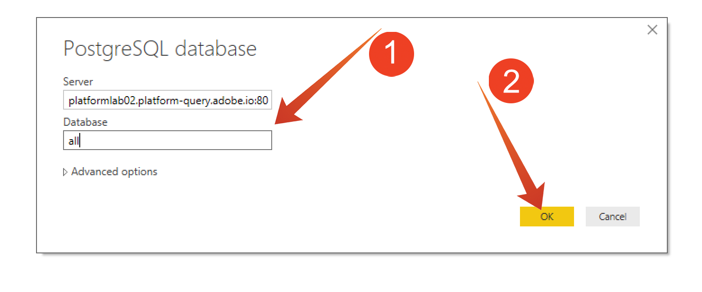

# Exercise 7.4.2 Explore the dataset with Power BI

Start Microsoft Power BI Desktop

Click "Get Data"

Search for "progres" (1), select "Progress" (2) from the list and "Connect" (3).

Enter **experienceplatform.platform-query.adobe.io:80** for the Server and "all" for the Database (1). Then click OK (2).

IMPORTANT Be sure to include port ':80' at the end of the Server value because the Query Service does not currently use the default PostgreSQL port of 5432

In the next dialog populate the User name and Password with your Username (ending in @AdobeOrg) and Password found in the "Connection Info" (2) section of the Queries menu (1).

In the Navigator dialog, put your station number in the search field (1) to locate your CTAS datasets and check the box next to each (2). Then click Load (3).

Make sure the "Report"-tab (1) is selected

Select the map (1) and after it is added to the reporting canvas, enlarge the map (2).

Next we need to define the measures and the dimensions, you do this by draging fields from the "fields" section onto the coresponding placeholders (located under "visualizations") as indicated below:

As measure we will use a count of "customerId". Drag the "crmid" field from the "fields" section into the "Size" placeholder":

Finally, to do some "callTopic" analysis, let's drag the "callTopic" field on to the "Page level filters" placeholder (you might have to scroll in the "visualizations" section);

Select/deselect "callTopics" investigate:

Congratulations! You have finished the Adobe Experience Platform Query Service Module.

[Go Back to Module 7](../README.md)

[Go Back to All Modules](../../README.md)
