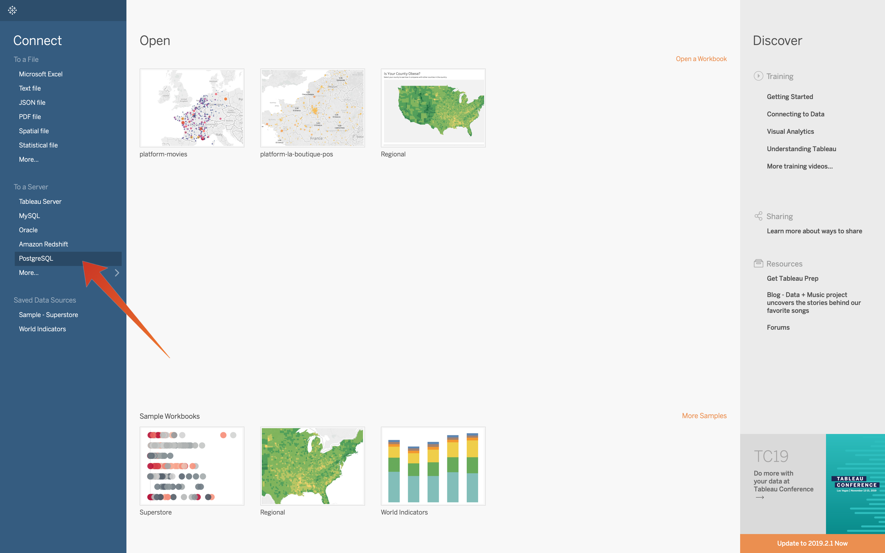
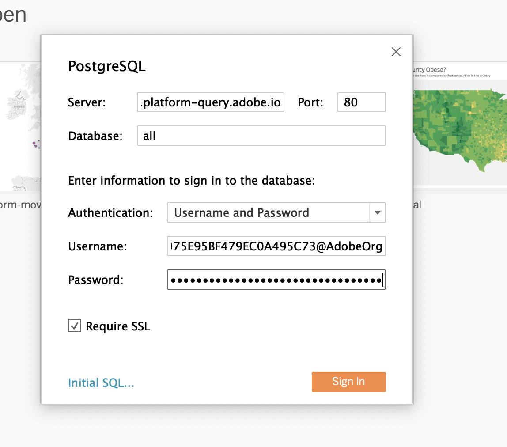
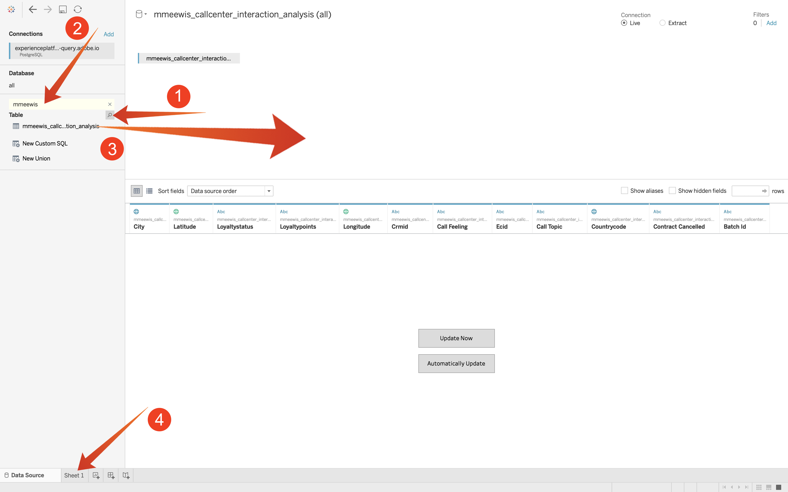
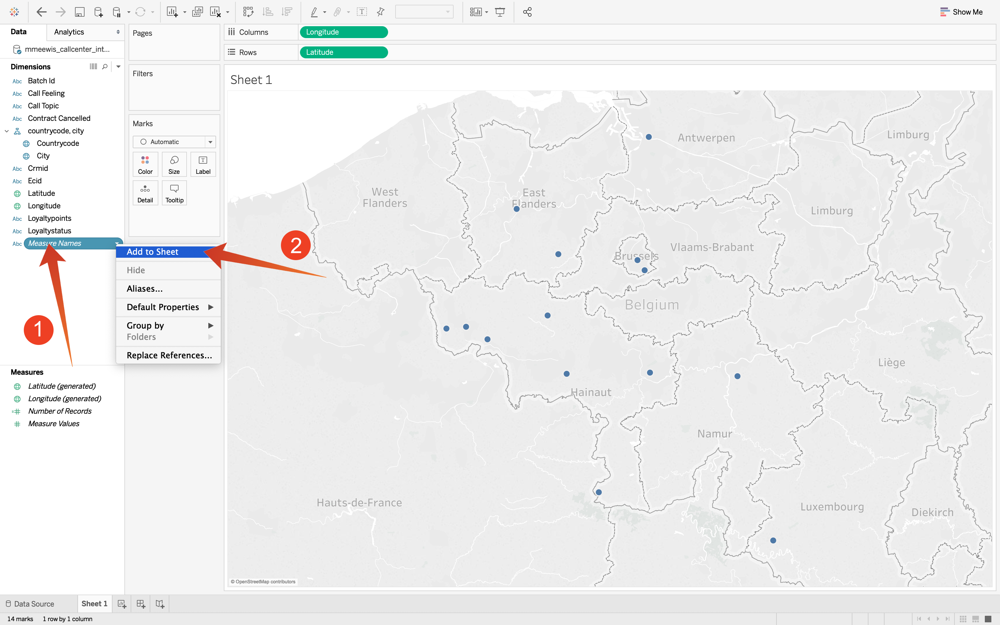

# Exercise 7.4.2 Explore the dataset with Tableau

Start Tableau

In "Connect To a Server" select "PostgreSQL":

In the connection dialog, specify **experienceplatform.platform-query.adobe.io** as the "Server" and **80** as the "Port", you can find your user name and password to connect to Adobe Platform Query Service in the Platform UI, "Credentials" (2) section of the Queries menu (1).

Sign In:

Click search (1) and enter your **ldap** into the search field, identify you table from the result set and drag (3) it onto the location named "Drag tables here". When finished, click on "Sheet 1" (3).

To visualize our data on the map we need to convert longitude and latitude to dimensions. In "measures" select "Latitude" (1) and open the field's dropdown and select "Convert to Dimension" (2). Do the same for the "Longitude" measure.

Drag the "Longitude" measure to the "Columns" and the "Latitude" measure to "Rows". Automatically the map of "Belgium" will appear with little dots representing the cities in out data set.

Select "Measure Names" (1), open the dropdown and select "Add to Sheet" (2):

You will now have a map, with dots of various sizes. The size indicates the number of call center interactions for that specific city. To vary the size of the dots, navigate to the right panel and open "Measure Values" (using the drop down icon). From the drop down list select "Edit Sizes". Play around with different sizes.

To further display the data per "Call Topic), drag (1) the "Call Topic" dimension onto "Pages". Navigate through the different "call topics" using the "Call Topic" (2) on the right side of the screen:

Congratulations! You have finished the Adobe Experience Platform Query Service Module.

[Go Back to Module 7](../README.md)

[Go Back to All Modules](../../README.md)
